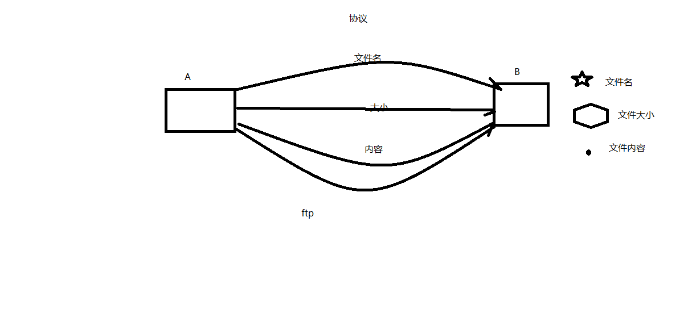
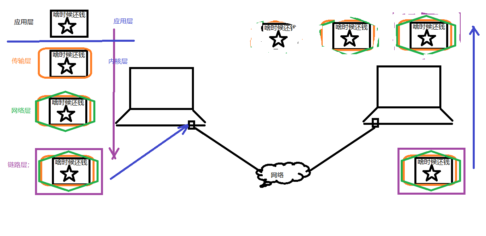
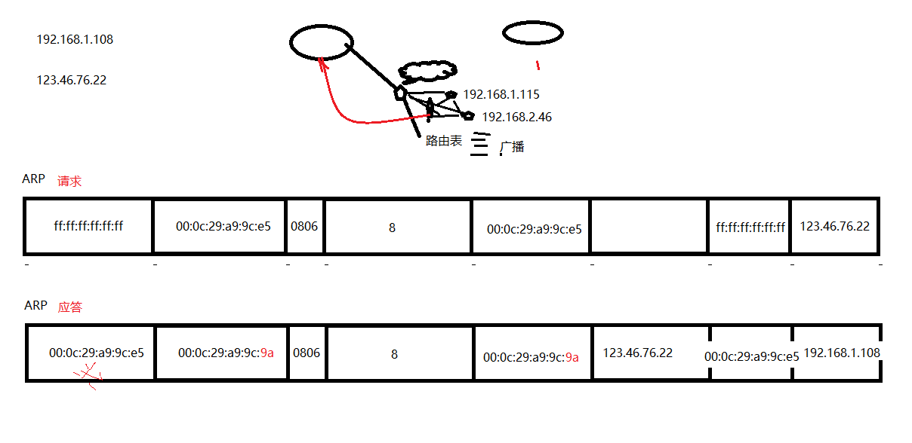
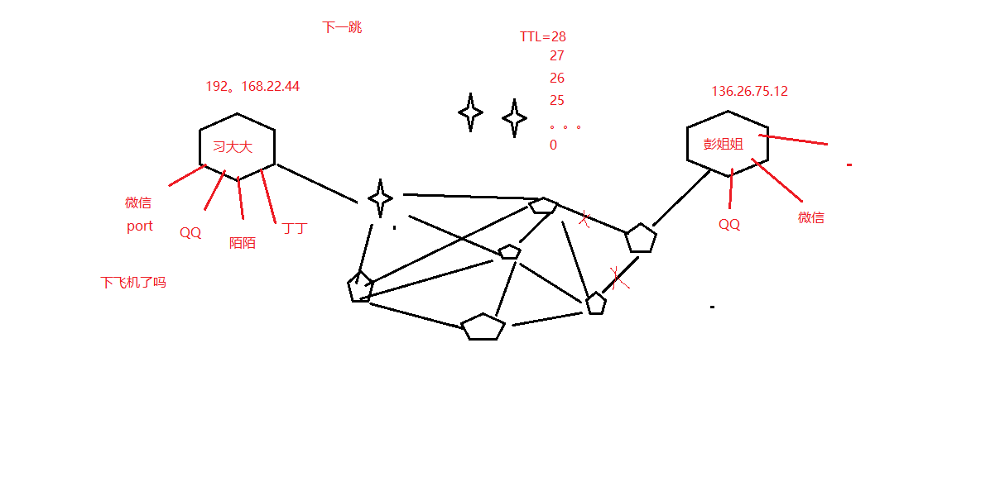
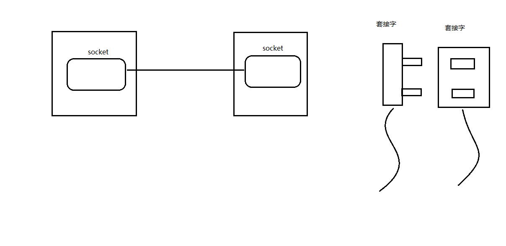

## 目录

- **第一章：网络基础**

  - [01P-协议](#01P-协议)
  - [02P-7层模型和4层模型及代表协议](#02P-7层模型和4层模型及代表协议)
  - [03P-网络传输数据封装流程](#03P-网络传输数据封装流程)
  - [04P-以太网帧和ARP请求](#04P-以太网帧和ARP请求)
  - [05P-IP协议](#05P-IP协议)
  - [06P-端口号和UDP协议](#06P-端口号和UDP协议)
  - [07P-TCP协议](#07P-TCP协议)
  - [08P-BS和CS模型对比](#08P-BS和CS模型对比)
  - [09P-套接字](#09P-套接字)

---

# 第一章：网络基础

## 01P-协议

协议：
一组规则。


## 02P-7层模型和4层模型及代表协议

分层模型结构：
OSI七层模型：  物、数、网、传、会、表、应
TCP/IP 4层模型：网（链路层/网络接口层）、网、传、应
应用层：http、ftp、nfs、ssh、telnet。。。
传输层：TCP、UDP
网络层：IP、ICMP、IGMP
链路层：以太网帧协议、ARP

## 03P-网络传输数据封装流程


网络传输流程：
数据没有封装之前，是不能在网络中传递。
数据-》应用层-》传输层-》网络层-》链路层  --- 网络环境

## 04P-以太网帧和ARP请求


以太网帧协议：
ARP协议：根据 Ip 地址获取 mac 地址。
以太网帧协议：根据mac地址，完成数据包传输。

## 05P-IP协议

IP协议：
版本： IPv4、IPv6  -- 4位
TTL： time to live 。 设置数据包在路由节点中的跳转上限。每经过一个路由节点，该值-1， 减为0的路由，有义务将该数据包丢弃
源IP： 32位。--- 4字节192.168.1.108 --- 点分十进制 IP地址（string）  --- 二进制
目的IP：32位。--- 4字节


## 06P-端口号和UDP协议

UDP：
16位：源端口号。2^16 = 65536
16位：目的端口号。

IP地址：可以在网络环境中，唯一标识一台主机。
端口号：可以网络的一台主机上，唯一标识一个进程。
ip地址+端口号：可以在网络环境中，唯一标识一个进程。

## 07P-TCP协议

TCP协议：
16位：源端口号。2^16 = 65536
16位：目的端口号。
```c
32序号;
```

32确认序号。
6个标志位。
16位窗口大小。2^16 = 65536

## 08P-BS和CS模型对比

**C/S模型（Client-Server）**

优点：
- 可以缓存大量数据
- 协议选择灵活
- 安全性较高

缺点：
- 跨平台性差
- 开发工作量较大

**B/S模型（Browser-Server）**

优点：
- 跨平台性好
- 开发工作量较小
- 速度快

缺点：
- 不能缓存大量数据
- 严格遵守HTTP协议
- 安全性相对较低

## 09P-套接字

网络套接字：  socket
一个文件描述符指向一个套接字（该套接字内部由内核借助两个缓冲区实现。）
在通信过程中， 套接字一定是成对出现的。

