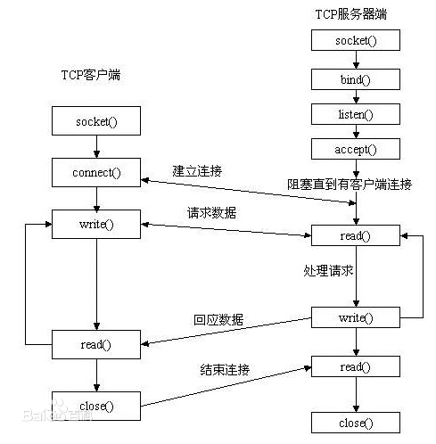

## 目录

- **第二章：Socket编程基础**

  - [01P-网络字节序](#01P-网络字节序)
  - [02P-IP地址转换函数](#02P-IP地址转换函数)
  - [03P-sockaddr地址结构](#03P-sockaddr地址结构)
  - [04P-socket模型创建流程分析](#04P-socket模型创建流程分析)
  - [05P-socket和bind](#05P-socket和bind)
  - [06P-listen和accept](#06P-listen和accept)
  - [07P-connect](#07P-connect)

---

# 第二章：Socket编程基础

## 01P-网络字节序

**字节序分类**

- **小端法**（Little-endian）：PC本地存储方式，高位存高地址，低位存低地址
  - 示例：`int a = 0x12345678`，内存中存储顺序为 `78 56 34 12`
- **大端法**（Big-endian）：网络存储方式，高位存低地址，低位存高地址
  - 示例：`int a = 0x12345678`，内存中存储顺序为 `12 34 56 78`

**字节序转换函数**

```c
htonl()  // 本地字节序 -> 网络字节序（IP地址，32位）
htons()  // 本地字节序 -> 网络字节序（端口号，16位）
ntohl()  // 网络字节序 -> 本地字节序（IP地址，32位）
ntohs()  // 网络字节序 -> 本地字节序（端口号，16位）
```

**IP地址转换流程**

```
192.168.1.11 (字符串) --> atoi() --> 整数 --> htonl() --> 网络字节序
```

## 02P-IP地址转换函数

**inet_pton - 本地字节序转网络字节序**

```c
#include <arpa/inet.h>
int inet_pton(int af, const char *src, void *dst);
```

参数说明：
- `af`：地址族，`AF_INET`（IPv4）或 `AF_INET6`（IPv6）
- `src`：传入参数，IP地址字符串（点分十进制格式）
- `dst`：传出参数，转换后的网络字节序IP地址

返回值：
- 成功：返回 1
- 异常：返回 0（src不是有效的IP地址）
- 失败：返回 -1

**inet_ntop - 网络字节序转本地字节序**

```c
#include <arpa/inet.h>
const char *inet_ntop(int af, const void *src, char *dst, socklen_t size);
```

参数说明：
- `af`：地址族，`AF_INET` 或 `AF_INET6`
- `src`：传入参数，网络字节序IP地址
- `dst`：传出参数，转换后的本地字节序IP地址字符串
- `size`：dst缓冲区大小

返回值：
- 成功：返回dst指针
- 失败：返回NULL

## 03P-sockaddr地址结构

**地址结构作用**

`sockaddr`地址结构用于在网络环境中唯一标识一个进程，由IP地址和端口号组成。



**sockaddr_in 结构体使用**

```c
struct sockaddr_in addr;

// 设置地址族
addr.sin_family = AF_INET;  // 或 AF_INET6

// 设置端口号（需要转换为网络字节序）
addr.sin_port = htons(9527);

// 设置IP地址方式1：指定具体IP
int dst;
inet_pton(AF_INET, "192.157.22.45", (void *)&dst);
addr.sin_addr.s_addr = dst;

// 设置IP地址方式2：绑定任意有效IP
addr.sin_addr.s_addr = htonl(INADDR_ANY);

// 绑定地址结构到socket
bind(fd, (struct sockaddr *)&addr, sizeof(addr));
```

## 04P-socket模型创建流程分析


## 05P-socket和bind

**socket函数 - 创建套接字**

```c
#include <sys/socket.h>
int socket(int domain, int type, int protocol);
```

参数说明：
- `domain`：协议族，`AF_INET`、`AF_INET6`、`AF_UNIX`
- `type`：套接字类型，`SOCK_STREAM`（TCP）、`SOCK_DGRAM`（UDP）
- `protocol`：协议，通常为0

返回值：
- 成功：返回新套接字对应的文件描述符
- 失败：返回 -1，设置errno

**bind函数 - 绑定地址结构**

```c
#include <arpa/inet.h>
int bind(int sockfd, const struct sockaddr *addr, socklen_t addrlen);
```

参数说明：
- `sockfd`：socket函数返回的文件描述符
- `addr`：传入参数，指向`sockaddr`结构体的指针
- `addrlen`：地址结构的大小

返回值：
- 成功：返回 0
- 失败：返回 -1，设置errno

**使用示例**

```c
struct sockaddr_in addr;
addr.sin_family = AF_INET;
addr.sin_port = htons(8888);
addr.sin_addr.s_addr = htonl(INADDR_ANY);

bind(sockfd, (struct sockaddr *)&addr, sizeof(addr));
```

## 06P-listen和accept

**listen函数 - 设置连接上限**

```c
int listen(int sockfd, int backlog);
```

参数说明：
- `sockfd`：socket函数返回的文件描述符
- `backlog`：同时进行三次握手的客户端数量上限，最大值128

返回值：
- 成功：返回 0
- 失败：返回 -1，设置errno

**accept函数 - 接受连接**

```c
int accept(int sockfd, struct sockaddr *addr, socklen_t *addrlen);
```

参数说明：
- `sockfd`：socket函数返回的文件描述符
- `addr`：传出参数，成功连接的客户端地址结构
- `addrlen`：传入传出参数，传入addr缓冲区大小，传出客户端地址实际大小

返回值：
- 成功：返回与客户端通信的socket文件描述符
- 失败：返回 -1，设置errno

**使用示例**

```c
struct sockaddr_in clit_addr;
socklen_t clit_addr_len = sizeof(clit_addr);

int connfd = accept(sockfd, (struct sockaddr *)&clit_addr, &clit_addr_len);
```

## 07P-connect

**connect函数 - 建立连接**

```c
int connect(int sockfd, const struct sockaddr *addr, socklen_t addrlen);
```

参数说明：
- `sockfd`：socket函数返回的文件描述符
- `addr`：传入参数，服务器地址结构
- `addrlen`：服务器地址结构的大小

返回值：
- 成功：返回 0
- 失败：返回 -1，设置errno

**使用示例**

```c
struct sockaddr_in srv_addr;
srv_addr.sin_family = AF_INET;
srv_addr.sin_port = htons(9527);  // 必须与服务器bind时设置的端口一致
inet_pton(AF_INET, "192.168.1.100", &srv_addr.sin_addr.s_addr);

connect(sockfd, (struct sockaddr *)&srv_addr, sizeof(srv_addr));
```

**注意**：客户端如果不使用bind绑定地址结构，系统会采用"隐式绑定"方式自动分配。
