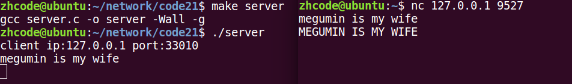
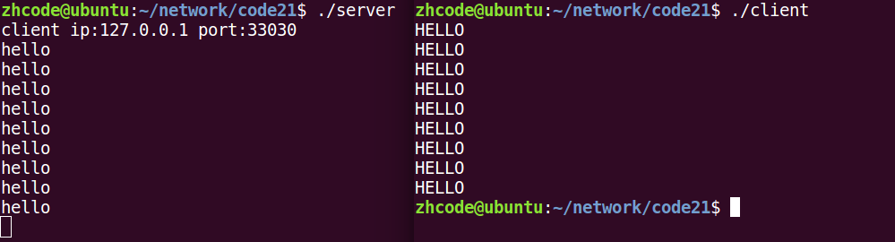

## 目录

- **第三章：TCP通信实现**

  - [01P-CS模型的TCP通信分析](#01P-CS模型的TCP通信分析)
  - [02P-server的实现](#02P-server的实现)
  - [03P-获取客户端地址结构](#03P-获取客户端地址结构)
  - [04P-client的实现](#04P-client的实现)
  - [05P-总结](#05P-总结)

---

# 第三章：TCP通信实现

## 01P-CS模型的TCP通信分析

TCP通信流程分析:
server:
```c
1. socket()创建socket
2. bind()绑定服务器地址结构
3. listen()设置监听上限
4. accept()阻塞监听客户端连接
5. read(fd)读socket获取客户端数据
6. 小--大写toupper()
7. write(fd)
8. close();
```

client:
```c
1. socket()创建socket
2. connect();与服务器建立连接
3. write()写数据到 socket
4. read()读转换后的数据。
5. 显示读取结果
6. close()
```

## 02P-server的实现

代码如下：
```c
#include <stdio.h>
#include <ctype.h>
#include <sys/socket.h>
#include <arpa/inet.h>
#include <stdlib.h>
#include <string.h>
#include <unistd.h>
#include <errno.h>
#include <pthread.h>
#define SERV_PORT 9527
void sys_err(const char *str)
{
    perror(str);
    exit(1);
}
int main(int argc, char *argv[])
{
    int lfd = 0, cfd = 0;
    int ret, i;
    char buf[BUFSIZ], client_IP[1024];
    struct sockaddr_in serv_addr, clit_addr;  // 定义服务器地址结构 和 客户端地址结构
    socklen_t clit_addr_len;                  // 客户端地址结构大小
    serv_addr.sin_family = AF_INET;             // IPv4
    serv_addr.sin_port = htons(SERV_PORT);      // 转为网络字节序的 端口号
    serv_addr.sin_addr.s_addr = htonl(INADDR_ANY);  // 获取本机任意有效IP
    lfd = socket(AF_INET, SOCK_STREAM, 0);      //创建一个 socket
    if (lfd == -1) {
        sys_err("socket error");
    }
    bind(lfd, (struct sockaddr *)&serv_addr, sizeof(serv_addr));//给服务器socket绑定地址结构（IP+port)
    listen(lfd, 128);                   //  设置监听上限
    clit_addr_len = sizeof(clit_addr);  //  获取客户端地址结构大小
    cfd = accept(lfd, (struct sockaddr *)&clit_addr, &clit_addr_len);   // 阻塞等待客户端连接请求
    if (cfd == -1)
        sys_err("accept error");
    printf("client ip:%s port:%d\n",
        inet_ntop(AF_INET, &clit_addr.sin_addr.s_addr, client_IP, sizeof(client_IP)),
        ntohs(clit_addr.sin_port));         // 根据accept传出参数，获取客户端 ip 和 port
    while (1) {
        ret = read(cfd, buf, sizeof(buf));      // 读客户端数据
        write(STDOUT_FILENO, buf, ret);         // 写到屏幕查看
        for (i = 0; i < ret; i++)                // 小写 -- 大写
            buf[i] = toupper(buf[i]);
        write(cfd, buf, ret);                   // 将大写，写回给客户端。
    }
    close(lfd);
    close(cfd);
    return 0;
}
```

编译测试，结果如下：


## 03P-获取客户端地址结构

```c
cfd = accept(lfd, (struct sockaddr *)&clit_addr, &clit_addr_len);
```

accept函数中的clit_addr传出的就是客户端地址结构，IP+port
于是，在代码中增加此段代码，可获取客户端信息：
```c
printf("client ip:%s port:%d\n",
    inet_ntop(AF_INET,&clit_addr.sin_addr.s_addr, client_IP, sizeof(client_IP)),
    ntohs(clit_addr.sin_port));
```

上一节代码中已经有这段代码，这里就不再跑一遍了。

## 04P-client的实现

```c
#include <stdio.h>
#include <sys/socket.h>
#include <arpa/inet.h>
#include <stdlib.h>
#include <string.h>
#include <unistd.h>
#include <errno.h>
#include <pthread.h>
#define SERV_PORT 9527
void sys_err(const char *str)
{
    perror(str);
    exit(1);
}
int main(int argc, char *argv[])
{
    int cfd;
    int conter = 10;
    char buf[BUFSIZ];
    struct sockaddr_in serv_addr;          //服务器地址结构
    serv_addr.sin_family = AF_INET;
    serv_addr.sin_port = htons(SERV_PORT);
    //inet_pton(AF_INET, "127.0.0.1", &serv_addr.sin_addr.s_addr);
    inet_pton(AF_INET, "127.0.0.1", &serv_addr.sin_addr);
    cfd = socket(AF_INET, SOCK_STREAM, 0);
    if (cfd == -1)
        sys_err("socket error");
    int ret = connect(cfd, (struct sockaddr *)&serv_addr, sizeof(serv_addr));
    if (ret != 0)
        sys_err("connect err");
    while (--conter) {
        write(cfd, "hello\n", 6);
        ret = read(cfd, buf, sizeof(buf));
        write(STDOUT_FILENO, buf, ret);
        sleep(1);
    }
    close(cfd);
    return 0;
}
```

编译运行，结果如下：

这里遇到过一个问题，如果之前运行server，用Ctrl+z终止进程，ps aux列表里会有服务器进程残留，这个会影响当前服务器。解决方法是kill掉这些服务器进程。不然端口被占用，当前运行的服务器进程接收不到东西，没有回显。

## 05P-总结

本章实现了TCP通信的完整流程：

**Server端流程**
1. `socket()` - 创建socket
2. `bind()` - 绑定服务器地址结构
3. `listen()` - 设置监听上限
4. `accept()` - 阻塞等待客户端连接
5. `read()/write()` - 读写数据
6. `close()` - 关闭连接

**Client端流程**
1. `socket()` - 创建socket
2. `connect()` - 与服务器建立连接
3. `write()/read()` - 读写数据
4. `close()` - 关闭连接

**关键点**
- 使用`accept()`获取客户端地址结构（IP+port）
- 使用`inet_ntop()`将网络字节序IP转换为字符串
- 客户端不显式bind时，系统会自动隐式绑定