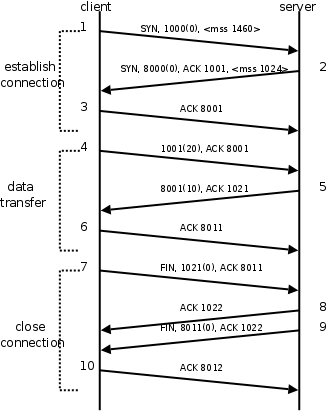
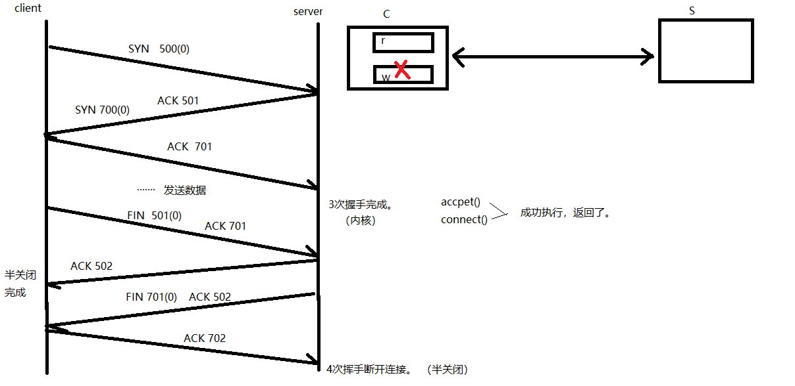
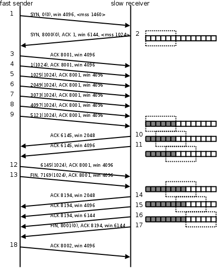
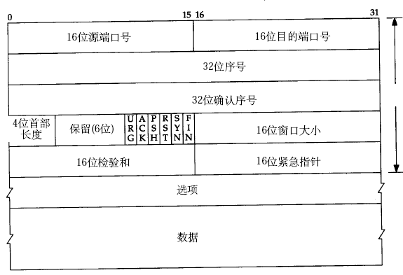
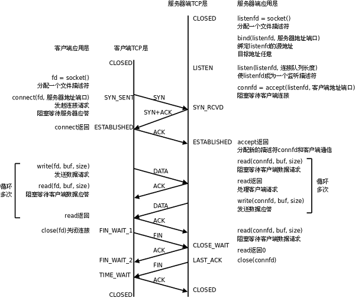

## 目录

- **第四章：TCP协议深入**

  - [01P-三次握手建立连接](#01P-三次握手建立连接)
  - [02P-数据通信](#02P-数据通信)
  - [03P-四次握手关闭连接](#03P-四次握手关闭连接)
  - [04P-半关闭补充说明](#04P-半关闭补充说明)
  - [05P-滑动窗口和TCP数据包格式](#05P-滑动窗口和TCP数据包格式)
  - [06P-通信时序与代码对应关系](#06P-通信时序与代码对应关系)
  - [07P-TCP通信时序总结](#07P-TCP通信时序总结)

---

# 第四章：TCP协议深入

## 01P-三次握手建立连接

## 02P-数据通信

并不是一次发送，一次应答。也可以批量应答

## 03P-四次握手关闭连接

## 04P-半关闭补充说明

这里其实就是想说明，完成两次挥手后，不是说两端的连接断开了，主动端关闭了写缓冲区，不能再向对端发送数据，被动端关闭了读缓冲区，不能再从对端读取数据。然而主动端还是能够读取对端发来的数据。

## 05P-滑动窗口和TCP数据包格式

滑动窗口：
发送给连接对端，本端的缓冲区大小（实时），保证数据不会丢失。

## 06P-通信时序与代码对应关系

## 07P-TCP通信时序总结

三次握手：
主动发起连接请求端，发送 SYN 标志位，请求建立连接。 携带序号号、数据字节数(0)、滑动窗口大小。
被动接受连接请求端，发送 ACK 标志位，同时携带 SYN 请求标志位。携带序号、确认序号、数据字节数(0)、滑动窗口大小。
主动发起连接请求端，发送 ACK 标志位，应答服务器连接请求。携带确认序号。
四次挥手：
主动关闭连接请求端， 发送 FIN 标志位。
被动关闭连接请求端， 应答 ACK 标志位。  ----- 半关闭完成。
被动关闭连接请求端， 发送 FIN 标志位。
主动关闭连接请求端， 应答 ACK 标志位。 ----- 连接全部关闭
滑动窗口：
发送给连接对端，本端的缓冲区大小（实时），保证数据不会丢失。

