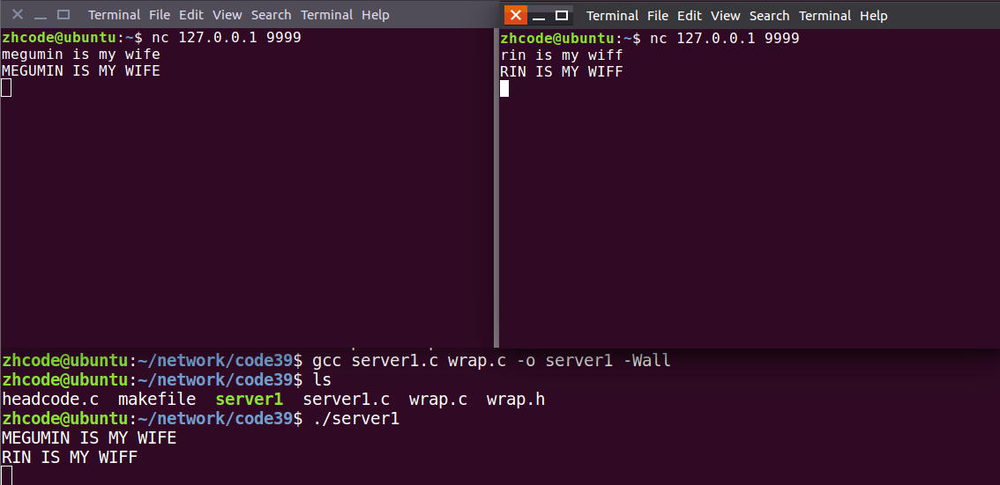
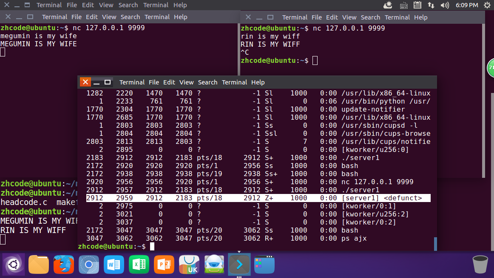
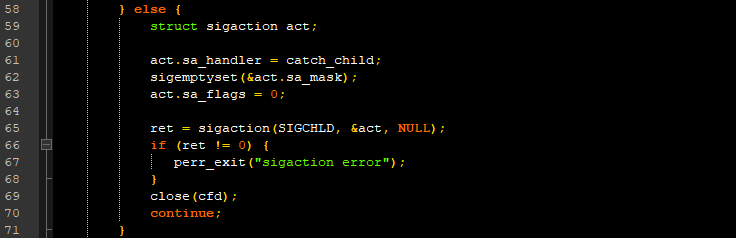
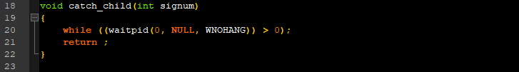
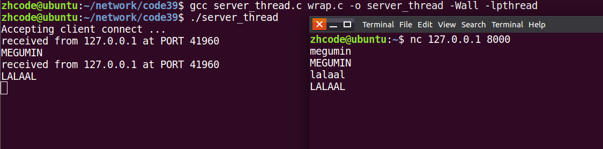
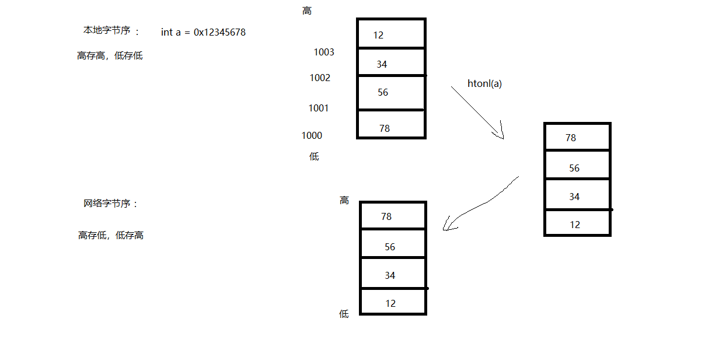

## 目录

- **第六章：多进程/多线程并发服务器**

  - [01P-多进程并发服务器思路分析](#01P-多进程并发服务器思路分析)
  - [02P-多线程并发服务器分析](#02P-多线程并发服务器分析)
  - [03P-多进程并发服务器实现](#03P-多进程并发服务器实现)
  - [04P-多进程服务器测试IP地址调整](#04P-多进程服务器测试IP地址调整)
  - [05P-服务器程序上传外网服务器并访问](#05P-服务器程序上传外网服务器并访问)
  - [06P-多线程服务器代码review](#06P-多线程服务器代码review)
  - [07P-read返回值和总结](#07P-read返回值和总结)
  - [08P-复习](#08P-复习)

---

# 第六章：多进程/多线程并发服务器

## 01P-多进程并发服务器思路分析

```c
1. Socket();创建 监听套接字 lfd
2. Bind()绑定地址结构 Strcut scokaddr_in addr;
3. Listen();
4. while (1) {
    cfd = Accpet();接收客户端连接请求。
    pid = fork();
    if (pid == 0){子进程 read(cfd) --- 小-》大 --- write(cfd)
        close(lfd)关闭用于建立连接的套接字 lfd
        read()
        小--大
        write()
    } else if （pid > 0） {
        close(cfd);关闭用于与客户端通信的套接字 cfd
        contiue;
    }
}
5. 子进程：
    close(lfd)
    read()
    小--大
    write()

父进程：
    close(cfd);

注册信号捕捉函数：SIGCHLD
在回调函数中， 完成子进程回收
    while （waitpid()）;
```

## 02P-多线程并发服务器分析

多线程并发服务器： server.c
```c
1. Socket();创建 监听套接字 lfd
2. Bind()绑定地址结构 Strcut scokaddr_in addr;
3. Listen();
4. while (1) {
    cfd = Accept(lfd, );
    pthread_create(&tid, NULL, tfn, (void *)cfd);
    pthread_detach(tid);  // pthead_join(tid, void **);  新线程---专用于回收子线程。
}
5. 子线程：
void *tfn(void *arg)
{
    // close(lfd)不能关闭。 主线程要使用lfd
    read(cfd)
    小--大
    write(cfd)
    pthread_exit（(void *)10）;
}
```

## 03P-多进程并发服务器实现

第一个版本的代码如下：
```c
#include <stdio.h>
#include <ctype.h>
#include <stdlib.h>
#include <sys/wait.h>
#include <string.h>
#include <strings.h>
#include <unistd.h>
#include <errno.h>
#include <signal.h>
#include <sys/socket.h>
#include <arpa/inet.h>
#include <pthread.h>
#include "wrap.h"
#define SRV_PORT 9999
int main(int argc, char *argv[])
{
    int lfd, cfd;
    pid_t pid;
    struct sockaddr_in srv_addr, clt_addr;
    socklen_t clt_addr_len;
    char buf[BUFSIZ];
    int ret, i;
    //memset(&srv_addr, 0, sizeof(srv_addr));                 // 将地址结构清零
    bzero(&srv_addr, sizeof(srv_addr));
    srv_addr.sin_family = AF_INET;
    srv_addr.sin_port = htons(SRV_PORT);
    srv_addr.sin_addr.s_addr = htonl(INADDR_ANY);
    lfd = Socket(AF_INET, SOCK_STREAM, 0);
    Bind(lfd, (struct sockaddr *)&srv_addr, sizeof(srv_addr));
    Listen(lfd, 128);
    clt_addr_len = sizeof(clt_addr);
    while (1) {
        cfd = Accept(lfd, (struct sockaddr *)&clt_addr, &clt_addr_len);
        pid = fork();
        if (pid < 0) {
            perr_exit("fork error");
        } else if (pid == 0) {
            close(lfd);
            break;
        } else {
            close(cfd);
            continue;
        }
    }
    if (pid == 0) {
        for (;;) {
            ret = Read(cfd, buf, sizeof(buf));
            if (ret == 0) {
                close(cfd);
                exit(1);
            }
            for (i = 0; i < ret; i++)
                buf[i] = toupper(buf[i]);
            write(cfd, buf, ret);
            write(STDOUT_FILENO, buf, ret);
        }
    }
    return 0;
}
```

编译运行，结果如下：

这个代码，有问题。我们Ctrl+C终止一个连接进程，会发现，有僵尸进程。

如上图所示，有个僵尸进程。这是因为父进程在阻塞等待，没来得及去回收这个子进程。
所以需要修改代码，增加子进程回收，用信号捕捉来实现。
修改部分如图所示：


完整代码如下：
```c
#include <stdio.h>
#include <ctype.h>
#include <stdlib.h>
#include <sys/wait.h>
#include <string.h>
#include <strings.h>
#include <unistd.h>
#include <errno.h>
#include <signal.h>
#include <sys/socket.h>
#include <arpa/inet.h>
#include <pthread.h>
#include "wrap.h"
#define SRV_PORT 9999
void catch_child(int signum)
{
    while ((waitpid(0, NULL, WNOHANG)) > 0);
    return ;
}
int main(int argc, char *argv[])
{
    int lfd, cfd;
    pid_t pid;
    struct sockaddr_in srv_addr, clt_addr;
    socklen_t clt_addr_len;
    char buf[BUFSIZ];
    int ret, i;
    //memset(&srv_addr, 0, sizeof(srv_addr));                 // 将地址结构清零
    bzero(&srv_addr, sizeof(srv_addr));
    srv_addr.sin_family = AF_INET;
    srv_addr.sin_port = htons(SRV_PORT);
    srv_addr.sin_addr.s_addr = htonl(INADDR_ANY);
    lfd = Socket(AF_INET, SOCK_STREAM, 0);
    Bind(lfd, (struct sockaddr *)&srv_addr, sizeof(srv_addr));
    Listen(lfd, 128);
    clt_addr_len = sizeof(clt_addr);
    while (1) {
        cfd = Accept(lfd, (struct sockaddr *)&clt_addr, &clt_addr_len);
        pid = fork();
        if (pid < 0) {
            perr_exit("fork error");
        } else if (pid == 0) {
            close(lfd);
            break;
        } else {
            struct sigaction act;
            act.sa_handler = catch_child;
            sigemptyset(&act.sa_mask);
            act.sa_flags = 0;
            ret = sigaction(SIGCHLD, &act, NULL);
            if (ret != 0) {
                perr_exit("sigaction error");
            }
            close(cfd);
            continue;
        }
    }
    if (pid == 0) {
        for (;;) {
            ret = Read(cfd, buf, sizeof(buf));
            if (ret == 0) {
                close(cfd);
                exit(1);
            }
            for (i = 0; i < ret; i++)
                buf[i] = toupper(buf[i]);
            write(cfd, buf, ret);
            write(STDOUT_FILENO, buf, ret);
        }
    }
    return 0;
}
```

这样，当子进程退出时，父进程收到信号，就会去回收子进程了，不会出现僵尸进程。

## 04P-多进程服务器测试IP地址调整

使用桥接模式，让自己主机和其他人主机处于同一个网段

## 05P-服务器程序上传外网服务器并访问

scp -r 命令，将本地文件拷贝至远程服务器上目标位置
scp -r 源地址 目标地址

## 06P-多线程服务器代码review

代码如下：
```c
#include <stdio.h>
#include <string.h>
#include <arpa/inet.h>
#include <pthread.h>
#include <ctype.h>
#include <unistd.h>
#include <fcntl.h>
#include "wrap.h"
#define MAXLINE 8192
#define SERV_PORT 8000
struct s_info {                     //定义一个结构体, 将地址结构跟cfd捆绑
    struct sockaddr_in cliaddr;
    int connfd;
};
void *do_work(void *arg)
{
    int n,i;
    struct s_info *ts = (struct s_info*)arg;
    char buf[MAXLINE];
    char str[INET_ADDRSTRLEN];      //#define INET_ADDRSTRLEN 16  可用"[+d"查看
    while (1) {
        n = Read(ts->connfd, buf, MAXLINE);                     //读客户端
        if (n == 0) {
            printf("the client %d closed...\n", ts->connfd);
            break;                                              //跳出循环,关闭cfd
        }
        printf("received from %s at PORT %d\n",
            inet_ntop(AF_INET, &(*ts).cliaddr.sin_addr, str, sizeof(str)),
            ntohs((*ts).cliaddr.sin_port));                 //打印客户端信息(IP/PORT)
        for (i = 0; i < n; i++)
            buf[i] = toupper(buf[i]);                           //小写-->大写
        Write(STDOUT_FILENO, buf, n);                           //写出至屏幕
        Write(ts->connfd, buf, n);                              //回写给客户端
    }
    Close(ts->connfd);
    return (void *)0;
}
int main(void)
{
    struct sockaddr_in servaddr, cliaddr;
    socklen_t cliaddr_len;
    int listenfd, connfd;
    pthread_t tid;
    struct s_info ts[256];      //创建结构体数组.
    int i = 0;
    listenfd = Socket(AF_INET, SOCK_STREAM, 0);                     //创建一个socket, 得到lfd
    bzero(&servaddr, sizeof(servaddr));                             //地址结构清零
    servaddr.sin_family = AF_INET;
    servaddr.sin_addr.s_addr = htonl(INADDR_ANY);                               //指定本地任意IP
    servaddr.sin_port = htons(SERV_PORT);                                       //指定端口号
    Bind(listenfd, (struct sockaddr *)&servaddr, sizeof(servaddr));             //绑定
    Listen(listenfd, 128);                                              //设置同一时刻链接服务器上限数
    printf("Accepting client connect ...\n");
    while (1) {
        cliaddr_len = sizeof(cliaddr);
        connfd = Accept(listenfd, (struct sockaddr *)&cliaddr, &cliaddr_len);   //阻塞监听客户端链接请求
        ts[i].cliaddr = cliaddr;
        ts[i].connfd = connfd;
        pthread_create(&tid, NULL, do_work, (void*)&ts[i]);
        pthread_detach(tid);                                            //子线程分离,防止僵线程产生.
        i++;
    }
    return 0;
}
```

编译运行，结果如下：


## 07P-read返回值和总结

**read函数返回值**

1. `> 0`：实际读到的字节数
2. `= 0`：已经读到结尾（对端已经关闭）
3. `-1`：应进一步判断errno的值：
   - `EAGAIN` 或 `EWOULDBLOCK`：设置了非阻塞方式读，没有数据到达
   - `EINTR`：慢速系统调用被中断
   - 其他情况：异常

## 08P-复习

