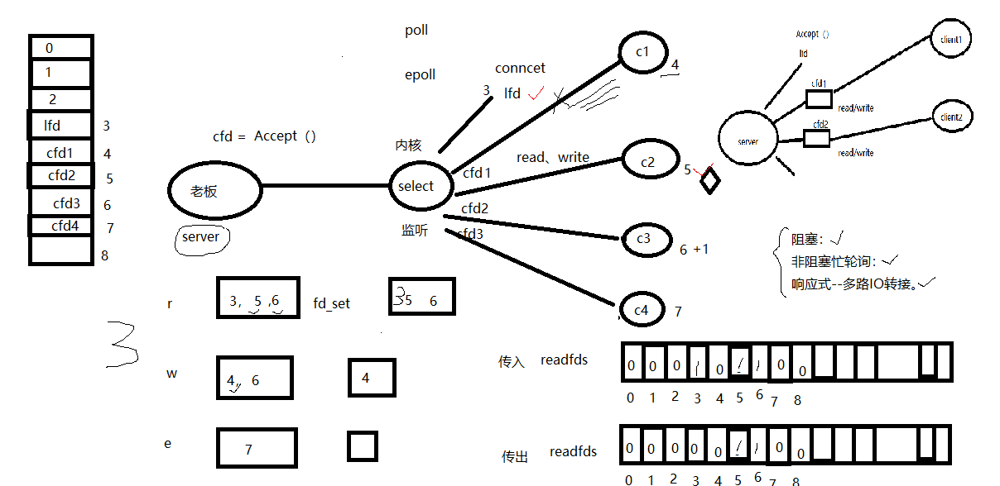
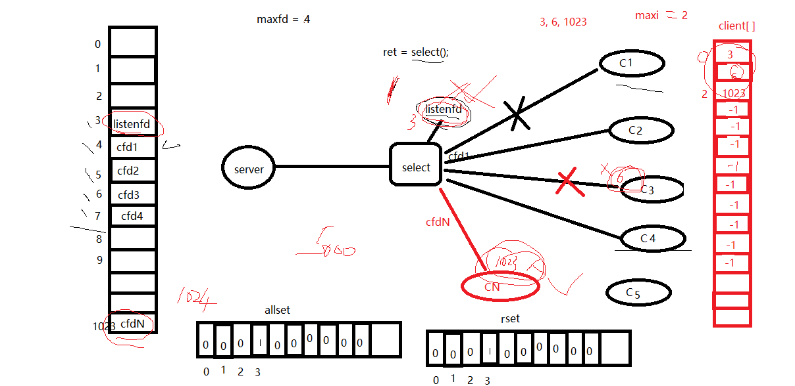
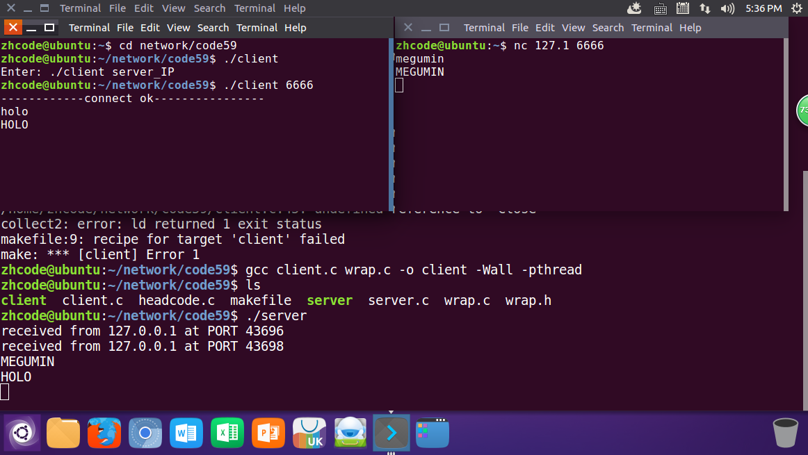

## 目录

- **第八章：多路IO转接-select**

  - [01P-多路IO转接服务器设计思路](#01P-多路IO转接服务器设计思路)
  - [02P-select函数参数简介](#02P-select函数参数简介)
  - [03P-select函数原型分析](#03P-select函数原型分析)
  - [04P-select相关函数参数分析](#04P-select相关函数参数分析)
  - [05P-select实现多路IO转接设计思路](#05P-select实现多路IO转接设计思路)
  - [06P-select实现多路IO转接-代码review](#06P-select实现多路IO转接-代码review)
  - [07P-select实现多路IO转接-添加注释](#07P-select实现多路IO转接-添加注释)
  - [08P-select优缺点](#08P-select优缺点)
  - [09P-添加一个自定义数组提高效率](#09P-添加一个自定义数组提高效率)
  - [10P-总结](#10P-总结)

---

# 第八章：多路IO转接-select

## 01P-多路IO转接服务器设计思路



## 02P-select函数参数简介

```c
int select(int nfds, fd_set *readfds, fd_set *writefds,fd_set *exceptfds, struct timeval *timeout);
```

nfds：监听的所有文件描述符中，最大文件描述符+1
readfds： 读 文件描述符监听集合。传入、传出参数
writefds：写 文件描述符监听集合。传入、传出参数NULL
exceptfds：异常 文件描述符监听集合传入、传出参数NULL
timeout： > 0: 设置监听超时时长。
NULL:阻塞监听

0：非阻塞监听，轮询
返回值：
> 0:所有监听集合（3个）中， 满足对应事件的总数。
0：没有满足监听条件的文件描述符
-1： errno

## 03P-select函数原型分析

```c
int select(int nfds, fd_set *readfds, fd_set *writefds,fd_set *exceptfds, struct timeval *timeout);
```

nfds：监听的所有文件描述符中，最大文件描述符+1
readfds： 读 文件描述符监听集合。传入、传出参数
writefds：写 文件描述符监听集合。传入、传出参数NULL
exceptfds：异常 文件描述符监听集合传入、传出参数NULL
timeout： > 0: 设置监听超时时长。
NULL:阻塞监听

0：非阻塞监听，轮询
返回值：
> 0:所有监听集合（3个）中， 满足对应事件的总数。
0：没有满足监听条件的文件描述符
-1： errno


## 04P-select相关函数参数分析

```c
void FD_CLR(int fd, fd_set *set)把某一个fd清除出去
int FD_ISSET(int fd, fd_set *set)判定某个fd是否在位图中
void FD_SET(int fd, fd_set *set)把某一个fd添加到位图
void FD_ZERO(fd_set *set)位图所有二进制位置零
```

select多路IO转接：
原理：  借助内核， select 来监听， 客户端连接、数据通信事件。
```c
void FD_ZERO(fd_set *set);--- 清空一个文件描述符集合。
fd_set rset;
FD_ZERO(&rset);
void FD_SET(int fd, fd_set *set);--- 将待监听的文件描述符，添加到监听集合中
FD_SET(3, &rset);FD_SET(5, &rset);FD_SET(6, &rset);
void FD_CLR(int fd, fd_set *set);--- 将一个文件描述符从监听集合中 移除。
FD_CLR（4， &rset）;
int  FD_ISSET(int fd, fd_set *set);--- 判断一个文件描述符是否在监听集合中。
```

返回值： 在：1；不在：0；
```c
FD_ISSET（4， &rset）;
```

## 05P-select实现多路IO转接设计思路

思路分析：
```c
int maxfd = 0；
lfd = socket() ;创建套接字
maxfd = lfd；
bind();绑定地址结构
listen();设置监听上限
fd_set rset， allset;创建r监听集合
FD_ZERO(&allset);将r监听集合清空
FD_SET(lfd, &allset);将 lfd 添加至读集合中。
while（1） {
    rset = allset；保存监听集合
    ret  = select(lfd+1， &rset， NULL， NULL， NULL);监听文件描述符集合对应事件。
    if（ret > 0） {有监听的描述符满足对应事件
        if (FD_ISSET(lfd, &rset)) {// 1 在。 0不在。
            cfd = accept（）；建立连接，返回用于通信的文件描述符
            maxfd = cfd；
            FD_SET(cfd, &allset);添加到监听通信描述符集合中。
        }
        for （i = lfd+1； i <= 最大文件描述符; i++）{
            FD_ISSET(i, &rset)有read、write事件
            read（）
            小 -- 大
            write();
        }
    }
}
```

## 06P-select实现多路IO转接-代码review


代码如下：
```c
#include <stdio.h>
#include <stdlib.h>
#include <unistd.h>
#include <string.h>
#include <arpa/inet.h>
#include <ctype.h>
#include "wrap.h"
#define SERV_PORT 6666
int main(int argc, char *argv[])
{
    int i, j, n, nready;
    int maxfd = 0;
    int listenfd, connfd;
    char buf[BUFSIZ];         /* #define INET_ADDRSTRLEN 16 */
    struct sockaddr_in clie_addr, serv_addr;
    socklen_t clie_addr_len;
    listenfd = Socket(AF_INET, SOCK_STREAM, 0);
    int opt = 1;
    setsockopt(listenfd, SOL_SOCKET, SO_REUSEADDR, &opt, sizeof(opt));
    bzero(&serv_addr, sizeof(serv_addr));
    serv_addr.sin_family= AF_INET;
    serv_addr.sin_addr.s_addr = htonl(INADDR_ANY);
    serv_addr.sin_port= htons(SERV_PORT);
    Bind(listenfd, (struct sockaddr *)&serv_addr, sizeof(serv_addr));
    Listen(listenfd, 128);
    fd_set rset, allset;                            /* rset 读事件文件描述符集合 allset用来暂存 */
    maxfd = listenfd;
    FD_ZERO(&allset);
    FD_SET(listenfd, &allset);                                  /* 构造select监控文件描述符集 */
    while (1) {
        rset = allset;                                          /* 每次循环时都从新设置select监控信号集 */
        nready = select(maxfd+1, &rset, NULL, NULL, NULL);
        if (nready < 0)
            perr_exit("select error");
        if (FD_ISSET(listenfd, &rset)) {                        /* 说明有新的客户端链接请求 */
            clie_addr_len = sizeof(clie_addr);
            connfd = Accept(listenfd, (struct sockaddr *)&clie_addr, &clie_addr_len);       /* Accept 不会阻塞 */
            FD_SET(connfd, &allset);                            /* 向监控文件描述符集合allset添加新的文件描述符connfd */
            if (maxfd < connfd)
                maxfd = connfd;
            if (0 == --nready)                                  /* 只有listenfd有事件, 后续的 for 不需执行 */
                continue;
        }
        for (i = listenfd+1; i <= maxfd; i++) {                 /* 检测哪个clients 有数据就绪 */
            if (FD_ISSET(i, &rset)) {
                if ((n = Read(i, buf, sizeof(buf))) == 0) {    /* 当client关闭链接时,服务器端也关闭对应链接 */
                    Close(i);
                    FD_CLR(i, &allset);                         /* 解除select对此文件描述符的监控 */
                } else if (n > 0) {
                    for (j = 0; j < n; j++)
                        buf[j] = toupper(buf[j]);
                    Write(i, buf, n);
                }
            }
        }
    }
    Close(listenfd);
    return 0;
}
```

编译运行，结果如下：

如图，借助select也可以实现多线程

## 07P-select实现多路IO转接-添加注释

代码太长了，直接看59话吧

## 08P-select优缺点


select优缺点：
缺点：监听上限受文件描述符限制。 最大 1024.
检测满足条件的fd， 自己添加业务逻辑提高小。 提高了编码难度。
优点：跨平台。win、linux、macOS、Unix、类Unix、mips
select代码里有个可以优化的地方，用数组存下文件描述符，这样就不需要每次扫描一大堆无关文件描述符了

## 09P-添加一个自定义数组提高效率

这里就是改进之前代码的问题，之前的代码，如果最大fd是1023，每次确定有事件发生的fd时，就要扫描3-1023的所有文件描述符，这看起来很蠢。于是定义一个数组，把要监听的文件描述符存下来，每次扫描这个数组就行了。看起来科学得多。

如图，加个client数组，存要监听的描述符。
代码如下，挺长的
```c
#include <stdio.h>
#include <stdlib.h>
#include <unistd.h>
#include <string.h>
#include <arpa/inet.h>
#include <ctype.h>
#include "wrap.h"
#define SERV_PORT 6666
int main(int argc, char *argv[])
{
    int i, j, n, maxi;
    int nready, client[FD_SETSIZE];                 /* 自定义数组client, 防止遍历1024个文件描述符  FD_SETSIZE默认为1024 */
    int maxfd, listenfd, connfd, sockfd;
    char buf[BUFSIZ], str[INET_ADDRSTRLEN];         /* #define INET_ADDRSTRLEN 16 */
    struct sockaddr_in clie_addr, serv_addr;
    socklen_t clie_addr_len;
    fd_set rset, allset;                            /* rset 读事件文件描述符集合 allset用来暂存 */
    listenfd = Socket(AF_INET, SOCK_STREAM, 0);
    int opt = 1;
    setsockopt(listenfd, SOL_SOCKET, SO_REUSEADDR, &opt, sizeof(opt));
    bzero(&serv_addr, sizeof(serv_addr));
    serv_addr.sin_family= AF_INET;
    serv_addr.sin_addr.s_addr = htonl(INADDR_ANY);
    serv_addr.sin_port= htons(SERV_PORT);
    Bind(listenfd, (struct sockaddr *)&serv_addr, sizeof(serv_addr));
    Listen(listenfd, 128);
    maxfd = listenfd;                                           /* 起初 listenfd 即为最大文件描述符 */
    maxi = -1;                                                  /* 将来用作client[]的下标, 初始值指向0个元素之前下标位置 */
    for (i = 0; i < FD_SETSIZE; i++)
        client[i] = -1;                                         /* 用-1初始化client[] */
    FD_ZERO(&allset);
    FD_SET(listenfd, &allset);                                  /* 构造select监控文件描述符集 */
    while (1) {
        rset = allset;                                          /* 每次循环时都重新设置select监控信号集 */
        nready = select(maxfd+1, &rset, NULL, NULL, NULL);  //2  1--lfd  1--connfd
        if (nready < 0)
            perr_exit("select error");
        if (FD_ISSET(listenfd, &rset)) {                        /* 说明有新的客户端链接请求 */
            clie_addr_len = sizeof(clie_addr);
            connfd = Accept(listenfd, (struct sockaddr *)&clie_addr, &clie_addr_len);       /* Accept 不会阻塞 */
            printf("received from %s at PORT %d\n",
                inet_ntop(AF_INET, &clie_addr.sin_addr, str, sizeof(str)),
                ntohs(clie_addr.sin_port));
            for (i = 0; i < FD_SETSIZE; i++)
                if (client[i] < 0) {                            /* 找client[]中没有使用的位置 */
                    client[i] = connfd;                         /* 保存accept返回的文件描述符到client[]里 */
                    break;
                }
            if (i == FD_SETSIZE) {                              /* 达到select能监控的文件个数上限 1024 */
                fputs("too many clients\n", stderr);
                exit(1);
            }
            FD_SET(connfd, &allset);                            /* 向监控文件描述符集合allset添加新的文件描述符connfd */
            if (connfd > maxfd)
                maxfd = connfd;                                 /* select第一个参数需要 */
            if (i > maxi)
                maxi = i;                                       /* 保证maxi存的总是client[]最后一个元素下标 */
            if (--nready == 0)
                continue;
        }
        for (i = 0; i <= maxi; i++) {                               /* 检测哪个clients 有数据就绪 */
            if ((sockfd = client[i]) < 0)
                continue;
            if (FD_ISSET(sockfd, &rset)) {
                if ((n = Read(sockfd, buf, sizeof(buf))) == 0) {    /* 当client关闭链接时,服务器端也关闭对应链接 */
                    Close(sockfd);
                    FD_CLR(sockfd, &allset);                        /* 解除select对此文件描述符的监控 */
                    client[i] = -1;
                } else if (n > 0) {
                    for (j = 0; j < n; j++)
                        buf[j] = toupper(buf[j]);
                    Write(sockfd, buf, n);
                    Write(STDOUT_FILENO, buf, n);
                }
                if (--nready == 0)
                    break;                                          /* 跳出for, 但还在while中 */
            }
        }
    }
    Close(listenfd);
    return 0;
}
```

编译运行和改进前没啥区别，这里就不贴图了

## 10P-总结

**select优缺点**

缺点：
- 监听上限受文件描述符限制，最大1024
- 检测满足条件的fd后，需要自己添加业务逻辑，提高了编码难度

优点：
- 跨平台：支持Windows、Linux、macOS、Unix等