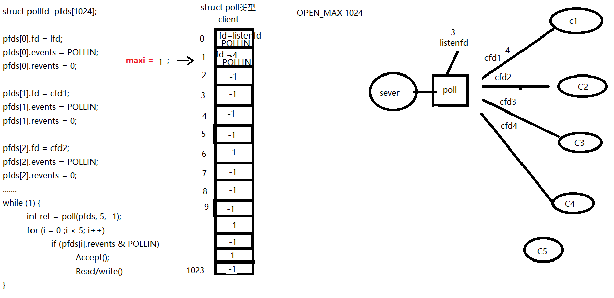

## 目录

- **第九章：多路IO转接-poll**

  - [01P-poll函数原型分析](#01P-poll函数原型分析)
  - [02P-poll函数使用注意事项示例](#02P-poll函数使用注意事项示例)
  - [03P-poll函数实现服务器](#03P-poll函数实现服务器)
  - [04P-poll总结](#04P-poll总结)

---

# 第九章：多路IO转接-poll

## 01P-poll函数原型分析

poll是对select的改进，但是它是个半成品，相对select提升不大。最终版本是epoll，所以poll了解一下就完事儿，重点掌握epoll。
poll：
```c
int poll(struct pollfd *fds, nfds_t nfds, int timeout);
```

fds：监听的文件描述符【数组】
```c
struct pollfd {
    int fd：待监听的文件描述符
    short events：待监听的文件描述符对应的监听事件
    // 取值：POLLIN、POLLOUT、POLLERR
    short revnets：传入时， 给0。如果满足对应事件的话， 返回 非0 --> POLLIN、POLLOUT、POLLERR
};
```

nfds: 监听数组的，实际有效监听个数。
timeout:  > 0:  超时时长。单位：毫秒。
-1:阻塞等待
0：  不阻塞
返回值：返回满足对应监听事件的文件描述符 总个数。
优点：
自带数组结构。 可以将 监听事件集合 和 返回事件集合 分离。
拓展 监听上限。 超出 1024限制。
缺点：
不能跨平台。 Linux
无法直接定位满足监听事件的文件描述符， 编码难度较大。

## 02P-poll函数使用注意事项示例



## 03P-poll函数实现服务器

这个东西用得少，基本都用epoll，从讲义上挂个代码过来，看看视频里思路就完事儿
```c
/* server.c */
#include <stdio.h>
#include <stdlib.h>
#include <string.h>
#include <netinet/in.h>
#include <arpa/inet.h>
#include <poll.h>
#include <errno.h>
#include "wrap.h"
#define MAXLINE 80
#define SERV_PORT 6666
#define OPEN_MAX 1024
int main(int argc, char *argv[])
{
    int i, j, maxi, listenfd, connfd, sockfd;
    int nready;
    ssize_t n;
    char buf[MAXLINE], str[INET_ADDRSTRLEN];
    socklen_t clilen;
    struct pollfd client[OPEN_MAX];
    struct sockaddr_in cliaddr, servaddr;
    listenfd = Socket(AF_INET, SOCK_STREAM, 0);
    bzero(&servaddr, sizeof(servaddr));
    servaddr.sin_family = AF_INET;
    servaddr.sin_addr.s_addr = htonl(INADDR_ANY);
    servaddr.sin_port = htons(SERV_PORT);
    Bind(listenfd, (struct sockaddr *)&servaddr, sizeof(servaddr));
    Listen(listenfd, 20);
    client[0].fd = listenfd;
    client[0].events = POLLRDNORM;                  /* listenfd监听普通读事件 */
    for (i = 1; i < OPEN_MAX; i++)
        client[i].fd = -1;                          /* 用-1初始化client[]里剩下元素 */
    maxi = 0;                                       /* client[]数组有效元素中最大元素下标 */
    for ( ; ; ) {
        nready = poll(client, maxi+1, -1);          /* 阻塞 */
        if (client[0].revents & POLLRDNORM) {       /* 有客户端链接请求 */
            clilen = sizeof(cliaddr);
            connfd = Accept(listenfd, (struct sockaddr *)&cliaddr, &clilen);
            printf("received from %s at PORT %d\n",
                inet_ntop(AF_INET, &cliaddr.sin_addr, str, sizeof(str)),
                ntohs(cliaddr.sin_port));
            for (i = 1; i < OPEN_MAX; i++) {
                if (client[i].fd < 0) {
                    client[i].fd = connfd;  /* 找到client[]中空闲的位置，存放accept返回的connfd */
                    break;
                }
            }
            if (i == OPEN_MAX)
                perr_exit("too many clients");
            client[i].events = POLLRDNORM;      /* 设置刚刚返回的connfd，监控读事件 */
            if (i > maxi)
                maxi = i;                       /* 更新client[]中最大元素下标 */
            if (--nready <= 0)
                continue;                       /* 没有更多就绪事件时,继续回到poll阻塞 */
        }
        for (i = 1; i <= maxi; i++) {            /* 检测client[] */
            if ((sockfd = client[i].fd) < 0)
                continue;
            if (client[i].revents & (POLLRDNORM | POLLERR)) {
                if ((n = Read(sockfd, buf, MAXLINE)) < 0) {
                    if (errno == ECONNRESET) { /* 当收到 RST标志时 */
                        /* connection reset by client */
                        printf("client[%d] aborted connection\n", i);
                        Close(sockfd);
                        client[i].fd = -1;
                    } else {
                        perr_exit("read error");
                    }
                } else if (n == 0) {
                    /* connection closed by client */
                    printf("client[%d] closed connection\n", i);
                    Close(sockfd);
                    client[i].fd = -1;
                } else {
                    for (j = 0; j < n; j++)
                        buf[j] = toupper(buf[j]);
                    Writen(sockfd, buf, n);
                }
                if (--nready <= 0)
                    break;              /* no more readable descriptors */
            }
        }
    }
    return 0;
}
```

## 04P-poll总结

优点：
自带数组结构。 可以将 监听事件集合 和 返回事件集合 分离。
拓展 监听上限。 超出 1024限制。
缺点：
不能跨平台。 Linux
无法直接定位满足监听事件的文件描述符， 编码难度较大。