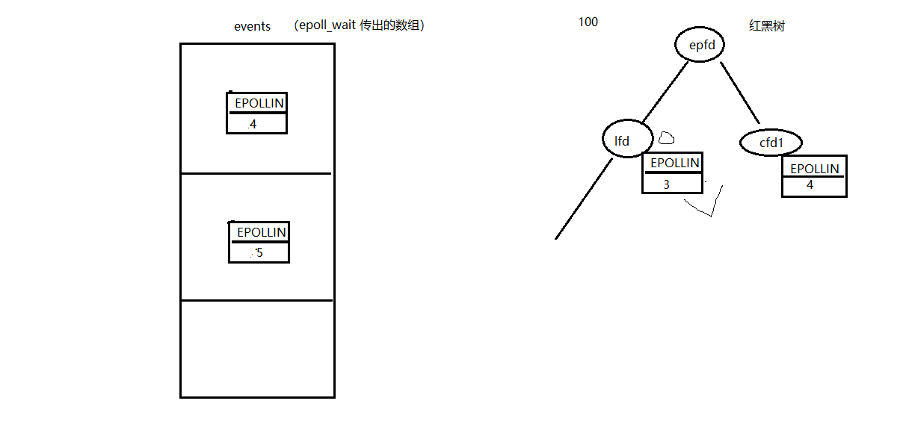
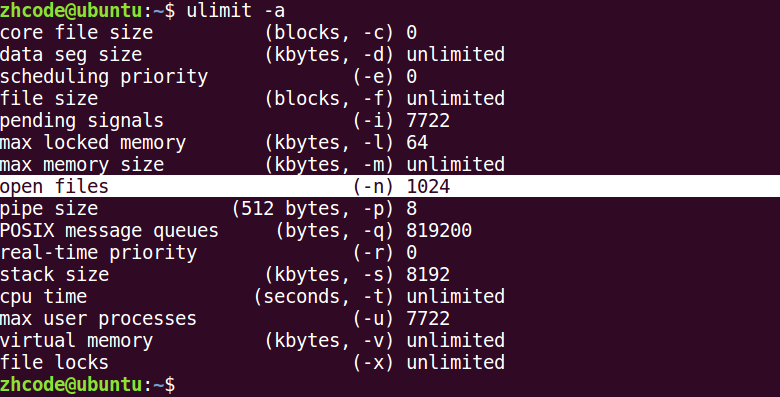
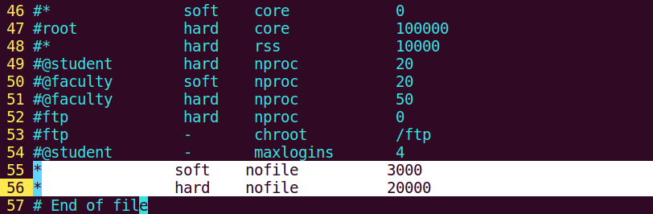
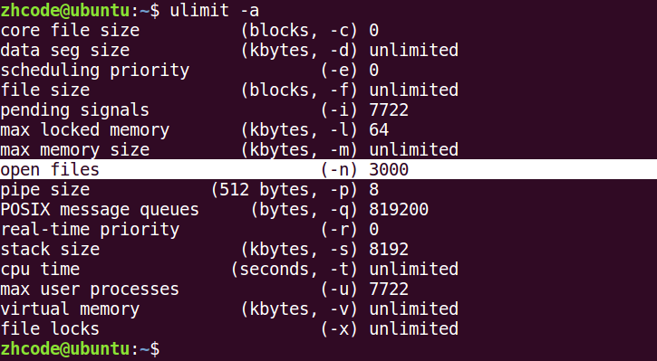
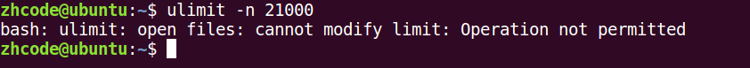
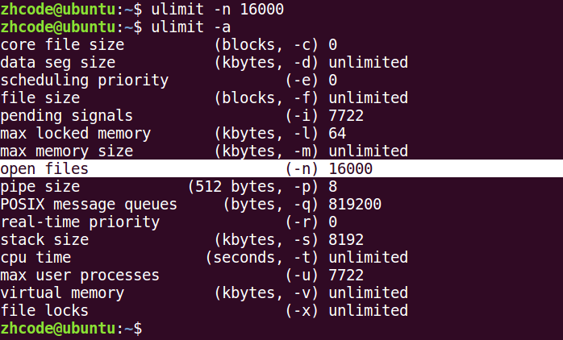
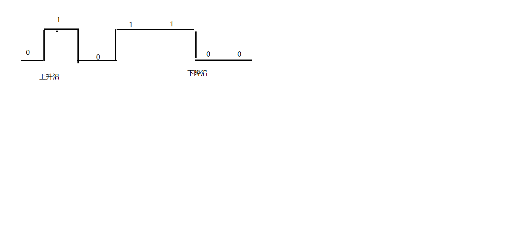
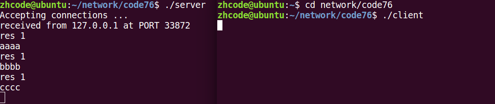
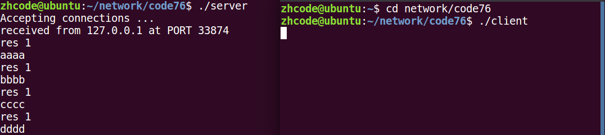

## 目录

- **第十章：多路IO转接-epoll**

  - [01P-epoll函数实现的多路IO转接](#01P-epoll函数实现的多路IO转接)
  - [02P-突破1024文件描述符设置](#02P-突破1024文件描述符设置)
  - [03P-epoll_create和epoll_ctl](#03P-epoll_create和epoll_ctl)
  - [04P-epoll_wait函数](#04P-epoll_wait函数)
  - [05P-中午复习](#05P-中午复习)
  - [06P-ET和LT模式](#06P-ET和LT模式)
  - [07P-网络中ET和LT模式](#07P-网络中ET和LT模式)
  - [08P-epoll的ET非阻塞模式](#08P-epoll的ET非阻塞模式)
  - [09P-epoll优缺点总结](#09P-epoll优缺点总结)
  - [10P-补充对比ET和LT](#10P-补充对比ET和LT)

---

# 第十章：多路IO转接-epoll

## 01P-epoll函数实现的多路IO转接


代码如下：
```c
#include <stdio.h>
#include <unistd.h>
#include <stdlib.h>
#include <string.h>
#include <arpa/inet.h>
#include <sys/epoll.h>
#include <errno.h>
#include <ctype.h>
#include "wrap.h"
#define MAXLINE 8192
#define SERV_PORT 8000
#define OPEN_MAX 5000
int main(int argc, char *argv[])
{
    int i, listenfd, connfd, sockfd;
    int  n, num = 0;
    ssize_t nready, efd, res;
    char buf[MAXLINE], str[INET_ADDRSTRLEN];
    socklen_t clilen;
    struct sockaddr_in cliaddr, servaddr;
    struct epoll_event tep, ep[OPEN_MAX];       //tep: epoll_ctl参数  ep[] : epoll_wait参数
    listenfd = Socket(AF_INET, SOCK_STREAM, 0);
    int opt = 1;
    setsockopt(listenfd, SOL_SOCKET, SO_REUSEADDR, &opt, sizeof(opt));      //端口复用
    bzero(&servaddr, sizeof(servaddr));
    servaddr.sin_family = AF_INET;
    servaddr.sin_addr.s_addr = htonl(INADDR_ANY);
    servaddr.sin_port = htons(SERV_PORT);
    Bind(listenfd, (struct sockaddr *) &servaddr, sizeof(servaddr));
    Listen(listenfd, 20);
    efd = epoll_create(OPEN_MAX);               //创建epoll模型, efd指向红黑树根节点
    if (efd == -1)
        perr_exit("epoll_create error");
    tep.events = EPOLLIN;
    tep.data.fd = listenfd;           //指定lfd的监听事件为"读"
    res = epoll_ctl(efd, EPOLL_CTL_ADD, listenfd, &tep);    //将lfd及对应的结构体设置到树上,efd可找到该树
    if (res == -1)
        perr_exit("epoll_ctl error");
    for ( ; ; ) {
        /*epoll为server阻塞监听事件, ep为struct epoll_event类型数组, OPEN_MAX为数组容量, -1表永久阻塞*/
        nready = epoll_wait(efd, ep, OPEN_MAX, -1);
        if (nready == -1)
            perr_exit("epoll_wait error");
        for (i = 0; i < nready; i++) {
            if (ep[i].data.fd == listenfd) {    //判断满足事件的fd是不是lfd
                clilen = sizeof(cliaddr);
                connfd = Accept(listenfd, (struct sockaddr *)&cliaddr, &clilen);    //接受链接
                printf("received from %s at PORT %d\n",
                    inet_ntop(AF_INET, &cliaddr.sin_addr, str, sizeof(str)),
                    ntohs(cliaddr.sin_port));
                printf("cfd %d---client %d\n", connfd, ++num);
                tep.events = EPOLLIN; tep.data.fd = connfd;
                res = epoll_ctl(efd, EPOLL_CTL_ADD, connfd, &tep);      //加入红黑树
                if (res == -1)
                    perr_exit("epoll_ctl error");
            } else {                                                    //不是lfd,
                sockfd = ep[i].data.fd;
                n = Read(sockfd, buf, MAXLINE);
                if (n == 0) {                                           //读到0,说明客户端关闭链接
                    res = epoll_ctl(efd, EPOLL_CTL_DEL, sockfd, NULL);  //将该文件描述符从红黑树摘除
                    if (res == -1)
                        perr_exit("epoll_ctl error");
                    Close(sockfd);                                      //关闭与该客户端的链接
                    printf("client[%d] closed connection\n", sockfd);
                } else if (n < 0) {                                     //出错
                    perror("read n < 0 error: ");
                    res = epoll_ctl(efd, EPOLL_CTL_DEL, sockfd, NULL);  //摘除节点
                    Close(sockfd);
                } else {                                                //实际读到了字节数
                    for (i = 0; i < n; i++)
                        buf[i] = toupper(buf[i]);                       //转大写,写回给客户端
                    Write(STDOUT_FILENO, buf, n);
                    Writen(sockfd, buf, n);
                }
            }
        }
    }
    Close(listenfd);
    Close(efd);
    return 0;
}
```

**一般步骤**
创建epoll
    ↓
监听socket加入epoll `epoll_ctl(epfd, EPOLL_CTL_ADD, listenfd, &ev);`
    ↓
epoll_wait等待事件
    ↓
有事件发生
    ↓
新连接？ —— accept并加入epoll
    ↓
读写事件？ —— recv/send处理
    ↓
关闭连接？ —— 从epoll删除并close
    ↓
继续循环

## 02P-突破1024文件描述符设置

突破 1024 文件描述符限制：
```c
cat /proc/sys/fs/file-max  --> 当前计算机所能打开的最大文件个数。 受硬件影响。
```

ulimit -a ——> 当前用户下的进程，默认打开文件描述符个数。  缺省为 1024
修改：
打开 sudo vi /etc/security/limits.conf， 写入：
```c
* soft nofile 65536--> 设置默认值， 可以直接借助命令修改。 【注销用户，使其生效】
* hard nofile 100000--> 命令修改上限。
```

cat /proc/sys/fs/file-max查看最大文件描述符上限

ulimit -a

sudo vi /etc/security/limits.conf  修改上限

修改之后，注销用户重新登录，查看文件描述符上限：

如图，已经修改成功了。
如果使用ulimit -n  来修改，会受到之前设置的hard的限制：


用ulimit -n设置之后，往下调可以，往上调需要注销用户再登录。

## 03P-epoll_create和epoll_ctl


epoll：
```c
int epoll_create(int size);创建一棵监听红黑树
```

size：创建的红黑树的监听节点数量。（仅供内核参考。）
返回值：指向新创建的红黑树的根节点的 fd。
失败： -1 errno
```c
int epoll_ctl(int epfd, int op, int fd, struct epoll_event *event);操作监听红黑树
epfd：epoll_create 函数的返回值。 epfd
```

op：对该监听红黑数所做的操作。
EPOLL_CTL_ADD 添加fd到 监听红黑树
EPOLL_CTL_MOD 修改fd在 监听红黑树上的监听事件。
EPOLL_CTL_DEL 将一个fd 从监听红黑树上摘下（取消监听）
fd：
待监听的fd
```c
event：本质 struct epoll_event 结构体 地址
```

成员 events：
EPOLLIN / EPOLLOUT / EPOLLERR
成员 data： 联合体（共用体）：
```c
int fd;  对应监听事件的 fd
```

void *ptr；
```c
uint32_t u32;
uint64_t u64;
```

返回值：成功 0； 失败： -1 errno

## 04P-epoll_wait函数

```c
int epoll_wait(int epfd, struct epoll_event *events, int maxevents, int timeout);  阻塞监听。
epfd：epoll_create 函数的返回值。 epfd
```

events：传出参数，【数组】， 满足监听条件的 那些 fd 结构体。
maxevents：数组 元素的总个数。 1024
```c
struct epoll_event evnets[1024]
```

timeout：
-1: 阻塞
0： 不阻塞
>0: 超时时间 （毫秒）
返回值：
> 0: 满足监听的 总个数。 可以用作循环上限。
0： 没有fd满足监听事件
-1：失败。 errno


## 05P-中午复习

epoll实现多路IO转接思路：
```c
lfd = socket（）;监听连接事件lfd
bind();
listen();
int epfd = epoll_create(1024);epfd, 监听红黑树的树根。
struct epoll_event tep, ep[1024];tep, 用来设置单个fd属性， ep 是 epoll_wait() 传出的满足监听事件的数组。
tep.events = EPOLLIN;初始化  lfd的监听属性。
tep.data.fd = lfd
epoll_ctl(epfd， EPOLL_CTL_ADD, lfd, &tep);将 lfd 添加到监听红黑树上。
while (1) {
    ret = epoll_wait(epfd， ep，1024， -1);实施监听
    for (i = 0; i < ret; i++) {
        if (ep[i].data.fd == lfd) {// lfd 满足读事件，有新的客户端发起连接请求
            cfd = Accept();
            tep.events = EPOLLIN;初始化  cfd的监听属性。
            tep.data.fd = cfd;
            epoll_ctl(epfd， EPOLL_CTL_ADD, cfd, &tep);
        } else {//cfd 们 满足读事件， 有客户端写数据来。
            n = read(ep[i].data.fd, buf, sizeof(buf));
            if ( n == 0) {
                close(ep[i].data.fd);
                epoll_ctl(epfd， EPOLL_CTL_DEL, ep[i].data.fd , NULL);// 将关闭的cfd，从监听树上摘下。
            } else if （n > 0） {
                小--大
                write(ep[i].data.fd, buf, n);
            }
        }
    }
}
```

## 06P-ET和LT模式

epoll是Linux下多路复用IO接口select/poll的增强版本，它能显著提高程序在大量并发连接中只有少量活跃的情况下的系统CPU利用率，因为它会复用文件描述符集合来传递结果而不用迫使开发者每次等待事件之前都必须重新准备要被侦听的文件描述符集合，另一点原因就是获取事件的时候，它无须遍历整个被侦听的描述符集，只要遍历那些被内核IO事件异步唤醒而加入Ready队列的描述符集合就行了。

EPOLL事件有两种模型：
Edge Triggered (ET) 边缘触发只有数据到来才触发，不管缓存区中是否还有数据。
Level Triggered (LT) 水平触发只要有数据都会触发。
视频中epoll测试代码如下，用一个子进程来写内容，用ET和LT模式来读取，结果很能说明问题：
```c
#include <stdio.h>
#include <stdlib.h>
#include <sys/epoll.h>
#include <errno.h>
#include <unistd.h>
#define MAXLINE 10
int main(int argc, char *argv[])
{
    int efd, i;
    int pfd[2];
    pid_t pid;
    char buf[MAXLINE], ch = 'a';
    pipe(pfd);
    pid = fork();
    if (pid == 0) {             //子 写
        close(pfd[0]);
        while (1) {
            //aaaa\n
            for (i = 0; i < MAXLINE/2; i++)
                buf[i] = ch;
            buf[i-1] = '\n';
            ch++;
            //bbbb\n
            for (; i < MAXLINE; i++)
                buf[i] = ch;
            buf[i-1] = '\n';
            ch++;
            //aaaa\nbbbb\n
            write(pfd[1], buf, sizeof(buf));
            sleep(5);
        }
        close(pfd[1]);
    } else if (pid > 0) {       //父 读
        struct epoll_event event;
        struct epoll_event resevent[10];        //epoll_wait就绪返回event
        int res, len;
        close(pfd[1]);
        efd = epoll_create(10);
        event.events = EPOLLIN | EPOLLET;     // ET 边沿触发
        // event.events = EPOLLIN;                 // LT 水平触发 (默认)
        event.data.fd = pfd[0];
        epoll_ctl(efd, EPOLL_CTL_ADD, pfd[0], &event);
        while (1) {
            res = epoll_wait(efd, resevent, 10, -1);
            printf("res %d\n", res);
            if (resevent[0].data.fd == pfd[0]) {
                len = read(pfd[0], buf, MAXLINE/2);
                write(STDOUT_FILENO, buf, len);
            }
        }
        close(pfd[0]);
        close(efd);
    } else {
        perror("fork");
        exit(-1);
    }
    return 0;
}
```

简单理解就是，水平触发就是有数据就触发，边沿触发是有新数据进来才触发。

## 07P-网络中ET和LT模式

直接看代码，server代码如下：
```c
#include <stdio.h>
#include <string.h>
#include <netinet/in.h>
#include <arpa/inet.h>
#include <signal.h>
#include <sys/wait.h>
#include <sys/types.h>
#include <sys/epoll.h>
#include <unistd.h>
#define MAXLINE 10
#define SERV_PORT 9000
int main(void)
{
    struct sockaddr_in servaddr, cliaddr;
    socklen_t cliaddr_len;
    int listenfd, connfd;
    char buf[MAXLINE];
    char str[INET_ADDRSTRLEN];
    int efd;
    listenfd = socket(AF_INET, SOCK_STREAM, 0);
    bzero(&servaddr, sizeof(servaddr));
    servaddr.sin_family = AF_INET;
    servaddr.sin_addr.s_addr = htonl(INADDR_ANY);
    servaddr.sin_port = htons(SERV_PORT);
    bind(listenfd, (struct sockaddr *)&servaddr, sizeof(servaddr));
    listen(listenfd, 20);
    struct epoll_event event;
    struct epoll_event resevent[10];
    int res, len;
    efd = epoll_create(10);
    event.events = EPOLLIN | EPOLLET;     /* ET 边沿触发 */
    //event.events = EPOLLIN;                 /* 默认 LT 水平触发 */
    printf("Accepting connections ...\n");
    cliaddr_len = sizeof(cliaddr);
    connfd = accept(listenfd, (struct sockaddr *)&cliaddr, &cliaddr_len);
    printf("received from %s at PORT %d\n",
        inet_ntop(AF_INET, &cliaddr.sin_addr, str, sizeof(str)),
        ntohs(cliaddr.sin_port));
    event.data.fd = connfd;
    epoll_ctl(efd, EPOLL_CTL_ADD, connfd, &event);
    while (1) {
        res = epoll_wait(efd, resevent, 10, -1);
        printf("res %d\n", res);
        if (resevent[0].data.fd == connfd) {
            len = read(connfd, buf, MAXLINE/2);         //readn(500)
            write(STDOUT_FILENO, buf, len);
        }
    }
    return 0;
}
```

client代码如下：
```c
#include <stdio.h>
#include <string.h>
#include <unistd.h>
#include <arpa/inet.h>
#include <netinet/in.h>
#define MAXLINE 10
#define SERV_PORT 9000
int main(int argc, char *argv[])
{
    struct sockaddr_in servaddr;
    char buf[MAXLINE];
    int sockfd, i;
    char ch = 'a';
    sockfd = socket(AF_INET, SOCK_STREAM, 0);
    bzero(&servaddr, sizeof(servaddr));
    servaddr.sin_family = AF_INET;
    inet_pton(AF_INET, "127.0.0.1", &servaddr.sin_addr);
    servaddr.sin_port = htons(SERV_PORT);
    connect(sockfd, (struct sockaddr *)&servaddr, sizeof(servaddr));
    while (1) {
        //aaaa\n
        for (i = 0; i < MAXLINE/2; i++)
            buf[i] = ch;
        buf[i-1] = '\n';
        ch++;
        //bbbb\n
        for (; i < MAXLINE; i++)
            buf[i] = ch;
        buf[i-1] = '\n';
        ch++;
        //aaaa\nbbbb\n
        write(sockfd, buf, sizeof(buf));
        sleep(5);
    }
    close(sockfd);
    return 0;
}
```

server边沿触发，编译运行，结果如下：

运行后，每过5秒钟服务器才输出一组字符，这是就是边沿触发的效果。
更改服务器为水平触发模式，运行程序，如下：

运行后，每5秒输出两组字符串，这是因为只写入了两组，这个模式的服务器，缓冲区有多少读多少。
ET模式：
边沿触发：
```c
缓冲区剩余未读尽的数据不会导致 epoll_wait 返回。 新的事件满足，才会触发。
struct epoll_event event;
event.events = EPOLLIN | EPOLLET;
```

LT模式：
水平触发 -- 默认采用模式。
```c
缓冲区剩余未读尽的数据会导致 epoll_wait 返回。
```

## 08P-epoll的ET非阻塞模式

```c
readn调用的阻塞，比如设定读500个字符，但是只读到498，完事儿阻塞了，等另剩下的2个字符，然而在server代码里，一旦read变为readn阻塞了，它就不会被唤醒了，因为epoll_wait因为readn的阻塞不会循环执行，读不到新数据。有点死锁的意思，差俩字符所以阻塞，因为阻塞，读不到新字符。
```

LT(level triggered)：LT是缺省的工作方式，并且同时支持block和no-block socket。在这种做法中，内核告诉你一个文件描述符是否就绪了，然后你可以对这个就绪的fd进行IO操作。如果你不作任何操作，内核还是会继续通知你的，所以，这种模式编程出错误可能性要小一点。传统的select/poll都是这种模型的代表。
ET(edge-triggered)：ET是高速工作方式，只支持no-block socket。在这种模式下，当描述符从未就绪变为就绪时，内核通过epoll告诉你。然后它会假设你知道文件描述符已经就绪，并且不会再为那个文件描述符发送更多的就绪通知。请注意，如果一直不对这个fd作IO操作(从而导致它再次变成未就绪)，内核不会发送更多的通知(only once).
用fcntl设置阻塞
非阻塞epoll的服务器代码如下：
```c
#include <stdio.h>
#include <string.h>
#include <netinet/in.h>
#include <arpa/inet.h>
#include <sys/wait.h>
#include <sys/types.h>
#include <sys/epoll.h>
#include <unistd.h>
#include <fcntl.h>
#define MAXLINE 10
#define SERV_PORT 8000
int main(void)
{
    struct sockaddr_in servaddr, cliaddr;
    socklen_t cliaddr_len;
    int listenfd, connfd;
    char buf[MAXLINE];
    char str[INET_ADDRSTRLEN];
    int efd, flag;
    listenfd = socket(AF_INET, SOCK_STREAM, 0);
    bzero(&servaddr, sizeof(servaddr));
    servaddr.sin_family = AF_INET;
    servaddr.sin_addr.s_addr = htonl(INADDR_ANY);
    servaddr.sin_port = htons(SERV_PORT);
    bind(listenfd, (struct sockaddr *)&servaddr, sizeof(servaddr));
    listen(listenfd, 20);
    ///////////////////////////////////////////////////////////////////////
    struct epoll_event event;
    struct epoll_event res_event[10];
    int res, len;
    efd = epoll_create(10);
    event.events = EPOLLIN | EPOLLET;     /* ET 边沿触发，默认是水平触发 */
    //event.events = EPOLLIN;
    printf("Accepting connections ...\n");
    cliaddr_len = sizeof(cliaddr);
    connfd = accept(listenfd, (struct sockaddr *)&cliaddr, &cliaddr_len);
    printf("received from %s at PORT %d\n",
        inet_ntop(AF_INET, &cliaddr.sin_addr, str, sizeof(str)),
        ntohs(cliaddr.sin_port));
    flag = fcntl(connfd, F_GETFL);          /* 修改connfd为非阻塞读 */
    flag |= O_NONBLOCK;
    fcntl(connfd, F_SETFL, flag);
    event.data.fd = connfd;
    epoll_ctl(efd, EPOLL_CTL_ADD, connfd, &event);      //将connfd加入监听红黑树
    while (1) {
        printf("epoll_wait begin\n");
        res = epoll_wait(efd, res_event, 10, -1);        //最多10个, 阻塞监听
        printf("epoll_wait end res %d\n", res);
        if (res_event[0].data.fd == connfd) {
            while ((len = read(connfd, buf, MAXLINE/2)) >0 )    //非阻塞读, 轮询
                write(STDOUT_FILENO, buf, len);
        }
    }
    return 0;
}
```

其实就是多了这几行：

结论：
epoll 的 ET模式， 高效模式，但是只支持 非阻塞模式。 --- 忙轮询。
```c
struct epoll_event event;
event.events = EPOLLIN | EPOLLET;
epoll_ctl(epfd, EPOLL_CTL_ADD, cfd， &event);
int flg = fcntl(cfd, F_GETFL);
flg |= O_NONBLOCK;
fcntl(cfd, F_SETFL, flg);
```


## 09P-epoll优缺点总结

优点：
高效。突破1024文件描述符。
缺点：
不能跨平台。 Linux。

## 10P-补充对比ET和LT

这里重要的就一点，当使用非阻塞读时，读取数据需要轮询。
比如使用readn的时候，数据没读够，因为非阻塞，跑了，想读剩下的，就得轮询。