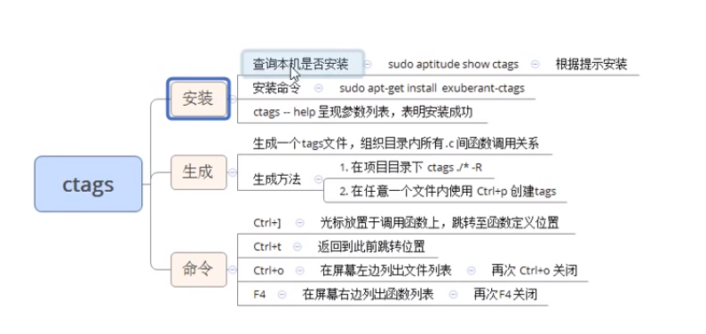

## 目录

- **第十一章：epoll反应堆模型**

  - [01P-epoll反应堆模型总述](#01P-epoll反应堆模型总述)
  - [02P-epoll反应堆main逻辑](#02P-epoll反应堆main逻辑)
  - [03P-epoll反应堆-给lfd和cfd指定回调函数](#03P-epoll反应堆-给lfd和cfd指定回调函数)
  - [04P-epoll反应堆initlistensocket小总结](#04P-epoll反应堆initlistensocket小总结)
  - [05P-epoll反应堆wait被触发后read和write回调及监听](#05P-epoll反应堆wait被触发后read和write回调及监听)
  - [06P-epoll反应堆-超时时间](#06P-epoll反应堆-超时时间)
  - [07P-总结](#07P-总结)
  - [08P-ctags使用](#08P-ctags使用)

---

# 第十一章：epoll反应堆模型

## 01P-epoll反应堆模型总述

epoll 反应堆模型：
epoll ET模式 + 非阻塞、轮询 + void *ptr。
```c
原来：socket、bind、listen -- epoll_create 创建监听 红黑树 --  返回 epfd -- epoll_ctl() 向树上添加一个监听fd -- while（1）--
-- epoll_wait 监听 -- 对应监听fd有事件产生 -- 返回 监听满足数组。 -- 判断返回数组元素 -- lfd满足 -- Accept -- cfd 满足
-- read() --- 小->大 -- write回去。
```

反应堆：不但要监听 cfd 的读事件、还要监听cfd的写事件。
```c
socket、bind、listen -- epoll_create 创建监听 红黑树 --  返回 epfd -- epoll_ctl() 向树上添加一个监听fd -- while（1）--
-- epoll_wait 监听 -- 对应监听fd有事件产生 -- 返回 监听满足数组。 -- 判断返回数组元素 -- lfd满足 -- Accept -- cfd 满足
-- read() --- 小->大 -- cfd从监听红黑树上摘下 -- EPOLLOUT -- 回调函数 -- epoll_ctl() -- EPOLL_CTL_ADD 重新放到红黑上监听写事件
-- 等待 epoll_wait 返回 -- 说明 cfd 可写 -- write回去 -- cfd从监听红黑树上摘下 -- EPOLLIN
-- epoll_ctl() -- EPOLL_CTL_ADD 重新放到红黑上监听读事件 -- epoll_wait 监听
```

反应堆的理解：加入IO转接之后，有了事件，server才去处理，这里反应堆也是这样，由于网络环境复杂，服务器处理数据之后，可能并不能直接写回去，比如遇到网络繁忙或者对方缓冲区已经满了这种情况，就不能直接写回给客户端。反应堆就是在处理数据之后，监听写事件，能写会客户端了，才去做写回操作。写回之后，再改为监听读事件。如此循环。

## 02P-epoll反应堆main逻辑

直接上代码，这就略微有点长了：
```c
/*
*epoll基于非阻塞I/O事件驱动
*/
#include <stdio.h>
#include <sys/socket.h>
#include <sys/epoll.h>
#include <arpa/inet.h>
#include <fcntl.h>
#include <unistd.h>
#include <errno.h>
#include <string.h>
#include <stdlib.h>
#include <time.h>
#define MAX_EVENTS  1024                                    //监听上限数
#define BUFLEN 4096
#define SERV_PORT   8080
void recvdata(int fd, int events, void *arg);
void senddata(int fd, int events, void *arg);
/* 描述就绪文件描述符相关信息 */
struct myevent_s {
    int fd;                                                 //要监听的文件描述符
    int events;                                             //对应的监听事件
    void *arg;                                              //泛型参数
    void (*call_back)(int fd, int events, void *arg);       //回调函数
    int status;                                             //是否在监听:1->在红黑树上(监听), 0->不在(不监听)
    char buf[BUFLEN];
    int len;
    long last_active;                                       //记录每次加入红黑树 g_efd 的时间值
};
int g_efd;                                                  //全局变量, 保存epoll_create返回的文件描述符
struct myevent_s g_events[MAX_EVENTS+1];                    //自定义结构体类型数组. +1-->listen fd
/*将结构体 myevent_s 成员变量 初始化*/
void eventset(struct myevent_s *ev, int fd, void (*call_back)(int, int, void *), void *arg)
{
    ev->fd = fd;
    ev->call_back = call_back;
    ev->events = 0;
    ev->arg = arg;
    ev->status = 0;
    memset(ev->buf, 0, sizeof(ev->buf));
    ev->len = 0;
    ev->last_active = time(NULL);                       //调用eventset函数的时间
    return;
}
/* 向 epoll监听的红黑树 添加一个 文件描述符 */
//eventadd(efd, EPOLLIN, &g_events[MAX_EVENTS]);
void eventadd(int efd, int events, struct myevent_s *ev)
{
    struct epoll_event epv = {0, {0}};
    int op;
    epv.data.ptr = ev;
    epv.events = ev->events = events;       //EPOLLIN 或 EPOLLOUT
    if (ev->status == 0) {                                  //已经在红黑树 g_efd 里
        op = EPOLL_CTL_ADD;                 //将其加入红黑树 g_efd, 并将status置1
        ev->status = 1;
    }
    if (epoll_ctl(efd, op, ev->fd, &epv) < 0)                       //实际添加/修改
        printf("event add failed [fd=%d], events[%d]\n", ev->fd, events);
    else
        printf("event add OK [fd=%d], op=%d, events[%0X]\n", ev->fd, op, events);
    return ;
}
/* 从epoll 监听的 红黑树中删除一个 文件描述符*/
void eventdel(int efd, struct myevent_s *ev)
{
    struct epoll_event epv = {0, {0}};
    if (ev->status != 1)                                        //不在红黑树上
        return ;
    //epv.data.ptr = ev;
    epv.data.ptr = NULL;
    ev->status = 0;                                             //修改状态
    epoll_ctl(efd, EPOLL_CTL_DEL, ev->fd, &epv);                //从红黑树 efd 上将 ev->fd 摘除
    return ;
}
/*  当有文件描述符就绪, epoll返回, 调用该函数 与客户端建立链接 */
void acceptconn(int lfd, int events, void *arg)
{
    struct sockaddr_in cin;
    socklen_t len = sizeof(cin);
    int cfd, i;
    if ((cfd = accept(lfd, (struct sockaddr *)&cin, &len)) == -1) {
        if (errno != EAGAIN && errno != EINTR) {
            /* 暂时不做出错处理 */
        }
        printf("%s: accept, %s\n", __func__, strerror(errno));
        return ;
    }
    do {
        for (i = 0; i < MAX_EVENTS; i++)                                //从全局数组g_events中找一个空闲元素
            if (g_events[i].status == 0)                                //类似于select中找值为-1的元素
                break;                                                  //跳出 for
        if (i == MAX_EVENTS) {
            printf("%s: max connect limit[%d]\n", __func__, MAX_EVENTS);
            break;                                                      //跳出do while(0) 不执行后续代码
        }
        int flag = 0;
        if ((flag = fcntl(cfd, F_SETFL, O_NONBLOCK)) < 0) {             //将cfd也设置为非阻塞
            printf("%s: fcntl nonblocking failed, %s\n", __func__, strerror(errno));
            break;
        }
        /* 给cfd设置一个 myevent_s 结构体, 回调函数 设置为 recvdata */
        eventset(&g_events[i], cfd, recvdata, &g_events[i]);
        eventadd(g_efd, EPOLLIN, &g_events[i]);                         //将cfd添加到红黑树g_efd中,监听读事件
    } while(0);
    printf("new connect [%s:%d][time:%ld], pos[%d]\n",
        inet_ntoa(cin.sin_addr), ntohs(cin.sin_port), g_events[i].last_active, i);
    return ;
}
void recvdata(int fd, int events, void *arg)
{
    struct myevent_s *ev = (struct myevent_s *)arg;
    int len;
    len = recv(fd, ev->buf, sizeof(ev->buf), 0);            //读文件描述符, 数据存入myevent_s成员buf中
    eventdel(g_efd, ev);        //将该节点从红黑树上摘除
    if (len > 0) {
        ev->len = len;
        ev->buf[len] = '\0';                                //手动添加字符串结束标记
        printf("C[%d]:%s\n", fd, ev->buf);
        eventset(ev, fd, senddata, ev);                     //设置该 fd 对应的回调函数为 senddata
        eventadd(g_efd, EPOLLOUT, ev);                      //将fd加入红黑树g_efd中,监听其写事件
    } else if (len == 0) {
        close(ev->fd);
        /* ev-g_events 地址相减得到偏移元素位置 */
        printf("[fd=%d] pos[%ld], closed\n", fd, ev-g_events);
    } else {
        close(ev->fd);
        printf("recv[fd=%d] error[%d]:%s\n", fd, errno, strerror(errno));
    }
    return;
}
void senddata(int fd, int events, void *arg)
{
    struct myevent_s *ev = (struct myevent_s *)arg;
    int len;
    len = send(fd, ev->buf, ev->len, 0);                    //直接将数据 回写给客户端。未作处理
    eventdel(g_efd, ev);                                //从红黑树g_efd中移除
    if (len > 0) {
        printf("send[fd=%d], [%d]%s\n", fd, len, ev->buf);
        eventset(ev, fd, recvdata, ev);                     //将该fd的 回调函数改为 recvdata
        eventadd(g_efd, EPOLLIN, ev);                       //从新添加到红黑树上， 设为监听读事件
    } else {
        close(ev->fd);                                      //关闭链接
        printf("send[fd=%d] error %s\n", fd, strerror(errno));
    }
    return ;
}
/*创建 socket, 初始化lfd */
void initlistensocket(int efd, short port)
{
    struct sockaddr_in sin;
    int lfd = socket(AF_INET, SOCK_STREAM, 0);
    fcntl(lfd, F_SETFL, O_NONBLOCK);                                            //将socket设为非阻塞
    memset(&sin, 0, sizeof(sin));                                               //bzero(&sin, sizeof(sin))
    sin.sin_family = AF_INET;
    sin.sin_addr.s_addr = INADDR_ANY;
    sin.sin_port = htons(port);
    bind(lfd, (struct sockaddr *)&sin, sizeof(sin));
    listen(lfd, 20);
    /* void eventset(struct myevent_s *ev, int fd, void (*call_back)(int, int, void *), void *arg);  */
    eventset(&g_events[MAX_EVENTS], lfd, acceptconn, &g_events[MAX_EVENTS]);
    /* void eventadd(int efd, int events, struct myevent_s *ev) */
    eventadd(efd, EPOLLIN, &g_events[MAX_EVENTS]);
    return ;
}
int main(int argc, char *argv[])
{
    unsigned short port = SERV_PORT;
    if (argc == 2)
        port = atoi(argv[1]);                           //使用用户指定端口.如未指定,用默认端口
    g_efd = epoll_create(MAX_EVENTS+1);                 //创建红黑树,返回给全局 g_efd
    if (g_efd <= 0)
        printf("create efd in %s err %s\n", __func__, strerror(errno));
    initlistensocket(g_efd, port);                      //初始化监听socket
    struct epoll_event events[MAX_EVENTS+1];            //保存已经满足就绪事件的文件描述符数组
    printf("server running:port[%d]\n", port);
    int checkpos = 0, i;
    while (1) {
        /* 超时验证，每次测试100个链接，不测试listenfd 当客户端60秒内没有和服务器通信，则关闭此客户端链接 */
        long now = time(NULL);                          //当前时间
        for (i = 0; i < 100; i++, checkpos++) {         //一次循环检测100个。 使用checkpos控制检测对象
            if (checkpos == MAX_EVENTS)
                checkpos = 0;
            if (g_events[checkpos].status != 1)         //不在红黑树 g_efd 上
                continue;
            long duration = now - g_events[checkpos].last_active;       //客户端不活跃的世间
            if (duration >= 60) {
                close(g_events[checkpos].fd);                           //关闭与该客户端链接
                printf("[fd=%d] timeout\n", g_events[checkpos].fd);
                eventdel(g_efd, &g_events[checkpos]);                   //将该客户端 从红黑树 g_efd移除
            }
        }
        /*监听红黑树g_efd, 将满足的事件的文件描述符加至events数组中, 1秒没有事件满足, 返回 0*/
        int nfd = epoll_wait(g_efd, events, MAX_EVENTS+1, 1000);
        if (nfd < 0) {
            printf("epoll_wait error, exit\n");
            break;
        }
        for (i = 0; i < nfd; i++) {
            /*使用自定义结构体myevent_s类型指针, 接收 联合体data的void *ptr成员*/
            struct myevent_s *ev = (struct myevent_s *)events[i].data.ptr;
            if ((events[i].events & EPOLLIN) && (ev->events & EPOLLIN)) {           //读就绪事件
                ev->call_back(ev->fd, events[i].events, ev->arg);
                //lfd  EPOLLIN
            }
            if ((events[i].events & EPOLLOUT) && (ev->events & EPOLLOUT)) {         //写就绪事件
                ev->call_back(ev->fd, events[i].events, ev->arg);
            }
        }
    }
    /* 退出前释放所有资源 */
    return 0;
}
```

main逻辑：创建套接字—》初始化连接—》超时验证—》监听—》处理读事件和写事件

## 03P-epoll反应堆-给lfd和cfd指定回调函数

eventset函数指定了不同事件对应的回调函数，所以虽然读写事件都用的call_back来回调，但实际上调用的是不同的函数。

## 04P-epoll反应堆initlistensocket小总结

eventset函数：
设置回调函数。   lfd --》 acceptconn()
```c
cfd --> recvdata();
cfd --> senddata();
```

eventadd函数：
将一个fd， 添加到 监听红黑树。  设置监听 read事件，还是监听写事件。

## 05P-epoll反应堆wait被触发后read和write回调及监听

网络编程中：  read --- recv()
```c
write --- send();
```

## 06P-epoll反应堆-超时时间

用一个last_active存储上次活跃时间，完事儿用当前时间和上次活跃时间来计算不活跃时间长度，不活跃时间超过一定阈值，就踢掉这个客户端。

## 07P-总结

**epoll反应堆模型核心思想**

epoll ET模式 + 非阻塞轮询 + 回调函数（void *ptr）

**与传统epoll的区别**

传统模式：read → 处理 → write（直接写回）

反应堆模式：read → 处理 → 监听写事件 → 可写时write → 监听读事件

**关键点**
- 使用`eventset()`设置回调函数（lfd→acceptconn，cfd→recvdata/senddata）
- 使用`eventadd()`将fd添加到监听红黑树，设置监听读/写事件
- 通过`last_active`记录活跃时间，实现超时踢出客户端

## 08P-ctags使用

