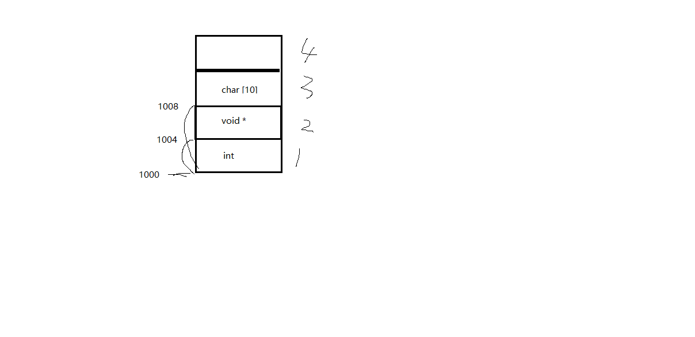

## 目录

- **第十四章：本地套接字**

  - [01P-本地套接字和网络套接字比较](#01P-本地套接字和网络套接字比较)
  - [02P-本地套接字通信](#02P-本地套接字通信)
  - [03P-本地套接字和网络套接字实现对比](#03P-本地套接字和网络套接字实现对比)
  - [04P-总结](#04P-总结)

---

# 第十四章：本地套接字

## 01P-本地套接字和网络套接字比较


本地套接字：
IPC： pipe、fifo、mmap、信号、本地套（domain）--- CS模型
对比网络编程 TCP C/S模型， 注意以下几点：
```c
1. int socket(int domain, int type, int protocol); 参数 domain：AF_INET --> AF_UNIX/AF_LOCAL
```

type: SOCK_STREAM/SOCK_DGRAM  都可以。
```c
2. 地址结构：  sockaddr_in --> sockaddr_un
struct sockaddr_in srv_addr; --> struct sockaddr_un srv_adrr;
srv_addr.sin_family = AF_INET;  --> srv_addr.sun_family = AF_UNIX;
srv_addr.sin_port = htons(8888);    strcpy(srv_addr.sun_path, "srv.socket")
srv_addr.sin_addr.s_addr = htonl(INADDR_ANY);len = offsetof(struct sockaddr_un, sun_path) + strlen("srv.socket");
bind(fd, (struct sockaddr *)&srv_addr, sizeof(srv_addr));  --> bind(fd, (struct sockaddr *)&srv_addr, len);
3. bind()函数调用成功，会创建一个 socket。因此为保证bind成功，通常我们在 bind之前， 可以使用 unlink("srv.socket");
```

4. 客户端不能依赖 "隐式绑定"。并且应该在通信建立过程中，创建且初始化2个地址结构：
```c
1） client_addr --> bind()
2)  server_addr --> connect();
```

## 02P-本地套接字通信

服务器代码：
```c
#include <stdio.h>
#include <unistd.h>
#include <sys/socket.h>
#include <strings.h>
#include <string.h>
#include <ctype.h>
#include <arpa/inet.h>
#include <sys/un.h>
#include <stddef.h>
#include "wrap.h"
#define SERV_ADDR  "serv.socket"
int main(void)
{
    int lfd, cfd, len, size, i;
    struct sockaddr_un servaddr, cliaddr;
    char buf[4096];
    lfd = Socket(AF_UNIX, SOCK_STREAM, 0);
    bzero(&servaddr, sizeof(servaddr));
    servaddr.sun_family = AF_UNIX;
    strcpy(servaddr.sun_path, SERV_ADDR);
    len = offsetof(struct sockaddr_un, sun_path) + strlen(servaddr.sun_path);     /* servaddr total len */
    unlink(SERV_ADDR);                      /* 确保bind之前serv.sock文件不存在,bind会创建该文件 */
    Bind(lfd, (struct sockaddr *)&servaddr, len);           /* 参3不能是sizeof(servaddr) */
    Listen(lfd, 20);
    printf("Accept ...\n");
    while (1) {
        len = sizeof(cliaddr);  //AF_UNIX大小+108B
        cfd = Accept(lfd, (struct sockaddr *)&cliaddr, (socklen_t *)&len);
        len -= offsetof(struct sockaddr_un, sun_path);      /* 得到文件名的长度 */
        cliaddr.sun_path[len] = '\0';                       /* 确保打印时,没有乱码出现 */
        printf("client bind filename %s\n", cliaddr.sun_path);
        while ((size = read(cfd, buf, sizeof(buf))) > 0) {
            for (i = 0; i < size; i++)
                buf[i] = toupper(buf[i]);
            write(cfd, buf, size);
        }
        close(cfd);
    }
    close(lfd);
    return 0;
}
```

客户端代码：
```c
#include <stdio.h>
#include <unistd.h>
#include <sys/types.h>
#include <sys/socket.h>
#include <strings.h>
#include <string.h>
#include <ctype.h>
#include <arpa/inet.h>
#include <sys/un.h>
#include <stddef.h>
#include "wrap.h"
#define SERV_ADDR "serv.socket"
#define CLIE_ADDR "clie.socket"
int main(void)
{
    int  cfd, len;
    struct sockaddr_un servaddr, cliaddr;
    char buf[4096];
    cfd = Socket(AF_UNIX, SOCK_STREAM, 0);
    bzero(&cliaddr, sizeof(cliaddr));
    cliaddr.sun_family = AF_UNIX;
    strcpy(cliaddr.sun_path,CLIE_ADDR);
    len = offsetof(struct sockaddr_un, sun_path) + strlen(cliaddr.sun_path);     /* 计算客户端地址结构有效长度 */
    unlink(CLIE_ADDR);
    Bind(cfd, (struct sockaddr *)&cliaddr, len);                                 /* 客户端也需要bind, 不能依赖自动绑定*/
    bzero(&servaddr, sizeof(servaddr));                                          /* 构造server 地址 */
    servaddr.sun_family = AF_UNIX;
    strcpy(servaddr.sun_path, SERV_ADDR);
    len = offsetof(struct sockaddr_un, sun_path) + strlen(servaddr.sun_path);   /* 计算服务器端地址结构有效长度 */
    Connect(cfd, (struct sockaddr *)&servaddr, len);
    while (fgets(buf, sizeof(buf), stdin) != NULL) {
        write(cfd, buf, strlen(buf));
        len = read(cfd, buf, sizeof(buf));
        write(STDOUT_FILENO, buf, len);
    }
    close(cfd);
    return 0;
}
```

## 03P-本地套接字和网络套接字实现对比

由于布局原因，直接看课程笔记比较科学。
linux网络编程资料\day5\1-教学资料\课堂笔记.txt

## 04P-总结

直接看课程笔记linux网络编程资料\day5\1-教学资料\课堂笔记.txt