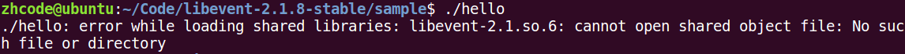
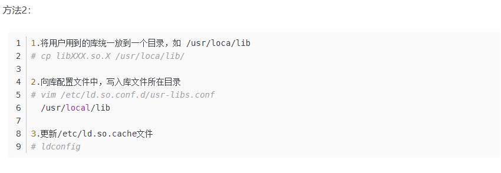
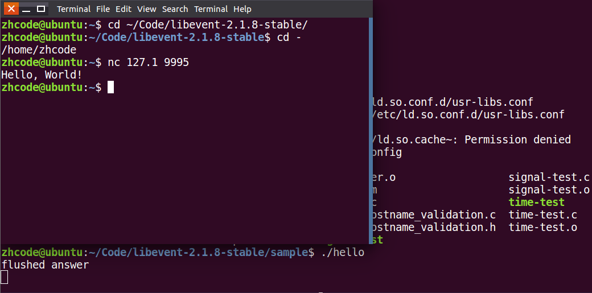
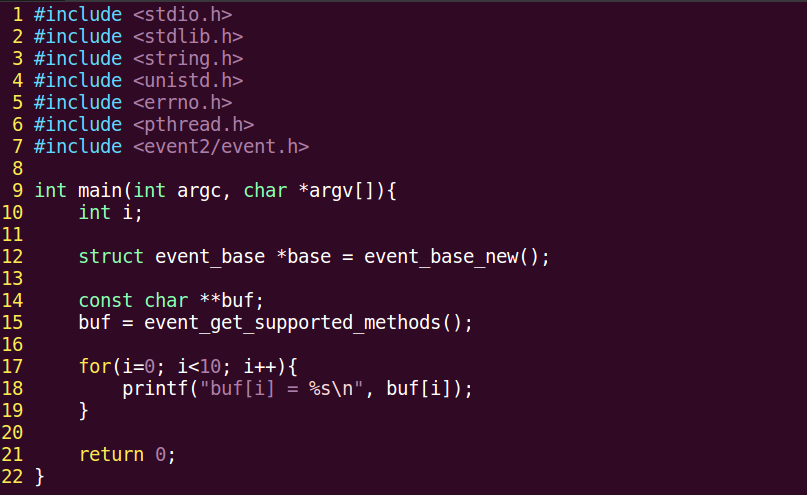
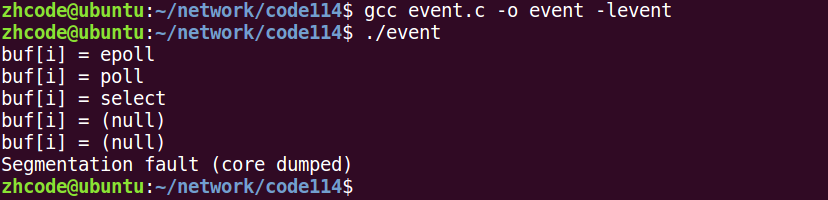
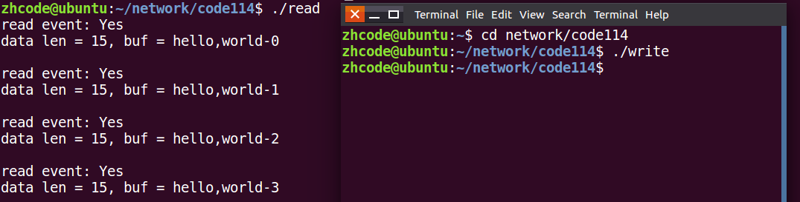
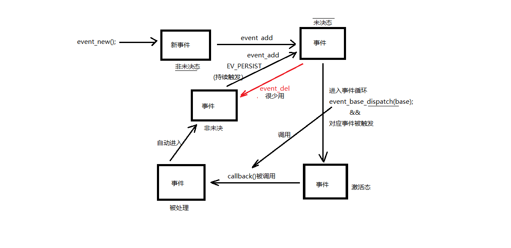
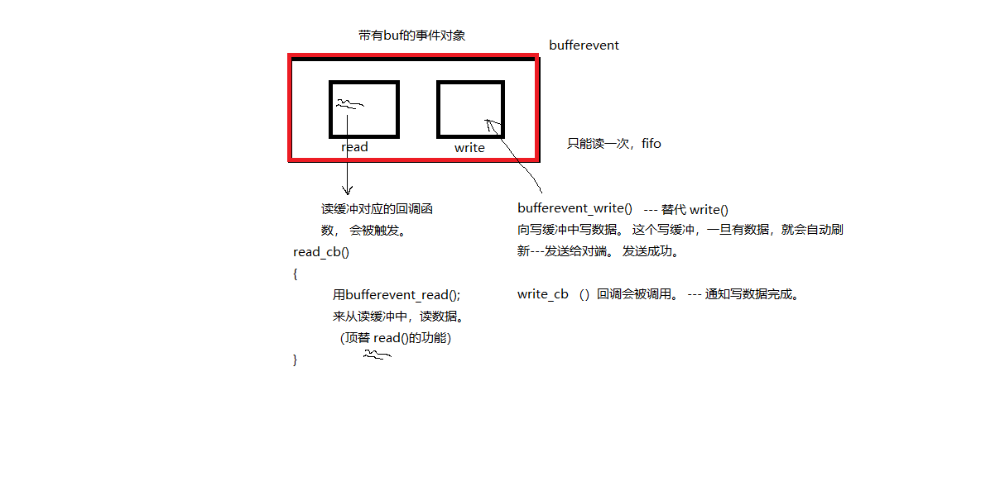
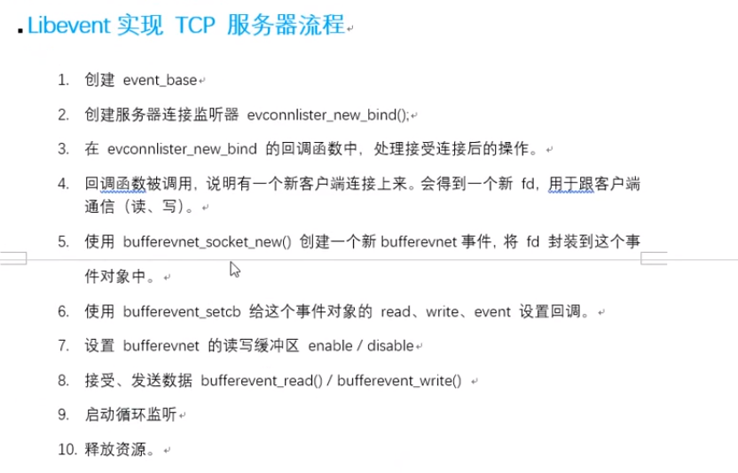
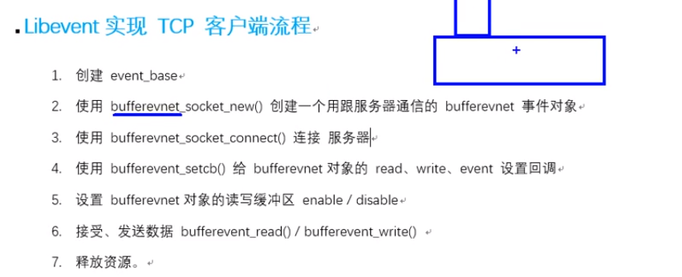

## 目录

- **第十五章：libevent库**

  - [01P-libevent简介](#01P-libevent简介)
  - [02P-libevent库的下载和安装](#02P-libevent库的下载和安装)
  - [03P-libevent封装的框架思想](#03P-libevent封装的框架思想)
  - [04P-结合helloworld初识libevent](#04P-结合helloworld初识libevent)
  - [05P-框架相关的不常用函数](#05P-框架相关的不常用函数)
  - [06P-创建事件对象](#06P-创建事件对象)
  - [07P-事件event操作](#07P-事件event操作)
  - [08P-使用fifo的读写](#08P-使用fifo的读写)
  - [09P-使用fifo的读写编码实现](#09P-使用fifo的读写编码实现)
  - [10P-未决和非未决](#10P-未决和非未决)
  - [11P-bufferevent特性](#11P-bufferevent特性)
  - [12P-bufferevent事件对象创建、销毁](#12P-bufferevent事件对象创建、销毁)
  - [13P-给bufferevent事件对象设置回调](#13P-给bufferevent事件对象设置回调)
  - [14P-缓冲区开启和关闭](#14P-缓冲区开启和关闭)
  - [15P-客户端和服务器连接和监听](#15P-客户端和服务器连接和监听)
  - [16P-libevent实现TCP服务器流程](#16P-libevent实现TCP服务器流程)
  - [17P-libevent实现TCP服务器源码分析](#17P-libevent实现TCP服务器源码分析)
  - [18P-服务器注意事项](#18P-服务器注意事项)
  - [19P-客户端流程简析和回顾](#19P-客户端流程简析和回顾)
  - [20P-总结](#20P-总结)

---

# 第十五章：libevent库

## 01P-libevent简介

libevent库
开源。精简。跨平台（Windows、Linux、maxos、unix）。专注于网络通信。

## 02P-libevent库的下载和安装

源码包安装：  参考 README、readme
./configure检查安装环境 生成 makefile
make生成 .o 和 可执行文件
sudo make install将必要的资源cp置系统指定目录。
进入 sample 目录，运行demo验证库安装使用情况。
编译使用库的 .c 时，需要加 -levent 选项。
```c
库名 libevent.so --> /usr/local/lib   查看的到。
```

特性：
基于"事件"异步通信模型。--- 回调。
这里遇到一个问题：

解决办法：
解决这个问题的博客

完事儿运行测试，结果如下：


## 03P-libevent封装的框架思想

libevent框架：
1. 创建 event_base(乐高底座)
2. 创建 事件evnet
3. 将事件 添加到 base上
4. 循环监听事件满足
5. 释放 event_base
1. 创建 event_base(乐高底座)
```c
struct event_base *event_base_new(void);
struct event_base *base = event_base_new();
```

2. 创建 事件evnet
```c
常规事件 event--> event_new();
bufferevent --> bufferevent_socket_new();
```

3. 将事件 添加到 base上
```c
int event_add(struct event *ev, const struct timeval *tv)
```

4. 循环监听事件满足
```c
int event_base_dispatch(struct event_base *base);
event_base_dispatch(base);
```

5. 释放 event_base
```c
event_base_free(base);
```

## 04P-结合helloworld初识libevent

特性：
基于"事件"异步通信模型。--- 回调。

## 05P-框架相关的不常用函数

查看支持哪些多路IO：
代码如下：

编译运行，结果如下：


## 06P-创建事件对象

创建事件event：
```c
struct event *ev；
struct event *event_new(struct event_base *base，evutil_socket_t fd，short what，event_callback_fn cb;  void *arg);
```

base： event_base_new()返回值。
fd： 绑定到 event 上的 文件描述符
what：对应的事件（r、w、e）
EV_READ一次 读事件
EV_WRTIE一次 写事件
EV_PERSIST持续触发。 结合 event_base_dispatch 函数使用，生效。
cb：一旦事件满足监听条件，回调的函数。
```c
typedef void (*event_callback_fn)(evutil_socket_t fd,  short,  void *)
```

arg： 回调的函数的参数。
返回值：成功创建的 event

## 07P-事件event操作

添加事件到 event_base
```c
int event_add(struct event *ev, const struct timeval *tv);
```

ev: event_new() 的返回值。
```c
tv：NULL
```

销毁事件
```c
int event_free(struct event *ev);
```

ev: event_new() 的返回值。

## 08P-使用fifo的读写

读端的代码如下：
```c
#include <stdio.h>
#include <unistd.h>
#include <stdlib.h>
#include <sys/types.h>
#include <sys/stat.h>
#include <string.h>
#include <fcntl.h>
#include <event2/event.h>
// 对操作处理函数
void read_cb(evutil_socket_t fd, short what, void *arg)
{
    // 读管道
    char buf[1024] = {0};
    int len = read(fd, buf, sizeof(buf));
    printf("read event: %s \n", what & EV_READ ? "Yes" : "No");
    printf("data len = %d, buf = %s\n", len, buf);
    sleep(1);
}
// 读管道
int main(int argc, const char* argv[])
{
    unlink("myfifo");
    //创建有名管道
    mkfifo("myfifo", 0664);
    // open file
    //int fd = open("myfifo", O_RDONLY | O_NONBLOCK);
    int fd = open("myfifo", O_RDONLY);
    if(fd == -1)
    {
        perror("open error");
        exit(1);
    }
    // 创建个event_base
    struct event_base* base = NULL;
    base = event_base_new();
    // 创建事件
    struct event* ev = NULL;
    ev = event_new(base, fd, EV_READ | EV_PERSIST, read_cb, NULL);
    // 添加事件
    event_add(ev, NULL);
    // 事件循环
    event_base_dispatch(base);  // while（1） { epoll();}
    // 释放资源
    event_free(ev);
    event_base_free(base);
    close(fd);
    return 0;
}
```

如代码所示，这个也遵循libevent搭积木的过程
写管道代码如下：
```c
#include <stdio.h>
#include <unistd.h>
#include <stdlib.h>
#include <sys/types.h>
#include <sys/stat.h>
#include <string.h>
#include <fcntl.h>
#include <event2/event.h>
// 对操作处理函数
void write_cb(evutil_socket_t fd, short what, void *arg)
{
    // write管道
    char buf[1024] = {0};
    static int num = 0;
    sprintf(buf, "hello,world-%d\n", num++);
    write(fd, buf, strlen(buf)+1);
    sleep(1);
}
// 写管道
int main(int argc, const char* argv[])
{
    // open file
    //int fd = open("myfifo", O_WRONLY | O_NONBLOCK);
    int fd = open("myfifo", O_WRONLY);
    if(fd == -1)
    {
        perror("open error");
        exit(1);
    }
    // 写管道
    struct event_base* base = NULL;
    base = event_base_new();
    // 创建事件
    struct event* ev = NULL;
    // 检测的写缓冲区是否有空间写
    //ev = event_new(base, fd, EV_WRITE , write_cb, NULL);
    ev = event_new(base, fd, EV_WRITE | EV_PERSIST, write_cb, NULL);
    // 添加事件
    event_add(ev, NULL);
    // 事件循环
    event_base_dispatch(base);
    // 释放资源
    event_free(ev);
    event_base_free(base);
    close(fd);
    return 0;
}
```

编译运行，结果如下：


## 09P-使用fifo的读写编码实现

这个基本上就是把前面代码写了一遍，复习一下，问题不大

## 10P-未决和非未决

未决和非未决：
非未决: 没有资格被处理
未决： 有资格被处理，但尚未被处理
```c
event_new --> event ---> 非未决 --> event_add --> 未决 --> dispatch() && 监听事件被触发 --> 激活态
--> 执行回调函数 --> 处理态 --> 非未决 event_add && EV_PERSIST --> 未决 --> event_del --> 非未决
```



## 11P-bufferevent特性


带缓冲区的事件 bufferevent
```c
#include <event2/bufferevent.h>
```

read/write 两个缓冲. 借助 队列.

## 12P-bufferevent事件对象创建、销毁

创建、销毁bufferevent：
```c
struct bufferevent *ev；
struct bufferevent *bufferevent_socket_new(struct event_base *base, evutil_socket_t fd, enum bufferevent_options options);
```

base： event_base
fd:封装到bufferevent内的 fd
options：BEV_OPT_CLOSE_ON_FREE
返回： 成功创建的 bufferevent事件对象。
```c
void  bufferevent_socket_free(struct bufferevent *ev);
```

## 13P-给bufferevent事件对象设置回调

给bufferevent设置回调：
```c
对比event：event_new( fd, callback );  event_add() -- 挂到 event_base 上。
```

bufferevent_socket_new（fd）  bufferevent_setcb（ callback ）
```c
void bufferevent_setcb(struct bufferevent * bufev,
    bufferevent_data_cb readcb,
    bufferevent_data_cb writecb,
    bufferevent_event_cb eventcb,
    void *cbarg );
```

bufev： bufferevent_socket_new() 返回值
```c
readcb： 设置 bufferevent 读缓冲，对应回调  read_cb{  bufferevent_read() 读数据  }
writecb： 设置 bufferevent 写缓冲，对应回调 write_cb {  } -- 给调用者，发送写成功通知。  可以 NULL
```

eventcb： 设置 事件回调。   也可传NULL
```c
typedef void (*bufferevent_event_cb)(struct bufferevent *bev,  short events, void *ctx);
void event_cb(struct bufferevent *bev,  short events, void *ctx)
{
    // ......
}
```

events： BEV_EVENT_CONNECTED
cbarg：上述回调函数使用的 参数。
read 回调函数类型：
```c
typedef void (*bufferevent_data_cb)(struct bufferevent *bev, void*ctx);
void read_cb(struct bufferevent *bev, void *cbarg )
{
    // .....
    bufferevent_read();   --- read();
}
bufferevent_read()函数的原型：
size_t bufferevent_read(struct bufferevent *bev, void *buf, size_t bufsize);
```

write 回调函数类型：
```c
int bufferevent_write(struct bufferevent *bufev, const void *data,  size_t size);
```

## 14P-缓冲区开启和关闭

启动、关闭 bufferevent的 缓冲区：
```c
void bufferevent_enable(struct bufferevent *bufev, short events);   启动
```

events： EV_READ、EV_WRITE、EV_READ|EV_WRITE
默认、write 缓冲是 enable、read 缓冲是 disable
```c
bufferevent_enable(evev, EV_READ);-- 开启读缓冲。
```

## 15P-客户端和服务器连接和监听

连接客户端：
```c
socket();connect();
int bufferevent_socket_connect(struct bufferevent *bev, struct sockaddr *address, int addrlen);
```

bev: bufferevent 事件对象（封装了fd）
```c
address、len：等同于 connect() 参2/3
```

创建监听服务器：
```c
------ socket();bind();listen();accept();
struct evconnlistener * listner
struct evconnlistener *evconnlistener_new_bind (
    struct event_base *base,
    evconnlistener_cb cb,
    void *ptr,
    unsigned flags,
    int backlog,
    const struct sockaddr *sa,
    int socklen);
```

base： event_base
cb: 回调函数。 一旦被回调，说明在其内部应该与客户端完成， 数据读写操作，进行通信。
ptr： 回调函数的参数
flags： LEV_OPT_CLOSE_ON_FREE | LEV_OPT_REUSEABLE
```c
backlog： listen() 2参。 -1 表最大值
```

sa：服务器自己的地址结构体
socklen：服务器自己的地址结构体大小。
返回值：成功创建的监听器。
释放监听服务器:
```c
void evconnlistener_free(struct evconnlistener *lev);
```

## 16P-libevent实现TCP服务器流程

服务器端 libevent 创建TCP连接：
1. 创建event_base
```c
2. 创建bufferevent事件对象。bufferevent_socket_new();
```

3. 使用bufferevent_setcb() 函数给 bufferevent的 read、write、event 设置回调函数。
```c
4. 当监听的 事件满足时，read_cb会被调用， 在其内部 bufferevent_read();读
```

5. 使用 evconnlistener_new_bind 创建监听服务器， 设置其回调函数，当有客户端成功连接时，这个回调函数会被调用。
6. 封装 listner_cb() 在函数内部。完成与客户端通信。
7. 设置读缓冲、写缓冲的 使能状态 enable、disable
```c
7. 启动循环 event_base_dispath();
```

8. 释放连接。


## 17P-libevent实现TCP服务器源码分析

服务器源码如下：
```c
#include <stdio.h>
#include <unistd.h>
#include <stdlib.h>
#include <sys/types.h>
#include <sys/stat.h>
#include <string.h>
#include <event2/event.h>
#include <event2/listener.h>
#include <event2/bufferevent.h>
// 读缓冲区回调
void read_cb(struct bufferevent *bev, void *arg)
{
    char buf[1024] = {0};
    bufferevent_read(bev, buf, sizeof(buf));
    printf("client say: %s\n", buf);
    char *p = "我是服务器, 已经成功收到你发送的数据!";
    // 发数据给客户端
    bufferevent_write(bev, p, strlen(p)+1);
    sleep(1);
}
// 写缓冲区回调
void write_cb(struct bufferevent *bev, void *arg)
{
    printf("I'm服务器, 成功写数据给客户端,写缓冲区回调函数被回调...\n");
}
// 事件
void event_cb(struct bufferevent *bev, short events, void *arg)
{
    if (events & BEV_EVENT_EOF)
    {
        printf("connection closed\n");
    }
    else if(events & BEV_EVENT_ERROR)
    {
        printf("some other error\n");
    }
    bufferevent_free(bev);
    printf("buffevent 资源已经被释放...\n");
}
void cb_listener(
    struct evconnlistener *listener,
    evutil_socket_t fd,
    struct sockaddr *addr,
    int len, void *ptr)
{
    printf("connect new client\n");
    struct event_base* base = (struct event_base*)ptr;
    // 通信操作
    // 添加新事件
    struct bufferevent *bev;
    bev = bufferevent_socket_new(base, fd, BEV_OPT_CLOSE_ON_FREE);
    // 给bufferevent缓冲区设置回调
    bufferevent_setcb(bev, read_cb, write_cb, event_cb, NULL);
    bufferevent_enable(bev, EV_READ);
}
int main(int argc, const char* argv[])
{
    // init server
    struct sockaddr_in serv;
    memset(&serv, 0, sizeof(serv));
    serv.sin_family = AF_INET;
    serv.sin_port = htons(9876);
    serv.sin_addr.s_addr = htonl(INADDR_ANY);
    struct event_base* base;
    base = event_base_new();
    // 创建套接字
    // 绑定
    // 接收连接请求
    struct evconnlistener* listener;
    listener = evconnlistener_new_bind(base, cb_listener, base,
        LEV_OPT_CLOSE_ON_FREE | LEV_OPT_REUSEABLE,
        36, (struct sockaddr*)&serv, sizeof(serv));
    event_base_dispatch(base);
    evconnlistener_free(listener);
    event_base_free(base);
    return 0;
}
```

## 18P-服务器注意事项

bufev_server的代码，锤起来：
```c
#include <stdio.h>
#include <stdlib.h>
#include <string.h>
#include <unistd.h>
#include <errno.h>
#include <sys/socket.h>
#include <event2/event.h>
#include <event2/bufferevent.h>
#include <event2/listener.h>
#include <pthread.h>
void sys_err(const char *str)
{
    perror(str);
    exit(1);
}
// 读事件回调
void read_cb(struct bufferevent *bev, void *arg)
{
    char buf[1024] = {0};
    // 借助读缓冲，从客户端拿数据
    bufferevent_read(bev, buf, sizeof(buf));
    printf("clinet write: %s\n", buf);
    // 借助写缓冲，写数据回给客户端
    bufferevent_write(bev, "abcdefg", 7);
}
// 写事件回调
void write_cb(struct bufferevent *bev, void *arg)
{
    printf("-------fwq------has wrote\n");
}
// 其他事件回调
void event_cb(struct bufferevent *bev,  short events, void *ctx)
{
}
// 被回调，说明有客户端成功连接， cfd已经传入该参数内部。 创建bufferevent事件对象
// 与客户端完成读写操作。
void listener_cb(struct evconnlistener *listener, evutil_socket_t sock,
    struct sockaddr *addr, int len, void *ptr)
{
    struct event_base *base = (struct event_base *)ptr;
    // 创建bufferevent 对象
    struct bufferevent *bev = NULL;
    bev = bufferevent_socket_new(base, sock, BEV_OPT_CLOSE_ON_FREE);
    // 给bufferevent 对象 设置回调 read、write、event
    void bufferevent_setcb(struct bufferevent * bufev,
        bufferevent_data_cb readcb,
        bufferevent_data_cb writecb,
        bufferevent_event_cb eventcb,
        void *cbarg );
    // 设置回调函数
    bufferevent_setcb(bev, read_cb, write_cb, NULL, NULL);
    // 启动 read 缓冲区的 使能状态
    bufferevent_enable(bev, EV_READ);
    return ;
}
int main(int argc, char *argv[])
{
    // 定义服务器地址结构
    struct sockaddr_in srv_addr;
    bzero(&srv_addr, sizeof(srv_addr));
    srv_addr.sin_family = AF_INET;
    srv_addr.sin_port = htons(8765);
    srv_addr.sin_addr.s_addr = htonl(INADDR_ANY);
    // 创建event_base
    struct event_base *base = event_base_new();
    /*
    struct evconnlistener *evconnlistener_new_bind (
        struct event_base *base,
        evconnlistener_cb cb,
        void *ptr,
        unsigned flags,
        int backlog,
        const struct sockaddr *sa,
        int socklen);
    */
    // 创建服务器监听器：
    struct evconnlistener *listener = NULL;
    listener = evconnlistener_new_bind(base, listener_cb, (void *)base,
        LEV_OPT_CLOSE_ON_FREE | LEV_OPT_REUSEABLE, -1,
        (struct sockaddr *)&srv_addr, sizeof(srv_addr));
    // 启动监听循环
    event_base_dispatch(base);
    // 销毁event_base
    evconnlistener_free(listener);
    event_base_free(base);
    return 0;
}
```

## 19P-客户端流程简析和回顾


代码走起：
```c
#include <stdio.h>
#include <unistd.h>
#include <stdlib.h>
#include <sys/types.h>
#include <sys/stat.h>
#include <string.h>
#include <event2/bufferevent.h>
#include <event2/event.h>
#include <arpa/inet.h>
void read_cb(struct bufferevent *bev, void *arg)
{
    char buf[1024] = {0};
    bufferevent_read(bev, buf, sizeof(buf));
    printf("fwq say:%s\n", buf);
    bufferevent_write(bev, buf, strlen(buf)+1);
    sleep(1);
}
void write_cb(struct bufferevent *bev, void *arg)
{
    printf("----------我是客户端的写回调函数,没卵用\n");
}
void event_cb(struct bufferevent *bev, short events, void *arg)
{
    if (events & BEV_EVENT_EOF)
    {
        printf("connection closed\n");
    }
    else if(events & BEV_EVENT_ERROR)
    {
        printf("some other error\n");
    }
    else if(events & BEV_EVENT_CONNECTED)
    {
        printf("已经连接服务器...\\(^o^)/...\n");
        return;
    }
    // 释放资源
    bufferevent_free(bev);
}
// 客户端与用户交互，从终端读取数据写给服务器
void read_terminal(evutil_socket_t fd, short what, void *arg)
{
    // 读数据
    char buf[1024] = {0};
    int len = read(fd, buf, sizeof(buf));
    struct bufferevent* bev = (struct bufferevent*)arg;
    // 发送数据
    bufferevent_write(bev, buf, len+1);
}
int main(int argc, const char* argv[])
{
    struct event_base* base = NULL;
    base = event_base_new();
    int fd = socket(AF_INET, SOCK_STREAM, 0);
    // 通信的fd放到bufferevent中
    struct bufferevent* bev = NULL;
    bev = bufferevent_socket_new(base, fd, BEV_OPT_CLOSE_ON_FREE);
    // init server info
    struct sockaddr_in serv;
    memset(&serv, 0, sizeof(serv));
    serv.sin_family = AF_INET;
    serv.sin_port = htons(9876);
    inet_pton(AF_INET, "127.0.0.1", &serv.sin_addr.s_addr);
    // 连接服务器
    bufferevent_socket_connect(bev, (struct sockaddr*)&serv, sizeof(serv));
    // 设置回调
    bufferevent_setcb(bev, read_cb, write_cb, event_cb, NULL);
    // 设置读回调生效
    // bufferevent_enable(bev, EV_READ);
    // 创建事件
    struct event* ev = event_new(base, STDIN_FILENO, EV_READ | EV_PERSIST,
        read_terminal, bev);
    // 添加事件
    event_add(ev, NULL);
    event_base_dispatch(base);
    event_free(ev);
    event_base_free(base);
    return 0;
}
```

## 20P-总结

linux网络编程资料\day6\1-教学资料\课堂笔记.txt