## 目录

- **第十六章：Web服务器项目**

  - [01P-web大练习的概述](#01P-web大练习的概述)
  - [02P-HTML文本和标题](#02P-HTML文本和标题)
  - [03P-错误页面html](#03P-错误页面html)
  - [04P-列表、图片和超链接](#04P-列表图片和超链接)
  - [05P-http协议请求、应答协议基础格式](#05P-http协议请求应答协议基础格式)
  - [06P-服务器框架复习和getline函数](#06P-服务器框架复习和getline函数)
  - [07P-复习](#07P-复习)
  - [08P-单文件通信流程分析](#08P-单文件通信流程分析)
  - [09P-正则表达式获取文件名](#09P-正则表达式获取文件名)
  - [10P-判断文件是否存在](#10P-判断文件是否存在)
  - [11P-写出http应答协议头](#11P-写出http应答协议头)
  - [12P-写数据给浏览器](#12P-写数据给浏览器)
  - [13P-错误原因及说明](#13P-错误原因及说明)
  - [14P-错误页面展示](#14P-错误页面展示)
  - [15P-浏览器请求目录](#15P-浏览器请求目录)
  - [16P-判断文件类型](#16P-判断文件类型)
  - [17P-汉字字符编码和解码](#17P-汉字字符编码和解码)
  - [18P-libevent实现的web服务器](#18P-libevent实现的web服务器)
  - [19P-telnet调试](#19P-telnet调试)

---

# 第十六章：Web服务器项目

## 01P-web大练习的概述

写一个供用户访问主机文件的web服务器

## 02P-HTML文本和标题

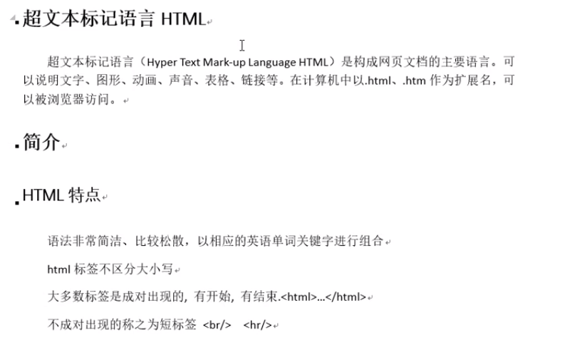
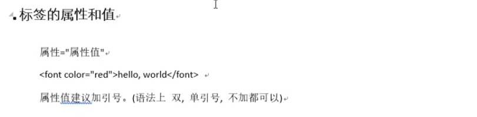
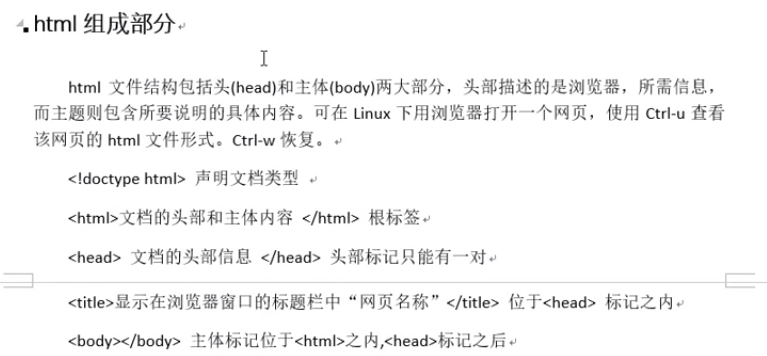
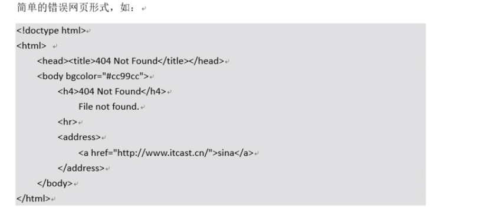
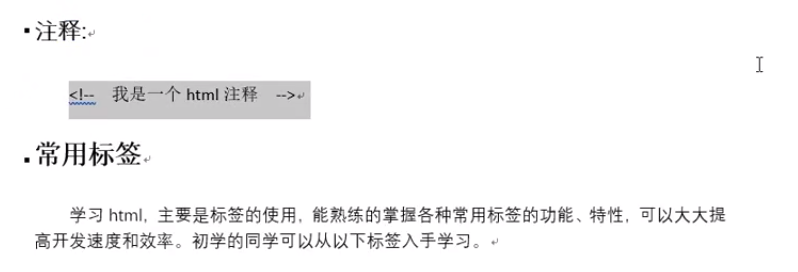
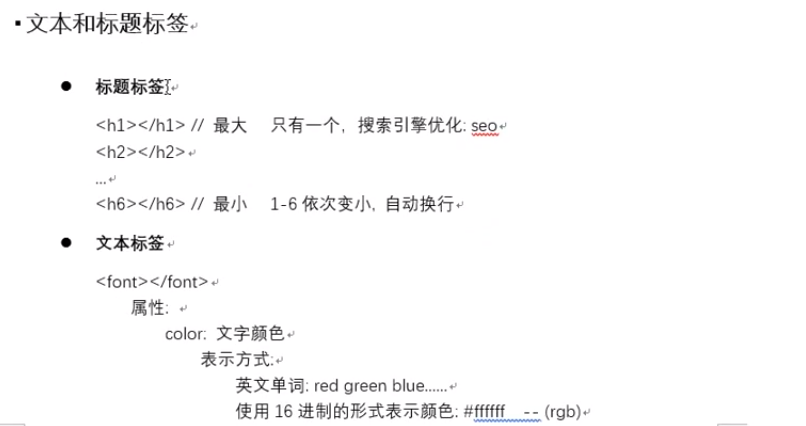

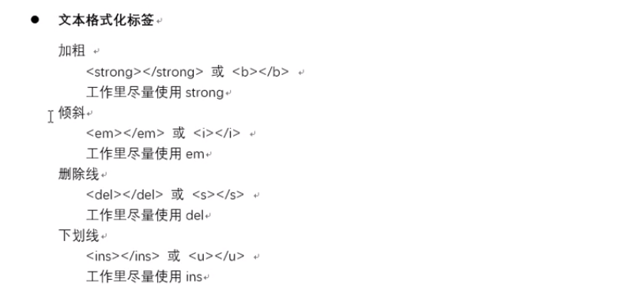
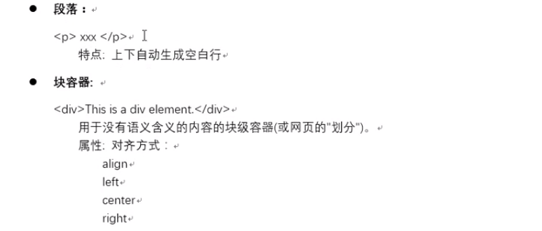


## 03P-错误页面html

代码比较简单
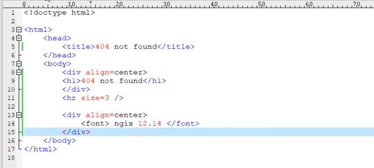

## 04P-列表、图片和超链接

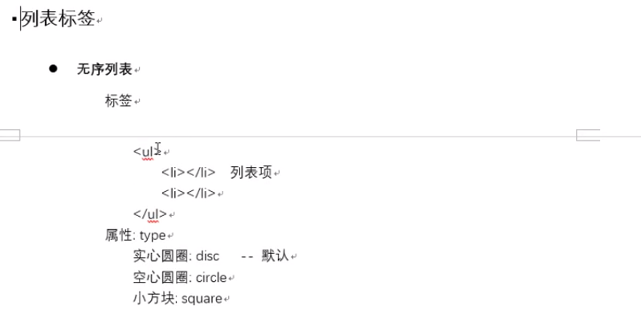
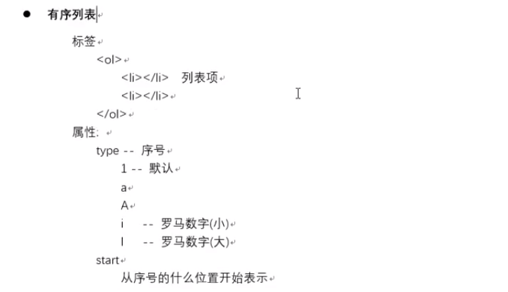
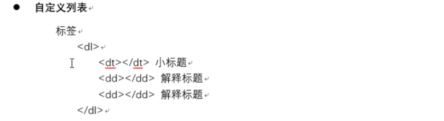
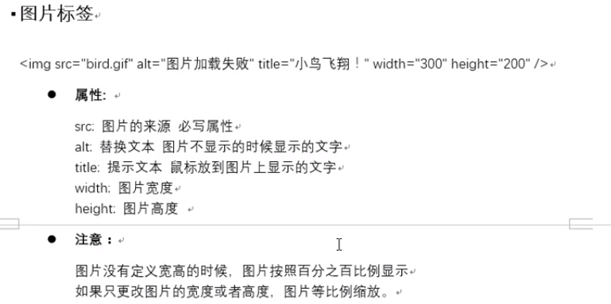
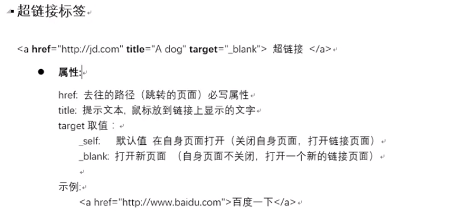


## 05P-http协议请求、应答协议基础格式

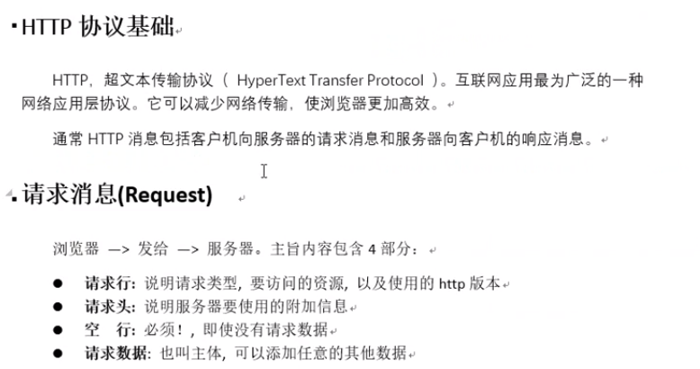
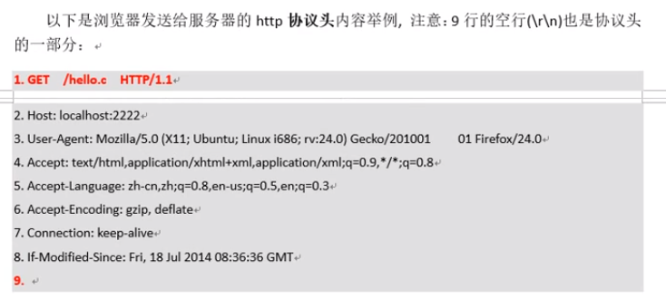
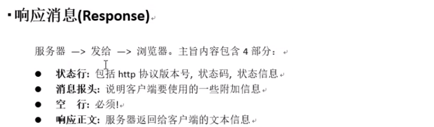
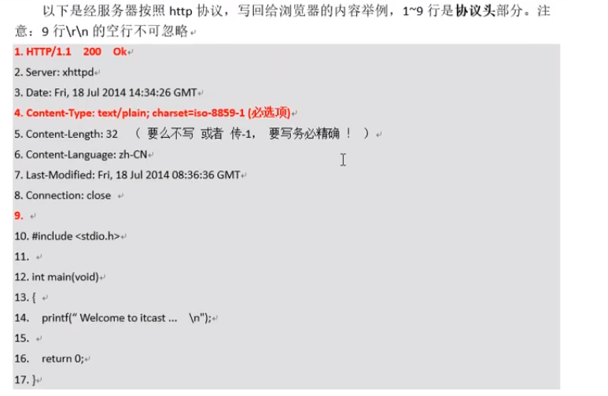
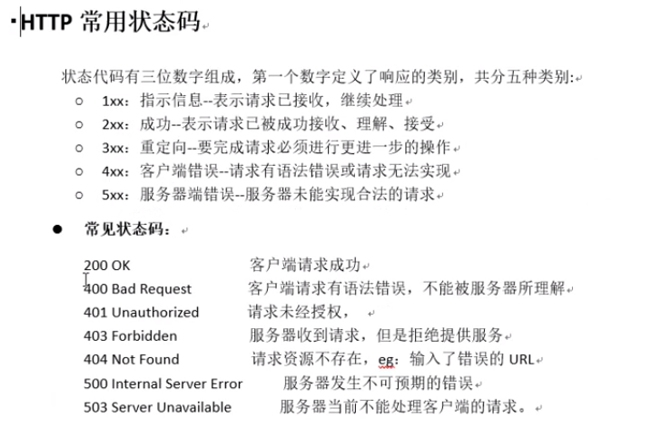

## 06P-服务器框架复习和getline函数

代码如下：
```c
#include <stdio.h>
#include <string.h>
#include <stdlib.h>
#include <netinet/in.h>
#include <arpa/inet.h>
#include <sys/wait.h>
#include <sys/types.h>
#include <sys/epoll.h>
#include <unistd.h>
#include <fcntl.h>
#define MAXSIZE 2048
int init_listen_fd(int port, int epfd)
{
    //　创建监听的套接字 lfd
    int lfd = socket(AF_INET, SOCK_STREAM, 0);
    if (lfd == -1) {
        perror("socket error");
        exit(1);
    }
    // 创建服务器地址结构 IP+port
    struct sockaddr_in srv_addr;
    bzero(&srv_addr, sizeof(srv_addr));
    srv_addr.sin_family = AF_INET;
    srv_addr.sin_port = htons(port);
    srv_addr.sin_addr.s_addr = htonl(INADDR_ANY);
    // 端口复用
    int opt = 1;
    setsockopt(lfd, SOL_SOCKET, SO_REUSEADDR, &opt, sizeof(opt));
    // 给 lfd 绑定地址结构
    int ret = bind(lfd, (struct sockaddr*)&srv_addr, sizeof(srv_addr));
    if (ret == -1) {
        perror("bind error");
        exit(1);
    }
    // 设置监听上限
    ret = listen(lfd, 128);
    if (ret == -1) {
        perror("listen error");
        exit(1);
    }
    // lfd 添加到 epoll 树上
    struct epoll_event ev;
    ev.events = EPOLLIN;
    ev.data.fd = lfd;
    ret = epoll_ctl(epfd, EPOLL_CTL_ADD, lfd, &ev);
    if (ret == -1) {
        perror("epoll_ctl add lfd error");
        exit(1);
    }
    return lfd;
}
void do_accept(int lfd, int epfd)
{
    struct sockaddr_in clt_addr;
    socklen_t clt_addr_len = sizeof(clt_addr);
    int cfd = accept(lfd, (struct sockaddr*)&clt_addr, &clt_addr_len);
    if (cfd == -1) {
        perror("accept error");
        exit(1);
    }
    // 打印客户端IP+port
    char client_ip[64] = {0};
    printf("New Client IP: %s, Port: %d, cfd = %d\n",
        inet_ntop(AF_INET, &clt_addr.sin_addr.s_addr, client_ip, sizeof(client_ip)),
        ntohs(clt_addr.sin_port), cfd);
    // 设置 cfd 非阻塞
    int flag = fcntl(cfd, F_GETFL);
    flag |= O_NONBLOCK;
    fcntl(cfd, F_SETFL, flag);
    // 将新节点cfd 挂到 epoll 监听树上
    struct epoll_event ev;
    ev.data.fd = cfd;
    // 边沿非阻塞模式
    ev.events = EPOLLIN | EPOLLET;
    int ret = epoll_ctl(epfd, EPOLL_CTL_ADD, cfd, &ev);
    if (ret == -1)  {
        perror("epoll_ctl add cfd error");
        exit(1);
    }
}
void do_read(int cfd, int epfd)
{
    // read cfd 小 -- 大 write 回
    // 读取一行http协议， 拆分， 获取 get 文件名 协议号
}
void epoll_run(int port)
{
    int i = 0;
    struct epoll_event all_events[MAXSIZE];
    // 创建一个epoll监听树根
    int epfd = epoll_create(MAXSIZE);
    if (epfd == -1) {
        perror("epoll_create error");
        exit(1);
    }
    // 创建lfd，并添加至监听树
    int lfd = init_listen_fd(port, epfd);
    while (1) {
        // 监听节点对应事件
        int ret = epoll_wait(epfd, all_events, MAXSIZE, -1);
        if (ret == -1) {
            perror("epoll_wait error");
            exit(1);
        }
        for (i=0; i<ret; ++i) {
            // 只处理读事件, 其他事件默认不处理
            struct epoll_event *pev = &all_events[i];
            // 不是读事件
            if (!(pev->events & EPOLLIN)) {
                continue;
            }
            if (pev->data.fd == lfd) {       // 接受连接请求
                do_accept(lfd, epfd);
            } else {                        // 读数据
                do_read(pev->data.fd, epfd);
            }
        }
    }
}
int main(int argc, char *argv[])
{
    // 命令行参数获取 端口 和 server提供的目录
    if (argc < 3)
    {
        printf("./server port path\n");
    }
    // 获取用户输入的端口
    int port = atoi(argv[1]);
    // 改变进程工作目录
    int ret = chdir(argv[2]);
    if (ret != 0) {
        perror("chdir error");
        exit(1);
    }
    // 启动 epoll监听
    epoll_run(port);
    return 0;
}
```

## 07P-复习

请求协议： --- 浏览器组织，发送
GET /hello.c Http1.1\r\n
2. Host: localhost:2222\r\n
3. User-Agent: Mozilla/5.0 (X11; Ubuntu; Linux i686; rv:24.0) Gecko/201001    01 Firefox/24.0\r\n
```c
4. Accept: text/html,application/xhtml+xml,application/xml;q=0.9,*/*;q=0.8\r\n
5. Accept-Language: zh-cn,zh;q=0.8,en-us;q=0.5,en;q=0.3\r\n
```

6. Accept-Encoding: gzip, deflate\r\n
7. Connection: keep-alive\r\n
8. If-Modified-Since: Fri, 18 Jul 2014 08:36:36 GMT\r\n
【空行】\r\n
应答协议：
Http1.1 200 OK
2. Server: xhttpd
Content-Type：text/plain; charset=iso-8859-1
3. Date: Fri, 18 Jul 2014 14:34:26 GMT
5. Content-Length: 32  （ 要么不写 或者 传-1， 要写务必精确 ！ ）
6. Content-Language: zh-CN
7. Last-Modified: Fri, 18 Jul 2014 08:36:36 GMT
8. Connection: close
\r\n
[数据起始。。。。。
。。。。
。。。数据终止]

## 08P-单文件通信流程分析

1. getline() 获取 http协议的第一行。
2. 从首行中拆分  GET、文件名、协议版本。 获取用户请求的文件名。
3. 判断文件是否存在。 stat()
4. 判断是文件还是目录。
5. 是文件-- open -- read -- 写回给浏览器
6. 先写 http 应答协议头 ： http/1.1 200 ok
Content-Type：text/plain; charset=iso-8859-1

## 09P-正则表达式获取文件名

```c
void do_read(int cfd, int epfd)
{
    // 读取一行http协议， 拆分， 获取 get 文件名 协议号
    char line[1024] = {0};
    char method[16], path[256], protocol[16];
    int len = get_line(cfd, line, sizeof(line)); //读 http请求协议首行 GET /hello.c HTTP/1.1
    if (len == 0) {
        printf("服务器，检查到客户端关闭....\n");
        disconnect(cfd, epfd);
    } else {
        sscanf(line, "%[^ ] %[^ ] %[^ ]", method, path, protocol);
        printf("method=%s, path=%s, protocol=%s\n", method, path, protocol);
        while (1) {
            char buf[1024] = {0};
            len = get_line(cfd, buf, sizeof(buf));
            if (buf[0] == '\n') {
                break;
            } else if (len == -1)
                break;
        }
        if (strncasecmp(method, "GET", 3) == 0)
        {
            char *file = path+1;   // 取出 客户端要访问的文件名
            http_request(cfd, file);
            disconnect(cfd, epfd);
        }
    }
}
```

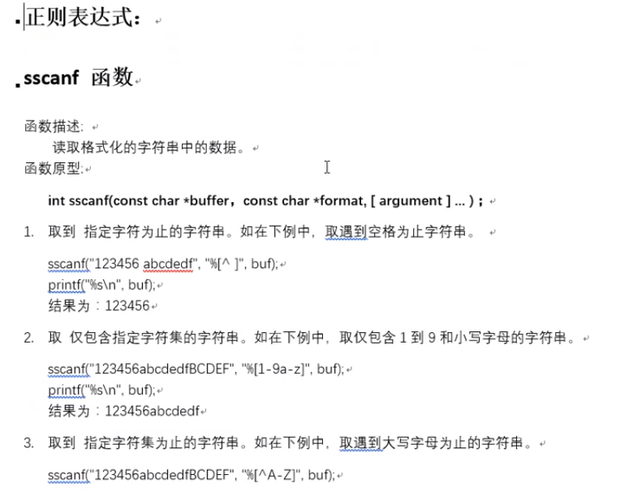
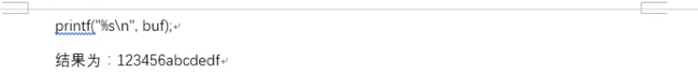

## 10P-判断文件是否存在

```c
// 处理http请求， 判断文件是否存在， 回发
void http_request(int cfd, const char *file)
{
    struct stat sbuf;
    // 判断文件是否存在
    int ret = stat(file, &sbuf);
    if (ret != 0) {
        // 回发浏览器 404 错误页面
        perror("stat");
        exit(1);
    }
    if(S_ISREG(sbuf.st_mode)) {     // 是一个普通文件
        // 回发 http协议应答
        //send_respond(cfd, 200, "OK", " Content-Type: text/plain; charset=iso-8859-1", sbuf.st_size);
        send_respond(cfd, 200, "OK", "Content-Type:image/jpeg", -1);
        //send_respond(cfd, 200, "OK", "audio/mpeg", -1);
        // 回发 给客户端请求数据内容。
        send_file(cfd, file);
    }
}
```

## 11P-写出http应答协议头

```c
// 客户端端的fd, 错误号，错误描述，回发文件类型， 文件长度
void send_respond(int cfd, int no, char *disp, char *type, int len)
{
    char buf[4096] = {0};
    sprintf(buf, "HTTP/1.1 %d %s\r\n", no, disp);
    send(cfd, buf, strlen(buf), 0);
    sprintf(buf, "Content-Type: %s\r\n", type);
    sprintf(buf+strlen(buf), "Content-Length:%d\r\n", len);
    send(cfd, buf, strlen(buf), 0);
    send(cfd, "\r\n", 2, 0);
}
```

## 12P-写数据给浏览器

```c
// 发送服务器本地文件 给浏览器
void send_file(int cfd, const char *file)
{
    int n = 0, ret;
    char buf[4096] = {0};
    // 打开的服务器本地文件。  --- cfd 能访问客户端的 socket
    int fd = open(file, O_RDONLY);
    if (fd == -1) {
        // 404 错误页面
        perror("open error");
        exit(1);
    }
    while ((n = read(fd, buf, sizeof(buf))) > 0) {
        ret = send(cfd, buf, n, 0);
        if (ret == -1) {
            perror("send error");
            exit(1);
        }
        if (ret < 4096)
            printf("-----send ret: %d\n", ret);
    }
    close(fd);
}
```

## 13P-错误原因及说明

```c
MP3请求错误的原因在于，做错误判断时太粗略，errno=EAGAIN或者errno=EINTR时，并不算错误，此时继续执行循环读取数据就行。
```

然而原来的程序是直接退出了，所以没接收到数据。

## 14P-错误页面展示

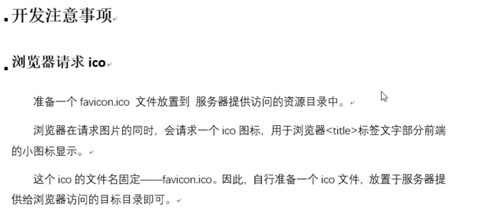
错误页面部分的代码：
```c
void send_error(int cfd, int status, char *title, char *text)
{
    char buf[4096] = {0};
    sprintf(buf, "%s %d %s\r\n", "HTTP/1.1", status, title);
    sprintf(buf+strlen(buf), "Content-Type:%s\r\n", "text/html");
    sprintf(buf+strlen(buf), "Content-Length:%d\r\n", -1);
    sprintf(buf+strlen(buf), "Connection: close\r\n");
    send(cfd, buf, strlen(buf), 0);
    send(cfd, "\r\n", 2, 0);
    memset(buf, 0, sizeof(buf));
    sprintf(buf, "<html><head><title>%d %s</title></head>\n", status, title);
    sprintf(buf+strlen(buf), "<body bgcolor=\"#cc99cc\"><h2 align=\"center\">%d %s</h4>\n", status, title);
    sprintf(buf+strlen(buf), "%s\n", text);
    sprintf(buf+strlen(buf), "<hr>\n</body>\n</html>\n");
    send(cfd, buf, strlen(buf), 0);
    return ;
}
```

直接看完整代码吧：
```c
epoll_server.c
```

## 15P-浏览器请求目录

```c
// http请求处理
void http_request(const char* request, int cfd)
{
    // 拆分http请求行
    char method[12], path[1024], protocol[12];
    sscanf(request, "%[^ ] %[^ ] %[^ ]", method, path, protocol);
    printf("method = %s, path = %s, protocol = %s\n", method, path, protocol);
    // 转码 将不能识别的中文乱码 -> 中文
    // 解码 %23 %34 %5f
    decode_str(path, path);
    char* file = path+1; // 去掉path中的/ 获取访问文件名
    // 如果没有指定访问的资源, 默认显示资源目录中的内容
    if(strcmp(path, "/") == 0) {
        // file的值, 资源目录的当前位置
        file = "./";
    }
    // 获取文件属性
    struct stat st;
    int ret = stat(file, &st);
    if(ret == -1) {
        send_error(cfd, 404, "Not Found", "NO such file or direntry");
        return;
    }
    // 判断是目录还是文件
    if(S_ISDIR(st.st_mode)) {       // 目录
        // 发送头信息
        send_respond_head(cfd, 200, "OK", get_file_type(".html"), -1);
        // 发送目录信息
        send_dir(cfd, file);
    } else if(S_ISREG(st.st_mode)) { // 文件
        // 发送消息报头
        send_respond_head(cfd, 200, "OK", get_file_type(file), st.st_size);
        // 发送文件内容
        send_file(cfd, file);
    }
}
```

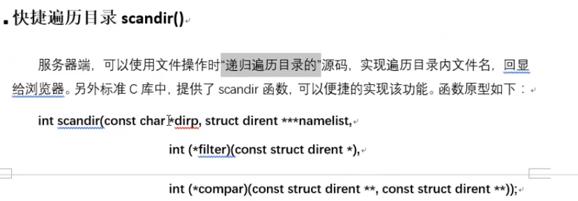
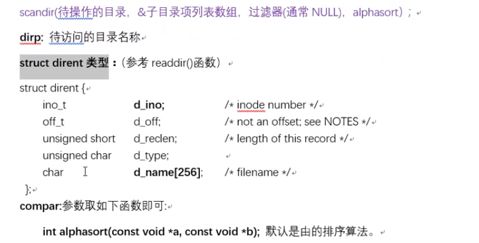
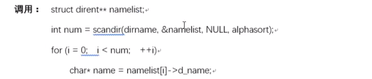

## 16P-判断文件类型

```c
// 通过文件名获取文件的类型
const char *get_file_type(const char *name)
{
    char* dot;
    // 自右向左查找'.'字符, 如不存在返回NULL
    dot = strrchr(name, '.');
    if (dot == NULL)
        return "text/plain; charset=utf-8";
    if (strcmp(dot, ".html") == 0 || strcmp(dot, ".htm") == 0)
        return "text/html; charset=utf-8";
    if (strcmp(dot, ".jpg") == 0 || strcmp(dot, ".jpeg") == 0)
        return "image/jpeg";
    if (strcmp(dot, ".gif") == 0)
        return "image/gif";
    if (strcmp(dot, ".png") == 0)
        return "image/png";
    if (strcmp(dot, ".css") == 0)
        return "text/css";
    if (strcmp(dot, ".au") == 0)
        return "audio/basic";
    if (strcmp( dot, ".wav" ) == 0)
        return "audio/wav";
    if (strcmp(dot, ".avi") == 0)
        return "video/x-msvideo";
    if (strcmp(dot, ".mov") == 0 || strcmp(dot, ".qt") == 0)
        return "video/quicktime";
    if (strcmp(dot, ".mpeg") == 0 || strcmp(dot, ".mpe") == 0)
        return "video/mpeg";
    if (strcmp(dot, ".vrml") == 0 || strcmp(dot, ".wrl") == 0)
        return "model/vrml";
    if (strcmp(dot, ".midi") == 0 || strcmp(dot, ".mid") == 0)
        return "audio/midi";
    if (strcmp(dot, ".mp3") == 0)
        return "audio/mpeg";
    if (strcmp(dot, ".ogg") == 0)
        return "application/ogg";
    if (strcmp(dot, ".pac") == 0)
        return "application/x-ns-proxy-autoconfig";
    return "text/plain; charset=utf-8";
}
```

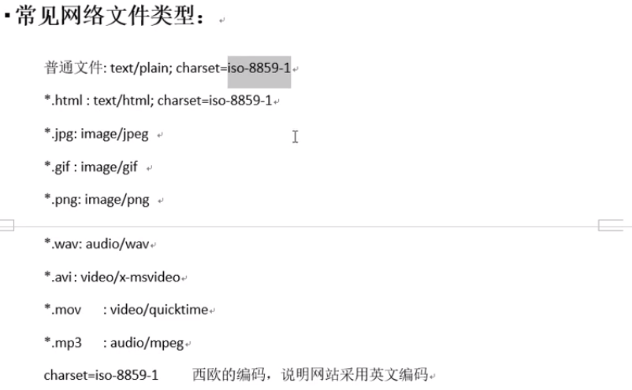
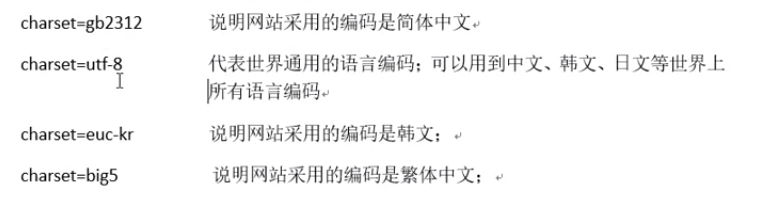

## 17P-汉字字符编码和解码

URL中的汉字默认是存为Unicode码
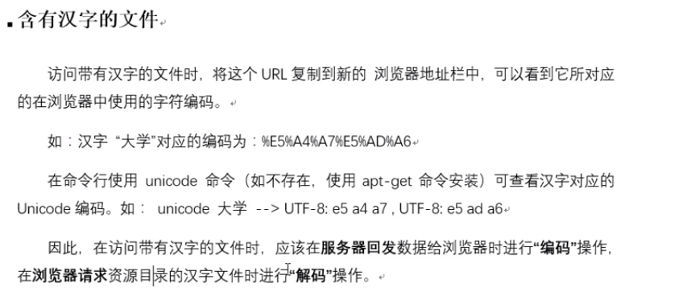

## 18P-libevent实现的web服务器

直接源码啃起来吧

## 19P-telnet调试

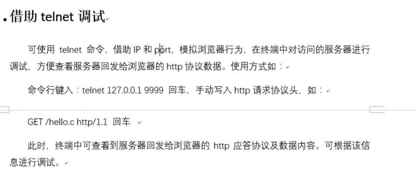