# 第1章 Linux命令基础

## 目录

- [Linux命令基础习惯](#linux命令基础习惯)
  - [主键盘快捷键](#主键盘快捷键)
- [类Unix系统目录](#类unix系统目录)
  - [Linux 系统目录](#linux-系统目录)
- [目录和文件操作（一）](#目录和文件操作一)
  - [Linux 系统文件类型（共 7~8 种）](#linux-系统文件类型共-78-种)
  - [文件权限说明](#文件权限说明)
  - [隐藏终端中的路径](#隐藏终端中的路径)
- [目录和文件操作（二）](#目录和文件操作二)
- [软链接和硬链接](#软链接和硬链接)
- [创建修改用户和用户组](#创建修改用户和用户组)
  - [chmod 修改权限](#chmod-修改权限)
- [find命令（一）](#find命令一)
  - [常用选项](#常用选项)
- [午后复习](#午后复习)
- [find命令（二）](#find命令二)
- [grep和xargs](#grep和xargs)
  - [创建名字带空格的文件](#创建名字带空格的文件)
- [xargs加强和awk说明](#xargs加强和awk说明)
- [软件包安装](#软件包安装)
- [压缩命令gzip和bzip2](#压缩命令gzip和bzip2)
  - [第一种压缩方式：gzip](#第一种压缩方式gzip)
  - [第二种压缩方式：bzip2](#第二种压缩方式bzip2)
- [rar压缩和zip压缩](#rar压缩和zip压缩)
  - [rar 压缩](#rar-压缩)
  - [zip 压缩](#zip-压缩)
- [其他命令](#其他命令)
- [总结](#总结)
  - [Linux 系统目录](#linux-系统目录-1)
  - [Linux 系统文件类型（共 7~8 种）](#linux-系统文件类型共-78-种-1)
  - [软链接](#软链接)
  - [硬链接](#硬链接)
  - [用户管理](#用户管理)
  - [find 命令](#find-命令)
  - [grep 命令](#grep-命令)
  - [软件安装](#软件安装)
  - [tar 压缩与解压](#tar-压缩与解压)
  - [rar 压缩与解压](#rar-压缩与解压)
  - [zip 压缩与解压](#zip-压缩与解压)
- [复习](#复习)

---


## Linux命令基础习惯

`date` 显示系统当前时间。

```bash
cat /etc/shells
```
查看当前可使用的 shell。

```bash
echo $SHELL
```
查看当前使用的 shell。

### 主键盘快捷键

| 快捷键 | 功能 |
|--------|------|
| `Ctrl-p` | 上 |
| `Ctrl-n` | 下 |
| `Ctrl-b` | 左 |
| `Ctrl-f` | 右 |
| `Ctrl-d` | 删除光标后面的字符 |
| `Ctrl-a` | 光标移到行首（Home） |
| `Ctrl-e` | 光标移到行末（End） |
| `Backspace` | 删除光标前面的单个字符 |
| `Ctrl-u` | 清除整行 |
| `Ctrl-k` | 删除光标到行末 |
| `Shift-PgUp` | 向上翻页 |
| `Shift-PgDn` | 向下翻页 |
| `Ctrl-Shift-+` | 增大终端字体 |
| `Ctrl--` | 减小终端字体 |
| `Ctrl-Alt-T` | 新打开一个终端 |
| `Ctrl-l` | 清屏（也可以使用 `clear` 命令） |


## 类Unix系统目录

```bash
pwd
```
查看当前所在目录。

### Linux 系统目录

| 目录 | 说明 |
|------|------|
| `bin` | 存放二进制可执行文件 |
| `boot` | 存放开机启动程序 |
| `dev` | 存放设备文件（字符设备、块设备） |
| `home` | 存放普通用户 |
| `etc` | 用户信息和系统配置文件（`passwd`、`group`） |
| `lib` | 库文件（如 `libc.so.6`） |
| `root` | 管理员宿主目录（家目录） |
| `usr` | 用户资源管理目录（Unix Software Resource） |

查看鼠标日志：


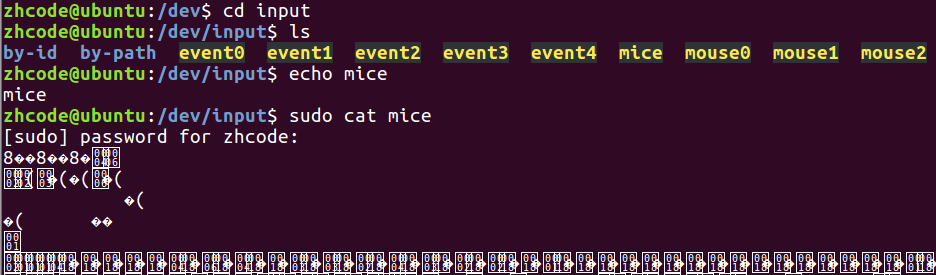

## 目录和文件操作（一）

```bash
cd -
```
返回上一个目录。

### Linux 系统文件类型（共 7~8 种）

| 标识 | 文件类型 |
|------|----------|
| `-` | 普通文件 |
| `d` | 目录文件 |
| `c` | 字符设备文件 |
| `b` | 块设备文件 |
| `l` | 软链接 |
| `p` | 管道文件 |
| `s` | 套接字 |

```bash
ls
```
列出当前文件夹下的目录项。

```bash
ll
```
竖排显示目录项和详细信息，是 `ls -l` 的缩写。


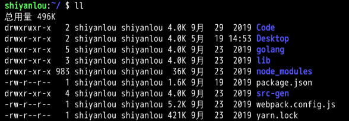

```bash
ls -l
```
显示目录项详细信息。

```bash
ls -l dirname
```
显示 `dirname` 中目录的详细信息。

```bash
ls -ld dirname
```
显示 `dirname` 本身的详细信息。

```bash
ls -R
```
递归查看目录。


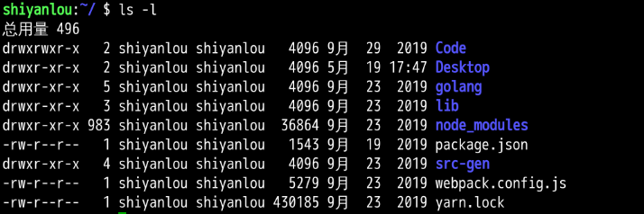


```bash
ls -Rl
```
递归展示详细信息。

### 文件权限说明

目录项详细信息各字段含义：

| 字段 | 含义 |
|------|------|
| 文件权限 | 如 `-rw-r--r--` |
| 硬链接计数 | 指向该文件的硬链接数量 |
| 所有者 | 文件所属用户 |
| 所属组 | 文件所属用户组 |
| 大小 | 文件大小（字节） |
| 时间 | 最后修改时间 |
| 文件名 | 文件或目录名称 |

权限位展开（以 `-rw-r--r--` 为例）：

| 位置 | 字符 | 含义 |
|------|------|------|
| 第 1 位 | `-` | 文件类型 |
| 第 2~4 位 | `rw-` | 所有者权限：读、写 |
| 第 5~7 位 | `r--` | 同组用户权限：读 |
| 第 8~10 位 | `r--` | 其他用户权限：读 |

```bash
which <command>
```
查看指定命令所在的目录位置。

### 隐藏终端中的路径

```bash
vi ~/.bashrc
```
打开 shell 环境配置文件，在末尾添加 `PS1='$ '`，保存退出后重启终端即可。


效果如下：

```bash
mkdir dirname
```
新建目录。

```bash
rmdir dirname
```
删除空目录，非空目录无法删除。

```bash
touch filename
```
创建空文件。

```bash
rm filename
```
删除文件。

```bash
rm -r dirname
```
递归删除目录。

```bash
rm -rf dirname
```
强制递归删除目录。


```bash
mv file1 file2 location
```
将 `file1` 和 `file2` 移动到目标位置。

```bash
cp filename dirname
```
复制文件到目录。

```bash
cp filename1 filename2
```
复制 `filename1` 并重命名为 `filename2`。

```bash
cp -a dirname1 dirname2
```
复制目录1及其下所有文件到目录2。

```bash
cp -r dirname1 dirname2
```
递归复制目录1到目录2。

`-a` 与 `-r` 的区别在于，`-a` 是完全复制，会保留文件权限、修改时间等属性。


## 目录和文件操作（二）

```bash
cat filename
```
查看文件内容。

```bash
tac filename
```
逆序查看文件内容（按行反转）。

`cat` 也可以读取终端输入，即回显功能。

```bash
more filename
```
与 `cat` 类似，但对于大文件查看更适用。空格翻页，回车逐行，使用 `q` 或 `Ctrl-c` 退出。

```bash
less filename
```
与 `cat` 类似。空格翻页，回车逐行，使用 `q` 或 `Ctrl-c` 退出。

```bash
head -n filename
```
查看文件前 n 行，不加 `-n` 参数默认查看 10 行。

```bash
tail -n filename
```
查看文件后 n 行，默认查看 10 行。注意显示顺序为正序，例如文件共 10 行时，`tail -4` 显示的是第 7、8、9、10 行。


```bash
tree
```
查看当前目录结构树，需要先安装 `tree`。


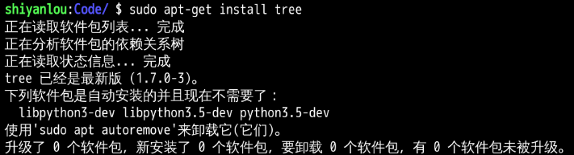


## 软链接和硬链接

```bash
ln -s file file.s
```
创建一个**软链接**。软链接类似于 Windows 下的快捷方式。

软链接的大小等于其存储的文件路径长度。

Linux 下的软链接行为与 Windows 下的快捷方式类似，但如果是用相对路径创建的软链接，在软链接移动之后就会失效，无法访问。这一点与 Windows 快捷方式不同，Windows 快捷方式放在任意位置均可。

因此，创建软链接时最好使用**绝对路径**。使用绝对路径创建的软链接在移动后不会失效。


注意：软链接的权限指的是软链接本身的权限，不是软链接指向文件的权限。

```bash
ln file file.h
```
创建一个**硬链接**。创建硬链接后，文件的硬链接计数加 1。

再创建一个硬链接后，对于 `file1`，有 2 个硬链接 `file.h` 和 `file.hard`，无论更改哪个硬链接或者文件本身，这三个文件的内容同步变化。

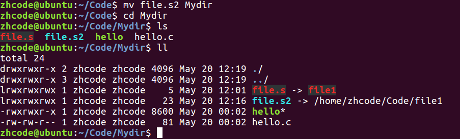


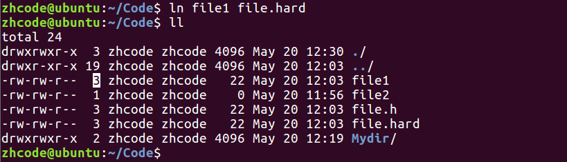

产生同步变化的原因：文件和硬链接的 **Inode** 相同。每个文件都有唯一的 Inode，硬链接相当于对同一 Inode 的多个引用，因此修改任意一个引用都会反映到所有引用上。

当删除一个硬链接时，文件的硬链接计数减 1，当计数减为 0 时，才会真正删除该文件。


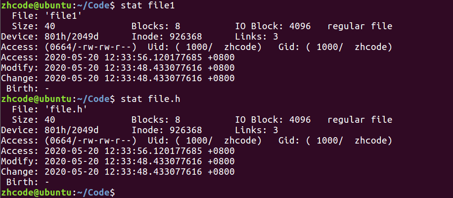

即使删除硬链接指向的源文件，也只会让硬链接计数减 1。

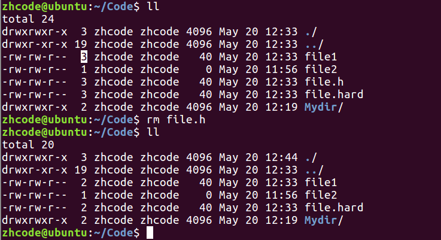

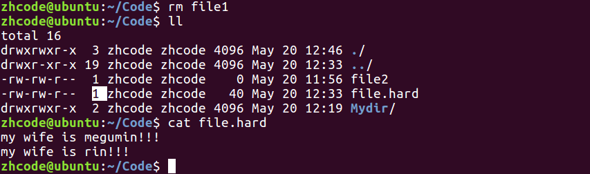

## 创建修改用户和用户组

```bash
whoami
```
查看当前用户。

### chmod 修改权限

#### 文字设定法

```bash
chmod [who] [+|-|=] [mode] filename
```

操作对象 `who` 可以是：

| 参数 | 说明 |
|------|------|
| `u` | 用户（user），即文件或目录的所有者 |
| `g` | 同组（group）用户，即与文件所有者有相同组 ID 的所有用户 |
| `o` | 其他（others）用户 |
| `a` | 所有（all）用户，系统默认值 |

操作符号：

| 符号 | 说明 |
|------|------|
| `+` | 添加某个权限 |
| `-` | 取消某个权限 |
| `=` | 赋予给定权限并取消其他所有权限 |

示例：给 `file2` 文件添加执行权限：

```bash
chmod u+x file2
```

#### 数字设定法

```bash
chmod <操作码> filename
```

权限数值对应关系：

| 权限 | 数值 |
|------|------|
| `r`（读） | 4 |
| `w`（写） | 2 |
| `x`（执行） | 1 |

每组权限的数值为对应位相加，例如 `rwx` = 4 + 2 + 1 = 7，`rw-` = 4 + 2 = 6，`r--` = 4。

示例：将文件权限设置为 `-rwxrw-r--`（操作码 764）：

- 所有者：`rwx` = 7
- 所有者所在组：`rw-` = 6
- 其他用户：`r--` = 4


操作码即为 764。

```bash
sudo adduser newusername
```
添加新用户。

```bash
chown username filename
```
修改文件所有者。

```bash
su username
```
切换当前用户为 `username`。

```bash
sudo addgroup groupname
```
添加新的用户组。


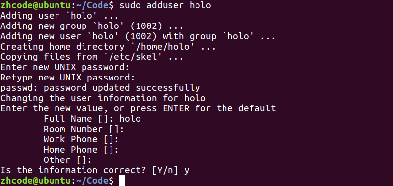

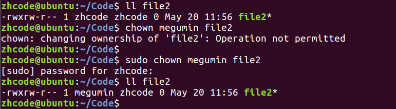


```bash
sudo chgrp groupname filename
```
修改文件所属用户组。

```bash
sudo chown username:groupname filename
```
同时修改文件所属用户和用户组。

```bash
sudo deluser username
```
删除用户。

```bash
sudo delgroup groupname
```
删除用户组。


## find命令（一）

`find` 命令用于查找文件。

### 常用选项

`-type`：按文件类型搜索。可选值：`d`（目录）、`p`（管道）、`s`（套接字）、`c`（字符设备）、`b`（块设备）、`l`（软链接）、`f`（普通文件）。

```bash
find ./ -type f
```

`-name`：按文件名搜索。

```bash
find ./ -name "*file*.jpg"
```

`-maxdepth`：指定搜索深度，应作为第一个参数出现。

```bash
find ./ -maxdepth 1 -name "*file*.jpg"
```

`-size`：按文件大小搜索，单位：`k`、`M`、`G`。

```bash
find /home/itcast -size +20M -size -50M
```
注意：两个 `-size` 条件缺一不可，且文件大小单位对大小写敏感。

`-atime`、`-mtime`、`-ctime`（单位：天），`-amin`、`-mmin`、`-cmin`（单位：分钟）：按时间搜索。

| 参数 | 含义 |
|------|------|
| `a` | 最近访问时间（access） |
| `m` | 最近修改时间（modify），指更改文件内容 |
| `c` | 最近变更时间（change），指更改文件属性（元数据） |

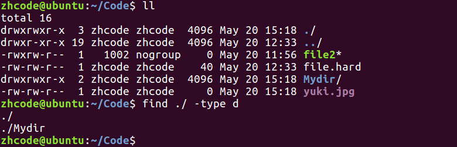


## 午后复习

## find命令（二）

`-exec`：将 `find` 搜索的结果集执行某一指定命令。

```bash
find /usr/ -name '*tmp*' -exec ls -ld {} \;
```

`-ok`：以交互式方式将 `find` 搜索的结果集执行某一指定命令。

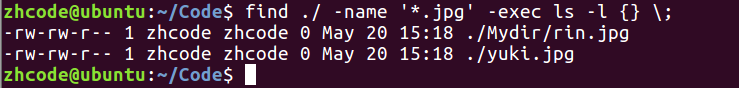

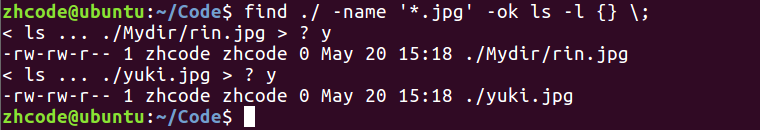

## grep和xargs

`grep` 命令用于查找文件内容。

```bash
grep -r 'copy' ./ -n
```

`-n` 参数：显示行号。

```bash
ps
```
监控后台进程工作情况，默认只显示当前可以和用户交互的进程。

```bash
ps aux | grep 'cupsd'
```
检索进程结果集。使用 `grep` 搜索进程时，有一条结果是搜索进程本身。


`find` 与 `xargs` 配合使用：

```bash
find ... | xargs ls -l
```
对 `find` 操作的结果集进行操作，等价于：

```bash
find ... -exec ls -l {} \;
```

两者的区别在于，当结果集很大时，`xargs` 会对结果进行分段处理，因此性能更优。但 `xargs` 也有缺陷：默认使用空格来分割结果集，当文件名包含空格时，会因文件名被切割而失效。

`-print0` 与 `-0`：将 `find` 搜索的结果集以 null 字符分隔，解决文件名含空格的问题。当结果集数量过大时，可以分片映射。

```bash
find /usr/ -name '*tmp*' -print0 | xargs -0 ls -ld
```

其中 `-print0` 是 `find` 的选项，指定结果集以 null 分隔；`-0` 是 `xargs` 的选项，指定以 null 分隔输入。

### 创建名字带空格的文件

第一种方法：文件名加引号。

第二种方法：使用转义字符。


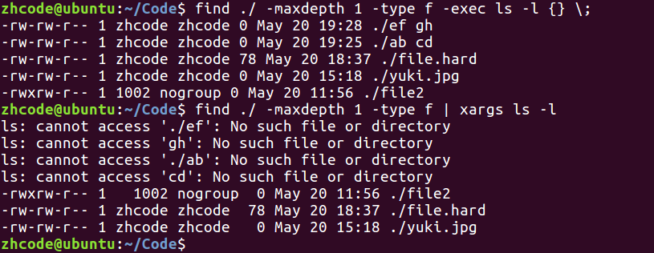

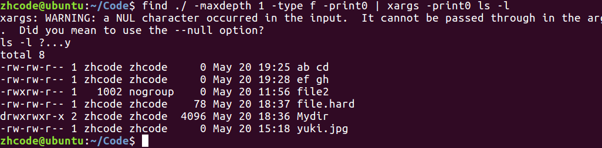

## xargs加强和awk说明

## 软件包安装

```bash
sudo apt-get install softname
```
安装软件。

```bash
sudo apt-get update
```
更新软件列表。

更换软件源：系统设置 -> 软件和更新 -> 下载自...。更换软件源后需要更新软件列表。

```bash
sudo apt-get remove softname
```
卸载软件。

使用安装包进行软件安装：

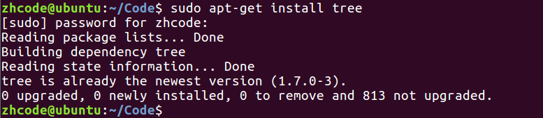

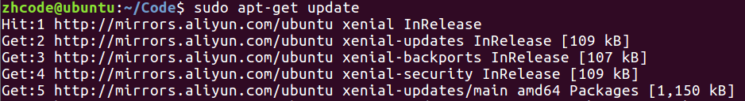

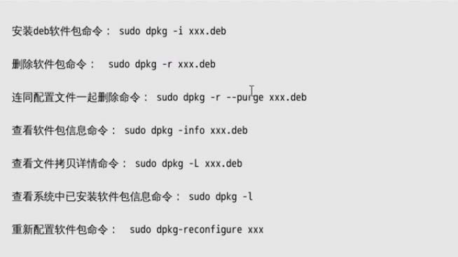

## 压缩命令gzip和bzip2

`gzip` 和 `bzip2` 都是配合 `tar` 打包命令使用的压缩工具。两者的缺陷是只能对单个文件进行压缩，既不能压缩目录，也不能打包。

### 第一种压缩方式：gzip

```bash
tar zcvf 压缩包名.tar.gz 压缩材料
```

上述命令实际上执行了两步：

1. 使用 `gzip` 进行压缩：

```bash
gzip filename
```

解压：

```bash
gunzip zipfile
```

2. 使用 `tar` 进行打包：

```bash
tar file... tarname
```

因此 `tar zcvf` 是两条指令的结合版本。

**zcvf 参数说明：**

| 参数 | 含义 |
|------|------|
| `z` | zip，使用 gzip 压缩 |
| `c` | create，创建压缩包 |
| `v` | verbose，显示压缩过程（可省略，使用 `zcf` 即不显示过程） |
| `f` | file，指定文件名 |

```bash
file filename
```
查看文件来源。

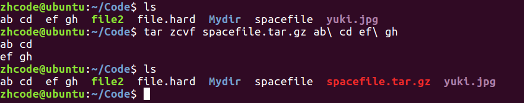

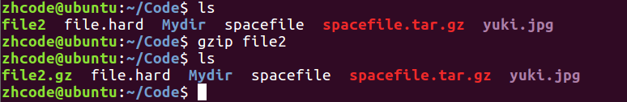

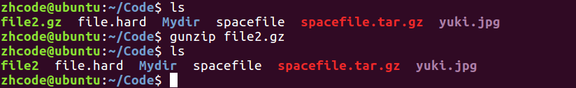

### 第二种压缩方式：bzip2

```bash
tar jcvf 压缩包名.tar.bz2 压缩材料
```

解压：将压缩命令中的 `c` 替换为 `x`：

```bash
tar zxvf 压缩包名.tar.gz
```
使用 gzip 方式解压。

```bash
tar jxvf 压缩包名.tar.bz2
```
使用 bzip2 方式解压。


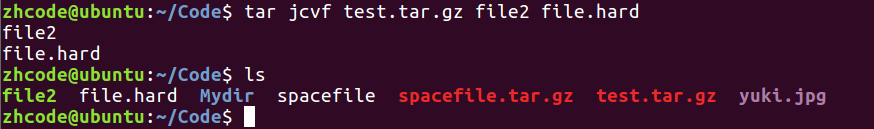

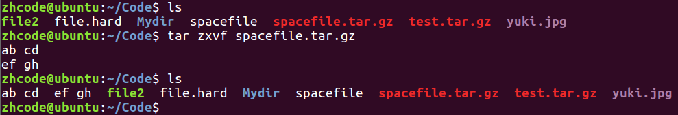

## rar压缩和zip压缩

### rar 压缩

需要先安装 `rar`。

```bash
rar a -r newdir dir
```
把 `dir` 压缩成 `newdir.rar`。如果压缩材料里没有目录，`-r` 参数可以省去。

```bash
unrar x newdir.rar
```
解压 rar 文件。

```bash
sudo aptitude show softname
```
查看软件安装信息。


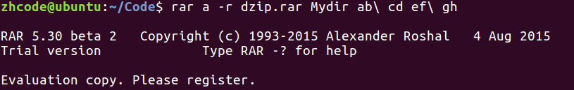

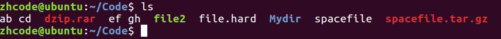

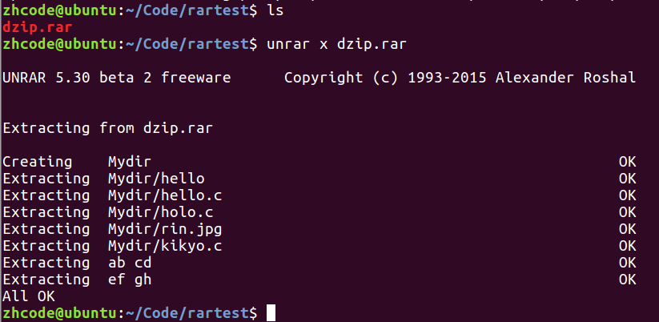

### zip 压缩

```bash
zip -r dir.zip dir
```

解压：

```bash
unzip dir.zip
```

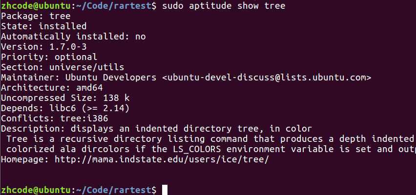

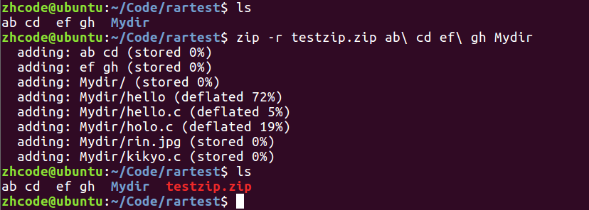

zip 文件在 Windows 和 Linux 下通用。

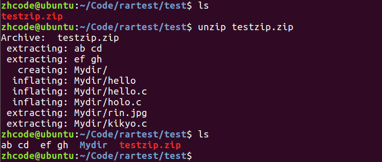

## 其他命令

```bash
who
```
查看当前在线上的用户情况。

```bash
whoami
```
查看当前用户（不带有进程信息）。

```bash
ps aux | grep <条件>
```
检索进程结果集，结果至少有一个（即当前查询进程本身）。

```bash
jobs
```
查看操作系统当前运行了哪些用户作业。

```bash
kill
```
杀死进程。

```bash
env
```
查看环境变量。

```bash
top
```
文字版任务管理器。

```bash
sudo passwd username
```
设置用户密码。


```bash
sudo su
```
切换到 root 用户。

```bash
ifconfig
```
查看网卡信息。

```bash
man
```
系统参考手册。

```bash
man n name
```
在系统手册第 n 章查看 `name`。

```bash
alias
```
给命令起别名。

`ll` 实际指令中的 `-F` 选项意味着带文件标识符：目录末尾有 `/`，可执行文件末尾带 `*`。

```bash
alias 别名='指令'
```
以管道查询别名为例：


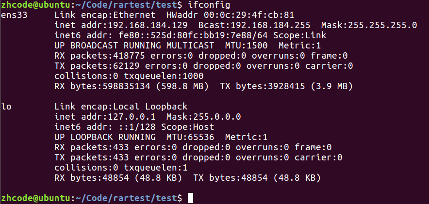

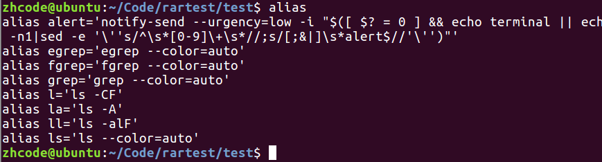

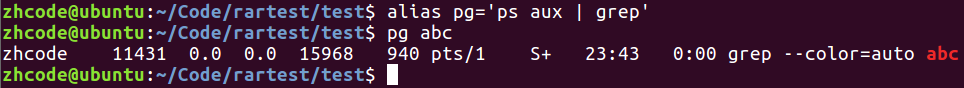

## 总结

Linux 系统的核心理念：**"所见皆文件"**。

### Linux 系统目录

| 目录 | 说明 |
|------|------|
| `bin` | 存放二进制可执行文件 |
| `boot` | 存放开机启动程序 |
| `dev` | 存放设备文件（字符设备、块设备） |
| `home` | 存放普通用户 |
| `etc` | 用户信息和系统配置文件（`passwd`、`group`） |
| `lib` | 库文件（如 `libc.so.6`） |
| `root` | 管理员宿主目录（家目录） |
| `usr` | 用户资源管理目录 |

### Linux 系统文件类型（共 7~8 种）

| 标识 | 文件类型 |
|------|----------|
| `-` | 普通文件 |
| `d` | 目录文件 |
| `c` | 字符设备文件 |
| `b` | 块设备文件 |
| `l` | 软链接 |
| `p` | 管道文件 |
| `s` | 套接字 |

### 软链接

软链接相当于快捷方式。为保证软链接可以任意移动，创建时务必对源文件使用**绝对路径**。

### 硬链接

```bash
ln file file.hard
```

操作系统给每一个文件赋予唯一的 **Inode**，当多个文件共享同一 Inode 时，彼此内容同步。

删除时，只将硬链接计数减 1。减为 0 时，Inode 被释放。

### 用户管理

创建用户：

```bash
sudo adduser 新用户名
```

> 也可使用 `useradd`。

修改文件所属用户：

```bash
sudo chown 新用户名 待修改文件
```

例如：

```bash
sudo chown wangwu a.c
```

删除用户：

```bash
sudo deluser 用户名
```

创建用户组：

```bash
sudo addgroup 新组名
```

修改文件所属用户组：

```bash
sudo chgrp 新用户组名 待修改文件
```

例如：

```bash
sudo chgrp g88 a.c
```

删除用户组：

```bash
sudo delgroup 用户组名
```

使用 `chown` 一次修改所有者和所属组：

```bash
sudo chown 所有者:所属组 待操作文件
```

### find 命令

`find` 命令用于查找文件。

`-type`：按文件类型搜索，可选值：`d`、`p`、`s`、`c`、`b`、`l`、`f`（文件）。

`-name`：按文件名搜索。

```bash
find ./ -name "*file*.jpg"
```

`-maxdepth`：指定搜索深度，应作为第一个参数出现。

```bash
find ./ -maxdepth 1 -name "*file*.jpg"
```

`-size`：按文件大小搜索，单位：`k`、`M`、`G`。

```bash
find /home/itcast -size +20M -size -50M
```

`-atime`、`-mtime`、`-ctime`（天），`-amin`、`-mmin`、`-cmin`（分钟）：按时间搜索。

`-exec`：将 `find` 搜索的结果集执行某一指定命令。

```bash
find /usr/ -name '*tmp*' -exec ls -ld {} \;
```

`-ok`：以交互式方式将 `find` 搜索的结果集执行某一指定命令。

`xargs`：将 `find` 搜索的结果集执行某一指定命令，当结果集数量过大时，可以分片映射。

```bash
find /usr/ -name '*tmp*' | xargs ls -ld
```

`-print0` 与 `-0`：

```bash
find /usr/ -name '*tmp*' -print0 | xargs -0 ls -ld
```

### grep 命令

`grep` 命令用于查找文件内容。

```bash
grep -r 'copy' ./ -n
```

`-n` 参数：显示行号。

```bash
ps aux | grep 'cupsd'
```
检索进程结果集。

### 软件安装

1. 联网。
2. 更新软件资源列表到本地：`sudo apt-get update`。
3. 安装软件：`sudo apt-get install 软件名`。
4. 卸载软件：`sudo apt-get remove 软件名`。
5. 使用软件包（`.deb`）安装：`sudo dpkg -i 安装包名`。

### tar 压缩与解压

**压缩：**

```bash
tar zcvf test.tar.gz file1 dir2
```
使用 gzip 方式压缩。

```bash
tar jcvf test.tar.bz2 file1 dir2
```
使用 bzip2 方式压缩。

**解压：** 将压缩命令中的 `c` 替换为 `x`：

```bash
tar zxvf test.tar.gz
```
使用 gzip 方式解压。

```bash
tar jxvf test.tar.bz2
```
使用 bzip2 方式解压。

### rar 压缩与解压

**压缩：**

```bash
rar a -r testrar.rar stdio.h test2.mp3
```

**解压：**

```bash
unrar x testrar.rar
```

### zip 压缩与解压

**压缩：**

```bash
zip -r testzip.zip dir stdio.h test2.mp3
```

**解压：**

```bash
unzip testzip.zip
```

## 复习

创建一个目录，大小默认是 4096 字节（4KB）。


