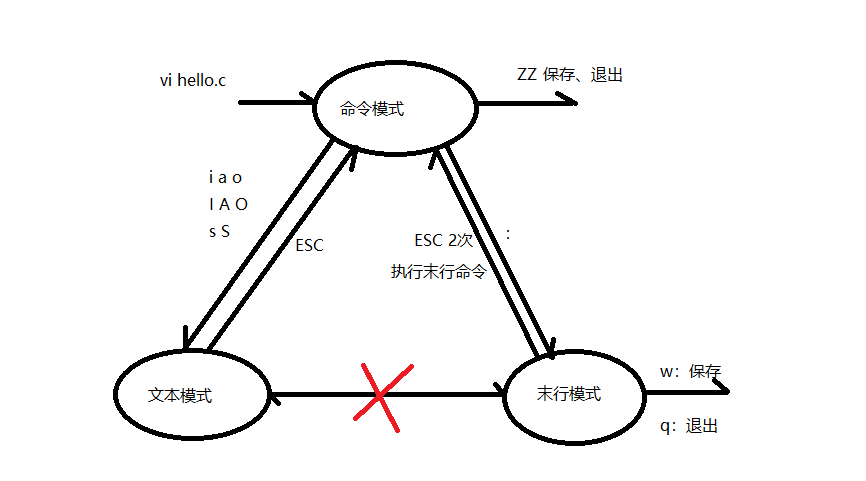
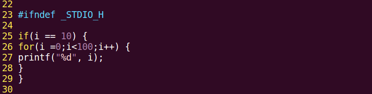
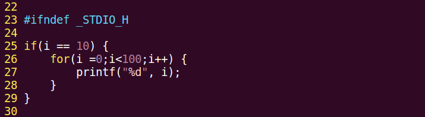
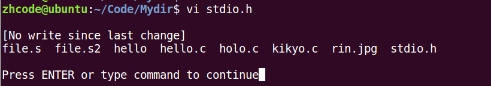

# 第2章 vim编辑器

## 目录

- [vim的三种工作模式](#vim的三种工作模式)
- [vim基本操作——跳转和删字符](#vim基本操作跳转和删字符)
  - [进入编辑模式](#进入编辑模式)
  - [删除操作](#删除操作)
  - [光标移动（命令模式）](#光标移动命令模式)
  - [行跳转](#行跳转)
  - [自动缩进](#自动缩进)
  - [大括号跳转](#大括号跳转)
- [vim基本操作——删除](#vim基本操作删除)
  - [替换单个字符](#替换单个字符)
  - [区域删除](#区域删除)
  - [整行删除](#整行删除)
- [vim基本操作——复制粘贴](#vim基本操作复制粘贴)
- [vim基本操作——查找和替换](#vim基本操作查找和替换)
  - [查找](#查找)
  - [替换（末行模式）](#替换末行模式)
  - [末行模式历史命令](#末行模式历史命令)
- [vim基本操作——其他](#vim基本操作其他)
  - [撤销与反撤销（命令模式）](#撤销与反撤销命令模式)
  - [分屏（末行模式）](#分屏末行模式)
  - [查看 man 手册（命令模式）](#查看-man-手册命令模式)
  - [查看宏定义（命令模式）](#查看宏定义命令模式)
  - [在 vim 中执行 Shell 命令（末行模式）](#在-vim-中执行-shell-命令末行模式)
- [vim配置思路](#vim配置思路)

---


## vim的三种工作模式



## vim基本操作——跳转和删字符

### 进入编辑模式

| 按键 | 功能 |
|------|------|
| `i` | 在光标前插入字符 |
| `a` | 在光标后插入字符 |
| `o` | 在光标所在行的下一行插入 |
| `I` | 在光标所在行的行首插入 |
| `A` | 在光标所在行的行末插入字符 |
| `O` | 在光标所在行的上一行插入字符 |
| `s` | 删除光标所在字符并进入编辑模式 |
| `S` | 删除光标所在行并进入编辑模式 |

### 删除操作

| 按键 | 功能 |
|------|------|
| `x` | 删除光标所在字符（保持命令模式） |
| `dw` | 删除光标所在单词，光标需在首字母上；若不在首字母，仅删除当前位置到单词末尾 |
| `D` | 删除光标所在位置到行末 |
| `d0` | 删除光标所在位置到行首 |
| `d$` | 删除光标所在位置到行末 |

### 光标移动（命令模式）

| 按键 | 功能 |
|------|------|
| `h` | 左移 |
| `j` | 下移 |
| `k` | 上移 |
| `l` | 右移 |
| `0`（数字） | 光标移到行首 |
| `$` | 光标移到行尾 |

### 行跳转

- **命令模式**：`{行号}G`（无回显）
- **末行模式**：`:{行号}` 后按回车
- **跳转首行**：`gg`（命令模式）
- **跳转末行**：`G`（命令模式）

### 自动缩进

在配置自动缩进之前，需要先修改 `vimrc` 文件，否则默认缩进宽度为 8 个空格。

Ubuntu 系统的 `vimrc` 文件位于 `/etc/vim/vimrc`，在文件末尾添加以下配置：

```vim
set tabstop=4       " 设置制表符宽度为4
set softtabstop=4   " 设置软制表符宽度为4
set shiftwidth=4    " 设置缩进空格数为4
```

配置完成后，在命令模式下使用 `gg=G` 可对全文进行自动缩进（无回显）。

### 大括号跳转

在命令模式下，将光标置于左大括号上，按 `%` 可跳转到对应的右大括号，再按 `%` 可跳回。其他括号（圆括号、方括号）同理。





## vim基本操作——删除

### 替换单个字符

在命令模式下，按 `r` 可替换光标选中的字符。

### 区域删除

将光标移至要删除的首字符，按 `v` 进入可视模式，使用 `hjkl` 移动到要删除的末尾，按 `d` 删除选中区域。

### 整行删除

| 按键 | 功能 |
|------|------|
| `dd` | 删除光标所在行（内容进入无名寄存器） |
| `{n}dd` | 从光标所在行开始删除 n 行 |

> **说明**：`dd` 实质上是**剪切**操作，被删除的内容会被存入无名寄存器（unnamed register），可通过 `p` 粘贴。

## vim基本操作——复制粘贴

| 按键 | 功能 |
|------|------|
| `yy` | 复制光标所在行 |
| `{n}yy` | 从光标所在行开始复制 n 行 |
| `p` | 向后粘贴剪贴板内容；若复制的是整行，则粘贴在光标所在行的下一行 |
| `P` | 向前粘贴剪贴板内容；若复制的是整行，则粘贴在光标所在行的上一行 |

> **说明**：复制整行时，行末的换行符也会被一并复制，因此 `p` 和 `P` 粘贴时会产生换行效果。

## vim基本操作——查找和替换

### 查找

在命令模式下使用 `/{关键词}` 进行查找。按回车启动查找后：

- 按 `n` 跳转到下一个匹配项
- 按 `N` 跳转到上一个匹配项

**查找光标所在单词**：将光标置于目标单词上（不要求在首字母），按 `*` 查找下一个，按 `#` 查找上一个。

### 替换（末行模式）

| 命令 | 功能 |
|------|------|
| `:s/待替换词/替换词` | 替换当前行的第一个匹配项 |
| `:%s/待替换词/替换词` | 替换全文每行的第一个匹配项 |
| `:%s/待替换词/替换词/g` | 全局替换（真正意义上的全文替换） |
| `:{起始行},{结束行}s/待替换词/替换词/g` | 替换指定行范围内的所有匹配项 |

示例：`:24,35s/待替换词/替换词/g` 表示替换第 24 至 35 行之间的所有目标词。

### 末行模式历史命令

| 按键 | 功能 |
|------|------|
| `Ctrl-p` | 上一条命令 |
| `Ctrl-n` | 下一条命令 |

## vim基本操作——其他

### 撤销与反撤销（命令模式）

| 按键 | 功能 |
|------|------|
| `u` | 撤销操作 |
| `Ctrl-r` | 反撤销（重做） |

### 分屏（末行模式）

| 命令 | 功能 |
|------|------|
| `:sp` | 水平分屏 |
| `:vsp` | 竖直分屏 |
| `:sp {文件名}` | 水平分屏并打开指定文件 |
| `:vsp {文件名}` | 竖直分屏并打开指定文件 |

分屏后的窗口操作：

- `Ctrl-w w`：在窗口间切换
- `:q`：退出当前光标所在的窗口
- `:qall`：退出所有窗口

### 查看 man 手册（命令模式）

将光标置于待查看的单词上，按 `K` 默认查看第一卷手册。使用 `{n}K` 可查看第 n 卷。

### 查看宏定义（命令模式）

将光标置于待查看的标识符上，按 `[d` 即可查看宏定义。

### 在 vim 中执行 Shell 命令（末行模式）

使用 `:!{命令}` 可在 vim 中执行外部 Shell 命令。执行后会切换至终端显示结果，按 `Enter` 返回 vim 界面。



## vim配置思路

vim 有两个配置文件：

1. `/etc/vim/vimrc` —— 系统级配置
2. `~/.vimrc` —— 用户级配置

其中，用户级配置（`~/.vimrc`）会优先加载，覆盖系统级配置。
