## 目录

- [gcc编译4步骤](#gcc编译4步骤)
- [gcc编译常用参数](#gcc编译常用参数)
- [动态库和静态库理论对比](#动态库和静态库理论对比)
- [静态库制作](#静态库制作)
- [静态库使用及头文件对应](#静态库使用及头文件对应)
- [动态库制作——生成与位置无关代码](#动态库制作生成与位置无关代码)
- [动态库制作——演示](#动态库制作演示)
- [动态库加载错误原因及解决方式](#动态库加载错误原因及解决方式)
- [动态库加载错误原因及解决方式（续）](#动态库加载错误原因及解决方式续)
- [扩展讲解——数据段合并](#扩展讲解数据段合并)
- [总结](#总结)

---


## gcc编译4步骤

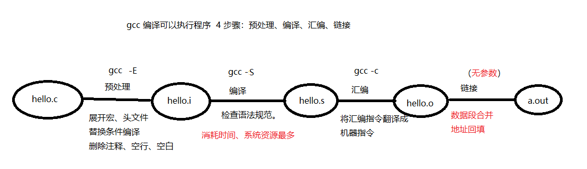

## gcc编译常用参数

当头文件和源码不在同一个目录下时，需要指定头文件所在位置。

下图是头文件和源码在同一个目录下：

将 `hello.h` 放入新建的文件夹 `hellodir` 之后，编译会失败。

使用 `-I` 参数指定头文件所在目录位置，该参数的位置可以在编译文件前，也可以在后面：

```bash
gcc -I ./hellodir hello.c -o hello
```

**常用参数说明：**

- **`-I`**：指定头文件所在目录位置。
- **`-c`**：只执行预处理、编译、汇编三个阶段，生成目标文件（`.o`）。
- **`-g`**：编译时添加调试信息，用于 `gdb` 调试。
- **`-Wall`**：显示所有警告信息。
- **`-D`**：向程序中"动态"注册宏定义。
- **`-l`**：指定动态库库名。
- **`-L`**：指定动态库路径。

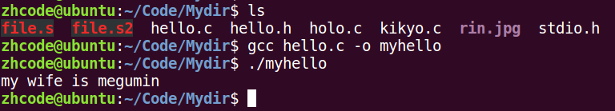

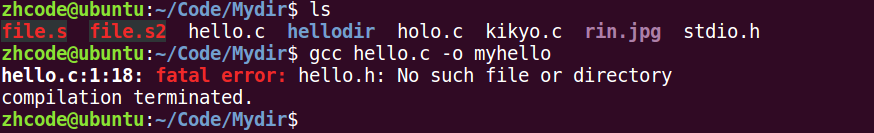

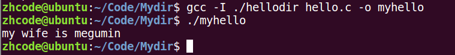

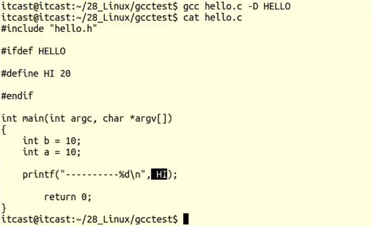

## 动态库和静态库理论对比

静态库在编译时会被静态展开到每个可执行文件中，因此有多少个文件引用就会展开多少次，占用较多内存。例如 100M 的静态库展开 100 次，就需要 1G 空间。但其优点是加载速度快，因为所有代码已经直接嵌入可执行文件中。

使用动态库时，动态库只需加载到内存一次。多个文件共用同一个动态库，用到时再临时加载，加载速度较慢，但非常节省内存。

动态库和静态库各有优劣，根据实际需求合理选用即可。

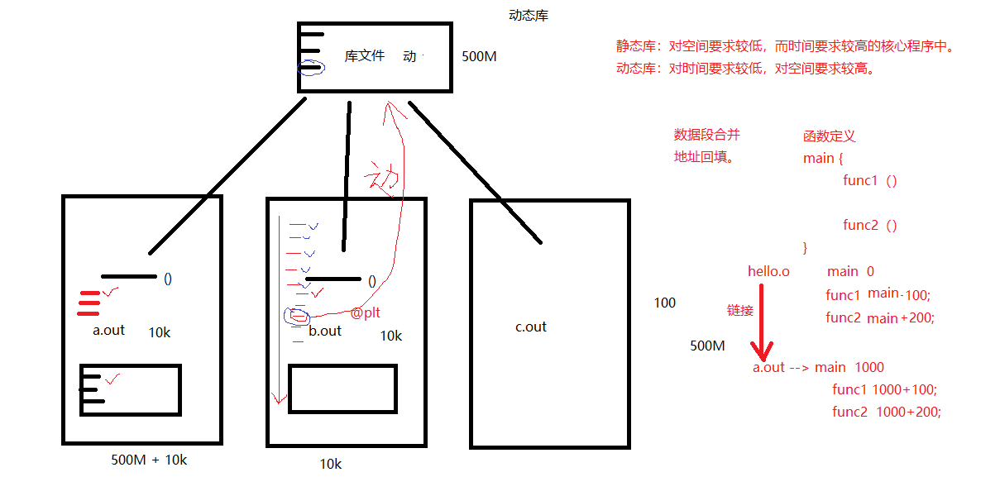

## 静态库制作

静态库的命名规则：以 `lib` 开头，以 `.a` 结尾。例如：`libmylib.a`。

使用 `ar` 工具生成静态库：

```bash
ar rcs libmylib.a file1.o
```

**制作步骤：**

**步骤一：** 编写源代码。

**步骤二：** 编译源代码，生成 `.o` 文件。

**步骤三：** 使用 `ar` 工具制作静态库：

```bash
ar rcs libname.a file1.o file2.o ...
```

**静态库的使用：**

```bash
gcc test.c lib库名.a -o a.out
```


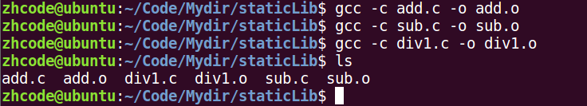

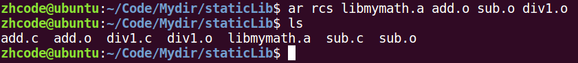

上图中，`test.c` 直接使用了 `mymath` 库中的 `add`、`sub`、`div1` 函数，因此在编译时需要导入静态库。编译时出现了函数未定义的警告，可以忽略，让系统生成默认的声明。

`test.c` 源文件大小仅为 296 字节，而编译生成的 `test` 可执行文件大小为 8776 字节，说明静态库在使用时是直接编译嵌入到可执行文件中的。

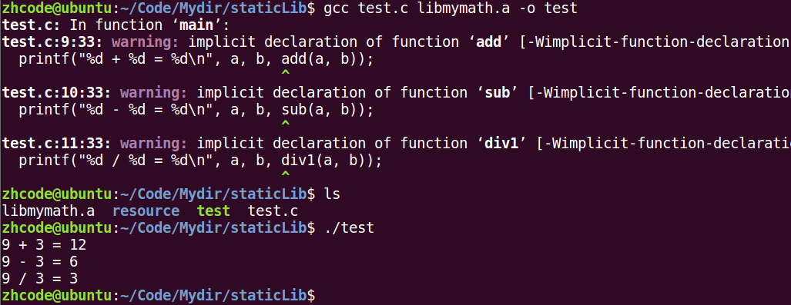


## 静态库使用及头文件对应

上一节出现的警告，是通过编译器隐式声明来解决的。编译器只能隐式声明返回值为 `int` 的函数形式：`int add(int, int);`。如果函数的返回值不是 `int`，则隐式声明失效，会导致编译报错。

在 `test.c` 中手动加入函数声明：

再次进行编译，就不会报错了。

上面这个方法需要库的使用者逐一了解库中的函数并手动声明到代码中，不够规范。

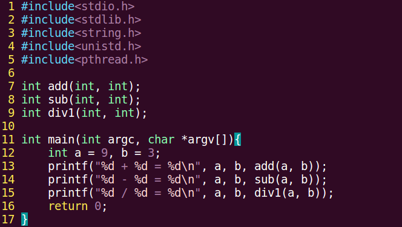

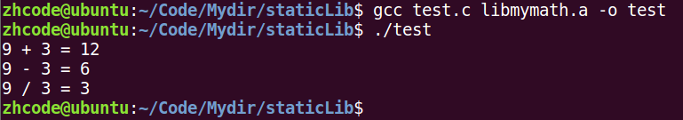

推荐使用头文件的方式来加载静态库。

左边的 `#ifndef / #define / #endif` 为**头文件守卫**（header guard），用于防止在代码中多次 `#include` 同一头文件导致静态库被重复展开，从而避免额外开销。

这样也不会报错，而且更加规范。

下面将静态库和头文件分别放置到其他目录下，运行过程如下：

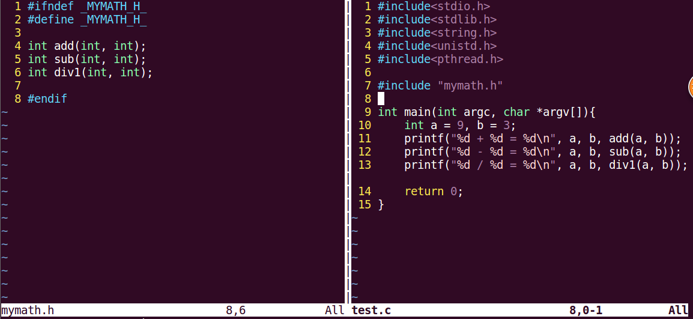

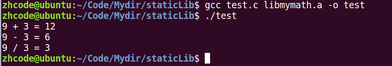

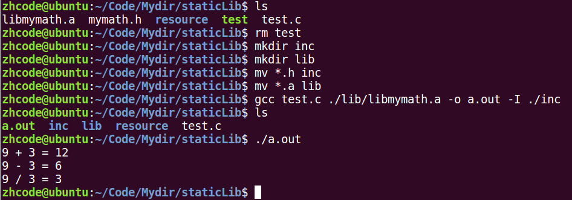

## 动态库制作——生成与位置无关代码

写在源代码里的函数，相对于 `main` 函数的偏移量是固定的。链接时回填 `main` 函数地址之后，其他源代码中的函数也就获得了正确地址。

动态库中的函数会使用 `@plt` 标识（Procedure Linkage Table），当动态库加载到内存时，再用实际加载地址将 `@plt` 替换掉。

**制作动态库的步骤：**

**步骤一：** 生成位置无关的 `.o` 文件：

```bash
gcc -c add.c -o add.o -fPIC
```

使用 `-fPIC` 参数后，生成的函数与位置无关，挂上 `@plt` 标识，等待动态绑定。


## 动态库制作——演示

**制作动态库的步骤：**

**1. 生成位置无关的 `.o` 文件：**

```bash
gcc -c add.c -o add.o -fPIC
```

使用 `-fPIC` 参数后，生成的函数与位置无关，挂上 `@plt` 标识，等待动态绑定。

**2. 使用 `gcc -shared` 制作动态库：**

```bash
gcc -shared -o lib库名.so add.o sub.o div.o
```

**3. 编译可执行程序时指定所使用的动态库**（`-l` 指定库名，`-L` 指定库路径）：

```bash
gcc test.c -o a.out -l mymath -L ./lib
```

**4. 运行可执行程序：**

```bash
./a.out
```

**过程演示：**

**步骤一：** 生成位置无关的 `.o` 文件。

**步骤二：** 制作动态库。

```bash
gcc -shared -o lib库名.so add.o sub.o div.o
```

**步骤三：** 编译程序。文件分布如下：动态库在 `lib` 目录下，头文件在 `inc` 目录下。

下面编译文件：

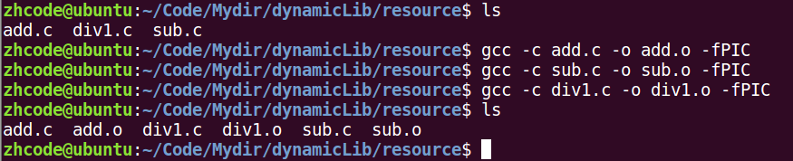

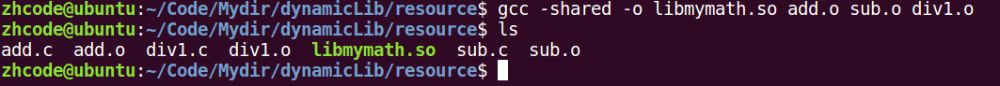


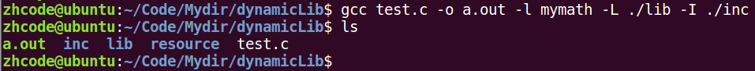

**步骤四：** 执行文件，出错。

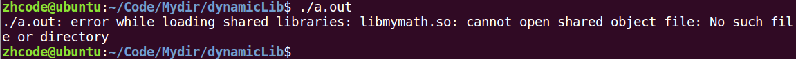

## 动态库加载错误原因及解决方式

**出错原因分析：**

- **链接器（Linker）**：工作于链接阶段，工作时需要 `-l` 和 `-L` 参数来找到动态库。
- **动态链接器（Dynamic Linker）**：工作于程序运行阶段，工作时需要知道动态库所在的目录位置。

**指定动态库路径并使其生效：**

通过环境变量指定动态库所在位置：

```bash
export LD_LIBRARY_PATH=动态库路径
```

当关闭终端后再次执行 `a.out` 时，又会报错。这是因为环境变量是进程级别的概念，关闭终端后再打开属于两个不同的进程，环境变量会丢失。要想永久生效，需要修改 shell 的配置文件：

```bash
vi ~/.bashrc
```

修改后要使配置文件立即生效：

```bash
. ~/.bashrc
# 或者
source ~/.bashrc
# 或者重启终端让其自动加载
```

此时再执行 `a.out` 就不会报错了。

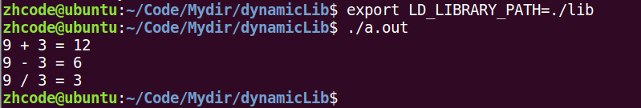

## 动态库加载错误原因及解决方式（续）

**解决方式：**

**【1】通过环境变量（临时生效，终端重启后环境变量失效）：**

```bash
export LD_LIBRARY_PATH=动态库路径
./a.out
```

**【2】永久生效：写入终端配置文件 `.bashrc`，建议使用绝对路径。**

1. 编辑配置文件：

```bash
vi ~/.bashrc
```

2. 写入以下内容并保存：

```bash
export LD_LIBRARY_PATH=动态库路径
```

3. 使配置文件生效：

```bash
. ~/.bashrc
# 或者
source ~/.bashrc
# 或者重启终端
```

4. 执行程序：

```bash
./a.out
```

**【3】拷贝自定义动态库到 `/lib`（标准 C 库所在目录位置）。**

**【4】配置文件法：**

1. 编辑系统配置文件：

```bash
sudo vi /etc/ld.so.conf
```

2. 写入动态库绝对路径并保存。

3. 使配置文件生效：

```bash
sudo ldconfig -v
```

4. 执行程序并使用 `ldd` 查看动态库依赖：

```bash
./a.out
ldd a.out
```

## 扩展讲解——数据段合并

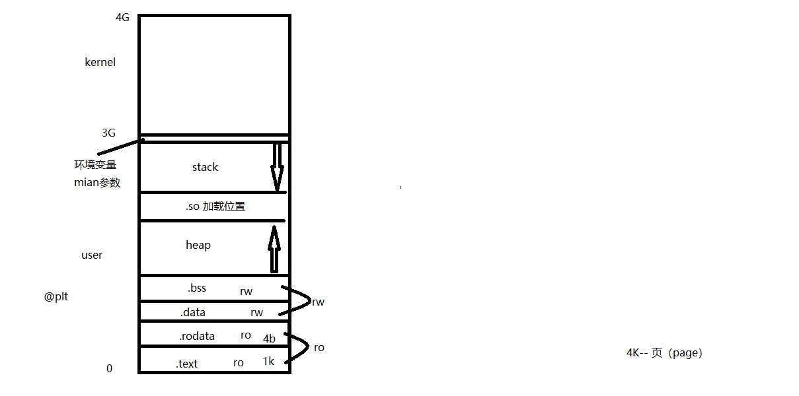

## 总结

**编译流程：** 预处理 -> 编译 -> 汇编 -> 链接。

**常用参数：** `-I`（头文件路径）、`-c`（生成 `.o`）、`-g`（调试信息）、`-Wall`（所有警告）、`-D`（动态宏定义）、`-l`（库名）、`-L`（库路径）。

**静态库：** 命名 `libxxx.a`，用 `ar rcs` 制作，链接时直接编入可执行文件，加载快但占空间。头文件守卫（`#ifndef/#define/#endif`）防止重复包含。

**动态库：** 命名 `libxxx.so`，用 `-fPIC` 生成位置无关代码，`gcc -shared` 制作。多个进程共享，节省内存但加载稍慢。

**动态库加载问题：** 运行时动态链接器找不到 `.so` 文件，解决方式有四种：

1. `export LD_LIBRARY_PATH=路径`（临时）
2. 写入 `~/.bashrc` 永久生效
3. 拷贝到 `/lib`
4. 写入 `/etc/ld.so.conf` 后 `sudo ldconfig -v`
