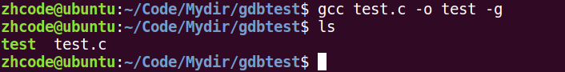
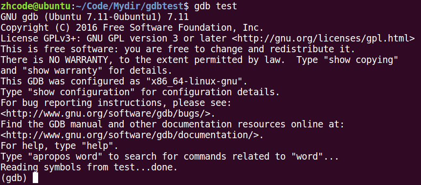
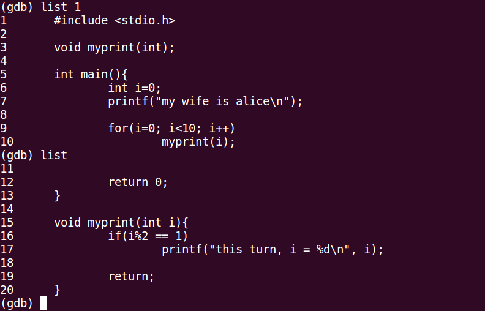
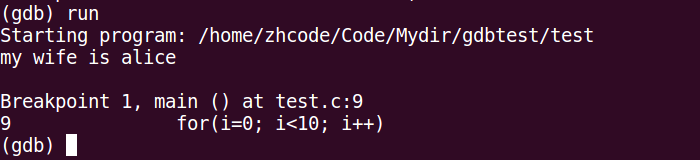
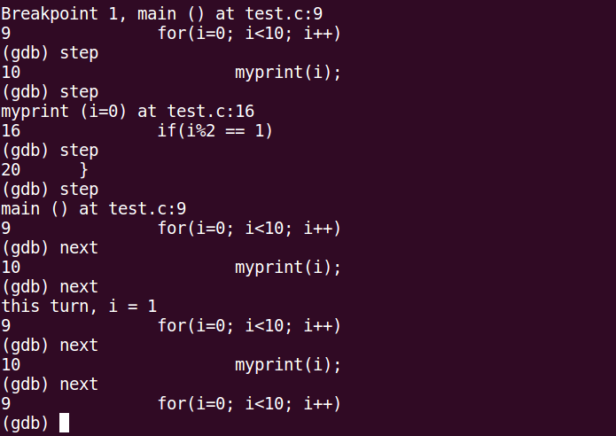
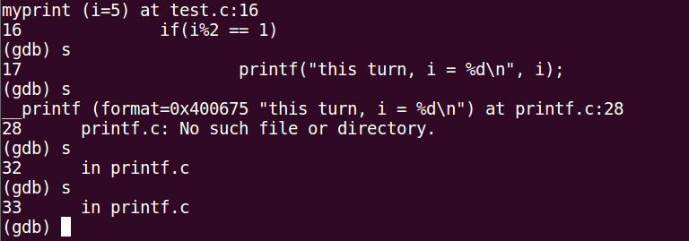
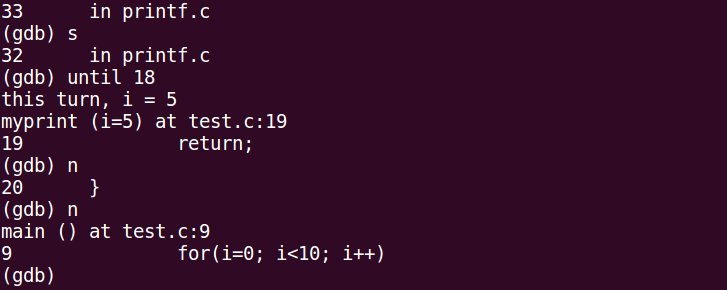
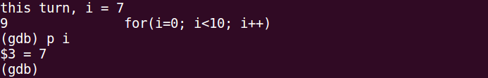
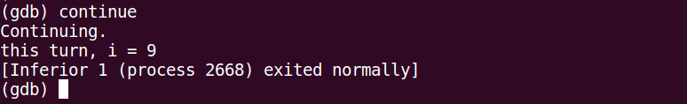

# 第4章 gdb调试

## 目录

- [gdb调试基础指令](#gdb调试基础指令)
  - [基础指令](#基础指令)
  - [其他指令](#其他指令)
  - [编译与调试示例](#编译与调试示例)
  - [调试过程截图](#调试过程截图)
- [gdb常见错误说明](#gdb常见错误说明)

---


## gdb调试基础指令

使用 gdb 之前，要求对文件进行编译时增加 `-g` 参数。加了该参数后生成的编译文件会更大，这是因为增加了 gdb 调试内容。

**大前提**：程序是你自己编写的，用于排查逻辑错误。

### 基础指令

| 指令 | 说明 |
|------|------|
| `-g` | 编译时使用该参数，可生成调试表 |
| `gdb ./a.out` | 启动对可执行文件的调试 |
| `list` / `l` | 列出源码，如 `list 1` 从第1行开始显示，后续输入可继续显示 |
| `break` / `b` | 设置断点，如 `b 20` 在第20行设置断点，断点所在行不会被执行 |
| `run` / `r` | 运行程序 |
| `next` / `n` | 执行下一条指令（不进入函数内部） |
| `step` / `s` | 执行下一条指令（会进入函数内部） |
| `print` / `p` | 查看变量的值，如 `p i` 查看变量 i |
| `continue` | 继续执行到下一个断点或程序结束 |
| `finish` | 结束当前函数调用 |
| `quit` | 退出 gdb 调试 |

**注意事项**：如果是系统函数，按 `s` 会进入其中无法直接退出，此时可使用 `until + 行号` 直接执行到指定行号处。

### 其他指令

| 指令 | 说明 |
|------|------|
| `run` | 使用 run 查找段错误出现位置 |
| `set args` | 设置 main 函数命令行参数（需在 `start`、`run` 之前执行） |
| `run 字串1 字串2 ...` | 设置 main 函数命令行参数 |
| `info b` | 查看断点信息表 |
| `b 20 if i = 5` | 设置条件断点 |
| `ptype` | 查看变量类型 |
| `bt` | 列出当前程序存活着的栈帧 |
| `frame` | 根据栈帧编号切换栈帧 |
| `display` | 设置跟踪变量 |
| `undisplay` | 取消跟踪变量（使用跟踪变量的编号） |

### 编译与调试示例

```bash
gcc gdbtest.c -o a.out -g
gdb test  # 启动对 test 的调试
```

### 调试过程截图




















## gdb常见错误说明

- **没有符号被读取**：编译时没加 `-g` 参数。
- 使用 `file` 命令后跟使用 `-g` 编译的文件，可以不用退出 gdb，直接读取后进行调试。
