# 第5章 makefile

## 目录

- [makefile基础规则](#makefile基础规则)
  - [基本规则](#基本规则)
  - [两个函数](#两个函数)
  - [clean目标](#clean目标)
  - [三个自动变量](#三个自动变量)
  - [模式规则](#模式规则)
  - [静态模式规则](#静态模式规则)
  - [伪目标](#伪目标)
  - [make命令参数](#make命令参数)
  - [第一个版本的Makefile](#第一个版本的makefile)
- [makefile的一个规则](#makefile的一个规则)
  - [关于指定目标](#关于指定目标)
- [午后回顾](#午后回顾)
- [makefile两个函数和clean](#makefile两个函数和clean)
  - [函数说明](#函数说明)
  - [clean规则](#clean规则)
- [makefile三个自动变量和模式规则](#makefile三个自动变量和模式规则)
  - [模拟执行与正式执行](#模拟执行与正式执行)
  - [三个自动变量](#三个自动变量)
  - [模式规则](#模式规则)
  - [静态模式规则](#静态模式规则)
  - [伪目标](#伪目标)
  - [编译参数](#编译参数)
- [习题和作业](#习题和作业)
  - [目录结构](#目录结构)
  - [编写makefile](#编写makefile)
  - [指定makefile文件名](#指定makefile文件名)

---


## makefile基础规则

**makefile**：用于管理项目的构建工具。

**命名**：文件命名为 `makefile` 或 `Makefile`，通过 `make` 命令执行。

### 基本规则

一条规则的基本结构如下：

```makefile
目标: 依赖条件
	命令
```

执行逻辑：
1. 目标的时间戳必须晚于依赖条件的时间戳，否则更新目标。
2. 如果依赖条件不存在，make 会寻找新的规则来生成依赖条件。

**ALL**：用于指定 makefile 的终极目标。

### 两个函数

```makefile
src = $(wildcard ./*.c)
```

匹配当前工作目录下的所有 `.c` 文件，将文件名组成列表赋值给变量 `src`，例如：`src = add.c sub.c div1.c`。

```makefile
obj = $(patsubst %.c, %.o, $(src))
```

将第三个参数中包含第一个参数的部分替换为第二个参数，例如：`obj = add.o sub.o div1.o`。

### clean目标

```makefile
clean:
	-rm -rf $(obj) a.out
```

`clean` 目标没有依赖条件。`rm` 前面的 `-` 表示删除不存在的文件时不报错，确保命令顺序执行完毕。

### 三个自动变量

- `$@`：在规则的命令中，表示规则中的**目标**。
- `$^`：在规则的命令中，表示所有**依赖条件**。
- `$<`：在规则的命令中，表示**第一个依赖条件**。如果将该变量应用在模式规则中，它可将依赖条件列表中的依赖依次取出，套用模式规则。

### 模式规则

```makefile
%.o: %.c
	gcc -c $< -o $@
```

### 静态模式规则

```makefile
$(obj): %.o: %.c
	gcc -c $< -o $@
```

### 伪目标

```makefile
.PHONY: clean ALL
```

### make命令参数

- `-n`：模拟执行 `make` 或 `make clean` 命令，不实际执行。
- `-f`：指定文件执行 `make` 命令，例如 `make -f xxxx.mk`。

### 第一个版本的Makefile

makefile 的依赖关系是从上至下的。目标文件是第一条规则中的目标，如果不满足执行条件，则继续向下执行；如果满足，则不再继续向下。

make 会自动寻找规则中需要的源文件，执行规则下面的命令生成目标。

执行 `make` 指令并运行生成的程序：


## makefile的一个规则

修改 `hello.c` 后，需要进行多文件联合编译：

```bash
gcc hello.c add.c sub.c div1.c -o a.out
```

针对新的代码，编写如下 makefile：


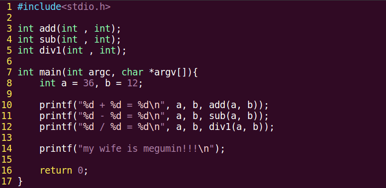

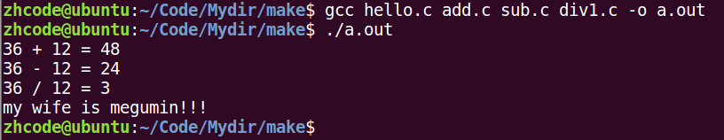


修改 `add.c` 后，使用 `make` 编译会发现问题：只修改了 `add.c`，但其他 `.c` 文件也重新编译了，效率较低。

改进后的 makefile 如下：

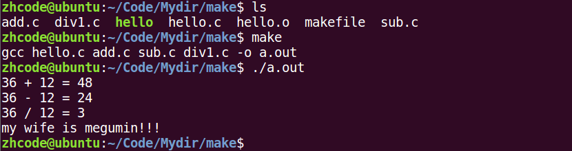


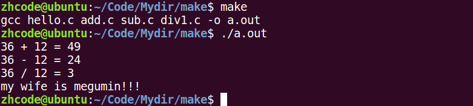

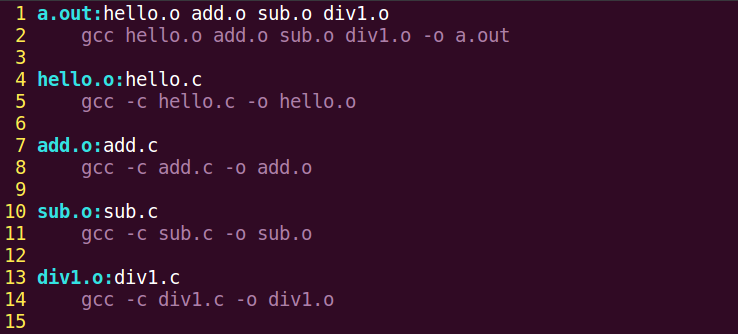

再次执行程序，修改 `sub.c` 后重新 `make`，可以看到只重新编译了修改过的 `sub.c` 和最终目标。

**makefile 检测原理**：修改文件后，文件的修改时间发生变化。当目标文件的时间戳早于依赖文件的时间戳时，该目标会被重新编译。例如修改 `sub.c` 后，`sub.o` 的时间早于 `sub.c`，`a.out` 的时间也早于 `sub.o`，因此这两个文件会重新编译。

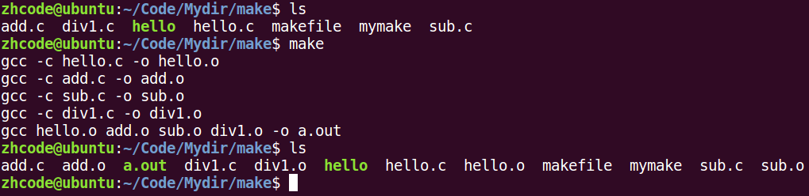

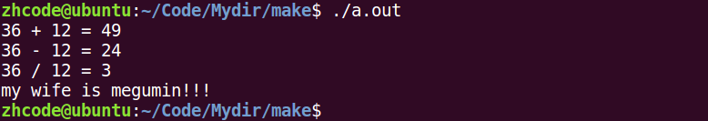

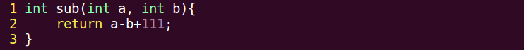

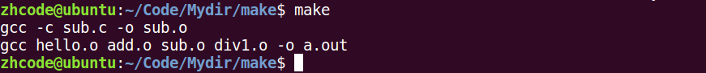

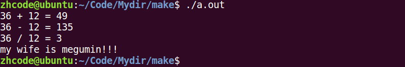

### 关于指定目标

将 `a.out` 放在文件末尾后执行 `make`，会发现默认行为发生变化。这是因为 makefile 默认以第一个目标文件为终极目标，生成后即停止。此时可以使用 `ALL` 来指定终极目标。

指定目标的 makefile 如下：

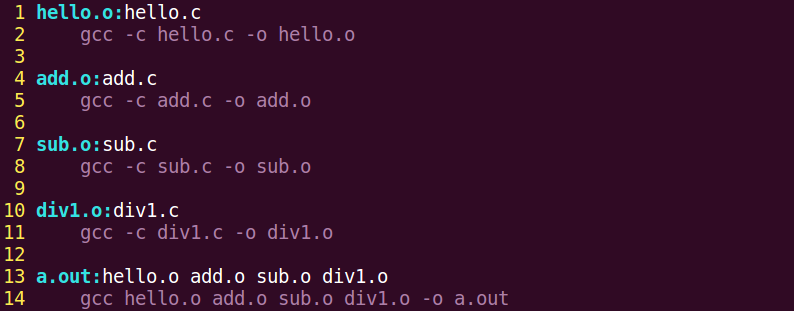

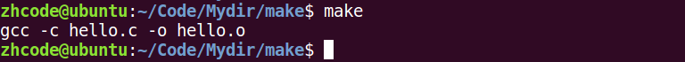

执行结果：

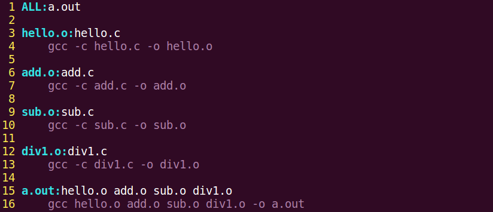

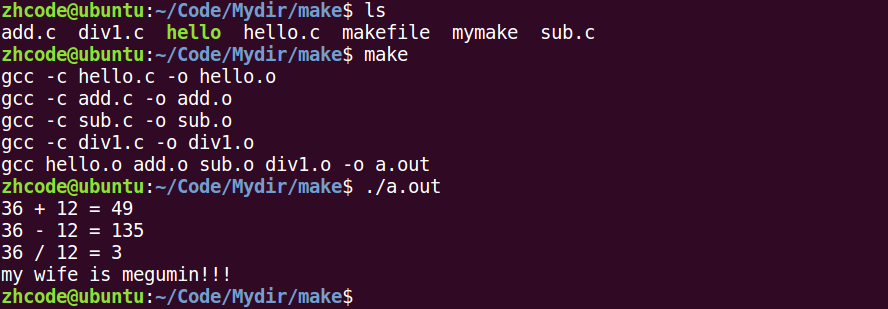


## makefile两个函数和clean

### 函数说明

```makefile
src = $(wildcard *.c)
```

找到当前目录下所有后缀为 `.c` 的文件，赋值给 `src`。

```makefile
obj = $(patsubset %.c, %.o, $(src))
```

把 `src` 变量里所有后缀为 `.c` 的文件替换成 `.o`。

使用这两个函数修改 makefile 如下：

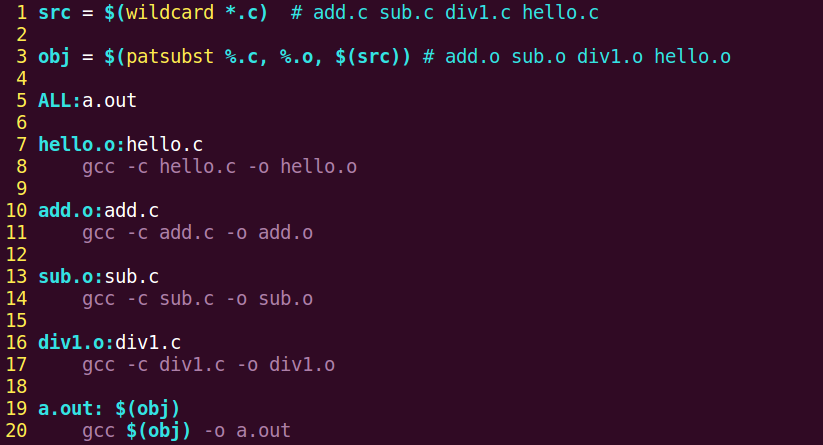

### clean规则

每次手动删除 `.o` 文件较为繁琐，因此在 makefile 中添加 `clean` 规则。`rm` 前面的 `-` 表示即使出错也继续执行。例如待删除的文件集合有 5 个，手动删除 1 个后只剩 4 个，但删除命令仍包含 5 个文件，不加 `-` 就会因文件不存在而报错。

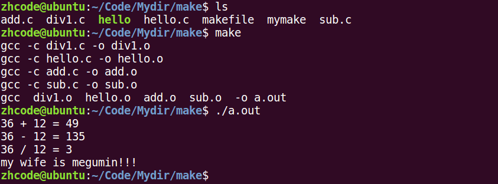

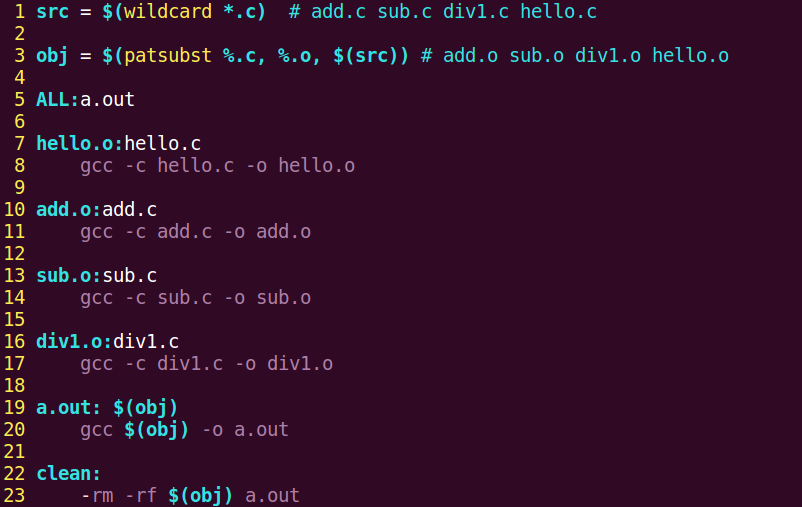


由于没有文件变动，`a.out` 的时间戳晚于所有依赖文件，因此 `make` 不会执行编译。

## makefile三个自动变量和模式规则

### 模拟执行与正式执行

执行时加 `-n` 参数先模拟执行 `clean` 部分，确认会删除哪些文件。确定无误后正式执行。

### 三个自动变量

- `$@`：在规则命令中，表示规则中的**目标**。
- `$<`：在规则命令中，表示规则中的**第一个条件**。如果将该变量用在模式规则中，它可以将依赖条件列表中的依赖依次取出，套用模式规则。
- `$^`：在规则命令中，表示规则中的**所有条件**，组成一个以空格隔开的列表，如果列表中有重复项则去重。

使用自动变量修改 makefile 如下：


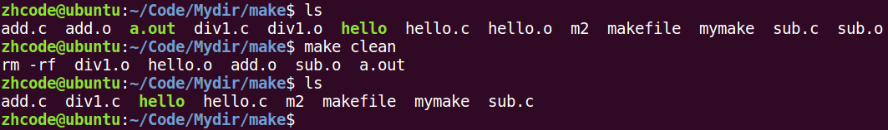

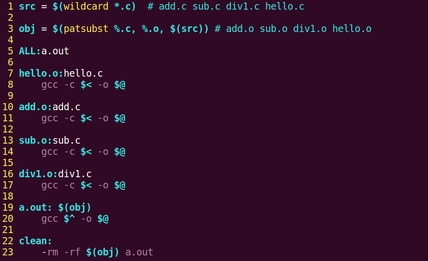

在 `sub`、`add` 等指令中，`$<` 和 `$^` 都能达到效果，但为了配合模式规则，使用 `$<`。

### 模式规则

上述 makefile 的可扩展性较差，例如添加乘法函数时需要在 makefile 中手动增加相应部分。使用模式规则可以解决这个问题：

```makefile
%.o: %.c
	gcc -c $< -o $@
```

修改 makefile 如下并执行：

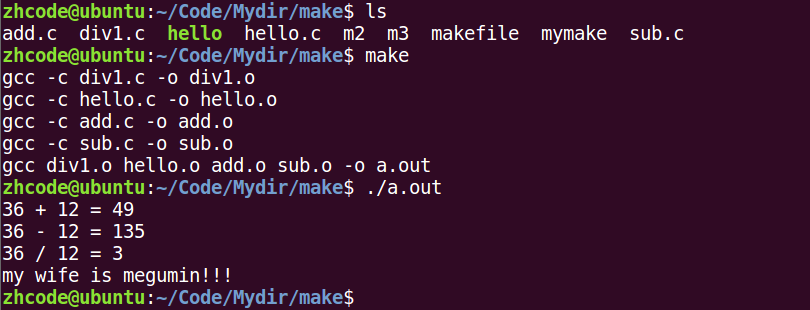

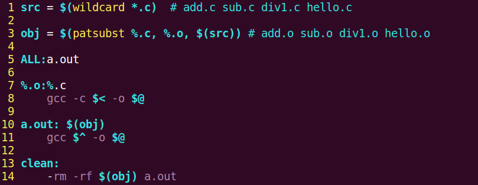

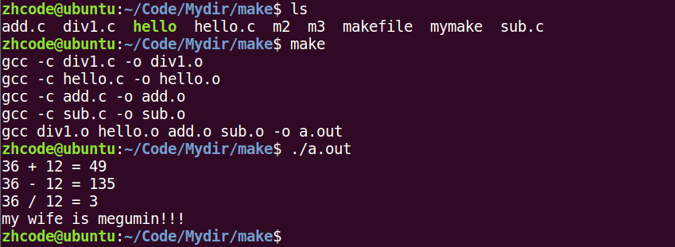

添加 `mul.c` 文件后直接执行 `make`，无需修改 makefile。增加函数时只需添加 `.c` 文件并修改源码即可，扩展性很强。

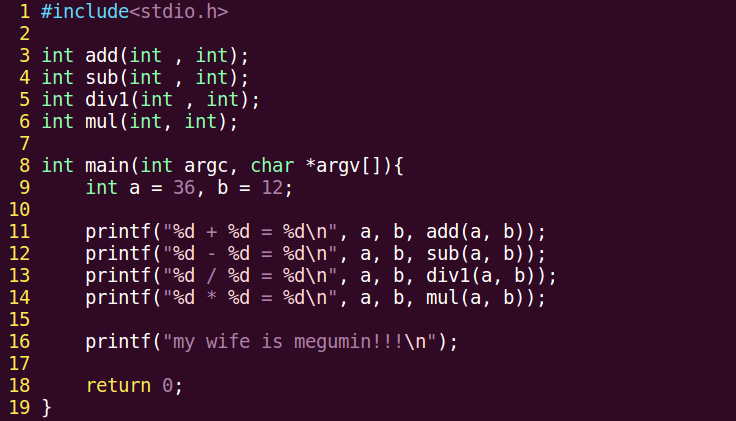

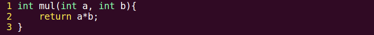

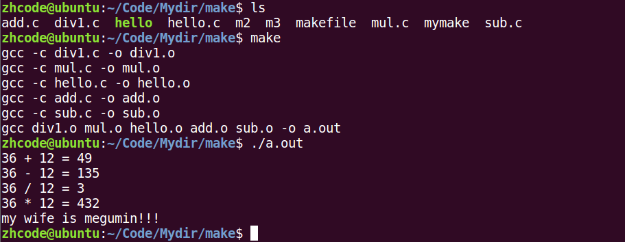

### 静态模式规则

继续优化 makefile，使用静态模式规则指定模式规则的适用范围。当文件集合较多时，需要明确指定哪个文件集合使用什么规则。

```makefile
$(obj): %.o: %.c
	gcc -c $< -o $@
```

### 伪目标

当当前文件夹下存在名为 `ALL` 或 `clean` 的文件时，会导致 makefile 无法正常工作，例如 `make clean` 不会执行清理操作。

使用伪目标解决此问题，添加如下声明：

```makefile
.PHONY: clean ALL
```

再次执行 `make clean` 即可正常工作。

### 编译参数

编译时的参数如 `-g`、`-Wall` 等也可以写在 makefile 中。修改后的 makefile 如下：

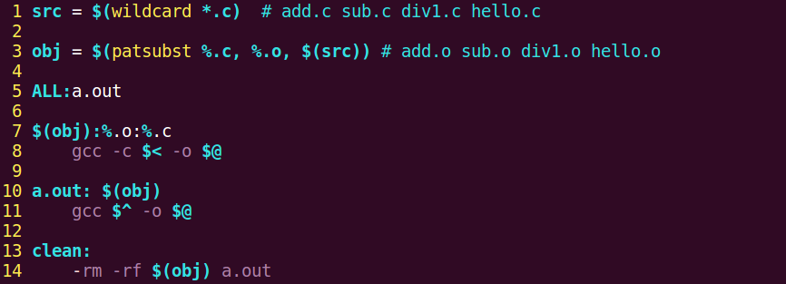

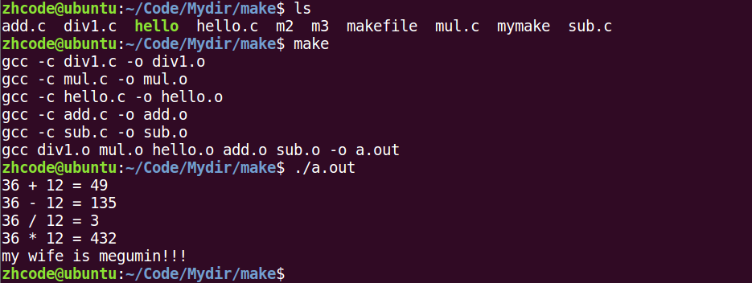

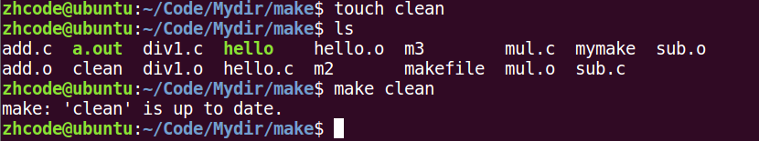

执行结果：

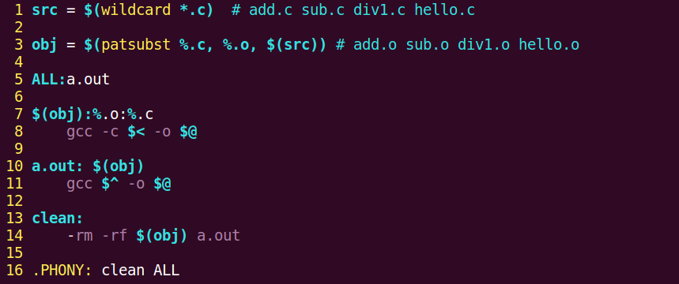

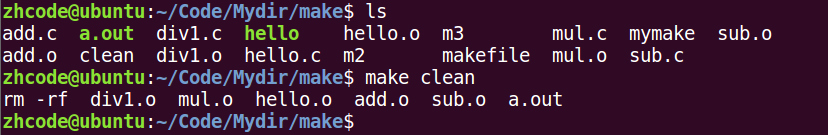

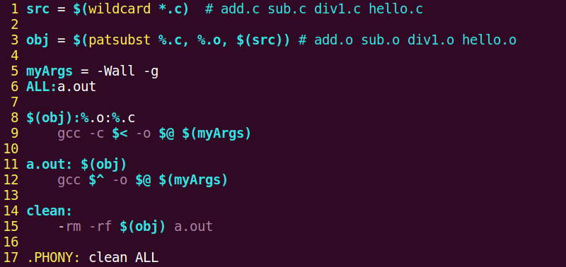

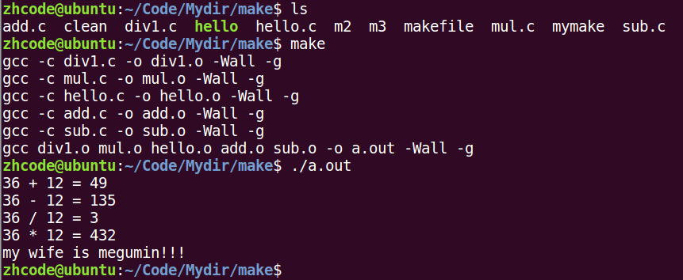


### 目录结构

源码 `add.c`、`sub.c` 在 `src` 目录下，`.o` 文件放在 `obj` 目录下，头文件 `head.h` 在 `inc` 目录下。

首先将 `hello.c` 中的头文件单独提取出来。

### 编写makefile

修改 makefile 如下，注意 `%` 的匹配规则：只匹配文件名，目录位置需要手动添加。


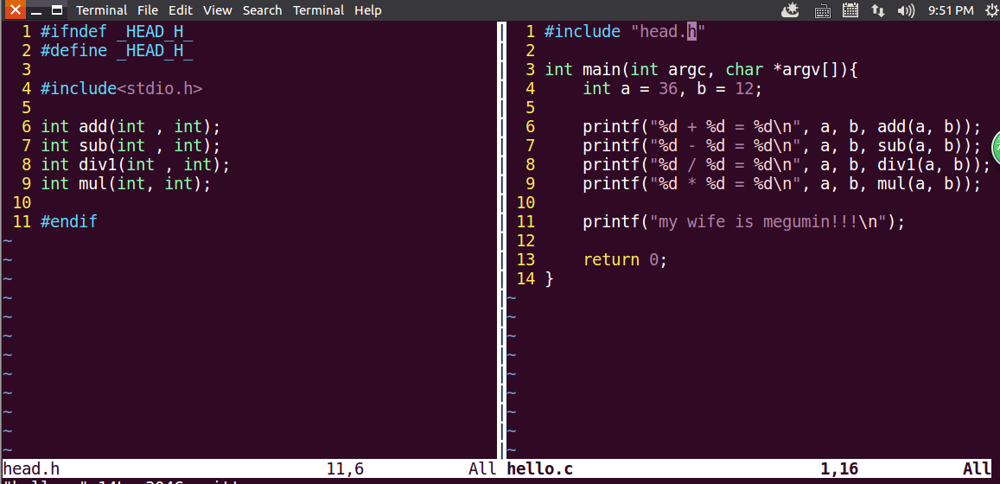

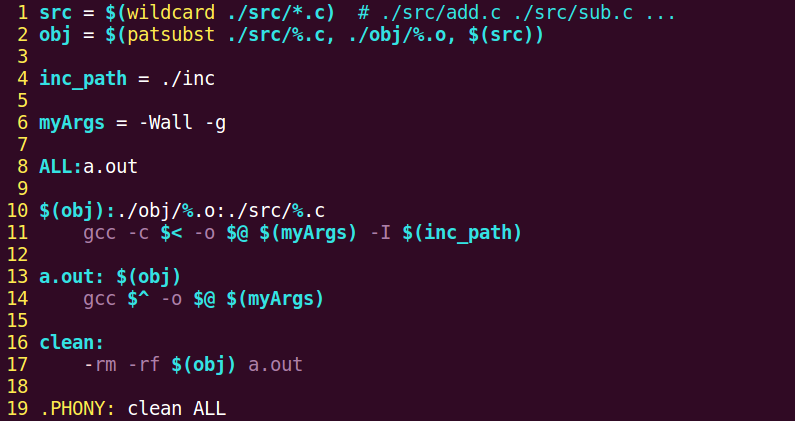

执行结果符合预期。调用 `clean` 删除文件可直接使用。

### 指定makefile文件名

如果 makefile 的文件名发生变化（例如命名为 `m6`），则需要使用 `-f` 参数指定文件：

```bash
make -f m6
```

执行 `clean`：

```bash
make -f m6 clean
```

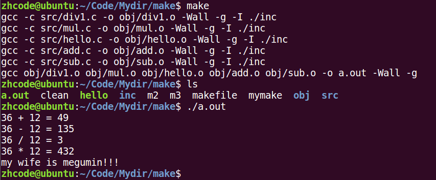

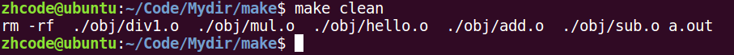
