# 第6章 文件IO

## 目录

- [概述](#概述)
- [open 函数](#open-函数)
  - [两参数版本](#两参数版本)
  - [三参数版本](#三参数版本)
  - [常见错误](#常见错误)
  - [close 函数](#close-函数)

- [read 和 write 实现 cp](#read-和-write-实现-cp)
  - [read 函数](#read-函数)
  - [write 函数](#write-函数)
  - [用 read 和 write 实现文件复制](#用-read-和-write-实现文件复制)
- [系统调用和库函数比较——预读入缓输出](#系统调用和库函数比较预读入缓输出)
- [文件描述符](#文件描述符)
- [阻塞和非阻塞](#阻塞和非阻塞)
  - [阻塞读取示例](#阻塞读取示例)
  - [非阻塞读取示例](#非阻塞读取示例)
- [fcntl 函数](#fcntl-函数)
- [lseek 函数](#lseek-函数)
  - [lseek 示例：写后重新定位读取](#lseek-示例写后重新定位读取)
  - [用 lseek 获取文件大小](#用-lseek-获取文件大小)
  - [用 lseek 扩展文件大小](#用-lseek-扩展文件大小)
- [传入传出参数](#传入传出参数)
- [目录项和 inode](#目录项和-inode)
- [stat 函数](#stat-函数)
  - [stat 函数](#stat-函数-1)
  - [lstat 函数](#lstat-函数)
- [lstat 和 stat 的区别](#lstat-和-stat-的区别)
- [传出参数当返回值](#传出参数当返回值)
- [link 和 unlink——隐式回收](#link-和-unlink隐式回收)
  - [link 函数](#link-函数)
  - [unlink 函数](#unlink-函数)
  - [利用 unlink 避免临时文件残留](#利用-unlink-避免临时文件残留)
  - [隐式回收](#隐式回收)
- [文件与目录的 rwx 权限差异](#文件与目录的-rwx-权限差异)
- [目录操作函数](#目录操作函数)
- [总结](#总结)

---


## 概述

**系统调用**：内核提供的函数。

**库调用**：程序库中的函数。

## open 函数

`open` 函数有两个版本，定义在 `<fcntl.h>` 中。

### 两参数版本

```c
int open(const char *pathname, int flags);
```

**参数：**
- `pathname`：欲打开的文件路径名
- `flags`：文件打开方式，取值为以下常量的组合（按位或）：
  - `O_RDONLY`：只读
  - `O_WRONLY`：只写
  - `O_RDWR`：读写
  - `O_CREAT`：文件不存在时创建
  - `O_APPEND`：追加模式
  - `O_TRUNC`：截断文件为零长度
  - `O_EXCL`：与 `O_CREAT` 配合使用，文件必须不存在
  - `O_NONBLOCK`：非阻塞模式

**返回值：**
- 成功：返回文件描述符（非负整数）
- 失败：返回 `-1`，并设置 `errno`

### 三参数版本

```c
int open(const char *pathname, int flags, mode_t mode);
```

当 `flags` 中指定了 `O_CREAT` 时，需要提供第三个参数 `mode`，取值为八进制数，用于描述文件的访问权限（如 `0664`）。

创建文件的最终权限计算公式：

```
最终权限 = mode & ~umask
```

**返回值：**
- 成功：返回文件描述符（非负整数）
- 失败：返回 `-1`，并设置 `errno`

### 常见错误

1. 打开的文件不存在
2. 以写方式打开只读文件（权限问题）
3. 以只写方式打开目录

当 `open` 出错时，程序会自动设置 `errno`，可通过 `strerror(errno)` 查看错误描述。

以打开不存在的文件为例：

执行该代码，结果如下：

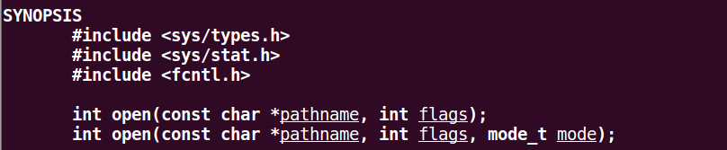

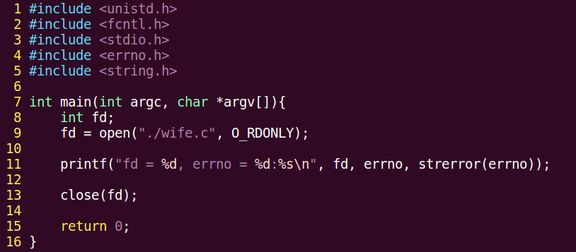


### close 函数

```c
#include <unistd.h>
int close(int fd);
```


## read 和 write 实现 cp

### read 函数

```c
ssize_t read(int fd, void *buf, size_t count);
```

**参数：**
- `fd`：文件描述符
- `buf`：存放读取数据的缓冲区
- `count`：缓冲区大小（字节数）

**返回值：**
- `0`：读到文件末尾（EOF）
- 大于 `0`：成功读取的字节数
- `-1`：失败，设置 `errno`
  - 若 `errno` 为 `EAGAIN` 或 `EWOULDBLOCK`，说明并非 `read` 失败，而是以非阻塞方式读取设备文件（或网络文件）时无数据可读

### write 函数

```c
ssize_t write(int fd, const void *buf, size_t count);
```

**参数：**
- `fd`：文件描述符
- `buf`：待写入数据的缓冲区
- `count`：数据大小（字节数）

**返回值：**
- 成功：返回写入的字节数
- 失败：返回 `-1`，设置 `errno`

### 用 read 和 write 实现文件复制

编译并复制文件：

可以在复制函数中加入错误检测：

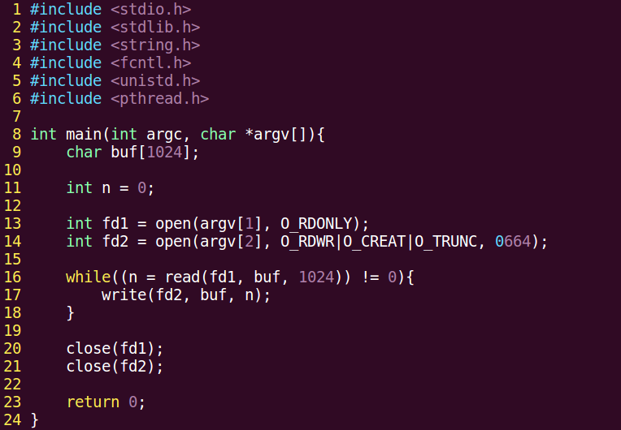


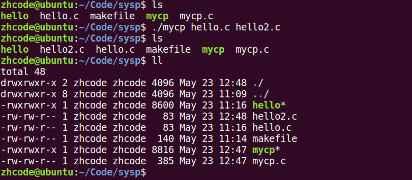

```c
if(fd == -1){
    perror("open argv[1] error");
    exit(1);
}
```

**错误处理函数（与 `errno` 相关）：**

```c
printf("xxx error: %d\n", errno);

char *strerror(int errnum);
printf("xxx error: %s\n", strerror(errno));

void perror(const char *s);
perror("open error");
```

用 `read`/`write` 实现的复制与 `fgetc`/`fputc` 实现的复制对比见下节。

## 系统调用和库函数比较——预读入缓输出

下面编写两个文件复制函数，一个用 `read`/`write` 实现，一个用 `fputc`/`fgetc` 实现，比较速度。

首先是 `fputc`/`fgetc` 版本：

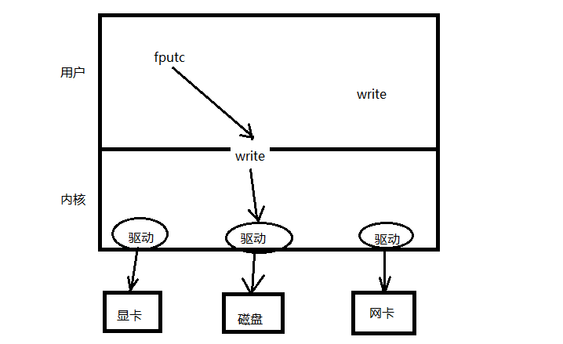

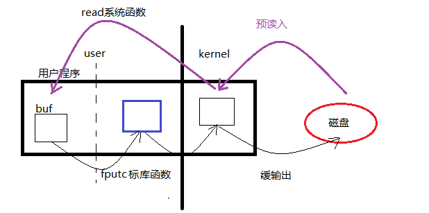

编译运行后，文件复制很快就完成了。

下面修改 `read` 版本的缓冲区，使其一次只复制一个字符：

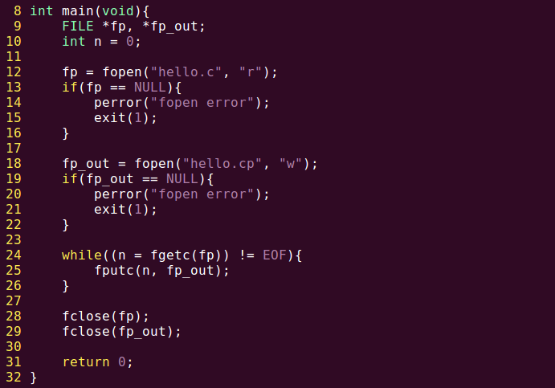


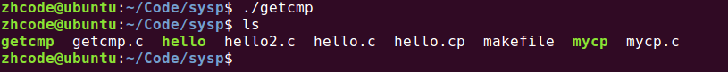

运行后速度明显缓慢。

**原因分析：**

`read`/`write` 每次读写一个字节时，会频繁进行内核态和用户态的切换，因此非常耗时。而 `fgetc`/`fputc` 内部有用户缓冲区（通常为 4096 字节），并非逐字节读写，内核态与用户态的切换次数大大减少。

这就是**预读入缓输出**机制。

因此系统调用并非一定优于库函数。在适用库函数的场景下，应优先使用库函数。标准 I/O 函数自带用户级缓冲区，系统调用则无用户级缓冲。内核级缓冲区两者都有。

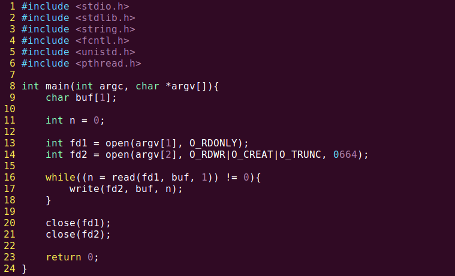

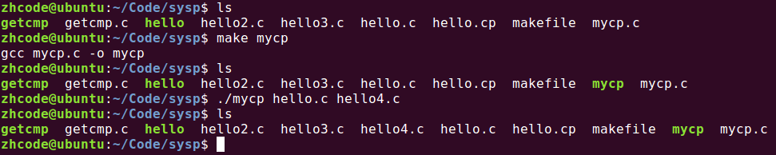

## 文件描述符

文件描述符是一个非负整数，本质上是进程文件描述符表的索引（下标），内核通过它找到对应的文件结构体。

**PCB（进程控制块）**：本质是结构体，其成员之一为**文件描述符表**。

文件描述符范围：`0` ~ `1023`，分配时取表中可用的最小值。

| 文件描述符 | 宏定义 | 说明 |
|-----------|--------|------|
| `0` | `STDIN_FILENO` | 标准输入 |
| `1` | `STDOUT_FILENO` | 标准输出 |
| `2` | `STDERR_FILENO` | 标准错误 |

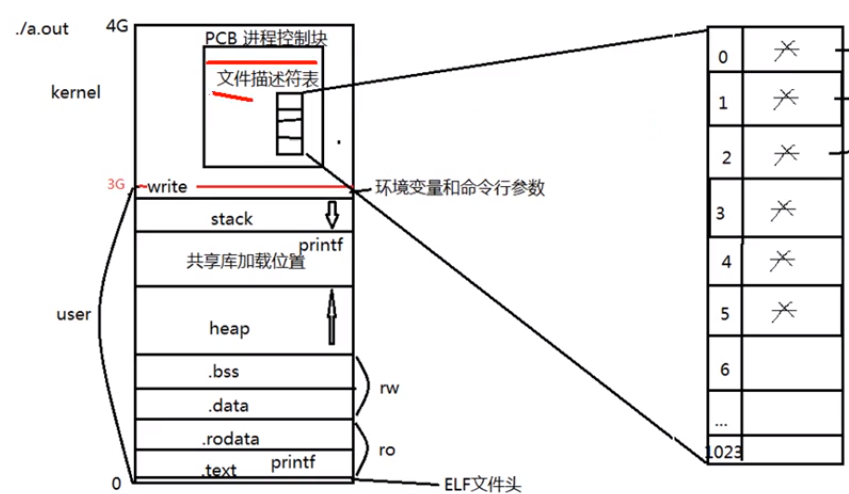

## 阻塞和非阻塞

阻塞与非阻塞是设备文件、网络文件的属性。

产生阻塞的场景：读设备文件、读网络文件。读常规文件无阻塞概念。

`/dev/tty` 是终端文件。以下调用将其设置为非阻塞状态（默认为阻塞状态）：

```c
open("/dev/tty", O_RDWR | O_NONBLOCK);
```

### 阻塞读取示例

一个从标准输入读取并写到标准输出的例子：执行程序后，会发现程序在阻塞等待输入。

### 非阻塞读取示例

下面是一段将终端设置为非阻塞读取的代码：

```c
#include <unistd.h>
#include <fcntl.h>
#include <stdlib.h>
#include <stdio.h>
#include <errno.h>
#include <string.h>

#define MSG_TRY "try again\n"
#define MSG_TIMEOUT "time out\n"

int main(void)
{
    char buf[10];
    int fd, n, i;

    fd = open("/dev/tty", O_RDONLY | O_NONBLOCK);
    if(fd < 0){
        perror("open /dev/tty");
        exit(1);
    }
    printf("open /dev/tty ok... %d\n", fd);

    for (i = 0; i < 5; i++){
        n = read(fd, buf, 10);
        if (n > 0) {                    // 读到数据
            break;
        }
        if (errno != EAGAIN) {          // EWOULDBLOCK
            perror("read /dev/tty");
            exit(1);
        } else {
            write(STDOUT_FILENO, MSG_TRY, strlen(MSG_TRY));
            sleep(2);
        }
    }

    if (i == 5) {
        write(STDOUT_FILENO, MSG_TIMEOUT, strlen(MSG_TIMEOUT));
    } else {
        write(STDOUT_FILENO, buf, n);
    }

    close(fd);

    return 0;
}
```

执行结果如下：

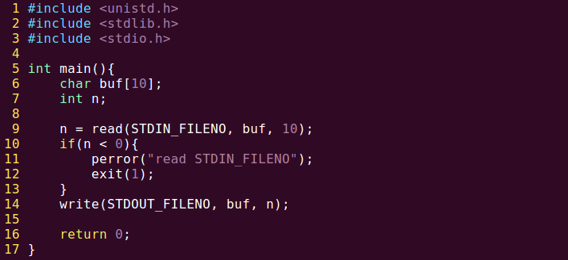


## fcntl 函数

`fcntl` 用于改变一个**已经打开**的文件的访问控制属性。重点掌握 `F_GETFL` 和 `F_SETFL` 两个命令。

```c
int fcntl(int fd, int cmd, ...);
```

**参数：**
- `fd`：文件描述符
- `cmd`：命令，决定了后续参数的个数

常用操作：

```c
int flags = fcntl(fd, F_GETFL);    // 获取文件状态标志
flags |= O_NONBLOCK;               // 添加非阻塞标志
fcntl(fd, F_SETFL, flags);         // 设置文件状态标志
```

- `F_GETFL`：获取文件状态标志
- `F_SETFL`：设置文件状态标志

终端文件默认是阻塞读的，下面用 `fcntl` 将其更改为非阻塞读：

```c
#include <unistd.h>
#include <fcntl.h>
#include <errno.h>
#include <stdio.h>
#include <stdlib.h>
#include <string.h>

#define MSG_TRY "try again\n"

int main(void)
{
    char buf[10];
    int flags, n;

    flags = fcntl(STDIN_FILENO, F_GETFL);   // 获取 stdin 属性信息
    if(flags == -1){
        perror("fcntl error");
        exit(1);
    }
    flags |= O_NONBLOCK;
    int ret = fcntl(STDIN_FILENO, F_SETFL, flags);
    if(ret == -1){
        perror("fcntl error");
        exit(1);
    }

tryagain:
    n = read(STDIN_FILENO, buf, 10);
    if(n < 0){
        if(errno != EAGAIN){
            perror("read /dev/tty");
            exit(1);
        }
        sleep(3);
        write(STDOUT_FILENO, MSG_TRY, strlen(MSG_TRY));
        goto tryagain;
    }
    write(STDOUT_FILENO, buf, n);

    return 0;
}
```

编译运行，结果如下——为非阻塞读取：


## lseek 函数

```c
off_t lseek(int fd, off_t offset, int whence);
```

**参数：**
- `fd`：文件描述符
- `offset`：偏移量，即将读写指针从 `whence` 指定的位置向后偏移 `offset` 个字节
- `whence`：起始偏移位置，取值为 `SEEK_SET`、`SEEK_CUR`、`SEEK_END`

**返回值：**
- 成功：返回从文件起始位置到当前偏移位置的字节数
- 失败：返回 `-1`，设置 `errno`

**应用场景：**

1. 文件的"读"和"写"共用同一偏移位置
2. 使用 `lseek` 获取文件大小
3. 使用 `lseek` 扩展文件大小——要想使文件大小真正扩展，必须引起 I/O 操作

也可使用 `truncate` 函数直接扩展文件：

```c
int ret = truncate("dict.cp", 250);
```

### lseek 示例：写后重新定位读取

向空白文件写入内容后，调整读写指针位置，再读取刚写入的内容。如果不调整指针位置，将读取不到内容，因为读写指针此时位于文件末尾。

```c
#include <stdio.h>
#include <stdlib.h>
#include <unistd.h>
#include <string.h>
#include <fcntl.h>

int main(void)
{
    int fd, n;
    char msg[] = "It's a test for lseek\n";
    char ch;

    fd = open("lseek.txt", O_RDWR | O_CREAT, 0644);
    if(fd < 0){
        perror("open lseek.txt error");
        exit(1);
    }

    write(fd, msg, strlen(msg));    // 写入后，读写指针位于文件末尾

    lseek(fd, 0, SEEK_SET);         // 将读写指针移回文件开头

    while((n = read(fd, &ch, 1))){
        if(n < 0){
            perror("read error");
            exit(1);
        }
        write(STDOUT_FILENO, &ch, n);   // 按字节读出并输出到屏幕
    }

    close(fd);

    return 0;
}
```

编译运行，结果如图：


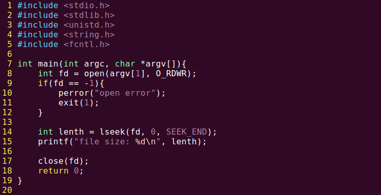

### 用 lseek 获取文件大小

编译执行，结果如下，没有问题：


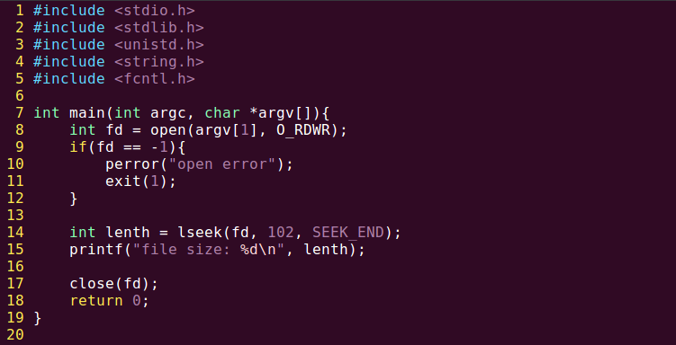

### 用 lseek 扩展文件大小

下面使用 `lseek` 将 `fcntl.c` 原本的 698 字节扩展为 800 字节（差值 102 字节）。

编译执行后，用 `ls` 命令查看 `fcntl.c`，发现文件大小并非 800。

原因是：要使文件大小真正扩展，必须引起 I/O 操作（至少写入一个字节）。

修改后的扩展文件代码如下：

编译运行后，打开 `fcntl.c` 查看，文件大小正确。


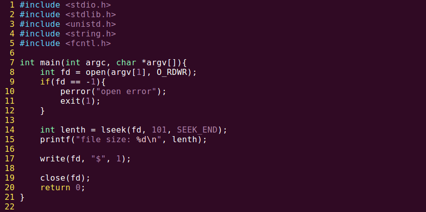


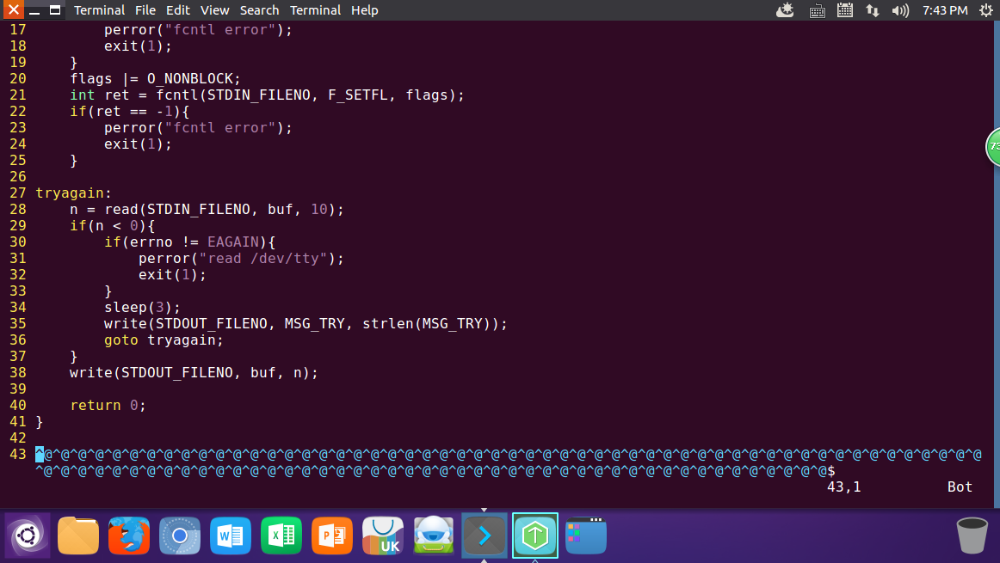

**小结：**

对于写文件再读取的例子，由于文件写完后未关闭，读写指针在文件末尾，因此不调节指针则无法读取到内容。

`lseek` 返回的偏移量总是相对于文件开头计算。用 `lseek` 获取文件大小，实际利用的是读写指针初末位置的偏移差。新打开的文件，读写指针位于文件开头。若用 `lseek` 扩展文件大小，必须引起 I/O 操作，因此至少需要写入一个字节。代码中 `lseek` 返回 799 而 `ls` 显示 800 的原因是：`lseek` 读取偏移差时，尚未写入最后的 `$` 符号。

末尾的 `^@` 是文件空洞。若希望填充内容保持整齐，可写入 `"\0"`。

扩展文件更简便的方式是直接使用 `truncate`：

```c
int ret = truncate("dict.cp", 250);
```

## 传入传出参数

**传入参数：**

1. 指针作为函数参数
2. 通常有 `const` 关键字修饰
3. 指针指向有效区域，在函数内部做读操作

**传出参数：**

1. 指针作为函数参数
2. 在函数调用之前，指针指向的空间可以无意义，但必须有效
3. 在函数内部做写操作
4. 函数调用结束后，充当函数返回值

**传入传出参数：**

1. 指针作为函数参数
2. 在函数调用之前，指针指向的空间有实际意义
3. 在函数内部，先做读操作，后做写操作
4. 函数调用结束后，充当函数返回值

## 目录项和 inode

一个文件主要由两部分组成：**dentry**（目录项）和 **inode**。

**inode** 本质是结构体，存储文件的属性信息，如：权限、类型、大小、时间、用户、盘块位置等。也称为文件属性管理结构，大多数 inode 存储在磁盘上。少量常用或近期使用的 inode 会被缓存到内存中。

所谓删除文件，即删除其 inode，但数据仍保留在硬盘上，后续会被覆盖。

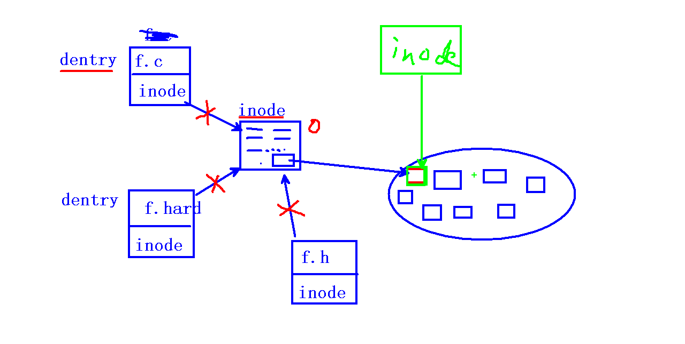

## stat 函数

获取文件属性（从 inode 结构体中获取）。

### stat 函数

```c
#include <sys/types.h>
#include <sys/stat.h>
#include <unistd.h>

int stat(const char *path, struct stat *buf);
```

**参数：**
- `path`：文件路径
- `buf`：传出参数，存放文件属性的 `struct stat` 结构体指针

**返回值：**
- 成功：返回 `0`
- 失败：返回 `-1`，设置 `errno`

常用成员：
- `buf.st_size`：获取文件大小
- `buf.st_mode`：获取文件类型和权限

### lstat 函数

```c
int lstat(const char *path, struct stat *buf);
```

`stat` 会穿透符号链接（即获取链接指向文件的属性），`lstat` 不会穿透符号链接（获取链接本身的属性）。

下面用 `stat` 获取文件大小：

编译运行并查看 `mystat.c` 文件的大小：

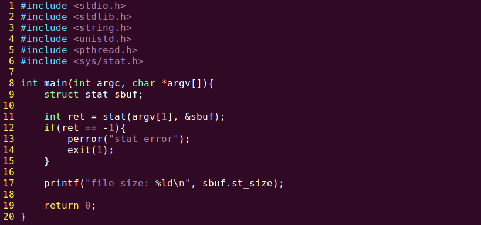


## lstat 和 stat 的区别

用 `stat` 查看文件类型的代码如下：

编译运行，查看 `mystat.c` 文件：`stat` 会获取符号链接指向的文件或目录的属性。若不想穿透符号链接，应使用 `lstat`。

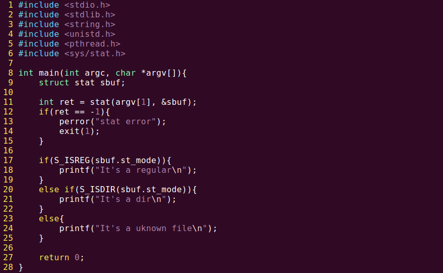


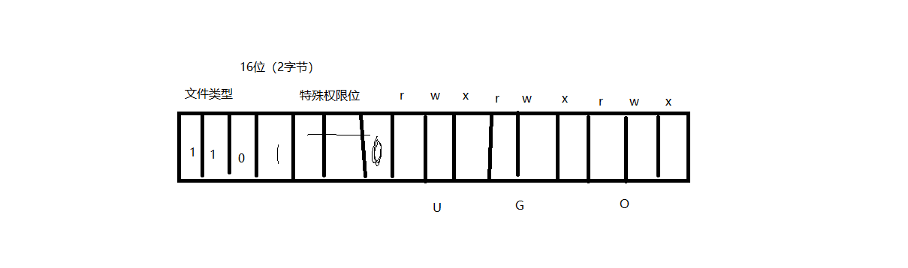

## 传出参数当返回值

传出参数在函数中被修改后，其值可以传出给调用者。传出参数的数量不受限制，比单纯的返回值更灵活。

## link 和 unlink——隐式回收

**硬链接数**即 dentry 数目。

### link 函数

```c
int link(const char *oldpath, const char *newpath);
```

`link` 用于创建硬链接。可用其实现 `mv` 命令：用 `oldpath` 创建 `newpath`，然后删除 `oldpath`。

### unlink 函数

```c
int unlink(const char *pathname);
```

`unlink` 用于删除一个文件的目录项（dentry），使硬链接数减 1。

**unlink 的特性：** 清除文件时，如果文件的硬链接数降为 0（无 dentry 对应），该文件仍不会立即被释放。需等到所有打开该文件的进程关闭文件后，系统才会在适当时机释放文件。

以下代码验证 `unlink` 删除的是 dentry：

```c
/*
 * unlink 函数删除的是 dentry
 */
#include <unistd.h>
#include <fcntl.h>
#include <stdlib.h>
#include <string.h>
#include <stdio.h>

int main(void)
{
    int fd, ret;
    char *p = "test of unlink\n";
    char *p2 = "after write something.\n";

    fd = open("temp.txt", O_RDWR | O_CREAT | O_TRUNC, 0644);
    if(fd < 0){
        perror("open temp error");
        exit(1);
    }

    ret = write(fd, p, strlen(p));
    if (ret == -1) {
        perror("-----write error");
    }

    printf("hi! I'm printf\n");

    ret = write(fd, p2, strlen(p2));
    if (ret == -1) {
        perror("-----write error");
    }

    printf("Enter anykey continue\n");
    getchar();

    ret = unlink("temp.txt");        // 具备了被释放的条件
    if(ret < 0){
        perror("unlink error");
        exit(1);
    }

    close(fd);

    return 0;
}
```

编译并运行，程序阻塞。此时打开新终端查看临时文件 `temp.txt`，可以看到临时文件并未被删除，因为当前进程尚未结束。输入字符使当前进程结束后，`temp.txt` 即被删除。

### 利用 unlink 避免临时文件残留

下面在程序中引入段错误（在 `unlink` 之前），由于段错误导致后续删除 `temp.txt` 的代码不会执行，`temp.txt` 将被保留——这是不合理的。

解决办法：检测 `fd` 有效性后，立即调用 `unlink` 释放 `temp.txt`。由于进程未结束，虽然 `temp.txt` 的硬链接数已降为 0，但文件不会立即释放，仍然存在。待程序执行完毕后文件才会被释放。这样就能避免因程序出错导致临时文件残留。

原理：文件创建后立即 `unlink` 使硬链接数降为 0，即使程序异常退出，该文件也会被清理。此时文件内容写在内核空间的缓冲区中。

修改后的代码如下：

```c
/*
 * unlink 函数删除的是 dentry
 */
#include <unistd.h>
#include <fcntl.h>
#include <stdlib.h>
#include <string.h>
#include <stdio.h>

int main(void)
{
    int fd, ret;
    char *p = "test of unlink\n";
    char *p2 = "after write something.\n";

    fd = open("temp.txt", O_RDWR | O_CREAT | O_TRUNC, 0644);
    if(fd < 0){
        perror("open temp error");
        exit(1);
    }

    ret = unlink("temp.txt");        // 具备了被释放的条件
    if(ret < 0){
        perror("unlink error");
        exit(1);
    }

    ret = write(fd, p, strlen(p));
    if (ret == -1) {
        perror("-----write error");
    }

    printf("hi! I'm printf\n");

    ret = write(fd, p2, strlen(p2));
    if (ret == -1) {
        perror("-----write error");
    }

    printf("Enter anykey continue\n");
    getchar();

    close(fd);

    return 0;
}
```

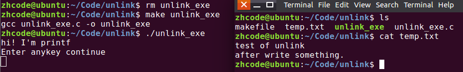


### 隐式回收

**隐式回收**：当进程结束运行时，所有被该进程打开的文件会被关闭，申请的内存空间会被释放。系统的这一特性称为隐式回收系统资源。

例如上面的程序，若未在程序中关闭文件描述符，没有隐式回收机制的话，该文件描述符会一直保留，多次出现这种情况会导致系统文件描述符耗尽。隐式回收会在程序结束时自动收回其打开的文件所占用的文件描述符。

## 文件与目录的 rwx 权限差异

使用 `vi` 打开目录，会得到目录项的列表。

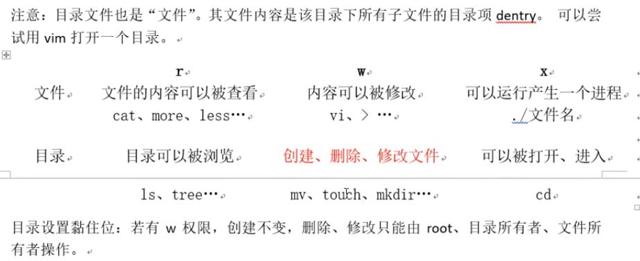

## 目录操作函数

```c
#include <dirent.h>

DIR *opendir(const char *name);
int closedir(DIR *dp);
struct dirent *readdir(DIR *dp);
```

`struct dirent` 结构体定义：

```c
struct dirent {
    ino_t d_ino;               // inode 编号
    char  d_name[256];         // 文件名
};
```

目录没有写操作，因为目录的写操作即创建文件（可使用 `touch` 命令）。

以下用目录操作函数实现 `ls` 功能：

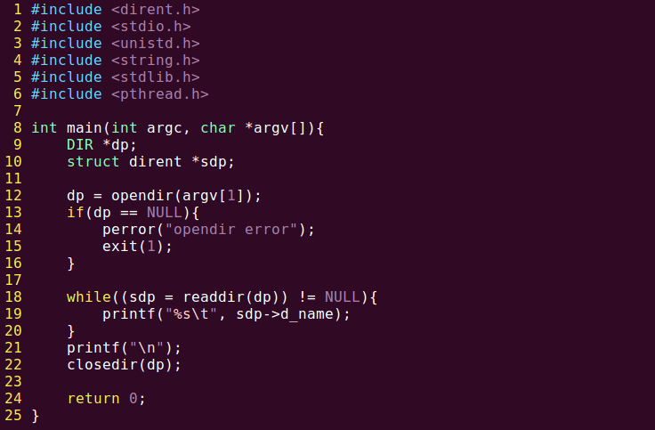

编译执行如下。若要隐藏 `.` 和 `..`，在输出文件名时进行判定，只输出非 `.` 和 `..` 的文件名即可。


## 总结

本章核心函数速查表：

| 函数 | 头文件 | 功能要点 |
|------|--------|----------|
| `open` | `<fcntl.h>` | 打开/创建文件，返回文件描述符；权限 = `mode & ~umask` |
| `close` | `<unistd.h>` | 关闭文件描述符 |
| `read` | `<unistd.h>` | 从 fd 读数据，返回读取字节数（0 表示 EOF） |
| `write` | `<unistd.h>` | 向 fd 写数据，返回写入字节数 |
| `lseek` | `<unistd.h>` | 移动读写指针，可用于获取/扩展文件大小 |
| `fcntl` | `<fcntl.h>` | 修改已打开文件的属性（如添加 `O_NONBLOCK`） |
| `stat`/`lstat` | `<sys/stat.h>` | 获取文件属性；`stat` 穿透符号链接，`lstat` 不穿透 |
| `link`/`unlink` | `<unistd.h>` | 创建硬链接 / 删除目录项（dentry） |
| `truncate` | `<unistd.h>` | 直接扩展或截断文件到指定大小 |
| `opendir`/`readdir`/`closedir` | `<dirent.h>` | 目录操作三件套 |

**关键概念回顾：**

- **文件描述符**：非负整数，是进程文件描述符表的索引；`0/1/2` 分别对应标准输入/输出/错误
- **预读入缓输出**：库函数（`fgetc`/`fputc`）自带用户缓冲区，比逐字节 `read`/`write` 快得多
- **阻塞与非阻塞**：设备文件/网络文件的属性，可通过 `O_NONBLOCK` 标志或 `fcntl` 切换
- **传入/传出参数**：传入参数用 `const` 修饰只读；传出参数在函数内写入后充当返回值
- **inode 与 dentry**：inode 存储文件属性，dentry（目录项）是文件名到 inode 的映射
- **隐式回收**：进程结束时，内核自动关闭其打开的文件、释放其申请的内存
- **unlink 临时文件技巧**：创建文件后立即 `unlink`，即使程序异常退出也不会残留临时文件
