# 第7章 目录操作与递归遍历

## 目录

- [复习](#复习)
- [递归遍历目录思路分析](#递归遍历目录思路分析)
- [递归遍历目录代码预览](#递归遍历目录代码预览)
- [递归遍历目录实现](#递归遍历目录实现)
- [递归遍历目录总结](#递归遍历目录总结)
- [dup 和 dup2](#dup-和-dup2)
  - [`dup`](#dup)
  - [`dup2`](#dup2)
- [fcntl 实现 dup 描述符](#fcntl-实现-dup-描述符)

---


## 复习

应用程序的系统调用过程：

应用程序 -> 标准库函数 -> 系统调用 -> 驱动 -> 硬件

## 递归遍历目录思路分析

**任务需求**：使用 `opendir`、`closedir`、`readdir`、`stat` 实现一个递归遍历目录的程序。输入一个指定目录，默认为当前目录。递归列出目录中的文件，同时显示文件大小。

**思路分析**（递归遍历目录：`ls-R.c`）

1. 判断命令行参数，获取用户要查询的目录名。`int argc, char *argv[]`

    `argc == 1` --> `./`

2. 判断用户指定的是否是目录。`stat` + `S_ISDIR()` --> 封装函数 `isFile()`

3. 读目录：`read_dir()`

    ```c
    opendir(dir);

    while (readdir()) {
        // 普通文件，直接打印
        // 目录：
        // 拼接目录访问绝对路径
        sprintf(path, "%s/%s", dir, d_name);
        // 递归调用自己
        opendir(path);
        readdir();
        closedir();
    }

    closedir();
    ```

    调用链：`read_dir()` --> `isFile()` --> `read_dir()`

## 递归遍历目录代码预览

```c
#include <stdio.h>
#include <stdlib.h>
#include <string.h>
#include <unistd.h>
#include <sys/stat.h>
#include <dirent.h>
#include <pthread.h>

void isFile(char *name);

// 打开目录读取,处理目录
void read_dir(char *dir, void (*func)(char *))
{
    char path[256];
    DIR *dp;
    struct dirent *sdp;

    dp = opendir(dir);
    if (dp == NULL) {
        perror("opendir error");
        return;
    }
    // 读取目录项
    while ((sdp = readdir(dp)) != NULL) {
        if (strcmp(sdp->d_name, ".") == 0 || strcmp(sdp->d_name, "..") == 0) {
            continue;
        }
        // 目录项本身不可访问, 拼接: 目录/目录项
        sprintf(path, "%s/%s", dir, sdp->d_name);

        // 判断文件类型,目录递归进入,文件显示名字/大小
        (*func)(path);
    }

    closedir(dp);

    return;
}

void isFile(char *name)
{
    int ret = 0;
    struct stat sb;

    // 获取文件属性, 判断文件类型
    ret = stat(name, &sb);
    if (ret == -1) {
        perror("stat error");
        return;
    }
    // 是目录文件
    if (S_ISDIR(sb.st_mode)) {
        read_dir(name, isFile);
    }
    // 是普通文件, 显示名字/大小
    printf("%10s\t\t%ld\n", name, sb.st_size);

    return;
}

int main(int argc, char *argv[])
{
    // 判断命令行参数
    if (argc == 1) {
        isFile(".");
    } else {
        isFile(argv[1]);
    }

    return 0;
}
```

## 递归遍历目录实现

先编写一个简易版本，可以判定文件并读取文件大小：

```c
#include <stdio.h>
#include <stdlib.h>
#include <string.h>
#include <unistd.h>
#include <pthread.h>
#include <sys/stat.h>

void isFile(char *name)
{
    int ret = 0;
    struct stat sb;

    ret = stat(name, &sb);
    if (ret == -1) {
        perror("stat error");
        return;
    }

    if (S_ISDIR(sb.st_mode)) {

    }
    printf("%s\t%ld\n", name, sb.st_size);

    return;
}

int main(int argc, char *argv[])
{
    if (argc == 1) {
        isFile(".");
    } else {
        isFile(argv[1]);
    }

    return 0;
}
```

编译运行，并查看一个文件。

下面完善功能，把对目录的递归处理补全：

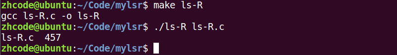

```c
#include <stdio.h>
#include <stdlib.h>
#include <string.h>
#include <unistd.h>
#include <sys/stat.h>
#include <dirent.h>
#include <pthread.h>

void isFile(char *name);

// 打开目录读取,处理目录
void read_dir(char *dir, void (*func)(char *))
{
    char path[256];
    DIR *dp;
    struct dirent *sdp;

    dp = opendir(dir);
    if (dp == NULL) {
        perror("opendir error");
        return;
    }
    // 读取目录项
    while ((sdp = readdir(dp)) != NULL) {
        if (strcmp(sdp->d_name, ".") == 0 || strcmp(sdp->d_name, "..") == 0) {
            continue;
        }
        // 目录项本身不可访问, 拼接: 目录/目录项
        sprintf(path, "%s/%s", dir, sdp->d_name);

        // 判断文件类型,目录递归进入,文件显示名字/大小
        (*func)(path);
    }

    closedir(dp);

    return;
}

void isFile(char *name)
{
    int ret = 0;
    struct stat sb;

    // 获取文件属性, 判断文件类型
    ret = stat(name, &sb);
    if (ret == -1) {
        perror("stat error");
        return;
    }
    // 是目录文件
    if (S_ISDIR(sb.st_mode)) {
        read_dir(name, isFile);
    }
    // 是普通文件, 显示名字/大小
    printf("%10s\t\t%ld\n", name, sb.st_size);

    return;
}

int main(int argc, char *argv[])
{
    // 判断命令行参数
    if (argc == 1) {
        isFile(".");
    } else {
        isFile(argv[1]);
    }

    return 0;
}
```

这里与视频中的差异在于使用了回调函数来实现对目录中目录项的处理，视频中直接调用了 `isFile`，差别不大。

编译运行，基本达到了 `ls -R` 的功能。

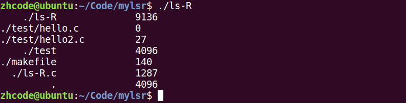

## 递归遍历目录总结

递归改为回调，逻辑上没有问题。

## dup 和 dup2

用来做重定向，本质就是**复制文件描述符**。

### `dup`

```c
int dup(int oldfd);
```

文件描述符复制。

- **oldfd**：已有文件描述符
- **返回值**：新文件描述符，该描述符与 `oldfd` 指向相同内容。

一个小例子，给一个旧的文件描述符，返回一个新文件描述符：

编译运行。`dup` 基本用法如此，后续使用主要起保存作用。

### `dup2`

```c
int dup2(int oldfd, int newfd);
```

文件描述符复制，将 `oldfd` 拷贝给 `newfd`。返回 `newfd`。

下面这个例子，将一个已有文件描述符 `fd1` 复制给另一个文件描述符 `fd2`，然后用 `fd2` 修改 `fd1` 指向的文件：

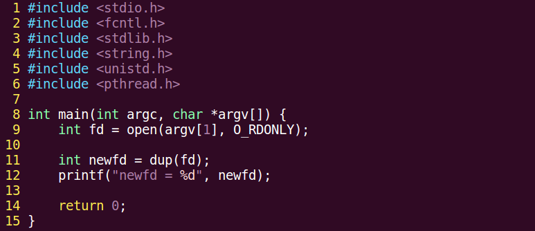

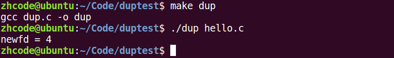

编译运行。然后查看 `hello.c`。

上面那个例子中，`fd1` 是打开 `hello.c` 的文件描述符，`fd2` 是打开 `hello2.c` 的文件描述符。使用 `dup2` 将 `fd1` 复制给了 `fd2`，于是在对 `fd2` 指向的文件进行写操作时，实际上就是对 `fd1` 指向的 `hello.c` 进行写操作。

这里需要注意一个问题：由于 `hello.c` 和 `hello2.c` 都是空文件，所以直接写入没有问题。但如果 `hello.c` 是非空的，写入的内容默认从文件头部开始写，会覆盖原有内容。

`dup2` 也可以用于**标准输入输出的重定向**。

下面这个例子，将输出到 `STDOUT` 的内容重定向到文件里：

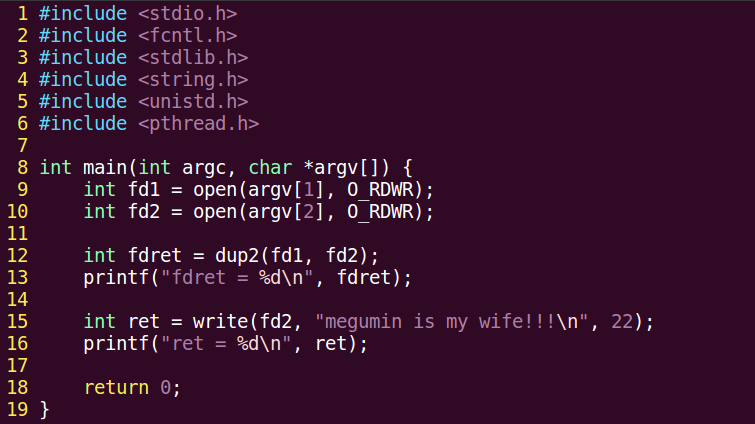

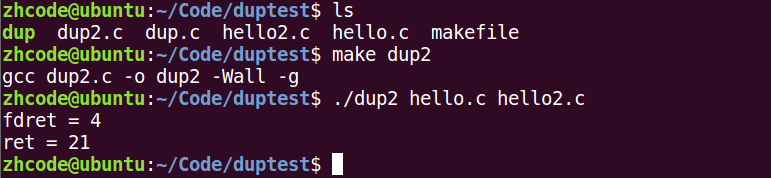


编译执行。

这个程序将 `fd1` 的内容复制给了 `fd2`，使得原来指向 `hello2.c` 的 `fd2` 也指向了 `hello.c`，并通过 `fd2` 向 `hello.c` 写入内容。然后将标准输出重定向至 `fd1`，即将要显示在标准输出的内容写入了 `fd1` 指向的文件 `hello.c` 中。

这里有一点与上面的程序不同：`hello.c` 处于打开状态，连续写入两段内容时，写入第二段时读写指针在第一段末尾，不会覆盖第一段内容。

再强调一下：**打开一个文件，读写指针默认在文件头，如果文件本身有内容，直接写入会覆盖原有内容。**

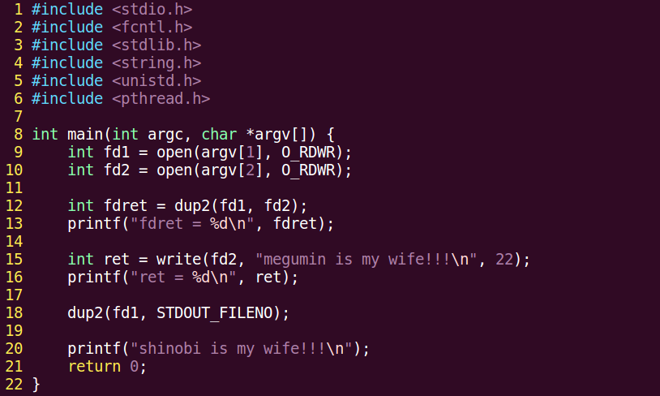

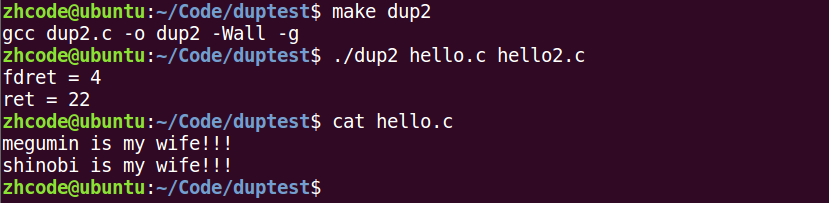

## fcntl 实现 dup 描述符

使用 `fcntl` 函数实现 `dup` 功能：

```c
int fcntl(int fd, int cmd, ...);
```

`cmd` 参数使用 `F_DUPFD`：

- 第三个参数**未被占用**时，返回等于该值的文件描述符。
- 第三个参数**已被占用**时，返回最小可用的文件描述符。

下面的代码使用 `fcntl` 来实现描述符的复制：

对于 `fcntl` 中的第三个参数，如果传入 `0` 且 `0` 已被占用，`fcntl` 会返回文件描述符表中的最小可用描述符。可以这样理解：传入一个文件描述符 `k`，如果 `k` 未被占用，则直接用 `k` 复制 `fd1` 的内容；如果 `k` 已被占用，则返回描述符表中最小可用描述符。

编译执行。如图可知，原来指向 `hello.c` 的文件描述符是 `3`，复制后新的文件描述符 `4` 也指向 `hello.c`。

下面这个例子使用 `fcntl` 复制文件描述符两次：第一次使用默认分配（传入 `0`），第二次使用自行选定的文件描述符复制，然后向文件中写入内容：

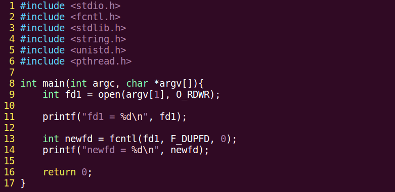

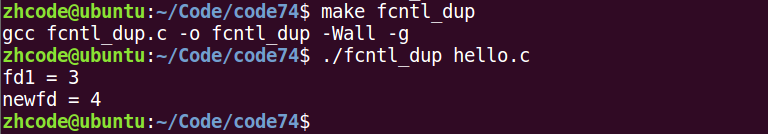

编译执行，结果如下：

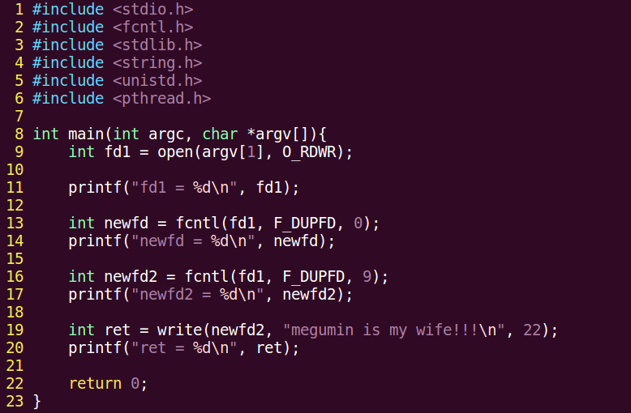

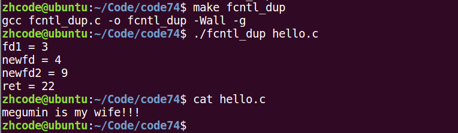

可见上述说明都是正确的。
