# 第8章 进程基础

## 目录

- [进程和程序以及CPU相关](#进程和程序以及cpu相关)
- [虚拟内存和物理内存映射关系](#虚拟内存和物理内存映射关系)
- [PCB进程控制块](#pcb进程控制块)
- [环境变量](#环境变量)
- [fork函数原理](#fork函数原理)
- [fork创建子进程](#fork创建子进程)
- [getpid和getppid](#getpid和getppid)
- [循环创建多个子进程](#循环创建多个子进程)
- [父子进程共享哪些内容](#父子进程共享哪些内容)
- [总结](#总结)
  - [进程与程序](#进程与程序)
  - [PCB进程控制块](#pcb进程控制块-1)
  - [fork 函数](#fork-函数)
- [父子进程gdb调试](#父子进程gdb调试)
- [exec函数族](#exec函数族)
- [execlp和execl函数](#execlp和execl函数)
- [exec函数族特性](#exec函数族特性)
- [孤儿进程和僵尸进程](#孤儿进程和僵尸进程)
- [wait回收子进程](#wait回收子进程)
- [获取子进程退出值和异常终止信号](#获取子进程退出值和异常终止信号)
- [waitpid回收子进程](#waitpid回收子进程)
- [错误解析](#错误解析)
- [waitpid回收多个子进程](#waitpid回收多个子进程)
- [wait和waitpid总结](#wait和waitpid总结)

---

## 进程和程序以及CPU相关

**程序**：静态的，只占用磁盘空间（类比剧本）。

**进程**：动态的，运行起来的程序，占用内存、CPU 等系统资源（类比戏）。

**并发（Concurrency）**：宏观上同时进行，微观上交替执行（单核 CPU 通过时间片轮转实现）。

**并行（Parallelism）**：微观上真正同时执行（需要多核 CPU）。

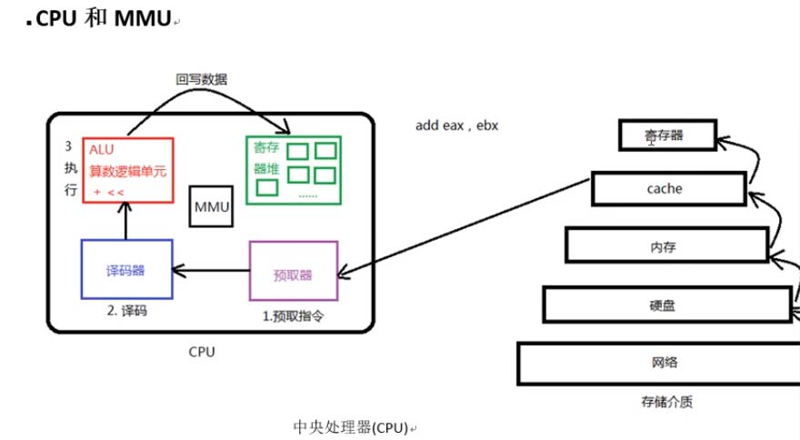

## 虚拟内存和物理内存映射关系

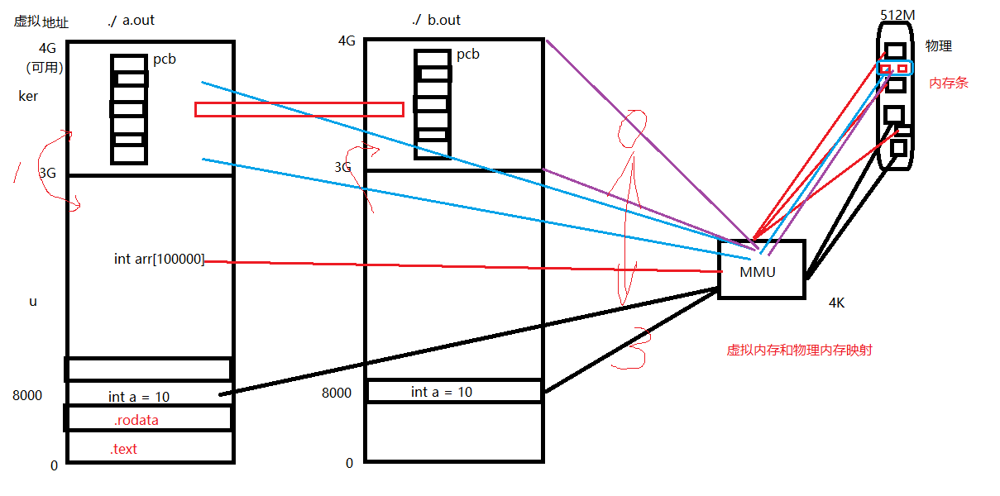

## PCB进程控制块

**PCB（Process Control Block）** 即进程控制块，包含以下信息：

- 进程 ID
- 文件描述符表
- 进程状态：初始态、就绪态、运行态、挂起态、终止态
- 进程工作目录位置
- `umask` 掩码（进程的概念）
- 信号相关信息资源
- 用户 ID 和组 ID

`ps aux` 返回结果里，第二列是进程 ID。


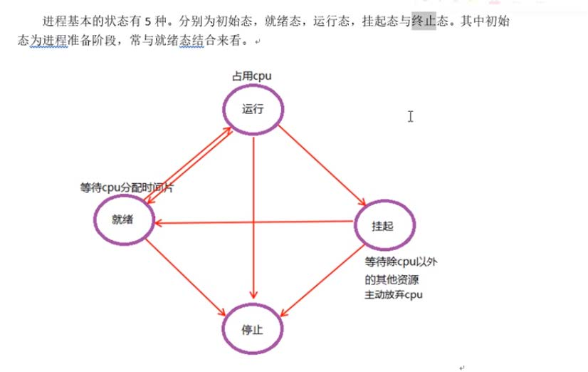

## 环境变量

```bash
echo $PATH   # 查看环境变量
```

`PATH` 环境变量里记录了一系列的值，当运行一个可执行文件时，系统会去环境变量记录的位置里查找这个文件并执行。

```bash
echo $TERM  # 查看终端
echo $LANG  # 查看语言
env         # 查看所有环境变量
```

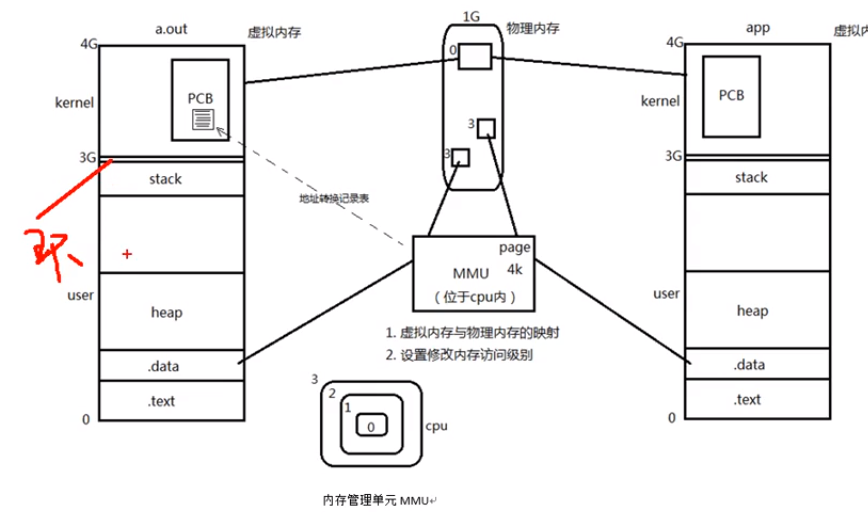

## fork函数原理

`fork` 函数用于创建子进程，父子进程各自返回：父进程返回子进程 PID，子进程返回 0。

```c
pid_t fork(void);
```

辅助函数：

```c
pid_t getpid(void);    // 获取当前进程 ID
pid_t getppid(void);   // 获取当前进程的父进程 ID
```

**循环创建 N 个子进程模型**：每个子进程标识自己的身份。

**父子进程相同**：
刚 `fork` 后，`data` 段、`text` 段、堆、栈、环境变量、全局变量、宿主目录位置、进程工作目录位置、信号处理方式均相同。

**父子进程不同**：
进程 ID、返回值、各自的父进程、进程创建时间、闹钟、未决信号集。

**父子进程共享**：
读时共享、写时复制——全局变量。
1. 文件描述符
2. `mmap` 映射区

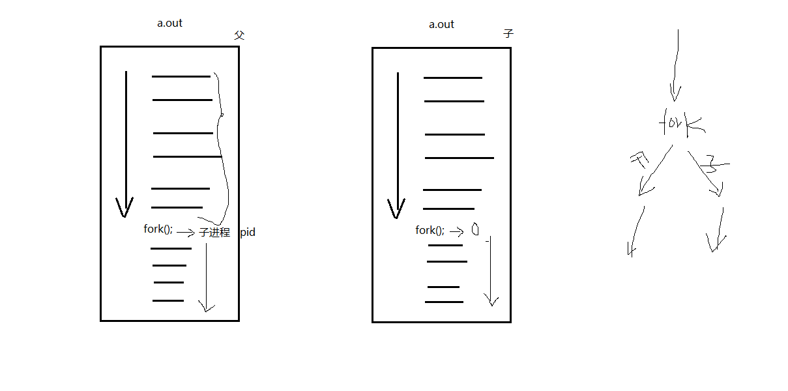

## fork创建子进程

下面是 `fork` 函数的示例代码：

编译运行后，关于终端提示符和输出信息混在一起的问题，在循环创建多个子进程一节会进行分析。

`fork` 之前的代码，父子进程都有，但只有父进程执行了，子进程没有执行；`fork` 之后的代码，父子进程都有机会执行。

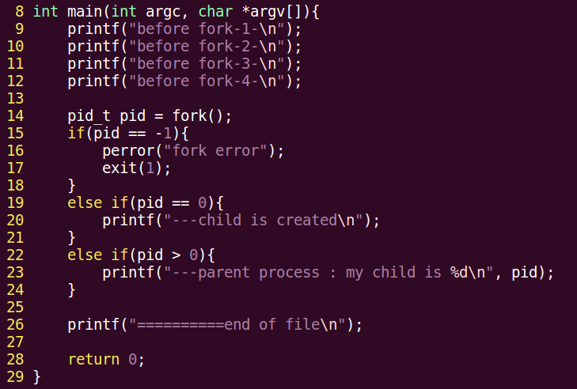

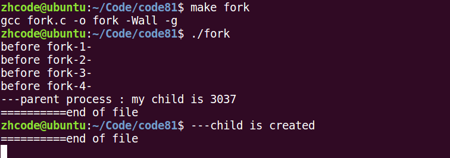

## getpid和getppid

在上面的 `fork` 示例中加入 `getpid` 和 `getppid` 函数，编译运行如下：

这里出现了一个问题：父进程的子进程 PID 与子进程报告的父进程 PID 不一致。

子进程 PID=3140，其报告的父进程 PID=1630；而父进程自己的 PID=3139，其创建的子进程 PID=3140，父进程的父进程 PID=2911。3140 报告的父进程是 1630，而非 3139。

多次运行后发现，所有子进程报告的父进程均为 1630。

推测：父进程先于子进程结束，子进程成为孤儿进程，被 init 进程（或 upstart）领养，1630 即为领养进程。

修改代码，给父进程增加 `sleep` 等待，确保子进程完成时父进程仍在运行：

编译运行后，2477 的子进程是 2478，2478 的父进程是 2477，父子进程关系正确。

查看父进程的父进程 PID=2911，即 `bash`，所有用户进程都是 `bash` 的子进程。而 1630 是 `upstart`，即孤儿进程的领养者。

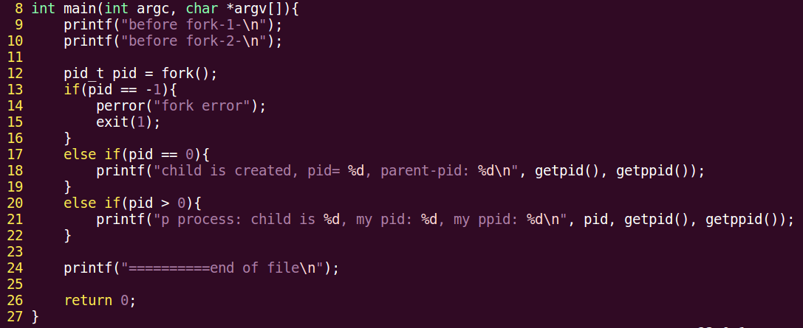

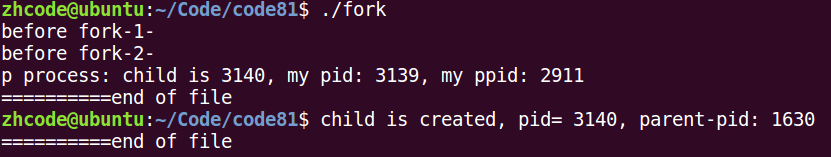

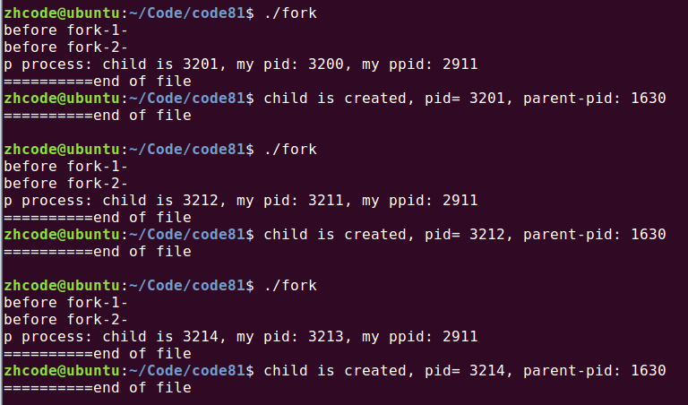

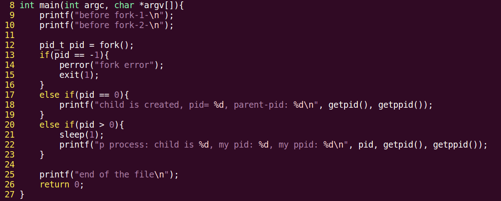

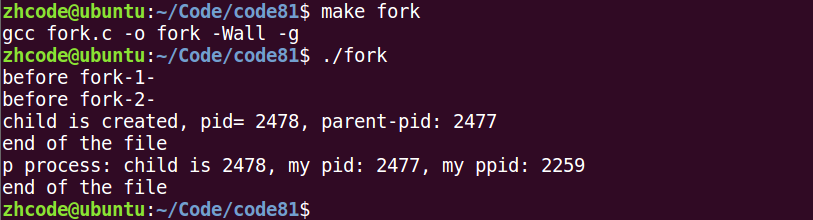

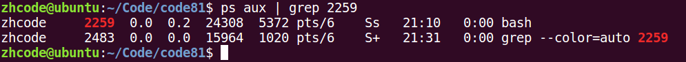

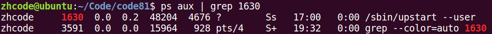

## 循环创建多个子进程

直接用 `for` 循环调用 `fork` 会出问题，因为子进程也会 `fork` 新的进程。解决方法是对调用 `fork` 的进程进行判定，只让父进程 `fork` 新的进程。

编译执行后出现两个问题：

1. **进程多了一个**：多出的是父进程，因为父进程在 `i=5` 时才跳出循环。需要对父进程进行判定并处理。
2. **进程输出顺序随机**：因为对操作系统而言，子进程几乎同时出现，它们和父进程一起竞争 CPU，谁抢到谁打印，所以顺序随机。
3. **终端提示符混在输出里**：`loop_fork` 是终端的子进程，一旦 `loop_fork` 执行完，终端就会打印提示符，而子进程可能还未执行完。

通过 `sleep` 延时让父进程最后结束，解决终端提示符干扰问题。

最后通过给不同子进程设置不同的等待时间（第 1 个少等，后面依次增加）实现有序输出。

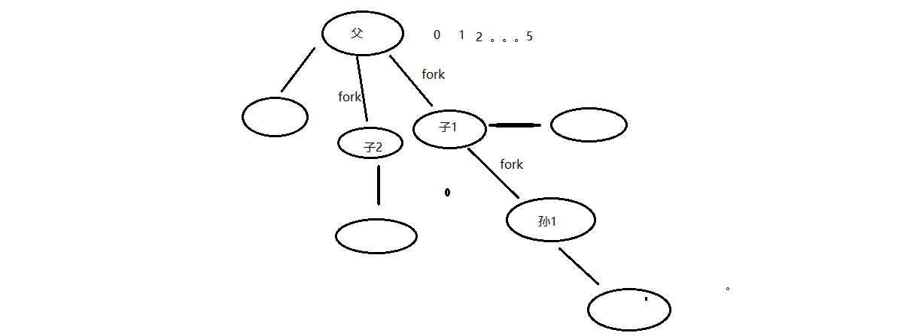

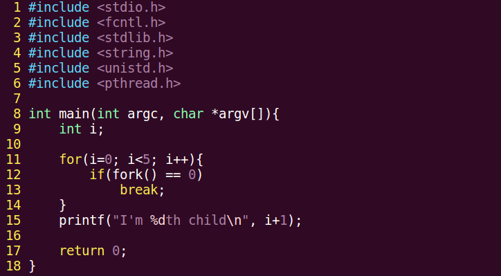

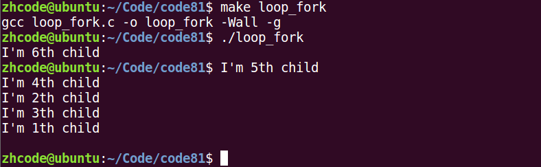

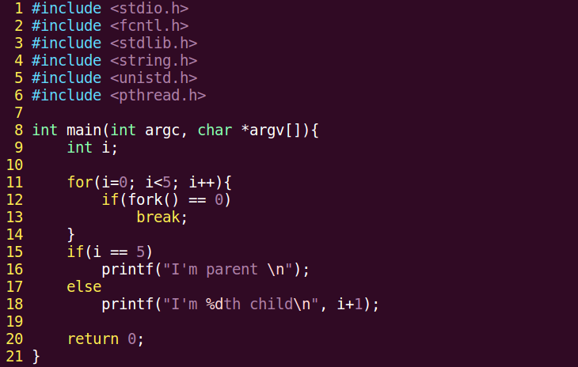

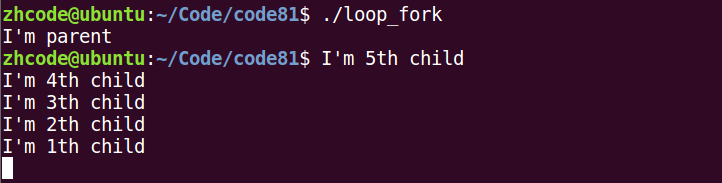

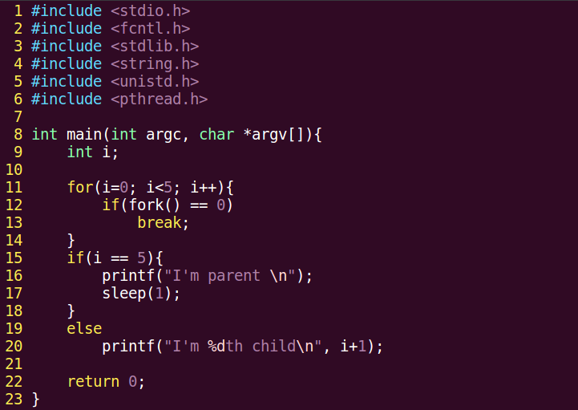

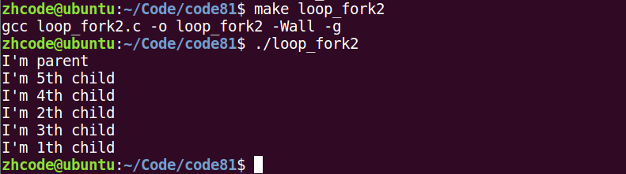

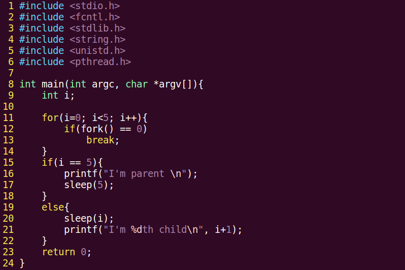

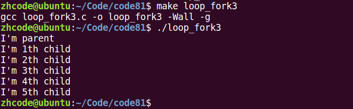

## 父子进程共享哪些内容

**父子进程相同**：
刚 `fork` 后，`data` 段、`text` 段、堆、栈、环境变量、全局变量、宿主目录位置、进程工作目录位置、信号处理方式均相同。

**父子进程不同**：
进程 ID、返回值、各自的父进程、进程创建时间、闹钟、未决信号集。

**父子进程共享**：
读时共享、写时复制——全局变量。
1. 文件描述符
2. `mmap` 映射区

## 总结

### 进程与程序

**程序**：静态的，只占用磁盘空间（类比剧本）。

**进程**：动态的，运行起来的程序，占用内存、CPU 等系统资源（类比戏）。

### PCB进程控制块

- 进程 ID
- 文件描述符表
- 进程状态：初始态、就绪态、运行态、挂起态、终止态
- 进程工作目录位置
- `umask` 掩码
- 信号相关信息资源
- 用户 ID 和组 ID

### fork 函数

```c
pid_t fork(void);
```

创建子进程。父子进程各自返回：父进程返回子进程 PID，子进程返回 0。

```c
pid_t getpid(void);    // 获取当前进程 ID
pid_t getppid(void);   // 获取当前进程的父进程 ID
```

循环创建 N 个子进程模型，每个子进程标识自己的身份。

**父子进程相同**：
刚 `fork` 后，`data` 段、`text` 段、堆、栈、环境变量、全局变量、宿主目录位置、进程工作目录位置、信号处理方式均相同。

**父子进程不同**：
进程 ID、返回值、各自的父进程、进程创建时间、闹钟、未决信号集。

**父子进程共享**：
读时共享、写时复制——全局变量。
1. 文件描述符
2. `mmap` 映射区

## 父子进程gdb调试

**gdb 调试父子进程**：

```bash
set follow-fork-mode parent   # 设置父进程调试路径（默认）
set follow-fork-mode child    # 设置子进程调试路径
```

注意：一定要在 `fork` 函数调用之前设置才有效。

## exec函数族

`exec` 函数族用于使进程执行某一程序。成功无返回值，失败返回 -1。

```c
int execlp(const char *file, const char *arg, ...);
```
借助 `PATH` 环境变量查找待执行程序。
- 参数 1：程序名
- 参数 2：`argv[0]`
- 参数 3：`argv[1]`
- ...：`argv[N]`
- 最后一个参数：`NULL`（哨兵）

```c
int execl(const char *path, const char *arg, ...);
```
自己指定待执行程序路径。

```c
int execvp(const char *file, char *const argv[]);
```

```bash
ps ajx   # 查看 pid ppid gid sid
```

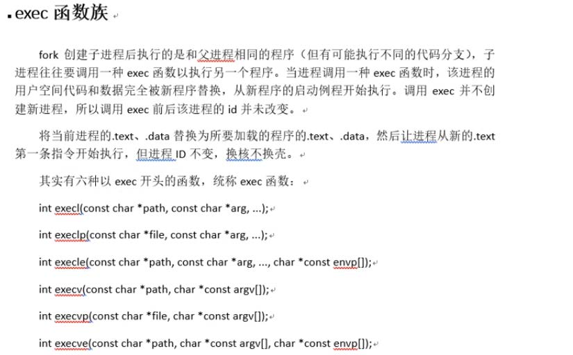

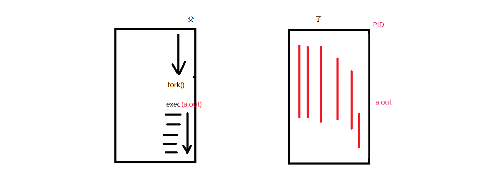

## execlp和execl函数

```c
int execlp(const char *file, const char *arg, ...);
```
成功无返回值，失败返回 -1。

参数 1 为要加载的程序名字，该函数需要配合 `PATH` 环境变量来使用，当 `PATH` 所有目录搜索后没有找到参数 1 则返回出错。该函数通常用来调用系统程序，如 `ls`、`date`、`cp`、`cat` 命令。`execlp` 中的 `p` 表示要借助环境变量来加载可执行文件。

示例代码，通过 `execlp` 让子进程执行 `ls` 命令：

编译运行后，只有父进程正确执行并输出了，子进程的 `ls` 输出有问题。问题出在可变参数上，是从 `argv[0]` 开始计算的。

修改代码，将缺失的 `argv[0]` 补上，然后让父进程延时 1 秒，保证终端提示符不和输出干扰。

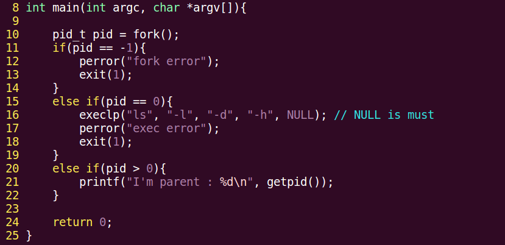


编译执行后，子进程能正确调用可执行程序，该程序可以是系统的，也可以是自定义的。

下面使用 `execl` 让子进程调用自定义程序。

```c
int execl(const char *path, const char *arg, ...);
```

注意：和 `execlp` 不同的是，第一个参数是路径，不是文件名。路径可以使用相对路径或绝对路径。

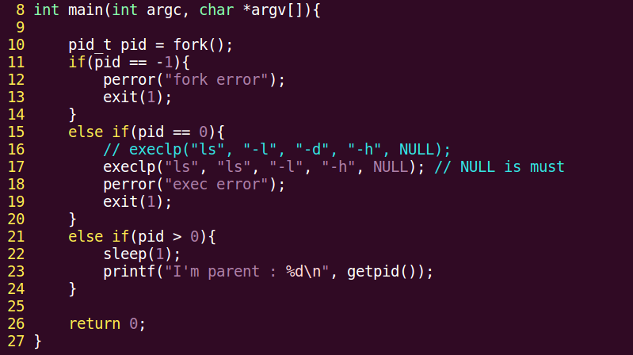

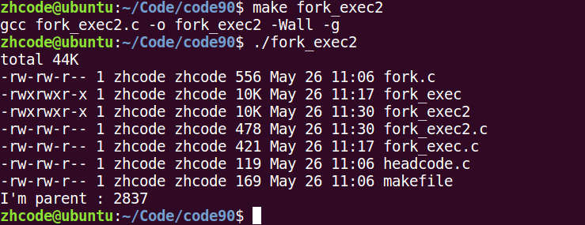

编译执行后，`execl` 也能执行 `ls` 等命令，只需给出完整路径即可。但对于系统指令，一般还是用 `execlp` 更方便。

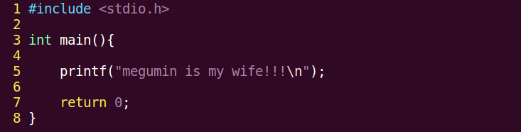

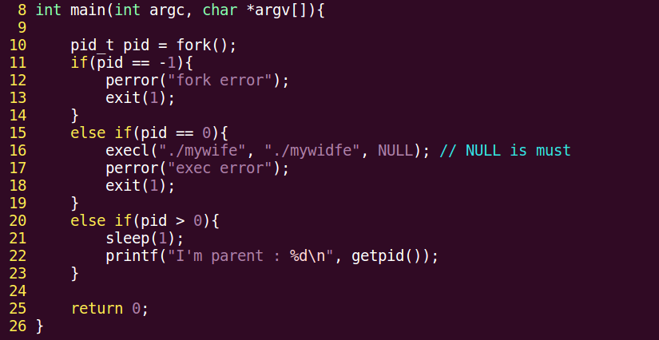

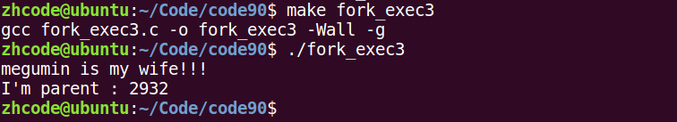

## exec函数族特性

编写一个程序，使用 `execlp` 执行进程查看，并将结果输出到文件里。需要用到 `open`、`execlp`、`dup2`。

编译执行后功能正常。

**exec 函数族一般规律**：
`exec` 函数一旦调用成功，即执行新的程序，不返回。只有失败才返回，错误值 -1。因此通常直接在 `exec` 函数调用后调用 `perror()` 和 `exit()`，无需 `if` 判断。

**命名规则**：
- `l`（list）：命令行参数列表
- `p`（path）：搜索 `file` 时使用 `PATH` 变量
- `v`（vector）：使用命令行参数数组
- `e`（environment）：使用环境变量数组，不使用进程原有的环境变量，设置新加载程序运行的环境变量

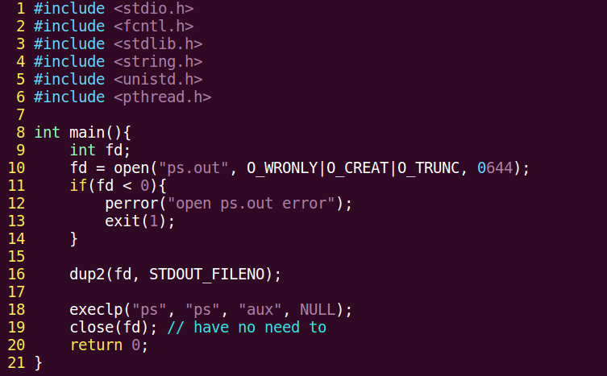

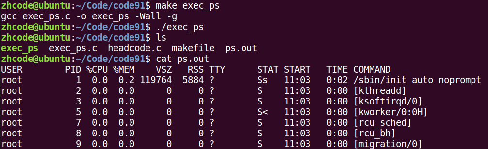

事实上，只有 `execve` 是真正的系统调用，其他 5 个函数最终都调用 `execve`，是库函数。所以 `execve` 在 man 手册第 2 节，其它函数在 man 手册第 3 节。

## 孤儿进程和僵尸进程

**孤儿进程**：
父进程先于子进程终止，子进程沦为"孤儿进程"，会被 `init` 进程（PID=1）领养。

**僵尸进程**：
子进程终止，父进程尚未对子进程进行回收，在此期间，子进程为"僵尸进程"。`kill` 对僵尸进程无效。注意：每个进程结束后都必然会经历僵尸态，只是时间长短不同。

子进程终止时，子进程残留资源 PCB 存放于内核中，PCB 记录了进程结束原因。进程回收即回收 PCB。要回收僵尸进程，需终止其父进程，使其被 `init` 进程领养并回收。

## wait回收子进程

`wait` 函数用于回收子进程退出资源，阻塞回收任意一个子进程。

```c
pid_t wait(int *status);
```

- **参数**：`status`（传出参数）——回收进程的状态
- **返回值**：成功返回回收进程的 PID，失败返回 -1 并设置 `errno`

**函数作用**：
1. 阻塞等待子进程退出
2. 清理子进程残留在内核的 PCB 资源
3. 通过传出参数，得到子进程结束状态

获取子进程正常终止值：
- `WIFEXITED(status)` 为真时，调用 `WEXITSTATUS(status)` 获取子进程退出值

获取导致子进程异常终止的信号：
- `WIFSIGNALED(status)` 为真时，调用 `WTERMSIG(status)` 获取导致子进程异常终止的信号编号

一个进程终止时会关闭所有文件描述符，释放在用户空间分配的内存，但它的 PCB 还保留着，内核在其中保存了一些信息：如果是正常终止则保存着退出状态，如果是异常终止则保存着导致该进程终止的信号编号。父进程可以调用 `wait` 或 `waitpid` 获取这些信息，然后彻底清除掉这个进程。在 shell 中可以用特殊变量 `$?` 查看进程退出状态，因为 shell 是它的父进程，当它终止时，shell 调用 `wait` 或 `waitpid` 得到它的退出状态，同时彻底清除掉这个进程。

下面这个例子使用 `wait` 来阻塞回收子进程。

编译运行如下：

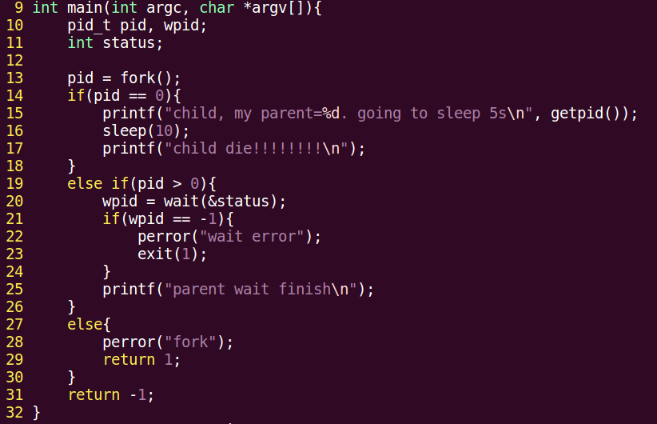


## 获取子进程退出值和异常终止信号

获取子进程正常终止值：
- `WIFEXITED(status)` 为真时，调用 `WEXITSTATUS(status)` 获取子进程退出值

获取导致子进程异常终止的信号：
- `WIFSIGNALED(status)` 为真时，调用 `WTERMSIG(status)` 获取导致子进程异常终止的信号编号

下面的代码捕获程序异常终止的信号并打印：

```c
#include <stdio.h>
#include <stdlib.h>
#include <unistd.h>
#include <sys/wait.h>

int main(void)
{
    pid_t pid, wpid;
    int status;

    pid = fork();
    if (pid == 0) {
        printf("---child, my id= %d, going to sleep 10s\n", getpid());
        sleep(10);
        printf("-------------child die--------------\n");
        return 73;
    } else if (pid > 0) {
        //wpid = wait(NULL);          // 不关心子进程结束原因
        wpid = wait(&status);       // 如果子进程未终止,父进程阻塞在这个函数上
        if (wpid == -1) {
            perror("wait error");
            exit(1);
        }
        if (WIFEXITED(status)) {        // 为真,说明子进程正常终止
            printf("child exit with %d\n", WEXITSTATUS(status));
        }
        if (WIFSIGNALED(status)) {      // 为真,说明子进程是被信号终止
            printf("child kill with signal %d\n", WTERMSIG(status));
        }

        printf("------------parent wait finish: %d\n", wpid);
    } else {
        perror("fork");
        return 1;
    }

    return 0;
}
```

编译运行，如下所示——这是子进程正常退出的情况。

下面发送信号使得子进程异常退出。

再测试一次，这次发送信号 11 试试。

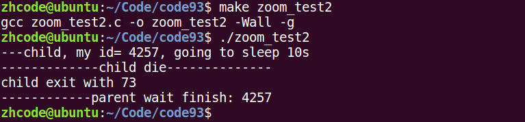

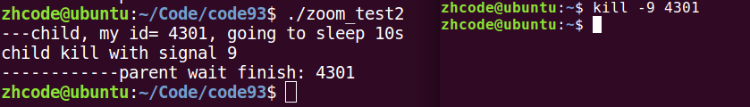

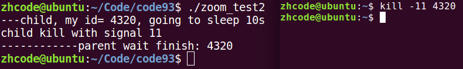

## waitpid回收子进程

`waitpid` 函数用于指定某一个进程进行回收，可以设置非阻塞。

```c
waitpid(-1, &status, 0);  // 等价于 wait(&status)
```

```c
pid_t waitpid(pid_t pid, int *status, int options);
```

**参数**：
- `pid`：指定回收某一个子进程 PID
  - `> 0`：待回收的子进程 PID
  - `-1`：任意子进程
  - `0`：同组的子进程
- `status`（传出参数）：回收进程的状态
- `options`：`WNOHANG` 指定回收方式为非阻塞

**返回值**：
- `> 0`：成功回收的子进程 PID
- `0`：函数调用时，第 3 个参数指定了 `WNOHANG`，且没有子进程结束
- `-1`：失败，设置 `errno`

一次 `wait`/`waitpid` 函数调用只能回收一个子进程。

## 错误解析

在演示回收指定子进程的代码时出了问题。问题原因在于指定子进程的 PID 传递：父进程里的 `pid` 变量和子进程的 `pid` 变量并不是同一个。子进程结束时，父进程的 `pid` 还是原来的 0。原来的代码没有使用 `fork` 的返回值，导致父进程没有得到指定回收子进程的 PID。

默认情况下，父进程 `fork` 出来的子进程都属于同一个进程组。

```c
pid_t waitpid(pid_t pid, int *status, int options);
```

**参数**：
- `pid`：指定回收某一个子进程 PID
  - `> 0`：待回收的子进程 PID
  - `-1`：任意子进程
  - `0`：同组的子进程
- `status`（传出参数）：回收进程的状态
- `options`：`WNOHANG` 指定回收方式为非阻塞

错误代码如下（不能回收指定的第 3 个子进程，每次回收的都是随机的）：

```c
// 指定回收一个子进程错误示例
#include <stdio.h>
#include <stdlib.h>
#include <string.h>
#include <unistd.h>
#include <sys/wait.h>
#include <pthread.h>

int main(int argc, char *argv[])
{
    int i;
    pid_t pid, wpid;

    for (i = 0; i < 5; i++) {
        if (fork() == 0) {       // 循环期间, 子进程不 fork
            if (i == 2) {
                 pid = getpid();
                 printf("------pid = %d\n", pid);
            }
            break;
        }
    }

    if (5 == i) {       // 父进程, 从表达式 2 跳出
        sleep(5);

        //wait(NULL);                           // 一次wait/waitpid 函数调用,只能回收一个子进程
        //wpid = waitpid(-1, NULL, WNOHANG);    // 回收任意子进程,没有结束的子进程,父进程直接返回0
        //wpid = waitpid(pid, NULL, WNOHANG);   // 指定一个进程回收

        printf("------in parent , before waitpid, pid= %d\n", pid);
        wpid = waitpid(pid, NULL, 0);  // 指定一个进程回收
        if (wpid == -1) {
            perror("waitpid error");
            exit(1);
        }
        printf("I'm parent, wait a child finish : %d \n", wpid);

    } else {            // 子进程, 从 break 跳出
        sleep(i);
        printf("I'm %dth child, pid= %d\n", i+1, getpid());
    }

    return 0;
}
```

编译并运行，结果如下：

该代码错误如前所述，父进程里的 `pid` 还是 0，因为父进程里没有获取指定子进程的 PID。

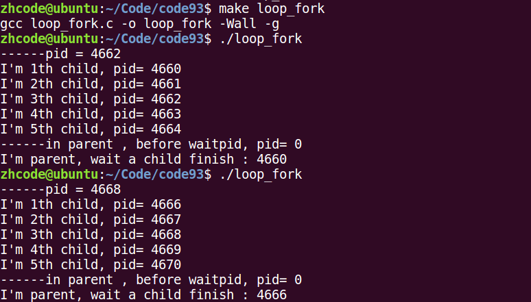

下面是正确的示例，循环 `fork` 出 5 个子进程，并回收指定的子进程：

```c
#include <stdio.h>
#include <stdlib.h>
#include <string.h>
#include <unistd.h>
#include <sys/wait.h>
#include <pthread.h>

int main(int argc, char *argv[])
{
    int i;
    pid_t pid, wpid, tmpid;

    for (i = 0; i < 5; i++) {
        pid = fork();
        if (pid == 0) {       // 循环期间, 子进程不 fork
            break;
        }
        if (i == 2) {
            tmpid = pid;
            printf("--------pid = %d\n", tmpid);
        }
    }

    if (5 == i) {       // 父进程, 从表达式 2 跳出
//      sleep(5);

        //wait(NULL);                           // 一次wait/waitpid 函数调用,只能回收一个子进程
        //wpid = waitpid(-1, NULL, WNOHANG);    // 回收任意子进程,没有结束的子进程,父进程直接返回0
        //wpid = waitpid(tmpid, NULL, 0);       // 指定一个进程回收, 阻塞等待
        printf("i am parent , before waitpid, pid = %d\n", tmpid);

        //wpid = waitpid(tmpid, NULL, WNOHANG);   // 指定一个进程回收, 不阻塞
        wpid = waitpid(tmpid, NULL, 0);         // 指定一个进程回收, 阻塞回收
        if (wpid == -1) {
            perror("waitpid error");
            exit(1);
        }
        printf("I'm parent, wait a child finish : %d \n", wpid);

    } else {            // 子进程, 从 break 跳出
        sleep(i);
        printf("I'm %dth child, pid= %d\n", i+1, getpid());
    }

    return 0;
}
```

编译执行后，指定回收的第三个进程就回收的第三个。实现方式有两种：一是阻塞等待回收指定进程；二是非阻塞，但用 `sleep` 延时父进程以保证待回收的指定子进程已经执行结束。上面的代码使用的是阻塞回收，但该方案的问题在于终端提示符会和输出混杂在一起。下面使用非阻塞回收 + 延时的方法，这样终端提示符就不会混在输出里。

```c
#include <stdio.h>
#include <stdlib.h>
#include <string.h>
#include <unistd.h>
#include <sys/wait.h>
#include <pthread.h>

int main(int argc, char *argv[])
{
    int i;
    pid_t pid, wpid, tmpid;

    for (i = 0; i < 5; i++) {
        pid = fork();
        if (pid == 0) {       // 循环期间, 子进程不 fork
            break;
        }
        if (i == 2) {
            tmpid = pid;
            printf("--------pid = %d\n", tmpid);
        }
    }

    if (5 == i) {       // 父进程, 从表达式 2 跳出
        sleep(5);

        //wait(NULL);                           // 一次wait/waitpid 函数调用,只能回收一个子进程
        //wpid = waitpid(-1, NULL, WNOHANG);    // 回收任意子进程,没有结束的子进程,父进程直接返回0
        //wpid = waitpid(tmpid, NULL, 0);       // 指定一个进程回收, 阻塞等待
        printf("i am parent , before waitpid, pid = %d\n", tmpid);

        wpid = waitpid(tmpid, NULL, WNOHANG);   // 指定一个进程回收, 不阻塞
        //wpid = waitpid(tmpid, NULL, 0);         // 指定一个进程回收, 阻塞回收
        if (wpid == -1) {
            perror("waitpid error");
            exit(1);
        }
        printf("I'm parent, wait a child finish : %d \n", wpid);

    } else {            // 子进程, 从 break 跳出
        sleep(i);
        printf("I'm %dth child, pid= %d\n", i+1, getpid());
    }

    return 0;
}
```

编译运行，结果如下：

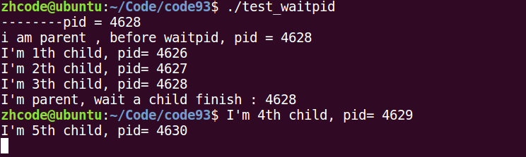

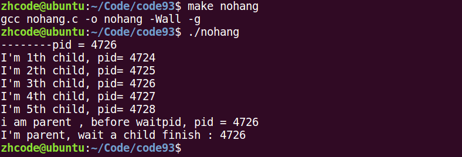

## waitpid回收多个子进程

`waitpid` 的函数签名和参数说明见上方 [waitpid回收子进程](#waitpid回收子进程) 一节。

一次 `wait`/`waitpid` 函数调用只能回收一个子进程，想回收多个需使用循环。

下面的例子循环回收多个子进程：

```c
// 回收多个子进程
#include <stdio.h>
#include <stdlib.h>
#include <string.h>
#include <unistd.h>
#include <sys/wait.h>
#include <pthread.h>

int main(int argc, char *argv[])
{
    int i;
    pid_t pid, wpid;

    for (i = 0; i < 5; i++) {
        pid = fork();
        if (pid == 0) {       // 循环期间, 子进程不 fork
            break;
        }
    }

    if (5 == i) {       // 父进程, 从表达式 2 跳出
        /*
        while ((wpid = waitpid(-1, NULL, 0))) {     // 使用阻塞方式回收子进程
            printf("wait child %d \n", wpid);
        }
        */
        while ((wpid = waitpid(-1, NULL, WNOHANG)) != -1) {     // 使用非阻塞方式,回收子进程
            if (wpid > 0) {
                printf("wait child %d \n", wpid);
            } else if (wpid == 0) {
                sleep(1);
                continue;
            }
        }

    } else {            // 子进程, 从 break 跳出
        sleep(i);
        printf("I'm %dth child, pid= %d\n", i+1, getpid());
    }

    return 0;
}
```

编译运行，结果如下：

可见，子进程运行完后，父进程就将其回收了。

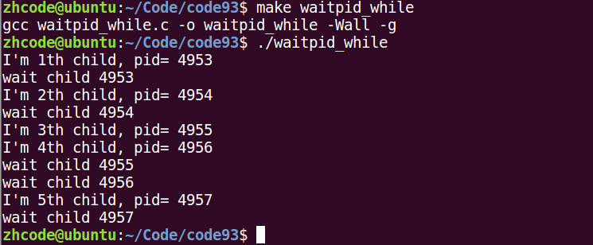

## wait和waitpid总结

**总结**：
`wait`、`waitpid` 一次调用回收一个子进程，想回收多个需使用循环。
