# 第9章 进程间通信

## 目录

- [进程间通信常见方式](#进程间通信常见方式)
- [管道的特质](#管道的特质)
- [管道的基本用法](#管道的基本用法)
  - [`pipe` 函数](#pipe-函数)
  - [管道通信原理](#管道通信原理)
- [管道读写行为](#管道读写行为)
- [父子进程通信练习](#父子进程通信练习)
- [文件类型与伪文件](#文件类型与伪文件)
- [父子进程 ls | wc -l 实现](#父子进程-ls--wc--l-实现)
- [兄弟进程间通信](#兄弟进程间通信)
- [多个读写端操作管道与管道缓冲区大小](#多个读写端操作管道与管道缓冲区大小)
- [命名管道 FIFO 的创建与原理](#命名管道-fifo-的创建与原理)
- [FIFO 实现无血缘关系进程间通信](#fifo-实现无血缘关系进程间通信)
- [文件用于进程间通信](#文件用于进程间通信)
- [mmap 函数原型](#mmap-函数原型)
- [mmap 使用注意事项](#mmap-使用注意事项)
- [mmap 建立映射区示例](#mmap-建立映射区示例)
- [mmap 总结](#mmap-总结)
- [父子进程间 mmap 通信](#父子进程间-mmap-通信)
- [无血缘关系进程间 mmap 通信](#无血缘关系进程间-mmap-通信)
- [mmap 匿名映射区](#mmap-匿名映射区)
- [进程间通信方式总结](#进程间通信方式总结)

---


## 进程间通信常见方式

IPC（InterProcess Communication，进程间通信）的常用方式及其特征：

- **管道**：实现简单
- **信号**：开销小
- **mmap 内存映射**：可用于无血缘关系的进程间通信
- **socket（本地套接字）**：通信稳定


## 管道的特质

管道的实现原理：内核借助**环形队列**机制，使用内核缓冲区实现。

管道的特质：

1. 伪文件（不占用磁盘空间）
2. 管道中的数据只能**一次性读取**
3. 数据在管道中只能**单向流动**

管道的局限性：

1. 自己写入的数据不能自己读取
2. 数据不可反复读取
3. **单向通信**
4. 仅限有血缘关系的进程间使用

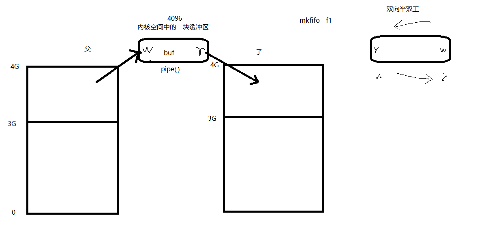

## 管道的基本用法

### `pipe` 函数

创建并打开管道：

```c
int pipe(int fd[2]);
```

**参数**：
- `fd[0]`：读端
- `fd[1]`：写端

**返回值**：
- 成功：返回 `0`
- 失败：返回 `-1`，设置 `errno`

### 管道通信原理

以下示例演示父进程向管道写入数据，子进程从管道读取并打印：

```c
#include <stdio.h>
#include <stdlib.h>
#include <string.h>
#include <unistd.h>
#include <errno.h>
#include <pthread.h>

void sys_err(const char *str)
{
    perror(str);
    exit(1);
}

int main(int argc, char *argv[])
{
    int ret;
    int fd[2];
    pid_t pid;

    char *str = "hello pipe\n";
```

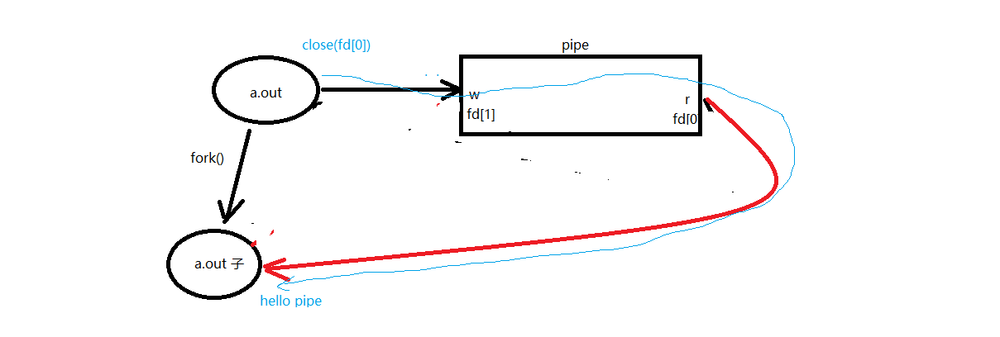

```c
    char buf[1024];

    ret = pipe(fd);
    if (ret == -1)
        sys_err("pipe error");

    pid = fork();
    if (pid > 0) {
        close(fd[0]);       // 关闭读端
        //sleep(3);
        write(fd[1], str, strlen(str));
        close(fd[1]);
    } else if (pid == 0) {
        close(fd[1]);       // 子进程关闭写端
        ret = read(fd[0], buf, sizeof(buf));
        printf("child read ret = %d\n", ret);
        write(STDOUT_FILENO, buf, ret);
        close(fd[0]);
    }

    return 0;
}
```

编译运行，结果如下。若不希望终端提示符与输出混杂，可在父进程写入内容后 `sleep(1)`。


## 管道读写行为

**读管道**：

1. 管道有数据时，`read` 返回实际读到的字节数
2. 管道无数据时：
   - 无写端：`read` 返回 `0`（类似读到文件末尾）
   - 有写端：`read` **阻塞等待**

**写管道**：

1. 无读端：进程异常终止（由 `SIGPIPE` 信号导致）
2. 有读端：
   - 管道已满：**阻塞等待**
   - 管道未满：返回实际写入的字节数

## 父子进程通信练习

练习：使用管道实现父子进程间通信，完成 `ls | wc -l`。假定父进程执行 `ls`，子进程执行 `wc`。

- `ls` 命令正常将结果写入 `stdout`，此处需写入管道写端
- `wc -l` 命令正常从 `stdin` 读取数据，此处需从管道读端读取

需要用到 `pipe`、`dup2`、`exec` 函数。

## 文件类型与伪文件

普通文件、目录、软链接占用磁盘空间。管道、套接字、字符设备、块设备不占用磁盘空间，属于**伪文件**。

## 父子进程 ls | wc -l 实现

练习：使用管道实现父子进程间通信，完成 `ls | wc -l`。假定父进程执行 `wc`，子进程执行 `ls`。

需要用到 `pipe`、`dup2`、`exec`。

```c
#include <stdio.h>
#include <stdlib.h>
#include <string.h>
#include <unistd.h>
#include <errno.h>
#include <pthread.h>

void sys_err(const char *str)
{
    perror(str);
    exit(1);
}

int main(int argc, char *argv[])
{
    int fd[2];
    int ret;
    pid_t pid;

    ret = pipe(fd);                 // 父进程先创建管道，持有读端和写端
    if (ret == -1) {
        sys_err("pipe error");
    }

    pid = fork();                   // 子进程同样持有管道的读端和写端
    if (pid == -1) {
        sys_err("fork error");
    }
    else if (pid > 0) {             // 父进程执行 wc，关闭写端
        close(fd[1]);
        dup2(fd[0], STDIN_FILENO);  // 重定向 stdin 到管道读端
        execlp("wc", "wc", "-l", NULL);
        sys_err("execlp wc error");
    }
    else if (pid == 0) {            // 子进程执行 ls，关闭读端
        close(fd[0]);
        dup2(fd[1], STDOUT_FILENO); // 重定向 stdout 到管道写端
        execlp("ls", "ls", NULL);
        sys_err("execlp ls error");
    }

    return 0;
}
```


## 兄弟进程间通信

练习：兄弟进程间通信——兄进程执行 `ls`，弟进程执行 `wc -l`，父进程等待回收子进程。

要求使用循环创建 N 个子进程的模型创建兄弟进程，使用循环因子 `i` 标识，注意管道读写行为。

测试结论：
- 一个管道允许一个写端、多个读端
- 一个管道允许多个写端、一个读端

```c
#include <stdio.h>
#include <stdlib.h>
#include <string.h>
#include <sys/wait.h>
#include <unistd.h>
#include <errno.h>
#include <pthread.h>

void sys_err(const char *str)
{
    perror(str);
    exit(1);
}

int main(int argc, char *argv[])
{
    int fd[2];
    int ret, i;
    pid_t pid;
```

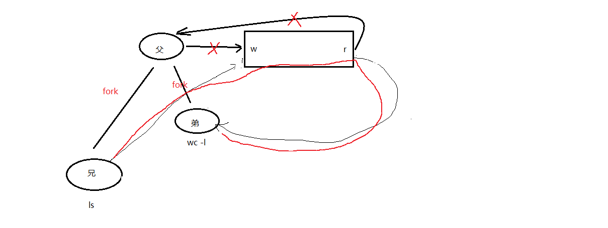

```c
    ret = pipe(fd);
    if (ret == -1) {
        sys_err("pipe error");
    }

    for (i = 0; i < 2; i++) {       // 循环创建子进程
        pid = fork();
        if (pid == -1) {
            sys_err("fork error");
        }
        if (pid == 0)               // 子进程跳出循环
            break;
    }

    if (i == 2) {                   // 父进程，不参与管道操作
        close(fd[0]);               // 关闭管道读端和写端
        close(fd[1]);

        wait(NULL);                 // 回收子进程
        wait(NULL);
    } else if (i == 0) {            // 兄进程
        close(fd[0]);
        dup2(fd[1], STDOUT_FILENO); // 重定向 stdout
        execlp("ls", "ls", NULL);
        sys_err("execlp ls error");
    } else if (i == 1) {            // 弟进程
        close(fd[1]);
        dup2(fd[0], STDIN_FILENO);  // 重定向 stdin
        execlp("wc", "wc", "-l", NULL);
        sys_err("execlp wc error");
    }

    return 0;
}
```

注意：父进程不使用管道，必须关闭父进程的管道两端，以确保数据单向流动。


## 多个读写端操作管道与管道缓冲区大小

以下示例演示一个读端、多个写端的情况（父进程读，两个子进程写）：

```c
#include <stdio.h>
#include <unistd.h>
#include <sys/wait.h>
#include <string.h>
#include <stdlib.h>

int main(void)
{
    pid_t pid;
    int fd[2], i, n;
    char buf[1024];

    int ret = pipe(fd);
    if (ret == -1) {
        perror("pipe error");
        exit(1);
    }

    for (i = 0; i < 2; i++) {
        if ((pid = fork()) == 0)
            break;
        else if (pid == -1) {
            perror("fork error");
            exit(1);
        }
    }

    if (i == 0) {
        close(fd[0]);
        write(fd[1], "1.hello\n", strlen("1.hello\n"));
    } else if (i == 1) {
        close(fd[0]);
        write(fd[1], "2.world\n", strlen("2.world\n"));
    } else {
        close(fd[1]);               // 父进程关闭写端，保留读端
        sleep(1);
        n = read(fd[0], buf, 1024); // 从管道中读取数据
        write(STDOUT_FILENO, buf, n);

        for (i = 0; i < 2; i++)    // 回收两个子进程
            wait(NULL);
    }

    return 0;
}
```

注意：父进程必须通过 `sleep` 等待子进程写入完成，否则可能在子进程尚未全部写入时就已读取并退出。

**管道缓冲区大小**：默认为 **4096 字节**。


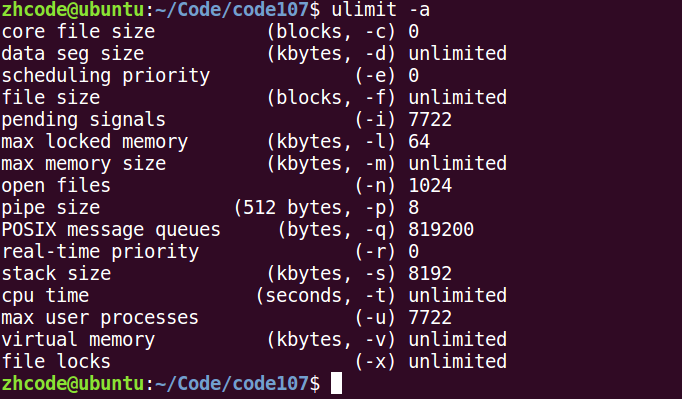

## 命名管道 FIFO 的创建与原理

管道的优缺点：

- **优点**：实现简单，相比信号和套接字实现进程通信简单得多
- **缺点**：
  1. 只能单向通信，双向通信需建立两个管道
  2. 只能用于有血缘关系的进程间通信

**FIFO（命名管道）** 可以用于**无血缘关系**的进程间通信。

创建命名管道：

```bash
mkfifo fifo_name
```

无血缘关系进程间通信的使用方式：
- 读端：`open(fifo, O_RDONLY)`
- 写端：`open(fifo, O_WRONLY)`

FIFO 操作起来像文件一样。

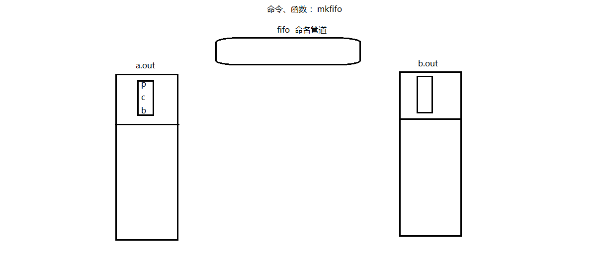

编译运行，结果如下，命名管道通过程序创建成功。

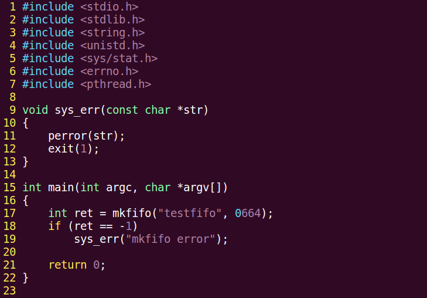

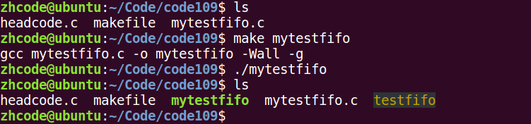

## FIFO 实现无血缘关系进程间通信

以下示例演示一个进程写 FIFO、另一个进程读 FIFO，操作方式与文件类似。

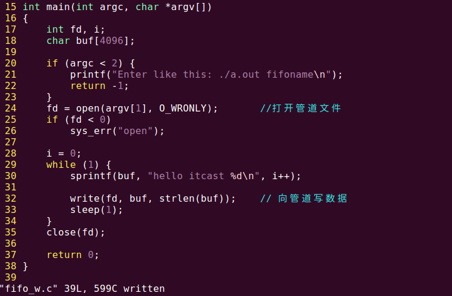

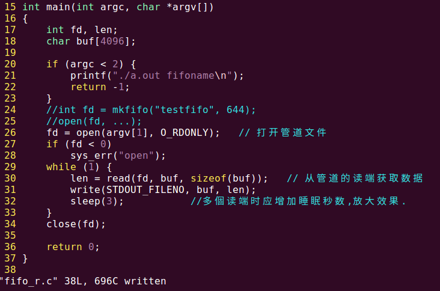

测试多个写端、一个读端的场景：开启多个写进程和一个读进程即可，这是允许的。

测试一个写端、多个读端时，由于数据被读取后即消失，多个读端读到的数据并集才是写端写入的全部数据。

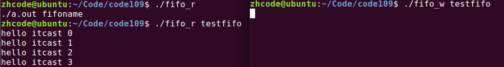

## 文件用于进程间通信

利用文件实现进程间通信：

打开的文件是内核中的一块缓冲区，多个无血缘关系的进程可以同时访问该文件。

无论进程间是否有血缘关系均可使用文件通信。有血缘关系的进程对同一文件使用相同的文件描述符，无血缘关系的进程对同一文件可能使用不同的文件描述符，但这不影响通信——只要打开的是同一个文件即可。

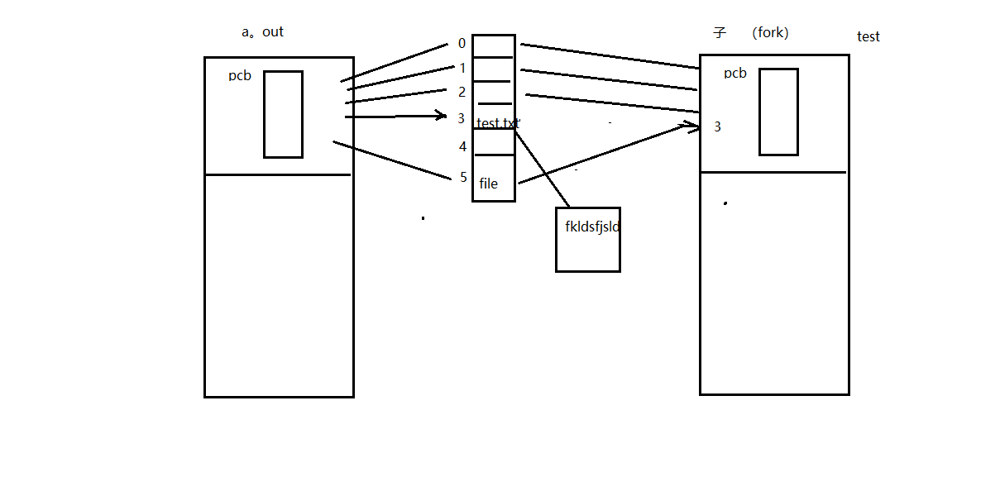

## mmap 函数原型

**存储映射 I/O**（Memory-mapped I/O）使一个磁盘文件与存储空间中的一个缓冲区相映射。从缓冲区中取数据相当于读文件中的相应字节，将数据存入缓冲区则相应字节自动写入文件。这样即可在不使用 `read` 和 `write` 函数的情况下，通过地址指针完成 I/O 操作。

使用此方法前需通知内核将指定文件映射到存储区域，映射工作通过 `mmap` 函数实现。

```c
void *mmap(void *addr, size_t length, int prot, int flags, int fd, off_t offset);
```

创建共享内存映射。

**参数**：
- `addr`：指定映射区的首地址，通常传 `NULL` 表示由系统自动分配
- `length`：共享内存映射区的大小（不得大于文件的实际大小）
- `prot`：共享内存映射区的读写属性，可选 `PROT_READ`、`PROT_WRITE`、`PROT_READ|PROT_WRITE`
- `flags`：共享内存的共享属性，可选 `MAP_SHARED`、`MAP_PRIVATE`
- `fd`：用于创建共享内存映射区的文件描述符
- `offset`：偏移位置，默认 `0` 表示映射文件全部内容，必须是 4K 的整数倍

**返回值**：
- 成功：映射区的首地址
- 失败：`MAP_FAILED`（即 `(void *)(-1)`），设置 `errno`

`flags` 中 `MAP_SHARED` 表示修改会反映到磁盘上，`MAP_PRIVATE` 表示修改不反映到磁盘上。

释放映射区：

```c
int munmap(void *addr, size_t length);
```

- `addr`：`mmap` 的返回值
- `length`：映射区大小

## mmap 使用注意事项

1. 用于创建映射区的文件大小为 0，实际指定非 0 大小创建映射区，会触发**总线错误**（Bus Error）
2. 用于创建映射区的文件大小为 0，实际指定 0 大小创建映射区，会触发**无效参数**错误
3. 用于创建映射区的文件读写属性为只读，但映射区属性为读写时，会触发**无效参数**错误
4. 创建映射区需要读权限。当访问权限指定为 `MAP_SHARED` 时，`mmap` 的读写权限应 **<=** 文件的 `open` 权限。仅写权限不行
5. 文件描述符 `fd` 在 `mmap` 创建映射区完成后即可关闭，后续通过地址访问
6. `offset` 必须是 **4096** 的整数倍（MMU 映射的最小单位为 4K）
7. 对申请的映射区内存不能越界访问
8. `munmap` 释放的地址必须是 `mmap` 返回的地址
9. 映射区访问权限为 `MAP_PRIVATE` 时，对内存所做的所有修改仅在内存中有效，不会反映到物理磁盘上
10. 映射区访问权限为 `MAP_PRIVATE` 时，`open` 文件只需有读权限即可

`mmap` 函数的推荐调用方式：

```c
fd = open("filename", O_RDWR);
mmap(NULL, filesize, PROT_READ | PROT_WRITE, MAP_SHARED, fd, 0);
```

## mmap 建立映射区示例

以下示例使用 `mmap` 创建一个映射区（共享内存）并写入内容：

编译运行结果如下：

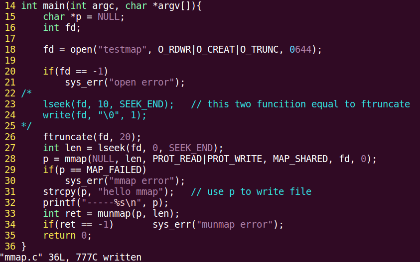


## mmap 总结

1. 创建映射区的过程中隐含着一次对映射文件的读操作
2. 当使用 `MAP_SHARED` 时，映射区的权限应 **<=** 文件打开的权限（出于对映射区的保护）；`MAP_PRIVATE` 则无此限制，因为 `mmap` 中的权限是对内存的限制
3. 映射区的释放与文件关闭无关，只要映射建立成功，文件即可立即关闭
4. 当映射文件大小为 0 时不能创建映射区，因此用于映射的文件必须有实际大小。`mmap` 使用时常见的总线错误通常是由于文件大小引起的——例如 400 字节大小的文件，映射时 `offset` 设为 4096 字节则会触发总线错误
5. `munmap` 传入的地址一定是 `mmap` 返回的地址，严禁对指针进行 `++` 操作
6. 文件偏移量必须为 **4K** 的整数倍
7. `mmap` 创建映射区出错概率较高，务必检查返回值，确保映射区建立成功后再进行后续操作

## 父子进程间 mmap 通信

父子进程使用 `mmap` 通信的步骤：

1. 父进程先创建映射区：`open`（`O_RDWR`）后调用 `mmap`（`MAP_SHARED`）
2. 指定 `MAP_SHARED` 权限
3. 调用 `fork()` 创建子进程
4. 一个进程写入，另一个进程读取

以下代码演示父子进程通过 `mmap` 通信，共享内存为一个 `int` 变量：

```c
#include <stdio.h>
#include <stdlib.h>
#include <unistd.h>
#include <fcntl.h>
#include <sys/mman.h>
#include <sys/wait.h>

int var = 100;

int main(void)
{
    int *p;
    pid_t pid;

    int fd;
    fd = open("temp", O_RDWR | O_CREAT | O_TRUNC, 0644);
    if (fd < 0) {
        perror("open error");
        exit(1);
    }
    ftruncate(fd, 4);

    p = (int *)mmap(NULL, 4, PROT_READ | PROT_WRITE, MAP_SHARED, fd, 0);
    //p = (int *)mmap(NULL, 4, PROT_READ|PROT_WRITE, MAP_PRIVATE, fd, 0);
    if (p == MAP_FAILED) {      // 注意：不是 p == NULL
        perror("mmap error");
        exit(1);
    }
    close(fd);                  // 映射区建立完毕，即可关闭文件

    pid = fork();               // 创建子进程
    if (pid == 0) {
        *p = 7000;              // 写共享内存
        var = 1000;
        printf("child, *p = %d, var = %d\n", *p, var);
    } else {
        sleep(1);
        printf("parent, *p = %d, var = %d\n", *p, var); // 读共享内存
        wait(NULL);

        int ret = munmap(p, 4); // 释放映射区
        if (ret == -1) {
            perror("munmap error");
            exit(1);
        }
    }

    return 0;
}
```

编译运行结果如下。子进程修改 `*p` 的值反映到了父进程，这是因为共享内存定义为 `MAP_SHARED`。若将共享内存定义为 `MAP_PRIVATE`，则父子进程的修改互不影响。


## 无血缘关系进程间 mmap 通信

无血缘关系进程间 `mmap` 通信的步骤：

1. 两个进程打开同一个文件，创建映射区
2. 指定 `flags` 为 `MAP_SHARED`
3. 一个进程写入，另一个进程读出

**注意**：`mmap` 通信中数据可以**重复读取**（内容被读取后不会消失），而 FIFO 中数据只能**一次性读取**。

写进程代码：

```c
#include <stdio.h>
#include <sys/stat.h>
#include <sys/types.h>
#include <fcntl.h>
#include <unistd.h>
#include <stdlib.h>
#include <sys/mman.h>
#include <string.h>

struct STU {
    int id;
    char name[20];
    char sex;
};

void sys_err(char *str)
{
    perror(str);
    exit(1);
}

int main(int argc, char *argv[])
{
    int fd;
    struct STU student = {10, "xiaoming", 'm'};
    char *mm;

    if (argc < 2) {
        printf("./a.out file_shared\n");
        exit(-1);
    }

    fd = open(argv[1], O_RDWR | O_CREAT, 0664);
    ftruncate(fd, sizeof(student));

    mm = mmap(NULL, sizeof(student), PROT_READ | PROT_WRITE, MAP_SHARED, fd, 0);
    if (mm == MAP_FAILED)
        sys_err("mmap");

    close(fd);

    while (1) {
        memcpy(mm, &student, sizeof(student));
        student.id++;
        sleep(1);
    }

    munmap(mm, sizeof(student));

    return 0;
}
```

读进程代码：

```c
#include <stdio.h>
#include <sys/stat.h>
#include <fcntl.h>
#include <unistd.h>
#include <stdlib.h>
#include <sys/mman.h>
#include <string.h>

struct STU {
    int id;
    char name[20];
    char sex;
};

void sys_err(char *str)
{
    perror(str);
    exit(-1);
}

int main(int argc, char *argv[])
{
    int fd;
    struct STU student;
    struct STU *mm;

    if (argc < 2) {
        printf("./a.out file_shared\n");
        exit(-1);
    }

    fd = open(argv[1], O_RDONLY);
    if (fd == -1)
        sys_err("open error");

    mm = mmap(NULL, sizeof(student), PROT_READ, MAP_SHARED, fd, 0);
    if (mm == MAP_FAILED)
        sys_err("mmap error");

    close(fd);

    while (1) {
        printf("id=%d\tname=%s\t%c\n", mm->id, mm->name, mm->sex);
        sleep(2);
    }

    munmap(mm, sizeof(student));

    return 0;
}
```

编译运行结果如下。多个写端、一个读端的场景也支持——开启多个写进程即可，读进程会读到所有写进程写入的内容。需要注意的是，内容被读取后不会消失，若读进程的读取间隔较短，会读到重复内容（写进程尚未写入新内容）。


## mmap 匿名映射区

**匿名映射**只能用于有血缘关系的进程间通信（无需关联文件）：

```c
p = (int *)mmap(NULL, 40, PROT_READ | PROT_WRITE, MAP_SHARED | MAP_ANONYMOUS, -1, 0);
```

## 进程间通信方式总结

| 通信方式 | 适用场景 | 特点 |
|---------|---------|------|
| **管道（pipe）** | 有血缘关系的进程间 | 单向通信，简单高效 |
| **FIFO（命名管道）** | 无血缘关系的进程间 | 数据一次性读取 |
| **文件** | 任意进程间 | 通过内核文件缓冲区共享 |
| **mmap（内存映射）** | 有/无血缘关系的进程间 | 数据可重复读取 |
| **匿名映射** | 有血缘关系的进程间 | 无需关联文件 |

**管道（pipe）** 用于有血缘关系的进程间通信，例如：

```bash
ps aux | grep xxx
ls | wc -l
```

**FIFO（命名管道）** 用于无血缘关系的进程间通信：

```bash
mkfifo fifo_name
```

- 读端：`open(fifo, O_RDONLY)`
- 写端：`open(fifo, O_WRONLY)`

**mmap 共享内存映射**：

```c
void *mmap(void *addr, size_t length, int prot, int flags, int fd, off_t offset);
int munmap(void *addr, size_t length);
```
