# 第10章 信号

## 目录

- [信号的概念和机制](#信号的概念和机制)
- [与信号相关的概念](#与信号相关的概念)
- [信号屏蔽字和未决信号集](#信号屏蔽字和未决信号集)
- [信号四要素和常规信号一览](#信号四要素和常规信号一览)
- [kill 函数和 kill 命令](#kill-函数和-kill-命令)
- [alarm 函数](#alarm-函数)
- [setitimer 函数](#setitimer-函数)
- [信号集操作函数](#信号集操作函数)
- [信号操作函数使用原理分析](#信号操作函数使用原理分析)
- [信号集操作函数练习](#信号集操作函数练习)
- [signal 实现信号捕捉](#signal-实现信号捕捉)
- [sigaction 实现信号捕捉](#sigaction-实现信号捕捉)
- [信号捕捉的特性](#信号捕捉的特性)
- [内核实现信号捕捉简析](#内核实现信号捕捉简析)
- [借助信号捕捉回收子进程](#借助信号捕捉回收子进程)
- [慢速系统调用中断](#慢速系统调用中断)
- [信号机制总结](#信号机制总结)
- [会话](#会话)
- [守护进程创建步骤分析](#守护进程创建步骤分析)
- [守护进程创建](#守护进程创建)

---


## 信号的概念和机制

信号的共性：简单、不能携带大量信息、满足特定条件才发送。

信号的特质：信号是软件层面上的"中断"。一旦信号产生，无论程序执行到什么位置，必须立即停止运行，处理信号，处理完成后再继续执行后续指令。

所有信号的产生及处理均由**内核**完成。

## 与信号相关的概念

**产生信号的方式：**

1. 按键产生
2. 系统调用产生
3. 软件条件产生
4. 硬件异常产生
5. 命令产生

**核心概念：**

- **未决（Pending）**：信号产生后、递达之前的状态。
- **递达（Delivered）**：信号产生并被送达到进程，由内核直接处理。
- **信号处理方式**：执行默认处理动作、忽略、捕捉（自定义处理函数）。
- **阻塞信号集（信号屏蔽字）**：本质为位图，用于记录信号的屏蔽状态。被屏蔽的信号在解除屏蔽前一直处于未决态。
- **未决信号集**：本质为位图，用于记录信号的处理状态。该集合中的信号表示已产生但尚未被处理。

## 信号屏蔽字和未决信号集

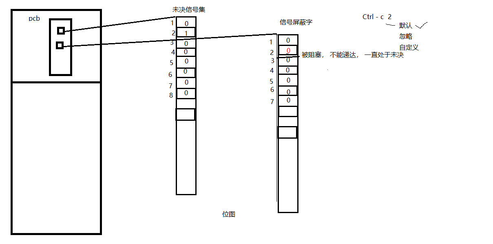

## 信号四要素和常规信号一览

使用 `kill -l` 可查看当前系统中的常规信号列表。

**信号四要素：**

信号使用之前，应先确定其四要素，而后再使用：

1. 编号
2. 名称
3. 对应事件
4. 默认处理动作

## kill 函数和 kill 命令

`kill` 命令和 `kill` 函数：

```c
int kill(pid_t pid, int signum);
```

**参数：**

- `pid`：
  - `> 0`：发送信号给指定进程。
  - `= 0`：发送信号给与调用 `kill` 函数的进程处于同一进程组的所有进程。
  - `< -1`：取绝对值，发送信号给该绝对值所对应的进程组的所有成员。
  - `-1`：发送信号给有权限发送的所有进程。
- `signum`：待发送的信号编号。

**返回值：**

- 成功：返回 `0`。
- 失败：返回 `-1`，并设置 `errno`。

以下示例演示子进程向父进程发送 `SIGKILL` 信号：

编译运行，结果如下：

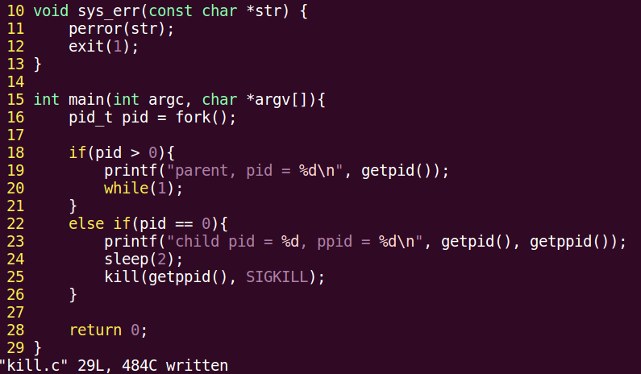

子进程也可以发送其他信号，例如段错误（`SIGSEGV`）等。

```bash
kill -9 -<进程组ID>
```

上述命令可向指定进程组发送信号。

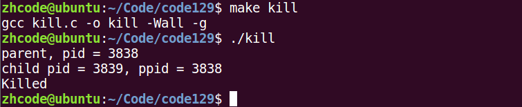

## alarm 函数

`alarm` 函数使用**自然计时法**，定时向当前进程发送 `SIGALRM` 信号。

```c
unsigned int alarm(unsigned int seconds);
```

**参数：**

- `seconds`：定时秒数。

**返回值：**

- 返回上次定时的剩余秒数；若之前没有设置闹钟，则返回 `0`。

**说明：**

- 该函数不会失败。
- `alarm(0)` 取消已设置的闹钟。

使用 `time` 命令可查看程序执行时间。**实际时间 = 用户时间 + 内核时间 + 等待时间**，优化瓶颈通常在于 I/O。

以下示例使用 `alarm` 函数计时，统计在指定时间内变量 `i` 的递增次数，用于衡量程序性能。

## setitimer 函数

`setitimer` 函数提供比 `alarm` 更精确的定时功能，支持微秒级精度和周期性定时。

```c
int setitimer(int which, const struct itimerval *new_value, struct itimerval *old_value);
```

**参数：**

- `which`：指定定时器类型。
  - `ITIMER_REAL`：自然计时，超时发送 `SIGALRM` 信号。
  - `ITIMER_VIRTUAL`：仅用户空间计时，超时发送 `SIGVTALRM` 信号。
  - `ITIMER_PROF`：内核与用户空间合计时，超时发送 `SIGPROF` 信号。
- `new_value`：定时器参数，类型为 `struct itimerval`。
- `old_value`：传出参数，保存上次定时的剩余时间，可为 `NULL`。

**结构体定义：**

```c
struct itimerval {
    struct timeval it_interval;  // 周期定时时间间隔
    struct timeval it_value;     // 首次定时触发时间
};

struct timeval {
    time_t      tv_sec;          // 秒
    suseconds_t tv_usec;         // 微秒
};
```

**使用示例：**

```c
struct itimerval new_t;
struct itimerval old_t;

new_t.it_interval.tv_sec = 0;
new_t.it_interval.tv_usec = 0;
new_t.it_value.tv_sec = 1;
new_t.it_value.tv_usec = 0;

int ret = setitimer(ITIMER_REAL, &new_t, &old_t);  // 定时1秒
```

**返回值：**

- 成功：返回 `0`。
- 失败：返回 `-1`，并设置 `errno`。

以下示例使用 `setitimer` 定时，周期性向屏幕打印信息。首次触发间隔为 2 秒，之后每隔 5 秒触发一次。`it_value` 控制首次触发时间，`it_interval` 控制后续周期间隔。

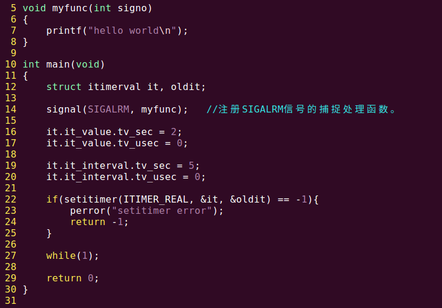

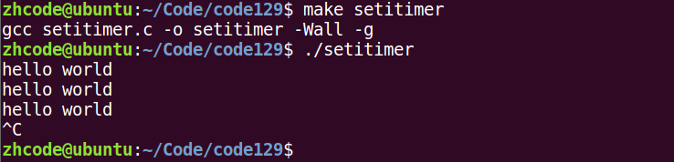

## 信号集操作函数

信号集操作函数用于管理 `sigset_t` 类型的信号集合：

```c
sigset_t set;                              // 自定义信号集

int sigemptyset(sigset_t *set);            // 清空信号集（所有位置0）
int sigfillset(sigset_t *set);             // 填充信号集（所有位置1）
int sigaddset(sigset_t *set, int signum);  // 将指定信号添加到集合中
int sigdelset(sigset_t *set, int signum);  // 将指定信号从集合中移除
int sigismember(const sigset_t *set, int signum); // 判断信号是否在集合中，存在返回1，否则返回0
```

**设置和解除信号屏蔽字：**

```c
int sigprocmask(int how, const sigset_t *set, sigset_t *oldset);
```

**参数：**

- `how`：操作方式。
  - `SIG_BLOCK`：将 `set` 中的信号添加到当前屏蔽字中（阻塞）。
  - `SIG_UNBLOCK`：将 `set` 中的信号从当前屏蔽字中移除（解除阻塞）。
  - `SIG_SETMASK`：用 `set` 替换当前屏蔽字。
- `set`：自定义信号集。
- `oldset`：传出参数，保存修改前的屏蔽字，可为 `NULL`。

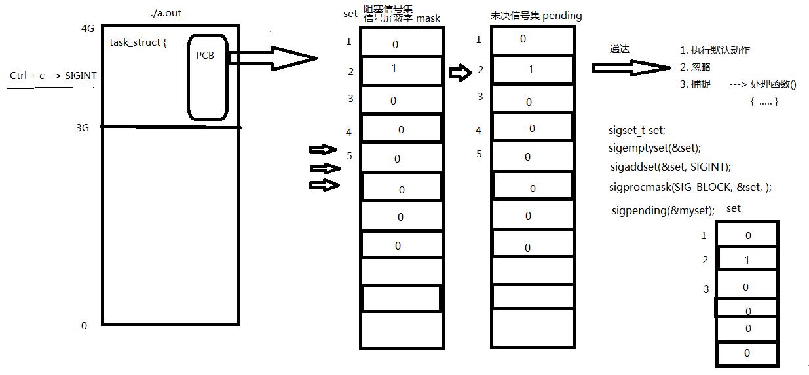

**查看未决信号集：**

```c
int sigpending(sigset_t *set);
```

- `set`：传出参数，保存当前的未决信号集。

## 信号操作函数使用原理分析


## 信号集操作函数练习

在常规信号中，`SIGKILL`（编号 9）和 `SIGSTOP`（编号 19）比较特殊，只能执行默认动作，不能被忽略、捕捉或阻塞。

以下示例利用自定义信号集设置信号阻塞，通过发送被阻塞的信号，观察未决信号集的变化：

```c
#include <stdio.h>
#include <signal.h>
#include <stdlib.h>
#include <string.h>
#include <unistd.h>
#include <errno.h>
#include <pthread.h>

void sys_err(const char *str)
{
    perror(str);
    exit(1);
}

void print_set(sigset_t *set)
{
    int i;
    for (i = 1; i < 32; i++) {
        if (sigismember(set, i))
            putchar('1');
        else
            putchar('0');
    }
    printf("\n");
}

int main(int argc, char *argv[])
{
    sigset_t set, oldset, pedset;
    int ret = 0;

    sigemptyset(&set);
    sigaddset(&set, SIGINT);
    sigaddset(&set, SIGQUIT);
    sigaddset(&set, SIGBUS);
    sigaddset(&set, SIGKILL);

    ret = sigprocmask(SIG_BLOCK, &set, &oldset);
    if (ret == -1)
        sys_err("sigprocmask error");

    while (1) {
        ret = sigpending(&pedset);
        print_set(&pedset);
        sleep(1);
    }

    return 0;
}
```

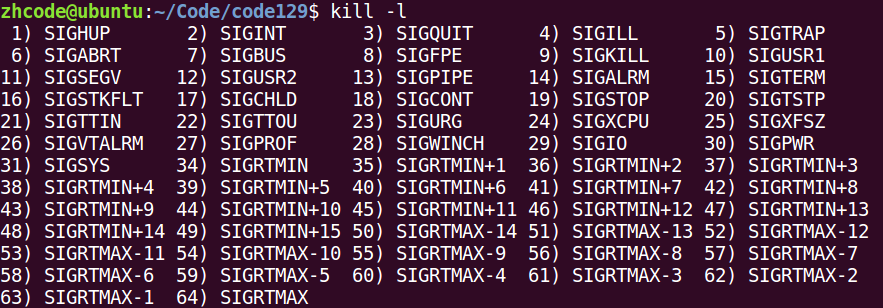

编译运行，如下图所示。输入 `Ctrl+C` 后，进程接收到信号，但由于设置了阻塞，信号未被处理，未决信号集对应位变为 1。

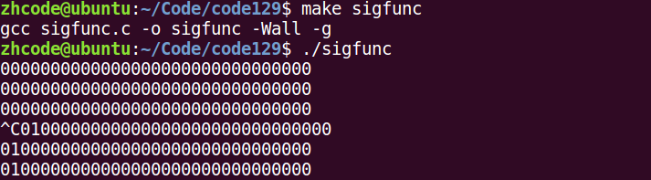

## signal 实现信号捕捉

`signal` 函数用于注册信号处理函数。

**参数：**

- `signum`：待捕捉的信号编号。
- `handler`：信号处理函数指针。

**信号捕捉特性：**

1. 信号处理函数执行期间，信号屏蔽字由 `mask` 临时替换为 `sa_mask`；处理函数执行完毕后恢复为 `mask`。
2. 信号处理函数执行期间，该信号本身自动被屏蔽（当 `sa_flags` 为默认值 `0` 时）。
3. 信号处理函数执行期间，若被屏蔽的信号多次发送，解除屏蔽后只处理一次。

以下是一个信号捕捉的示例：

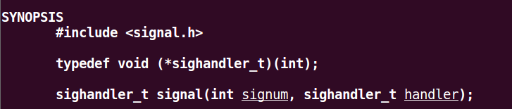

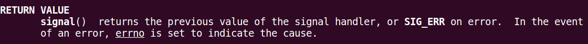

编译运行，结果如下：

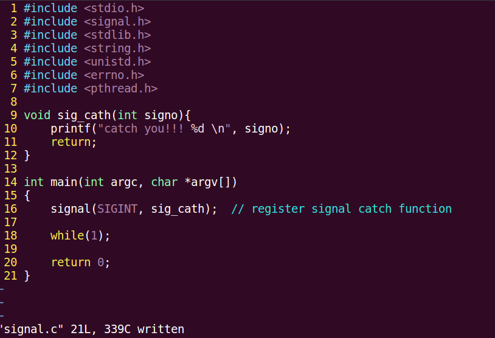

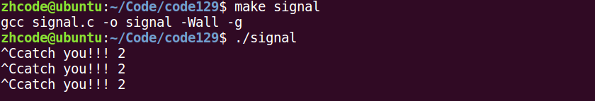

## sigaction 实现信号捕捉

`sigaction` 函数同样用于注册信号捕捉函数，但比 `signal` 提供了更精细的控制。

```c
int sigaction(int signum, const struct sigaction *act, struct sigaction *oldact);
```

**参数：**

- `signum`：待捕捉的信号编号。
- `act`：指向新的信号处理动作配置。
- `oldact`：传出参数，保存原来的信号处理动作，可为 `NULL`。

以下示例使用 `sigaction` 捕捉 `SIGINT` 和 `SIGQUIT` 两个信号：

```c
#include <stdio.h>
#include <signal.h>
#include <stdlib.h>
#include <string.h>
#include <unistd.h>
#include <errno.h>
#include <pthread.h>

void sys_err(const char *str)
{
    perror(str);
    exit(1);
}

void sig_catch(int signo)                   // 信号处理回调函数
{
    if (signo == SIGINT) {
        printf("catch you!! %d\n", signo);
        sleep(10);
    }
    else if (signo == SIGQUIT)
        printf("-----------catch you!! %d\n", signo);

    return;
}

int main(int argc, char *argv[])
{
    struct sigaction act, oldact;

    act.sa_handler = sig_catch;             // 设置回调函数
    sigemptyset(&(act.sa_mask));            // 清空sa_mask，仅在sig_catch执行期间有效
    //sigaddset(&act.sa_mask, SIGQUIT);
    act.sa_flags = 0;                       // 使用默认属性

    int ret = sigaction(SIGINT, &act, &oldact);   // 注册SIGINT信号捕捉函数
    if (ret == -1)
        sys_err("sigaction error");
    ret = sigaction(SIGQUIT, &act, &oldact);      // 注册SIGQUIT信号捕捉函数

    while (1);

    return 0;
}
```

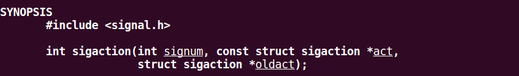

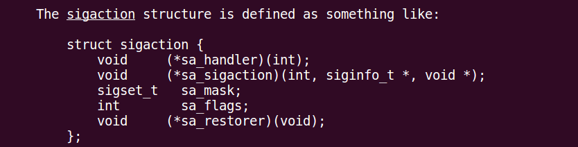

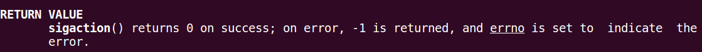

编译运行，如下图所示，两个信号均被成功捕捉并输出了对应信息。

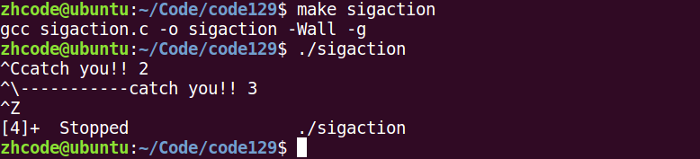

## 信号捕捉的特性

**信号捕捉特性：**

1. 信号处理函数执行期间，信号屏蔽字由 `mask` 临时替换为 `sa_mask`；处理函数执行完毕后恢复为 `mask`。
2. 信号处理函数执行期间，该信号本身自动被屏蔽（当 `sa_flags` 为默认值 `0` 时）。
3. 信号处理函数执行期间，若被屏蔽的信号多次发送，解除屏蔽后只处理一次。

## 内核实现信号捕捉简析

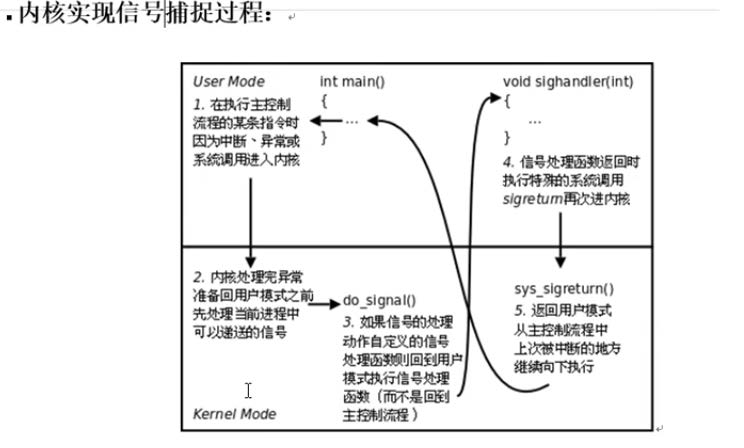

## 借助信号捕捉回收子进程

`SIGCHLD` 信号的产生条件：

1. 子进程终止时。
2. 子进程接收到 `SIGSTOP` 信号时。
3. 子进程处于停止态，接收到 `SIGCONT` 信号后被唤醒时。

**示例一：** 创建子进程，使用信号捕捉方式回收（单次回收）：

```c
#include <stdio.h>
#include <stdlib.h>
#include <string.h>
#include <unistd.h>
#include <signal.h>
#include <sys/wait.h>
#include <errno.h>
#include <pthread.h>

void sys_err(const char *str)
{
    perror(str);
    exit(1);
}

void catch_child(int signo)
{
    pid_t wpid;

    wpid = wait(NULL);
    printf("-----------catch child id %d\n", wpid);

    return;
}

int main(int argc, char *argv[])
{
    pid_t pid;
    // 阻塞SIGCHLD信号
    int i;
    for (i = 0; i < 5; i++)
        if ((pid = fork()) == 0)                // 创建多个子进程
            break;

    if (5 == i) {
        struct sigaction act;

        act.sa_handler = catch_child;           // 设置回调函数
        sigemptyset(&act.sa_mask);              // 设置捕捉函数执行期间屏蔽字
        act.sa_flags = 0;                       // 默认属性，本信号自动屏蔽

        sigaction(SIGCHLD, &act, NULL);         // 注册信号捕捉函数
        // 解除阻塞

        printf("I'm parent, pid = %d\n", getpid());

        while (1);

    } else {
        printf("I'm child pid = %d\n", getpid());
        return i;
    }

    return 0;
}
```

编译运行，结果如下图所示。每次执行仅回收到 1 个子进程，且回收数量不固定。

**原因分析：** 问题在于每次信号回调仅回收一个子进程。当多个子进程几乎同时终止时，其中一个子进程的终止信号被捕捉，父进程进入信号处理函数；此时其他子进程的终止信号陆续到达，由于**相同信号不排队**的原则（标准信号不支持排队，多次发送同一信号只会记录一次），最终只会回收累积信号中的一个子进程。

**示例二：** 修改回调函数，在处理函数中使用循环回收所有已终止的子进程：

```c
#include <stdio.h>
#include <stdlib.h>
#include <string.h>
#include <unistd.h>
#include <signal.h>
#include <sys/wait.h>
#include <errno.h>
#include <pthread.h>

void sys_err(const char *str)
{
    perror(str);
    exit(1);
}

void catch_child(int signo)
{
    pid_t wpid;

    while ((wpid = wait(NULL)) != -1) {
        printf("-----------catch child id %d\n", wpid);
    }
    return;
}

int main(int argc, char *argv[])
{
    pid_t pid;
    // 阻塞SIGCHLD信号
    int i;
    for (i = 0; i < 5; i++)
        if ((pid = fork()) == 0)                // 创建多个子进程
            break;

    if (5 == i) {
        struct sigaction act;

        act.sa_handler = catch_child;           // 设置回调函数
        sigemptyset(&act.sa_mask);              // 设置捕捉函数执行期间屏蔽字
        act.sa_flags = 0;                       // 默认属性，本信号自动屏蔽

        sigaction(SIGCHLD, &act, NULL);         // 注册信号捕捉函数
        // 解除阻塞

        printf("I'm parent, pid = %d\n", getpid());

        while (1);

    } else {
        printf("I'm child pid = %d\n", getpid());
        return i;
    }

    return 0;
}
```

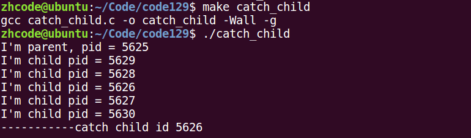

编译运行，所有子进程均被成功回收。

**注意事项：** 存在一种时序问题——父进程可能尚未完成信号处理函数的注册，子进程就已经终止。解决方法是在 `fork` 之前通过 `sigprocmask` 阻塞 `SIGCHLD` 信号，待注册完成后再解除阻塞。这样即使子进程先终止，其信号也因被屏蔽而暂存于未决信号集中，解除屏蔽后父进程即可处理累积的信号。

以下为完整的信号回收子进程代码，使用 `sigprocmask` 阻塞与解除阻塞确保所有子进程均被回收：

```c
#include <stdio.h>
#include <stdlib.h>
#include <string.h>
#include <unistd.h>
#include <signal.h>
#include <sys/wait.h>
#include <errno.h>
#include <pthread.h>

void sys_err(const char *str)
{
    perror(str);
    exit(1);
}

void catch_child(int signo)         // 子进程终止时发送SIGCHLD信号，该函数被内核回调
{
    pid_t wpid;
    int status;

    // while ((wpid = wait(NULL)) != -1) {
    while ((wpid = waitpid(-1, &status, 0)) != -1) {    // 循环回收，防止僵尸进程产生
        if (WIFEXITED(status))
            printf("---------------catch child id %d, ret=%d\n", wpid, WEXITSTATUS(status));
    }

    return;
}

int main(int argc, char *argv[])
{
    pid_t pid;
    // 阻塞SIGCHLD信号
    sigset_t set;
    sigemptyset(&set);
    sigaddset(&set, SIGCHLD);

    sigprocmask(SIG_BLOCK, &set, NULL);

    int i;
    for (i = 0; i < 15; i++)
        if ((pid = fork()) == 0)                // 创建多个子进程
            break;

    if (15 == i) {
        struct sigaction act;

        act.sa_handler = catch_child;           // 设置回调函数
        sigemptyset(&act.sa_mask);              // 设置捕捉函数执行期间屏蔽字
        act.sa_flags = 0;                       // 默认属性，本信号自动屏蔽

        sigaction(SIGCHLD, &act, NULL);         // 注册信号捕捉函数
        // 解除阻塞
        sigprocmask(SIG_UNBLOCK, &set, NULL);

        printf("I'm parent, pid = %d\n", getpid());

        while (1);

    } else {
        printf("I'm child pid = %d\n", getpid());
        return i;
    }

    return 0;
}
```

编译运行，所有子进程均被成功回收。

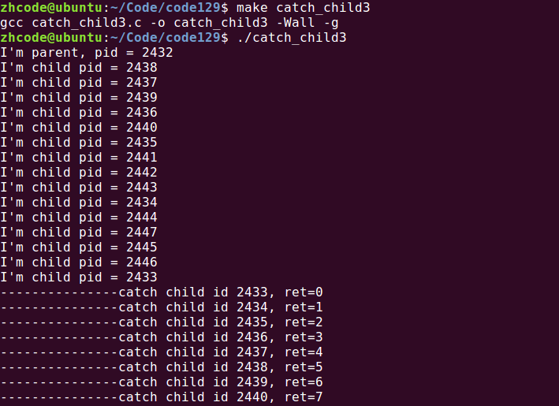

## 慢速系统调用中断

**慢速系统调用**是指可能使进程永久阻塞的一类系统调用。如果在阻塞期间收到信号，该系统调用可能被中断（早期行为）。可通过设置 `sa_flags` 中的 `SA_RESTART` 标志来控制是否自动重启被中断的系统调用。

常见的慢速系统调用包括 `read`、`write`、`pause` 等。

## 信号机制总结

本章要点回顾：

- **信号本质**：软件层面上的"中断"，由内核完成产生和处理。
- **信号生命周期**：产生 -> 未决 -> 递达，可通过信号屏蔽字阻塞信号。
- **信号集操作**：`sigemptyset`/`sigfillset`/`sigaddset`/`sigdelset`/`sigismember` 管理信号集，`sigprocmask` 设置屏蔽字，`sigpending` 查看未决信号集。
- **信号发送**：`kill`（向指定进程/进程组发送）、`alarm`/`setitimer`（定时发送）、`raise`/`abort`（向自身发送）。
- **信号捕捉**：`signal`（简单注册）、`sigaction`（精细控制，推荐使用）。处理函数执行期间信号屏蔽字临时替换为 `sa_mask`，该信号自身被自动屏蔽，多次发送只处理一次。
- **应用**：捕捉 `SIGCHLD` 信号可异步回收子进程，配合 `sigprocmask` 阻塞/解除阻塞可避免时序问题。

## 会话

**会话（Session）** 是多个进程组的集合。

**创建会话的注意事项：**

1. 调用进程不能是进程组组长，该进程将成为新会话的会话首进程（Session Leader）。
2. 该进程成为新进程组的组长进程。
3. 新会话将丢弃原有的控制终端，即该会话没有控制终端。
4. 若调用进程是进程组组长，则调用失败返回 `-1`。
5. 实际使用中，通常先调用 `fork` 创建子进程，父进程终止后由子进程调用 `setsid`。

**`getsid` 函数：** 获取指定进程的会话 ID。

```c
pid_t getsid(pid_t pid);
```

- 成功：返回调用进程的会话 ID。
- 失败：返回 `-1`，并设置 `errno`。

**`setsid` 函数：** 创建一个新会话，调用进程成为新会话的会话首进程和新进程组的组长进程。

```c
pid_t setsid(void);
```

- 成功：返回新会话的 ID。
- 失败：返回 `-1`，并设置 `errno`。

## 守护进程创建步骤分析

**守护进程（Daemon Process）** 是运行在操作系统后台的进程，脱离控制终端，一般不与用户直接交互。守护进程通常周期性地等待某个事件发生或周期性地执行某一任务，不受用户登录和注销的影响。守护进程通常以 `d` 结尾命名（如 `httpd`、`sshd`）。

创建守护进程最关键的一步是调用 `setsid` 函数创建一个新的会话，并成为会话首进程。

**守护进程创建步骤：**

1. 调用 `fork` 创建子进程，父进程退出。这确保子进程不是进程组组长，为后续 `setsid` 调用创造条件。
2. 子进程调用 `setsid` 创建新会话。
3. 根据需要调用 `chdir` 改变工作目录，防止目录被卸载导致问题。
4. 根据需要调用 `umask` 重设文件权限掩码，影响后续创建文件的默认权限。例如 `umask(0022)` 对应默认权限 `755`（目录）或 `644`（文件）。
5. 根据需要关闭或重定向文件描述符（关闭 `stdin`、`stdout`、`stderr`）。
6. 实现守护进程的业务逻辑（通常为死循环）。

## 守护进程创建

以下示例演示创建一个守护进程：

```c
#include <stdio.h>
#include <sys/stat.h>
#include <fcntl.h>
#include <stdlib.h>
#include <string.h>
#include <unistd.h>
#include <errno.h>
#include <pthread.h>

void sys_err(const char *str)
{
    perror(str);
    exit(1);
}

int main(int argc, char *argv[])
{
    pid_t pid;
    int ret, fd;

    pid = fork();
    if (pid > 0)                            // 父进程退出
        exit(0);

    pid = setsid();                         // 创建新会话
    if (pid == -1)
        sys_err("setsid error");

    ret = chdir("/home/zhcode/Code/code146");  // 改变工作目录
    if (ret == -1)
        sys_err("chdir error");

    umask(0022);                            // 设置文件权限掩码

    close(STDIN_FILENO);                    // 关闭标准输入

    fd = open("/dev/null", O_RDWR);         // 将fd重定向到/dev/null
    if (fd == -1)
        sys_err("open error");

    dup2(fd, STDOUT_FILENO);                // 重定向标准输出
    dup2(fd, STDERR_FILENO);                // 重定向标准错误

    while (1);                              // 守护进程业务逻辑

    return 0;
}
```

编译运行，结果如下。查看进程列表，可以看到该守护进程独立于终端运行，不受用户登录和注销的影响。要终止守护进程，需使用 `kill` 命令发送信号。

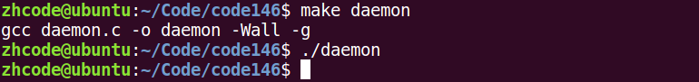

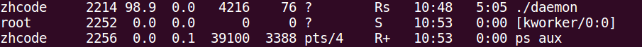
