# 第11章 线程

## 目录

- [线程概念](#线程概念)
- [三级映射](#三级映射)
- [线程共享与非共享资源](#线程共享与非共享资源)
- [创建线程](#创建线程)
- [循环创建多个子线程](#循环创建多个子线程)
- [错误分析](#错误分析)
- [线程间全局变量共享](#线程间全局变量共享)
- [`pthread_exit` 退出](#pthreadexit-退出)
- [`pthread_join`](#pthreadjoin)
- [`pthread_join` 作业](#pthreadjoin-作业)
- [`pthread_cancel` 函数](#pthreadcancel-函数)
- [检查出错返回与线程分离](#检查出错返回与线程分离)
- [线程分离 `pthread_detach`](#线程分离-pthreaddetach)
- [进程和线程控制原语对比](#进程和线程控制原语对比)
- [线程属性设置分离线程](#线程属性设置分离线程)
- [线程使用注意事项](#线程使用注意事项)
- [总结](#总结)
  - [线程概念](#线程概念-1)
  - [线程控制原语](#线程控制原语)
  - [进程和线程控制原语对比](#进程和线程控制原语对比)
  - [线程属性](#线程属性)

---


## 线程概念

进程：拥有独立的进程地址空间和独立的 PCB，是**资源分配**的基本单位。

线程：拥有独立的 PCB，但没有独立的进程地址空间，是 **CPU 调度**的基本单位。

```bash
ps -Lf 进程id
```

通过该命令可查看线程号（LWP），LWP 是 CPU 调度执行的最小单位。

```bash
ps -Lf 进程号
```

查看指定进程的所有线程。

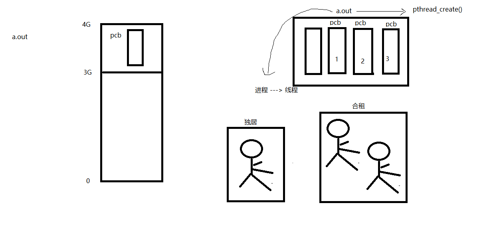

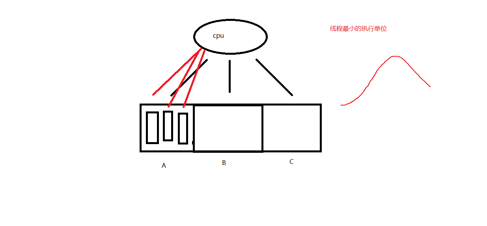

## 三级映射

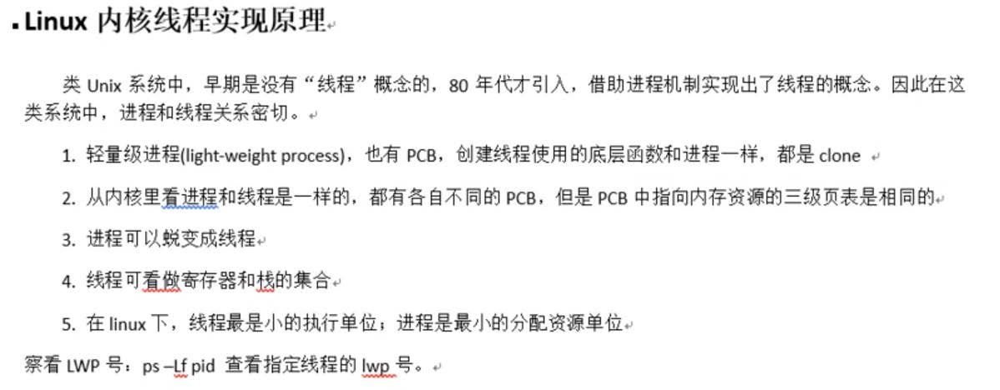

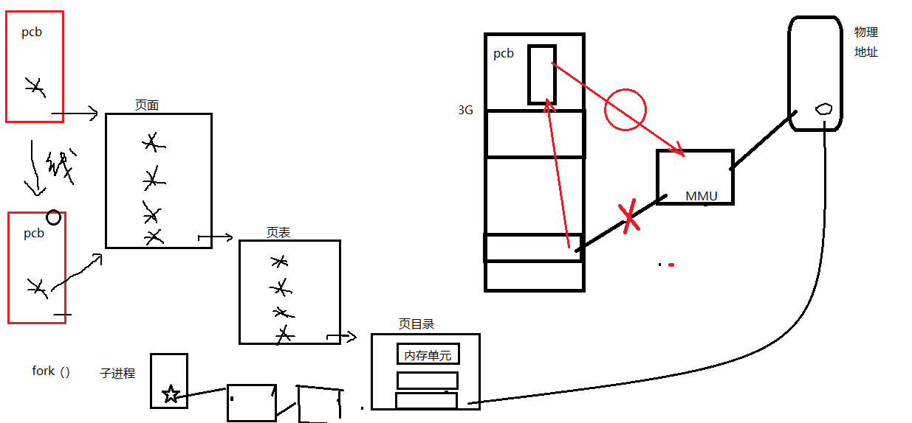

## 线程共享与非共享资源

线程**独享**栈空间（内核栈、用户栈）。

线程**共享** `.text`、`.data`、`.rodata`、`.bss`、`heap`，即共享全局变量（包括 `errno`）。

## 创建线程

**获取线程 ID：**

```c
pthread_t pthread_self(void);
```

返回当前线程 ID。线程 ID 用于在进程地址空间内部标识线程身份。

**检查线程函数出错返回：**

```c
fprintf(stderr, "xxx error: %s\n", strerror(ret));
```

**创建子线程：**

```c
int pthread_create(pthread_t *tid, const pthread_attr_t *attr,
                   void *(*start_routine)(void *), void *arg);
```

- **参数 1（`tid`）**：传出参数，用于存储新创建的子线程 ID。
- **参数 2（`attr`）**：线程属性，传 `NULL` 表示使用默认属性。
- **参数 3（`start_routine`）**：子线程回调函数。创建成功后，`pthread_create` 返回时该函数会被自动调用。
- **参数 4（`arg`）**：传递给回调函数的参数，无参数时传 `NULL`。
- **返回值**：成功返回 `0`；失败返回错误码 `errno`。

下面的例子创建一个子线程来执行指定任务：

```c
#include <stdio.h>
#include <stdlib.h>
#include <string.h>
#include <unistd.h>
#include <errno.h>
#include <pthread.h>

void sys_err(const char *str){
    perror(str);
    exit(1);
}

void *tfn(void *arg){
    printf("thread: pid = %d, tid = %lu\n", getpid(), pthread_self());
    return NULL;
}

int main(int argc, char *argv[]){
    pthread_t tid;

    printf("main: pid = %d, tid = %lu\n", getpid(), pthread_self());

    int ret = pthread_create(&tid, NULL, tfn, NULL);
    if (ret != 0) {
        perror("pthread_create error");
    }

    return 0;
}
```

编译运行后可以发现，子线程的打印信息并未出现。原因是主线程执行完毕后销毁了整个进程的地址空间，子线程来不及执行。一个简单的解决方法是让主线程休眠 1 秒，等待子线程执行完毕。

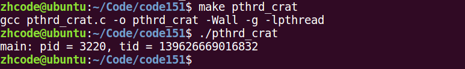

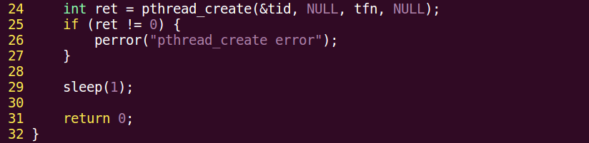

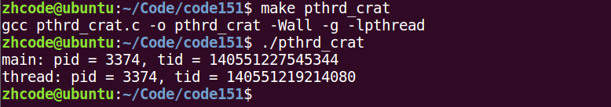

## 循环创建多个子线程

以下示例循环创建多个子线程：

```c
#include <stdio.h>
#include <stdlib.h>
#include <string.h>
#include <unistd.h>
#include <errno.h>
#include <pthread.h>

void sys_err(const char *str){
    perror(str);
    exit(1);
}

void *tfn(void *arg){
    int i = (int)arg;
    sleep(i);
    printf("--I'm %dth thread: pid = %d, tid = %lu\n", i+1, getpid(), pthread_self());
    return NULL;
}

int main(int argc, char *argv[]){
    int i;
    int ret;
    pthread_t tid;

    for(i = 0; i < 5; i++){
        ret = pthread_create(&tid, NULL, tfn, (void *)i);
        if (ret != 0) {
            sys_err("pthread_create error");
        }
    }
    sleep(i);
    printf("I'm main, pid = %d, tid = %lu\n", getpid(), pthread_self());

    return 0;
}
```

编译时可能出现类型强转警告（指针 4 字节转 `int` 的 8 字节），但此处不存在精度损失，可忽略。

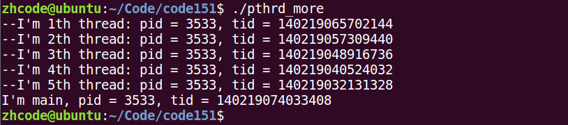

## 错误分析

在上一节的代码中，如果将 `i` 取地址后再传入线程创建函数，即将 `(void *)i` 改为 `(void *)&i`，同时在回调函数中改为 `int i = *((int *)arg)`，运行时会出现问题。

如果多次运行都只有主线程的输出，可将主线程等待时长改为大于 6 的数值。因为子线程的等待时间 `i` 不固定（但均小于等于 6 秒），若主线程抢占 CPU 后未及时让出，子线程可能无法输出。

错误原因在于：子线程通过引用传递 `i` 时，会读取主线程中 `i` 的值，而主线程中的 `i` 是动态变化的。因此**应当采用值传递，而非引用传递**。

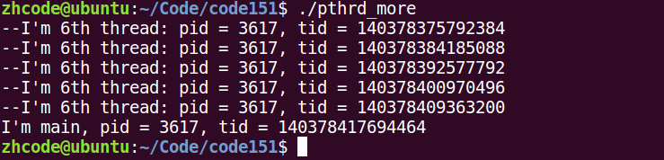

## 线程间全局变量共享

在子线程中修改全局变量后，主线程中该变量的值也会同步变化，因为同一进程内的所有线程共享全局变量。

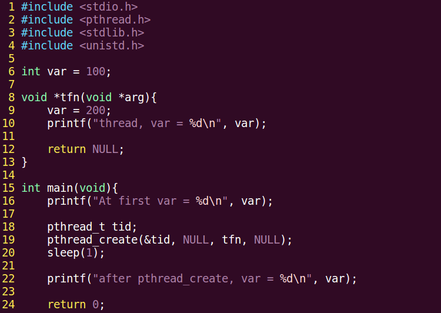

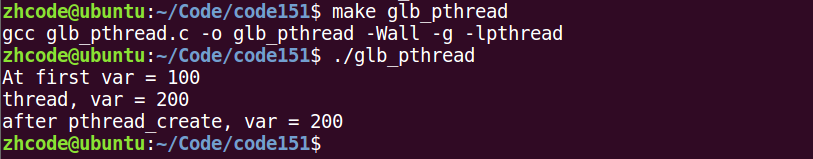

## `pthread_exit` 退出

```c
void pthread_exit(void *retval);
```

退出当前线程。`retval` 为退出值，无退出值时传 `NULL`。

**`exit()`、`return` 和 `pthread_exit()` 的区别：**

- `exit()`：退出当前**进程**。
- `return`：返回到调用者（函数返回）。
- `pthread_exit()`：退出当前**线程**。

如果在回调函数中调用 `exit(0)`，看起来像是退出了当前子线程，但实际上会终止整个进程，后续线程也不会再执行。

**一、使用 `return NULL`：**

后续线程不会终止，说明 `return` 可以结束当前线程函数。但严格来说，`return` 是返回到函数调用者，并非真正退出线程。

**二、调用自定义函数：**

```c
void *func(void){
    return NULL;
}
```

在回调函数中调用 `func()`，运行后所有线程仍在执行，说明仅通过函数返回无法达到退出线程的目的。

**三、使用 `pthread_exit`：**

```c
void *func(void){
    pthread_exit(NULL);
    return NULL;
}
```

在回调函数中调用 `func()`，运行后对应线程成功退出。`pthread_exit` 无论放在哪个函数中调用，都可以退出当前线程。

**用 `pthread_exit` 替代主线程的 `return 0`：** 由于主线程可能先于子线程结束，导致子线程的输出无法打印。之前使用 `sleep` 等待，现在可以用 `pthread_exit` 替代主线程的 `return 0`，仅退出当前线程而不影响其他线程。

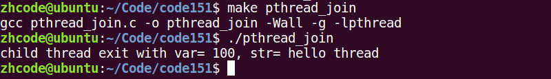

## `pthread_join`

```c
int pthread_join(pthread_t thread, void **retval);
```

阻塞等待并回收指定线程。

- **参数 1（`thread`）**：待回收的线程 ID。
- **参数 2（`retval`）**：传出参数，接收被回收线程的退出值。线程异常终止时，值为 `-1`。
- **返回值**：成功返回 `0`；失败返回错误码 `errno`。

以下示例演示回收线程并获取子线程返回值：

```c
#include <stdio.h>
#include <stdlib.h>
#include <string.h>
#include <unistd.h>
#include <errno.h>
#include <pthread.h>

struct thrd {
    int var;
    char str[256];
};

void sys_err(const char *str)
{
    perror(str);
    exit(1);
}

void *tfn(void *arg)
{
    struct thrd *tval;

    tval = malloc(sizeof(struct thrd));
    tval->var = 100;
    strcpy(tval->str, "hello thread");

    return (void *)tval;
}

int main(int argc, char *argv[])
{
    pthread_t tid;
    struct thrd *retval;

    int ret = pthread_create(&tid, NULL, tfn, NULL);
    if (ret != 0)
        sys_err("pthread_create error");

    ret = pthread_join(tid, (void **)&retval);
    if (ret != 0)
        sys_err("pthread_join error");

    printf("child thread exit with var= %d, str= %s\n", retval->var, retval->str);

    pthread_exit(NULL);
}
```

> 注意：原代码中 `malloc(sizeof(tval))` 应为 `malloc(sizeof(struct thrd))`，`tval` 是指针而非结构体。


## `pthread_join` 作业

使用 `pthread_join` 函数回收循环创建的多个子线程。注意 `tid` 需要使用数组来存储每个子线程的 ID。

## `pthread_cancel` 函数

```c
int pthread_cancel(pthread_t thread);
```

终止（杀死）一个线程。目标线程需要到达**取消点**（cancellation point）才能被终止。

- **参数（`thread`）**：待终止的线程 ID。
- **返回值**：成功返回 `0`；失败返回错误码 `errno`。

如果子线程没有到达取消点，`pthread_cancel` 将无效。可以在程序中手动添加取消点，调用 `pthread_testcancel()` 即可。

被 `pthread_cancel()` 成功终止的线程，其返回值为 `-1`，使用 `pthread_join` 回收。

以下示例演示主线程调用 `pthread_cancel` 终止子线程：

```c
#include <stdio.h>
#include <stdlib.h>
#include <string.h>
#include <unistd.h>
#include <errno.h>
#include <pthread.h>

void *tfn(void *arg){
    while (1) {
        printf("thread: pid = %d, tid = %lu\n", getpid(), pthread_self());
        sleep(1);
    }
    return NULL;
}

int main(int argc, char *argv[]){
    pthread_t tid;

    int ret = pthread_create(&tid, NULL, tfn, NULL);
    if (ret != 0) {
        fprintf(stderr, "pthread_create error:%s\n", strerror(ret));
        exit(1);
    }

    printf("main: pid = %d, tid = %lu\n", getpid(), pthread_self());

    sleep(5);

    ret = pthread_cancel(tid);
    if (ret != 0) {
        fprintf(stderr, "pthread_cancel error:%s\n", strerror(ret));
        exit(1);
    }

    while (1);

    pthread_exit((void *)0);
}
```

`pthread_cancel` 的必要条件是目标线程进入内核态。如果线程函数始终在用户态运行而不进入内核，则 `pthread_cancel` 无法终止该线程，此时需要手动调用 `pthread_testcancel()` 设置取消点。

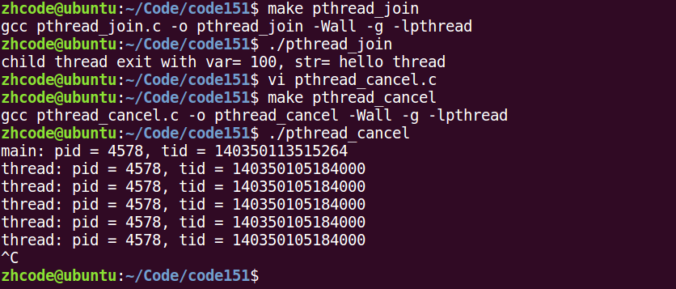

## 检查出错返回与线程分离

```c
int pthread_detach(pthread_t thread);
```

设置线程分离。分离后的线程终止时会自动回收资源，无需调用 `pthread_join`。

- **参数（`thread`）**：待分离的线程 ID。
- **返回值**：成功返回 `0`；失败返回错误码 `errno`。

以下示例使用 `pthread_detach` 分离线程：

```c
#include <stdio.h>
#include <stdlib.h>
#include <string.h>
#include <unistd.h>
#include <errno.h>
#include <pthread.h>

void *tfn(void *arg)
{
    printf("thread: pid = %d, tid = %lu\n", getpid(), pthread_self());
    return NULL;
}

int main(int argc, char *argv[])
{
    pthread_t tid;

    int ret = pthread_create(&tid, NULL, tfn, NULL);
    if (ret != 0) {
        perror("pthread_create error");
    }
    ret = pthread_detach(tid);   // 设置线程分离，线程终止时自动清理 PCB，无需回收
    if (ret != 0) {
        perror("pthread_detach error");
    }

    sleep(1);

    ret = pthread_join(tid, NULL);
    printf("join ret = %d\n", ret);
    if (ret != 0) {
        perror("pthread_join error");
    }

    printf("main: pid = %d, tid = %lu\n", getpid(), pthread_self());

    pthread_exit((void *)0);
}
```

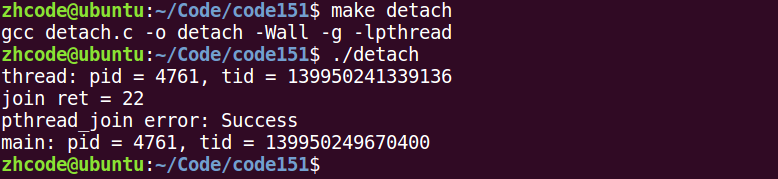

运行后 `pthread_join` 会报错，但 `perror` 无法正确打印线程函数的错误原因。这是因为 `perror` 依赖全局 `errno`，而 pthread 函数返回的错误码并不一定设置 `errno`。**应当使用 `strerror(ret)` 来获取线程函数的错误描述**：

```c
#include <stdio.h>
#include <stdlib.h>
#include <string.h>
#include <unistd.h>
#include <errno.h>
#include <pthread.h>

void *tfn(void *arg)
{
    printf("thread: pid = %d, tid = %lu\n", getpid(), pthread_self());
    return NULL;
}

int main(int argc, char *argv[])
{
    pthread_t tid;

    int ret = pthread_create(&tid, NULL, tfn, NULL);
    if (ret != 0) {
        fprintf(stderr, "pthread_create error: %s\n", strerror(ret));
        exit(1);
    }
    ret = pthread_detach(tid);   // 设置线程分离，线程终止时自动清理 PCB，无需回收
    if (ret != 0) {
        fprintf(stderr, "pthread_detach error: %s\n", strerror(ret));
        exit(1);
    }

    sleep(1);

    ret = pthread_join(tid, NULL);
    printf("join ret = %d\n", ret);
    if (ret != 0) {
        fprintf(stderr, "pthread_join error: %s\n", strerror(ret));
        exit(1);
    }

    printf("main: pid = %d, tid = %lu\n", getpid(), pthread_self());

    pthread_exit((void *)0);
}
```

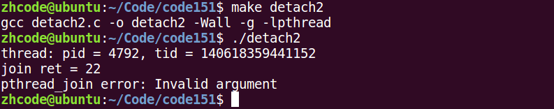

## 线程分离 `pthread_detach`

上一节中 `pthread_join` 报错的原因是：线程分离后系统会自动回收资源，再使用 `pthread_join` 回收已被系统回收的线程，此时线程 ID 已是无效参数。

## 进程和线程控制原语对比

| 线程控制原语 | 进程控制原语 |
|---|---|
| `pthread_create()` | `fork()` |
| `pthread_self()` | `getpid()` |
| `pthread_exit()` | `exit()` / `return` |
| `pthread_join()` | `wait()` / `waitpid()` |
| `pthread_cancel()` | `kill()` |
| `pthread_detach()` | — |

## 线程属性设置分离线程

通过设置线程属性，可以使线程在创建时即为分离态，无需事后调用 `pthread_detach`。

```c
pthread_attr_t attr;                                    // 创建线程属性结构体变量
pthread_attr_init(&attr);                               // 初始化线程属性
pthread_attr_setdetachstate(&attr, PTHREAD_CREATE_DETACHED);  // 设置为分离态
pthread_create(&tid, &attr, tfn, NULL);                 // 创建分离态线程
pthread_attr_destroy(&attr);                            // 销毁线程属性
```

完整示例代码：

```c
#include <stdio.h>
#include <stdlib.h>
#include <string.h>
#include <unistd.h>
#include <errno.h>
#include <pthread.h>

void *tfn(void *arg)
{
    printf("thread: pid = %d, tid = %lu\n", getpid(), pthread_self());
    return NULL;
}

int main(int argc, char *argv[])
{
    pthread_t tid;
    pthread_attr_t attr;

    int ret = pthread_attr_init(&attr);
    if (ret != 0) {
        fprintf(stderr, "attr_init error:%s\n", strerror(ret));
        exit(1);
    }

    ret = pthread_attr_setdetachstate(&attr, PTHREAD_CREATE_DETACHED);  // 设置分离属性
    if (ret != 0) {
        fprintf(stderr, "attr_setdetachstate error:%s\n", strerror(ret));
        exit(1);
    }

    ret = pthread_create(&tid, &attr, tfn, NULL);
    if (ret != 0) {
        perror("pthread_create error");
    }

    ret = pthread_attr_destroy(&attr);
    if (ret != 0) {
        fprintf(stderr, "attr_destroy error:%s\n", strerror(ret));
        exit(1);
    }

    ret = pthread_join(tid, NULL);
    if (ret != 0) {
        fprintf(stderr, "pthread_join error:%s\n", strerror(ret));
        exit(1);
    }

    printf("main: pid = %d, tid = %lu\n", getpid(), pthread_self());

    pthread_exit((void *)0);
}
```

运行后 `pthread_join` 报错，说明线程已被系统自动回收，分离属性设置成功。

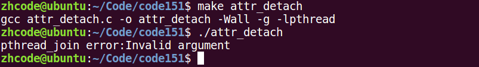

## 线程使用注意事项

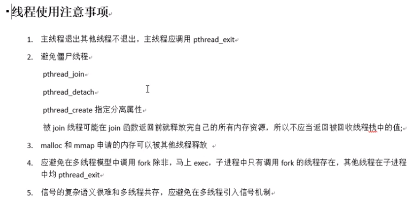

## 总结

### 线程概念

进程是**资源分配**的基本单位，线程是 **CPU 调度**的基本单位。线程独享栈空间（内核栈、用户栈），共享 `.text`、`.data`、`.rodata`、`.bss`、`heap` 等全局变量。

### 线程控制原语

| 函数 | 功能 |
|---|---|
| `pthread_self()` | 获取当前线程 ID |
| `pthread_create()` | 创建子线程 |
| `pthread_exit()` | 退出当前线程 |
| `pthread_join()` | 阻塞等待并回收线程 |
| `pthread_detach()` | 设置线程分离，终止时自动回收 |
| `pthread_cancel()` | 终止线程（需到达取消点） |

出错检查应使用 `strerror(ret)` 而非 `perror()`，因为 pthread 函数返回错误码而非设置 `errno`。

### 进程和线程控制原语对比

| 线程控制原语 | 进程控制原语 |
|---|---|
| `pthread_create()` | `fork()` |
| `pthread_self()` | `getpid()` |
| `pthread_exit()` | `exit()` / `return` |
| `pthread_join()` | `wait()` / `waitpid()` |
| `pthread_cancel()` | `kill()` |
| `pthread_detach()` | — |

### 线程属性

通过 `pthread_attr_setdetachstate(&attr, PTHREAD_CREATE_DETACHED)` 设置线程属性，可使线程在创建时即为分离态，无需事后调用 `pthread_detach`。
