# 第12章 线程同步

## 目录

- [线程同步概念](#线程同步概念)
- [锁使用的注意事项](#锁使用的注意事项)
- [借助互斥锁管理共享数据实现同步](#借助互斥锁管理共享数据实现同步)
- [互斥锁使用技巧](#互斥锁使用技巧)
- [try 锁](#try-锁)
- [读写锁操作函数原型](#读写锁操作函数原型)
- [两种死锁](#两种死锁)
- [读写锁原理](#读写锁原理)
- [读写锁示例（rwlock）](#读写锁示例rwlock)
- [静态初始化条件变量和互斥量](#静态初始化条件变量和互斥量)
- [条件变量和相关函数 wait](#条件变量和相关函数-wait)
- [条件变量的生产者消费者模型分析](#条件变量的生产者消费者模型分析)
- [条件变量生产者消费者代码预览](#条件变量生产者消费者代码预览)
- [条件变量实现生产者消费者代码](#条件变量实现生产者消费者代码)
- [多个消费者使用 while 循环](#多个消费者使用-while-循环)
- [条件变量 signal 注意事项](#条件变量-signal-注意事项)
- [信号量概念及其相关操作函数](#信号量概念及其相关操作函数)
- [信号量实现的生产者消费者](#信号量实现的生产者消费者)
- [总结](#总结)

---


## 线程同步概念

**线程同步**：协同步调，对公共区域数据按序访问。防止数据混乱，产生与时间有关的错误。

数据混乱的原因：
1. 资源共享（独享资源则不会）
2. 调度随机（意味着数据访问会出现竞争）
3. 线程间缺乏必要同步机制

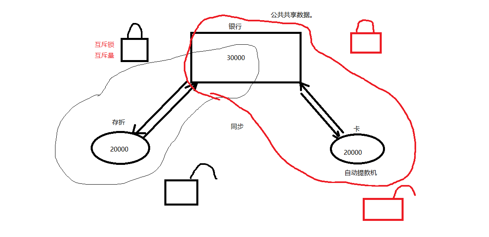

## 锁使用的注意事项

锁的使用：**建议锁**。对公共数据进行保护，所有线程在访问公共数据前应先获取锁再访问。但锁本身不具备强制性。

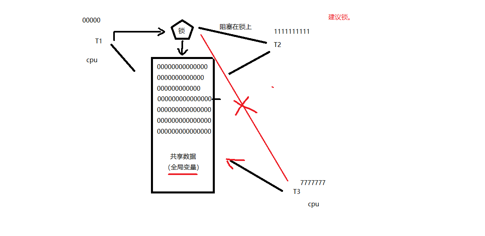

## 借助互斥锁管理共享数据实现同步

下面是一个由于数据共享导致输出混乱的示例：

```c
#include <stdio.h>
#include <string.h>
#include <pthread.h>
#include <stdlib.h>
#include <unistd.h>

void *tfn(void *arg)
{
    srand(time(NULL));

    while (1) {
        printf("hello ");
        sleep(rand() % 3);  /* 模拟长时间操作共享资源，导致 CPU 易主，产生与时间有关的错误 */
        printf("world\n");
        sleep(rand() % 3);
    }

    return NULL;
}

int main(void)
{
    pthread_t tid;
    srand(time(NULL));

    pthread_create(&tid, NULL, tfn, NULL);
    while (1) {
        printf("HELLO ");
        sleep(rand() % 3);
        printf("WORLD\n");
        sleep(rand() % 3);
    }
    pthread_join(tid, NULL);

    return 0;
}
```

编译运行，输出结果中主线程和子线程存在交叉输出的情况。

主要应用函数：

- `pthread_mutex_init` —— 初始化互斥锁
- `pthread_mutex_destroy` —— 销毁互斥锁
- `pthread_mutex_lock` —— 加锁
- `pthread_mutex_trylock` —— 尝试加锁
- `pthread_mutex_unlock` —— 解锁

以上 5 个函数的返回值都是：成功返回 0，失败返回错误号。

`pthread_mutex_t` 类型，其本质是一个结构体。为简化理解，应用时可忽略其实现细节，简单当成整数看待。`pthread_mutex_t mutex;` 变量 `mutex` 只有两种取值：0、1。

使用 `pthread_mutex_t`（互斥量、互斥锁）的一般步骤：

1. `pthread_mutex_t lock;` —— 创建锁
2. `pthread_mutex_init` —— 初始化
3. `pthread_mutex_lock` —— 加锁（1 --> 0）
4. 访问共享数据
5. `pthread_mutex_unlock` —— 解锁（0 --> 1）
6. `pthread_mutex_destroy` —— 销毁锁

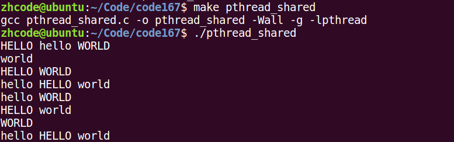

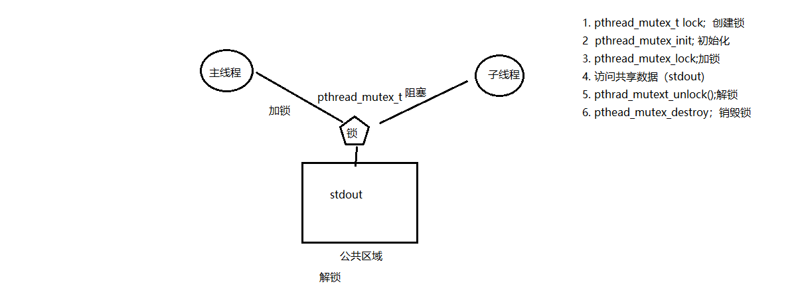

函数原型：

```c
int pthread_mutex_init(pthread_mutex_t *restrict mutex,
                       const pthread_mutexattr_t *restrict attr);
```

这里的 `restrict` 关键字表示指针指向的内容只能通过这个指针进行修改。

**初始化互斥量**：

1. 动态初始化：
```c
pthread_mutex_t mutex;
pthread_mutex_init(&mutex, NULL);
```

2. 静态初始化：
```c
pthread_mutex_t mutex = PTHREAD_MUTEX_INITIALIZER;
```

修改上面的代码，使用锁实现互斥访问共享区：

```c
#include <stdio.h>
#include <string.h>
#include <pthread.h>
#include <stdlib.h>
#include <unistd.h>

pthread_mutex_t mutex;      // 定义一把互斥锁

void *tfn(void *arg)
{
    srand(time(NULL));

    while (1) {
        pthread_mutex_lock(&mutex);     // 加锁
        printf("hello ");
        sleep(rand() % 3);             // 模拟长时间操作共享资源
        printf("world\n");
        pthread_mutex_unlock(&mutex);   // 解锁
        sleep(rand() % 3);
    }

    return NULL;
}

int main(void)
{
    pthread_t tid;
    srand(time(NULL));
    int ret = pthread_mutex_init(&mutex, NULL);    // 初始化互斥锁
    if (ret != 0) {
        fprintf(stderr, "mutex init error:%s\n", strerror(ret));
        exit(1);
    }

    pthread_create(&tid, NULL, tfn, NULL);
    while (1) {
        pthread_mutex_lock(&mutex);     // 加锁
        printf("HELLO ");
        sleep(rand() % 3);
        printf("WORLD\n");
        pthread_mutex_unlock(&mutex);   // 解锁
        sleep(rand() % 3);
    }
    pthread_join(tid, NULL);

    pthread_mutex_destroy(&mutex);     // 销毁互斥锁

    return 0;
}
```

编译运行，可以看到主线程和子线程在访问共享区时不再出现交叉输出的情况。

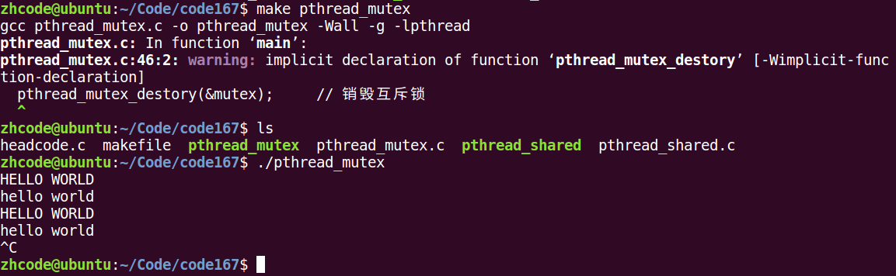

## 互斥锁使用技巧

注意事项：

- 尽量保证**锁的粒度**越小越好（访问共享数据前加锁，访问结束后立即解锁）。
- 互斥锁本质是结构体，可简化理解为整数。初始化成功后（调用 `pthread_mutex_init()`），其值为 1。
- **加锁**：`pthread_mutex_lock` 将锁的值减 1，若为 0 则阻塞当前线程。
- **解锁**：`pthread_mutex_unlock` 将锁的值加 1，唤醒阻塞在该锁上的线程。
- **尝试加锁**：`pthread_mutex_trylock` 尝试加锁，成功则将锁的值减 1；失败则直接返回，同时设置错误号 `EBUSY`，不会阻塞线程。

## try 锁

`pthread_mutex_trylock`：尝试加锁，成功则获取锁，失败则直接返回错误号（如 `EBUSY`），不阻塞线程。

## 读写锁操作函数原型

**读写锁**：锁只有一把。以读方式给数据加锁称为**读锁**，以写方式给数据加锁称为**写锁**。

- 读共享，写独占。
- 写锁优先级高。
- 相较于互斥量而言，当读线程较多时，可以提高访问效率。

```c
pthread_rwlock_t rwlock;

pthread_rwlock_init(&rwlock, NULL);

pthread_rwlock_rdlock(&rwlock);         // 获取读锁
pthread_rwlock_tryrdlock(&rwlock);      // 尝试获取读锁

pthread_rwlock_wrlock(&rwlock);         // 获取写锁
pthread_rwlock_trywrlock(&rwlock);      // 尝试获取写锁

pthread_rwlock_unlock(&rwlock);         // 解锁

pthread_rwlock_destroy(&rwlock);
```

以上函数都是成功返回 0，失败返回错误号。

`pthread_rwlock_t` 类型用于定义一个读写锁变量。

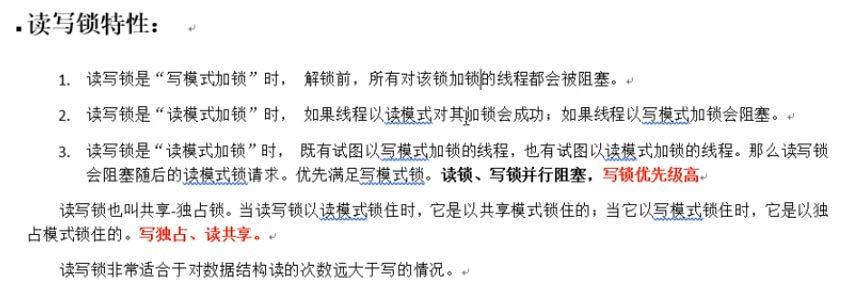

## 两种死锁

**死锁**：由于使用锁不恰当导致的现象：

1. 对一个锁反复加锁（`pthread_mutex_lock`）。
2. 两个线程各自持有一把锁，同时请求另一把锁。

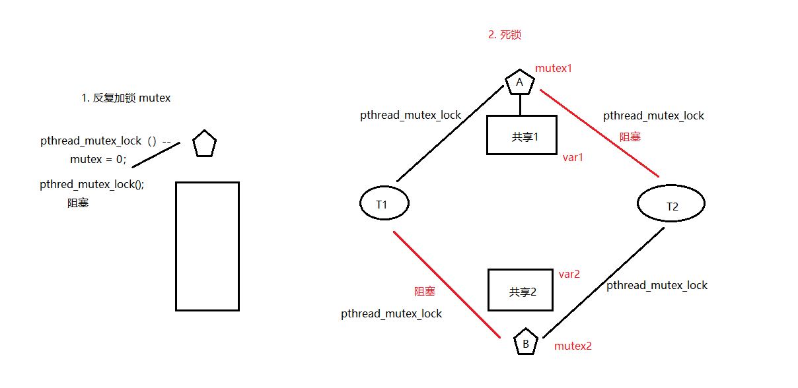

## 读写锁原理

**读写锁**：锁只有一把。以读方式给数据加锁称为**读锁**，以写方式给数据加锁称为**写锁**。

- 读共享，写独占。
- 写锁优先级高。
- 相较于互斥量而言，当读线程较多时，可以提高访问效率。

```c
pthread_rwlock_t rwlock;

pthread_rwlock_init(&rwlock, NULL);

pthread_rwlock_rdlock(&rwlock);         // 获取读锁
pthread_rwlock_tryrdlock(&rwlock);      // 尝试获取读锁

pthread_rwlock_wrlock(&rwlock);         // 获取写锁
pthread_rwlock_trywrlock(&rwlock);      // 尝试获取写锁

pthread_rwlock_unlock(&rwlock);         // 解锁

pthread_rwlock_destroy(&rwlock);
```

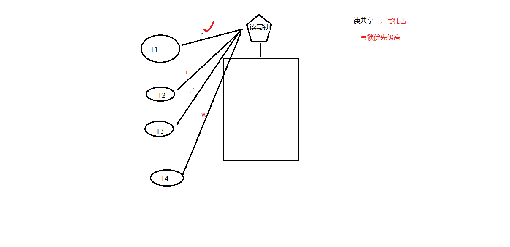

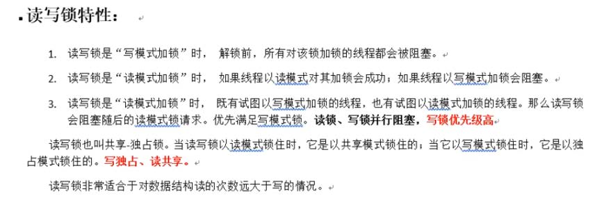

## 读写锁示例（rwlock）

一个读写锁的例子，核心特性为：读共享、写独占，写锁优先级高。

```c
/* 3 个线程不定时"写"全局资源，5 个线程不定时"读"同一全局资源 */

#include <stdio.h>
#include <unistd.h>
#include <pthread.h>

int counter;                          // 全局资源
pthread_rwlock_t rwlock;

void *th_write(void *arg)
{
    int t;
    int i = (int)arg;

    while (1) {
        t = counter;                    // 保存写之前的值
        usleep(1000);

        pthread_rwlock_wrlock(&rwlock);
        printf("=======write %d: %lu: counter=%d ++counter=%d\n", i, pthread_self(), t, ++counter);
        pthread_rwlock_unlock(&rwlock);

        usleep(9000);                   // 给读锁提供机会
    }
    return NULL;
}

void *th_read(void *arg)
{
    int i = (int)arg;

    while (1) {
        pthread_rwlock_rdlock(&rwlock);
        printf("----------------------------read %d: %lu: %d\n", i, pthread_self(), counter);
        pthread_rwlock_unlock(&rwlock);

        usleep(2000);                   // 给写锁提供机会
    }
    return NULL;
}

int main(void)
{
    int i;
    pthread_t tid[8];

    pthread_rwlock_init(&rwlock, NULL);

    for (i = 0; i < 3; i++)
        pthread_create(&tid[i], NULL, th_write, (void *)i);

    for (i = 0; i < 5; i++)
        pthread_create(&tid[i+3], NULL, th_read, (void *)i);

    for (i = 0; i < 8; i++)
        pthread_join(tid[i], NULL);

    pthread_rwlock_destroy(&rwlock);    // 释放读写锁

    return 0;
}
```

编译运行，程序输出速度较快。由于读共享、写独占且写锁优先级高，前面 5 个读线程一定先于后面的写线程到达，否则写线程会抢先获取锁进行写操作。

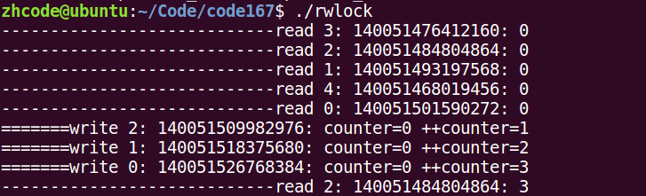

## 静态初始化条件变量和互斥量

**条件变量**：本身不是锁，但通常与互斥锁（`mutex`）结合使用。

```c
pthread_cond_t cond;
```

**初始化条件变量**：

1. 动态初始化：
```c
pthread_cond_init(&cond, NULL);
```

2. 静态初始化：
```c
pthread_cond_t cond = PTHREAD_COND_INITIALIZER;
```

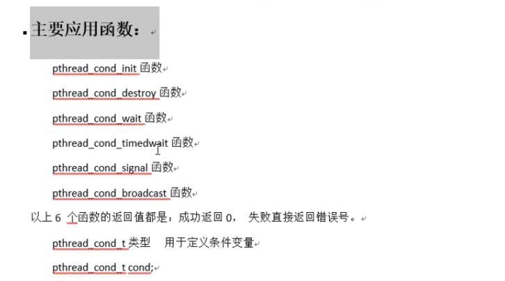

## 条件变量和相关函数 wait

**阻塞等待条件**：

```c
pthread_cond_wait(&cond, &mutex);
```

作用：
1. 阻塞等待条件变量满足。
2. 解锁已经加锁成功的互斥量（相当于 `pthread_mutex_unlock(&mutex)`），步骤 1 和步骤 2 为一个原子操作。
3. 当条件满足、函数返回时，解除阻塞并重新申请获取互斥锁（相当于 `pthread_mutex_lock(&mutex)`）。

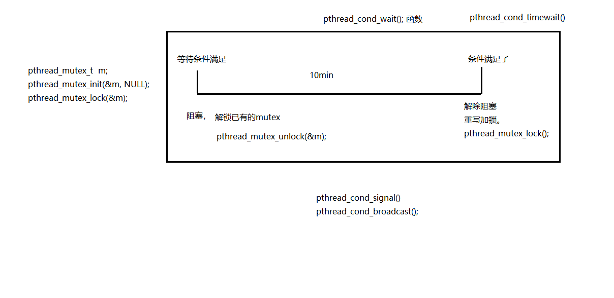

## 条件变量的生产者消费者模型分析

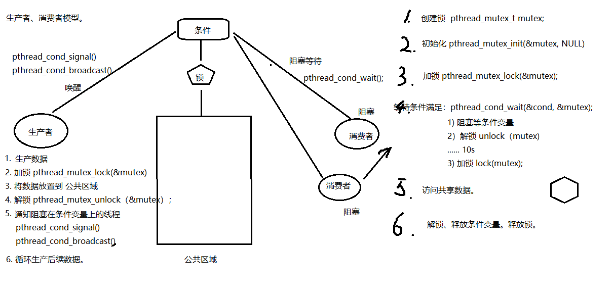

## 条件变量生产者消费者代码预览

代码如下：

```c
/* 借助条件变量模拟生产者-消费者问题 */
#include <stdlib.h>
#include <unistd.h>
#include <pthread.h>
#include <stdio.h>

/* 链表作为共享数据，需被互斥量保护 */
struct msg {
    struct msg *next;
    int num;
};

struct msg *head;

/* 静态初始化一个条件变量和一个互斥量 */
pthread_cond_t has_product = PTHREAD_COND_INITIALIZER;
pthread_mutex_t lock = PTHREAD_MUTEX_INITIALIZER;

void *consumer(void *p)
{
    struct msg *mp;

    for (;;) {
        pthread_mutex_lock(&lock);
        while (head == NULL) {                      // 头指针为空，说明没有节点（不能用 if，需用 while 防止虚假唤醒）
            pthread_cond_wait(&has_product, &lock); // 解锁并阻塞等待
        }
        mp = head;
        head = mp->next;                            // 模拟消费掉一个产品
        pthread_mutex_unlock(&lock);

        printf("-Consume %lu---%d\n", pthread_self(), mp->num);
        free(mp);
        sleep(rand() % 5);
    }
}

void *producer(void *p)
{
    struct msg *mp;

    for (;;) {
        mp = malloc(sizeof(struct msg));
        mp->num = rand() % 1000 + 1;               // 模拟生产一个产品
        printf("-Produce ---------------------%d\n", mp->num);

        pthread_mutex_lock(&lock);
        mp->next = head;
        head = mp;
        pthread_mutex_unlock(&lock);

        pthread_cond_signal(&has_product);          // 唤醒等待在该条件变量上的一个线程
        sleep(rand() % 5);
    }
}

int main(int argc, char *argv[])
{
    pthread_t pid, cid;
    srand(time(NULL));

    pthread_create(&pid, NULL, producer, NULL);
    pthread_create(&cid, NULL, consumer, NULL);

    pthread_join(pid, NULL);
    pthread_join(cid, NULL);

    return 0;
}
```

编译运行，可以看到消费者按序消费（因为使用的是链表结构）。

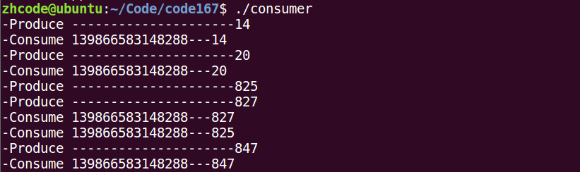

## 条件变量实现生产者消费者代码

```c
#include <stdio.h>
#include <stdlib.h>
#include <string.h>
#include <unistd.h>
#include <errno.h>
#include <pthread.h>

void err_thread(int ret, char *str)
{
    if (ret != 0) {
        fprintf(stderr, "%s:%s\n", str, strerror(ret));
        pthread_exit(NULL);
    }
}

struct msg {
    int num;
    struct msg *next;
};

struct msg *head;

pthread_mutex_t mutex = PTHREAD_MUTEX_INITIALIZER;      // 定义并初始化一个互斥量
pthread_cond_t has_data = PTHREAD_COND_INITIALIZER;     // 定义并初始化一个条件变量

void *producer(void *arg)
{
    while (1) {
        struct msg *mp = malloc(sizeof(struct msg));

        mp->num = rand() % 1000 + 1;                   // 模拟生产一个数据
        printf("--produce %d\n", mp->num);

        pthread_mutex_lock(&mutex);                     // 加锁互斥量
        mp->next = head;                                // 写公共区域
        head = mp;
        pthread_mutex_unlock(&mutex);                   // 解锁互斥量

        pthread_cond_signal(&has_data);                 // 唤醒阻塞在条件变量 has_data 上的线程

        sleep(rand() % 3);
    }

    return NULL;
}

void *consumer(void *arg)
{
    while (1) {
        struct msg *mp;

        pthread_mutex_lock(&mutex);                     // 加锁互斥量
        if (head == NULL) {
            pthread_cond_wait(&has_data, &mutex);       // 阻塞等待条件变量，同时解锁互斥量
        }                                               // pthread_cond_wait 返回时，重新加锁互斥量

        mp = head;
        head = mp->next;

        pthread_mutex_unlock(&mutex);                   // 解锁互斥量
        printf("---------consumer:%d\n", mp->num);

        free(mp);
        sleep(rand() % 3);
    }

    return NULL;
}

int main(int argc, char *argv[])
{
    int ret;
    pthread_t pid, cid;

    srand(time(NULL));

    ret = pthread_create(&pid, NULL, producer, NULL);   // 生产者
    if (ret != 0)
        err_thread(ret, "pthread_create producer error");

    ret = pthread_create(&cid, NULL, consumer, NULL);   // 消费者
    if (ret != 0)
        err_thread(ret, "pthread_create consumer error");

    pthread_join(pid, NULL);
    pthread_join(cid, NULL);

    return 0;
}
```

编译运行，结果如下：

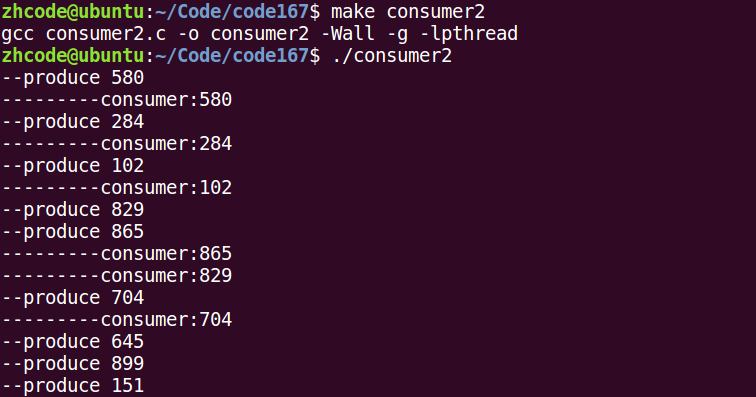

## 多个消费者使用 while 循环

先看一个手动创建多个消费者的代码：

```c
#include <stdio.h>
#include <stdlib.h>
#include <string.h>
#include <unistd.h>
#include <errno.h>
#include <pthread.h>

void err_thread(int ret, char *str)
{
    if (ret != 0) {
        fprintf(stderr, "%s:%s\n", str, strerror(ret));
        pthread_exit(NULL);
    }
}

struct msg {
    int num;
    struct msg *next;
};

struct msg *head;

pthread_mutex_t mutex = PTHREAD_MUTEX_INITIALIZER;      // 定义并初始化一个互斥量
pthread_cond_t has_data = PTHREAD_COND_INITIALIZER;     // 定义并初始化一个条件变量

void *producer(void *arg)
{
    while (1) {
        struct msg *mp = malloc(sizeof(struct msg));

        mp->num = rand() % 1000 + 1;                   // 模拟生产一个数据
        printf("--produce %d\n", mp->num);

        pthread_mutex_lock(&mutex);                     // 加锁互斥量
        mp->next = head;                                // 写公共区域
        head = mp;
        pthread_mutex_unlock(&mutex);                   // 解锁互斥量

        pthread_cond_signal(&has_data);                 // 唤醒阻塞在条件变量 has_data 上的线程

        sleep(rand() % 3);
    }

    return NULL;
}

void *consumer(void *arg)
{
    while (1) {
        struct msg *mp;

        pthread_mutex_lock(&mutex);                     // 加锁互斥量
        if (head == NULL) {
            pthread_cond_wait(&has_data, &mutex);       // 阻塞等待条件变量，同时解锁互斥量
        }                                               // pthread_cond_wait 返回时，重新加锁互斥量

        mp = head;
        head = mp->next;

        pthread_mutex_unlock(&mutex);                   // 解锁互斥量
        printf("---------consumer id = %lu  :%d\n", pthread_self(), mp->num);

        free(mp);
        sleep(rand() % 3);
    }

    return NULL;
}

int main(int argc, char *argv[])
{
    int ret;
    pthread_t pid, cid;

    srand(time(NULL));

    ret = pthread_create(&pid, NULL, producer, NULL);   // 生产者
    if (ret != 0)
        err_thread(ret, "pthread_create producer error");

    ret = pthread_create(&cid, NULL, consumer, NULL);   // 消费者
    if (ret != 0)
        err_thread(ret, "pthread_create consumer error");

    ret = pthread_create(&cid, NULL, consumer, NULL);   // 消费者
    if (ret != 0)
        err_thread(ret, "pthread_create consumer error");

    ret = pthread_create(&cid, NULL, consumer, NULL);   // 消费者
    if (ret != 0)
        err_thread(ret, "pthread_create consumer error");

    pthread_join(pid, NULL);
    pthread_join(cid, NULL);

    return 0;
}
```

上述代码存在问题。例如，两个消费者都阻塞在条件变量上（即没有数据可消费），此时两者都将锁释放。当生产者生产了一个数据后，会同时唤醒两个因条件变量阻塞的消费者，两者开始竞争锁。结果是消费者 A 获取锁并开始消费数据，消费者 B 阻塞在锁上。随后消费者 A 消费完毕并释放锁，消费者 B 被唤醒，但此时已无数据可供消费。因此存在逻辑错误——消费者在条件变量处阻塞时应使用 `while` 循环进行条件判断。这样消费者 A 消费完毕后，消费者 B 首先检查的是条件变量而非直接获取锁。

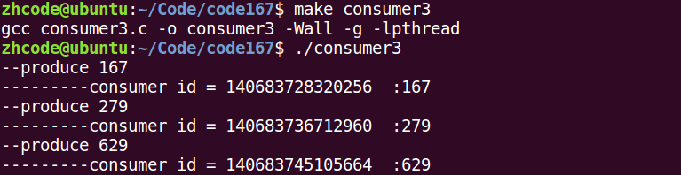

## 条件变量 signal 注意事项

- `pthread_cond_signal`：唤醒阻塞在条件变量上的至少一个线程。
- `pthread_cond_broadcast`：唤醒阻塞在条件变量上的所有线程。

## 信号量概念及其相关操作函数

**信号量**：应用于线程、进程间同步。信号量可理解为初始值为 N 的同步原语，N 表示可以同时访问共享数据区的线程数。

```c
sem_t sem;      // 定义信号量类型
```

函数原型：

```c
int sem_init(sem_t *sem, int pshared, unsigned int value);
```

参数说明：
- `sem`：信号量。
- `pshared`：0 表示用于线程间同步；非 0 表示用于进程间同步。
- `value`：N 值，指定同时访问的线程数。

其他操作函数：

```c
int sem_destroy(sem_t *sem);

int sem_wait(sem_t *sem);       // 一次调用做一次减 1 操作，当信号量值为 0 时再次减 1 会阻塞（类比 pthread_mutex_lock）

int sem_post(sem_t *sem);       // 一次调用做一次加 1 操作，唤醒等待信号量的线程（类比 pthread_mutex_unlock）
```

注意：`sem_post` 不会因信号量值达到上限而阻塞，它始终会成功地将信号量值加 1 并唤醒等待线程。

## 信号量实现的生产者消费者

```c
/* 信号量实现生产者-消费者问题 */

#include <stdlib.h>
#include <unistd.h>
#include <pthread.h>
#include <stdio.h>
#include <semaphore.h>

#define NUM 5

int queue[NUM];                                     // 全局数组实现环形队列
sem_t blank_number, product_number;                 // 空格子信号量、产品信号量

void *producer(void *arg)
{
    int i = 0;

    while (1) {
        sem_wait(&blank_number);                    // 生产者将空格子数减 1，为 0 则阻塞等待
        queue[i] = rand() % 1000 + 1;              // 生产一个产品
        printf("----Produce---%d\n", queue[i]);
        sem_post(&product_number);                  // 将产品数加 1

        i = (i + 1) % NUM;                         // 借助下标实现环形队列
        sleep(rand() % 1);
    }
}

void *consumer(void *arg)
{
    int i = 0;

    while (1) {
        sem_wait(&product_number);                  // 消费者将产品数减 1，为 0 则阻塞等待
        printf("-Consume---%d\n", queue[i]);
        queue[i] = 0;                               // 消费一个产品
        sem_post(&blank_number);                    // 消费完毕后将空格子数加 1

        i = (i + 1) % NUM;
        sleep(rand() % 3);
    }
}

int main(int argc, char *argv[])
{
    pthread_t pid, cid;

    sem_init(&blank_number, 0, NUM);                // 初始化空格子信号量为 5，线程间共享
    sem_init(&product_number, 0, 0);                // 产品数为 0

    pthread_create(&pid, NULL, producer, NULL);
    pthread_create(&cid, NULL, consumer, NULL);

    pthread_join(pid, NULL);
    pthread_join(cid, NULL);

    sem_destroy(&blank_number);
    sem_destroy(&product_number);

    return 0;
}
```

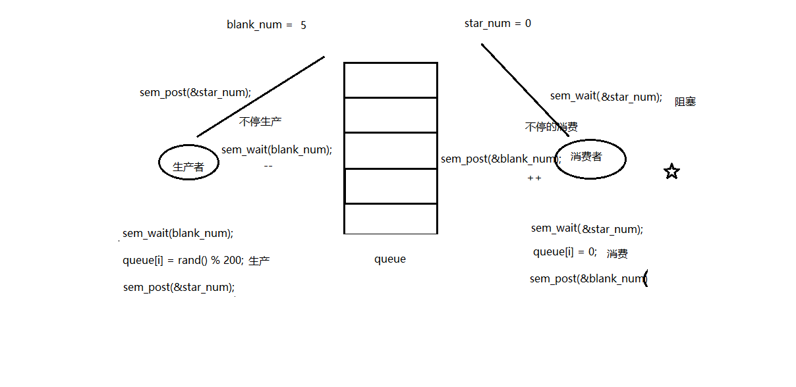

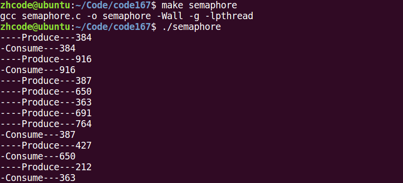

## 总结

**线程同步**：协同步调，对公共区域数据按序访问，防止数据混乱，产生与时间有关的错误。

**锁的使用**：建议锁，对公共数据进行保护。所有线程应在访问公共数据前先获取锁再访问，但锁本身不具备强制性。

**使用互斥锁（mutex）的一般步骤**：

1. `pthread_mutex_t lock;` —— 创建锁
2. `pthread_mutex_init` —— 初始化
3. `pthread_mutex_lock` —— 加锁
4. 访问共享数据
5. `pthread_mutex_unlock` —— 解锁
6. `pthread_mutex_destroy` —— 销毁锁

**初始化互斥量**：

1. 动态初始化：`pthread_mutex_init(&mutex, NULL);`
2. 静态初始化：`pthread_mutex_t mutex = PTHREAD_MUTEX_INITIALIZER;`

**注意事项**：

- 尽量保证锁的粒度越小越好（访问共享数据前加锁，访问结束后立即解锁）。
- 互斥锁本质是结构体，可简化理解为整数，初始化成功后值为 1。
- **加锁**：将锁的值减 1，若为 0 则阻塞线程。
- **解锁**：将锁的值加 1，唤醒阻塞在锁上的线程。
- **try 锁**：尝试加锁，成功则获取锁；失败则返回，同时设置错误号 `EBUSY`。

**`restrict` 关键字**：用来限定指针变量，被该关键字限定的指针变量所指向的内存操作必须由本指针完成。

**死锁**：由于使用锁不恰当导致的现象：

1. 对一个锁反复加锁。
2. 两个线程各自持有一把锁，同时请求另一把锁。

**读写锁**：锁只有一把。以读方式给数据加锁称为读锁，以写方式给数据加锁称为写锁。

- 读共享，写独占。
- 写锁优先级高。
- 相较于互斥量而言，当读线程较多时，可以提高访问效率。

```c
pthread_rwlock_t rwlock;
pthread_rwlock_init(&rwlock, NULL);
pthread_rwlock_rdlock(&rwlock);
pthread_rwlock_tryrdlock(&rwlock);
pthread_rwlock_wrlock(&rwlock);
pthread_rwlock_trywrlock(&rwlock);
pthread_rwlock_unlock(&rwlock);
pthread_rwlock_destroy(&rwlock);
```

**条件变量**：本身不是锁，但通常与互斥锁（`mutex`）结合使用。

```c
pthread_cond_t cond;
```

初始化条件变量：

1. 动态初始化：`pthread_cond_init(&cond, NULL);`
2. 静态初始化：`pthread_cond_t cond = PTHREAD_COND_INITIALIZER;`

**阻塞等待条件** `pthread_cond_wait(&cond, &mutex)` 的作用：

1. 阻塞等待条件变量满足。
2. 解锁已经加锁成功的互斥量（相当于 `pthread_mutex_unlock(&mutex)`）。
3. 当条件满足、函数返回时，重新加锁互斥量（相当于 `pthread_mutex_lock(&mutex)`）。

**条件变量通知函数**：

- `pthread_cond_signal`：唤醒阻塞在条件变量上的至少一个线程。
- `pthread_cond_broadcast`：唤醒阻塞在条件变量上的所有线程。

要求：能够借助条件变量完成生产者-消费者模型。

**信号量**：应用于线程、进程间同步，可理解为初始值为 N 的同步原语，N 表示可以同时访问共享数据区的线程数。

```c
sem_t sem;
int sem_init(sem_t *sem, int pshared, unsigned int value);
```

参数说明：
- `sem`：信号量。
- `pshared`：0 表示用于线程间同步；非 0 表示用于进程间同步。
- `value`：N 值，指定同时访问的线程数。

```c
int sem_destroy(sem_t *sem);
int sem_wait(sem_t *sem);       // 信号量值减 1，为 0 时阻塞（类比 pthread_mutex_lock）
int sem_post(sem_t *sem);       // 信号量值加 1，唤醒等待线程（类比 pthread_mutex_unlock）
```
